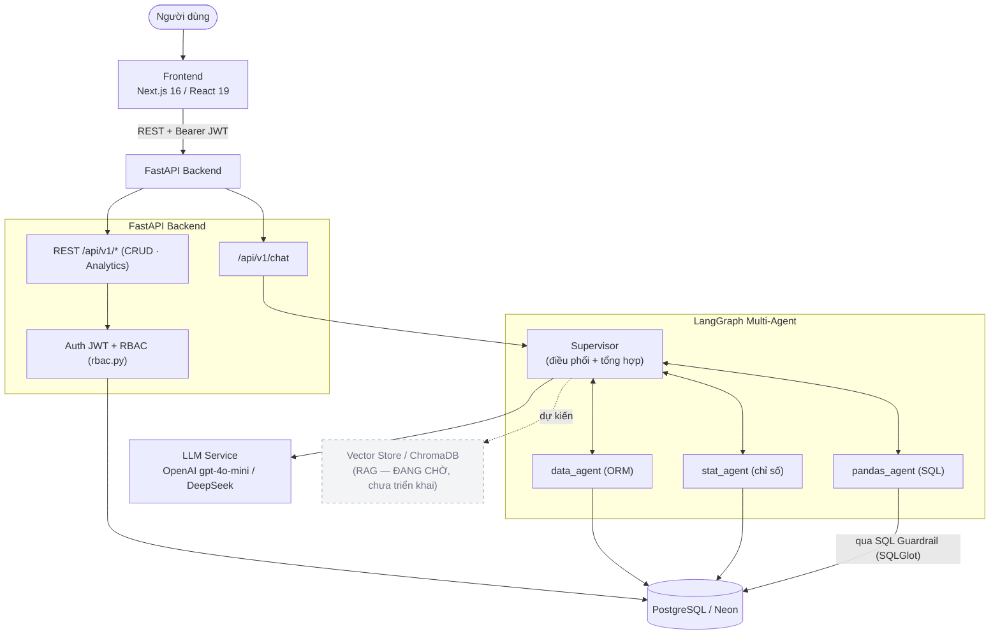
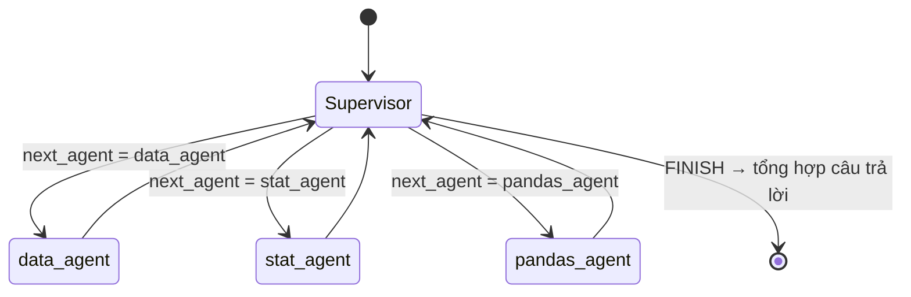
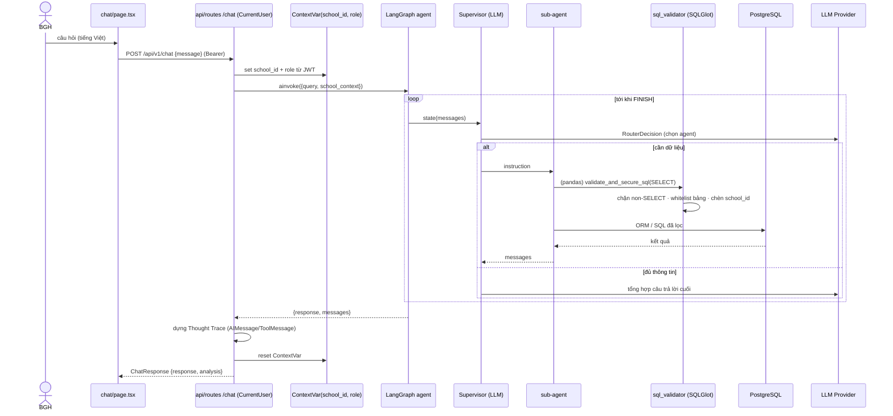
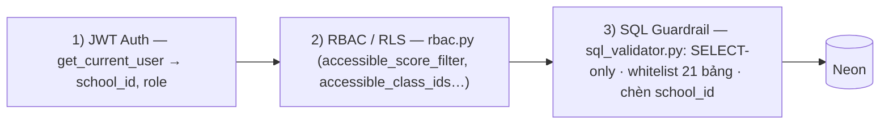

# Architecture Diagram — AI20K-075

> Hệ Trợ lý Phân tích Kết quả Học tập Toàn trường (Conversational BI + Learning Analytics) cho Ban Giám Hiệu K‑12.
> Sơ đồ phản ánh **kiến trúc thực tế trong repo** (`src/`, `frontend/src/`). Cập nhật cho hệ **multi-agent**.

## 1. System Overview

## 2. Multi-Agent Flow (`src/agents/graph.py`)

Entry point là **Supervisor**. Mỗi vòng, Supervisor (LLM `with_structured_output(RouterDecision)`) chọn sub‑agent kế tiếp hoặc `FINISH`; sub‑agent chạy xong **quay lại Supervisor**. Khi `FINISH`, Supervisor gọi LLM lần cuối để **tổng hợp** câu trả lời (Markdown, tiếng Việt, không lộ tên agent kỹ thuật).

| Sub-agent | Vai trò | Nguồn dữ liệu |
|-----------|---------|---------------|
| `data_agent` | Tra cứu hồ sơ học sinh, bảng điểm chi tiết/lớp | **ORM** (`SessionLocal` + `models.tables`), lọc `school_id` |
| `stat_agent` | Thống kê, thủ khoa/HS yếu, xu hướng, chỉ số GDI · Delta G · Momentum | ORM/helpers |
| `pandas_agent` | SQL thô / phân tích động phức tạp (tương quan…) | **SQL** qua `execute_read_only_query` → guardrail |

## 3. Chat request — luồng xử lý

## 4. Bảo mật — cô lập theo trường (tenant isolation)

`/chat` truyền `school_id`/`role` qua `ContextVar` ([src/agents/context.py](../src/agents/context.py)); tool ORM lọc `school_id`, còn SQL thô của `pandas_agent` bắt buộc qua guardrail [src/core/security/sql_validator.py](../src/core/security/sql_validator.py).

## 5. Component Details

| Component | Technology | Purpose | File |
|-----------|-----------|---------|------|
| Frontend | Next.js 16 / React 19 / Tailwind v4 | Dashboard · Bảng điểm · Quản lý điểm · Chat · Admin | `frontend/src/` |
| Backend | FastAPI / Uvicorn | REST API + Auth + Analytics | `src/main.py`, `src/api/` |
| Supervisor | LangGraph + LLM | Điều phối sub-agent + tổng hợp trả lời | `src/agents/supervisor/` |
| Sub-agents | LangGraph nodes | data / stat / pandas | `src/agents/{data_agent,stat_agent,pandas_agent}/` |
| LLM | OpenAI `gpt-4o-mini` / DeepSeek | Reasoning + tổng hợp | `src/services/llm.py`, `src/config.py` |
| SQL Guardrail | SQLGlot | SELECT-only + whitelist + chèn `school_id` | `src/core/security/sql_validator.py` |
| Database | PostgreSQL (Neon) | 21 bảng + view độ khó | `src/models/tables.py`, Alembic |
| Vector Store | ChromaDB | **RAG / embeddings — ĐANG CHỜ, CHƯA triển khai** | (cfg `chroma_persist_dir`) |

> ⚠️ **RAG chưa triển khai:** mới có biến cấu hình `chroma_persist_dir` trong [src/config.py](../src/config.py); chưa có luồng nạp/truy vấn embeddings. Khi triển khai, dự kiến nối vào Supervisor như một nguồn ngữ cảnh (đường nét đứt ở sơ đồ §1).
>
> 📄 Sơ đồ chi tiết hơn (component frontend/backend, ER, deployment): xem `private_docs/architecture.md` (tài liệu nội bộ).
