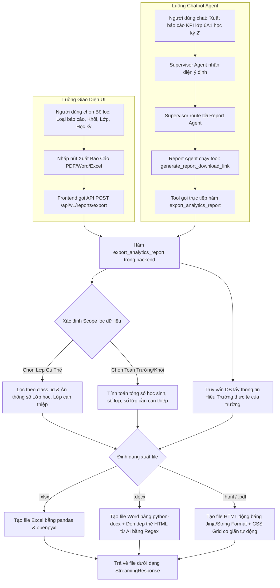

# Tài Liệu Quy Trình Xuất Báo Cáo & Danh Sách Các File Thay Đổi

Tài liệu này mô tả chi tiết quy trình (flow) xuất báo cáo hiện tại trong hệ thống SchoolAI (bao gồm cả luồng Giao diện Người dùng và luồng Trợ lý Chatbot Multi-Agent), đồng thời thống kê danh sách các tệp tin đã được thêm mới hoặc chỉnh sửa.

---

## 1. Sơ Đồ Quy Trình Xuất Báo Cáo (Report Flow)

Hệ thống hỗ trợ 2 luồng xuất báo cáo song song: **Luồng Giao Diện (UI Flow)** và **Luồng Chatbot (Agent Flow)**.

---

## 2. Danh Sách Các File Thêm Mới & Chỉnh Sửa

Dưới đây là danh sách các tệp tin liên quan trực tiếp đến hệ thống báo cáo và tác nhân (agent):

### A. Các Tệp Tin Thêm Mới (New Files)
| Đường dẫn file | Chức năng chi tiết |
| :--- | :--- |
| [tools.py](file:///f:/PROJECT_VINUNI/BUILD_COHORT/C2-App-051/src/agents/report_agent/tools.py) | Định nghĩa các công cụ LangChain (`LangChain Tools`) chuyên biệt cho chatbot:  • `get_report_data_summary`: Tra cứu nhanh số liệu thống kê. • `generate_report_download_link`: Gọi backend xuất file báo cáo thật và sinh liên kết tải trực tiếp cho người dùng. |
| [node.py](file:///f:/PROJECT_VINUNI/BUILD_COHORT/C2-App-051/src/agents/report_agent/node.py) | Định nghĩa Agent Node xử lý của `Report Agent`, tiếp nhận thông tin từ Supervisor, điều phối việc gọi công cụ và trả lời người dùng. |

### B. Các Tệp Tin Chỉnh Sửa (Modified Files)
| Đường dẫn file | Chức năng & Nội dung chỉnh sửa |
| :--- | :--- |
| [reports.py](file:///f:/PROJECT_VINUNI/BUILD_COHORT/C2-App-051/src/api/v1/reports.py) | **Controller xử lý xuất báo cáo chính ở Backend**: • Sửa lỗi đếm số lượng học sinh bị ảo (lọc đúng theo `class_id` và `grade_level`). • Lấy thông tin Hiệu trưởng động từ DB dựa trên `school_id` của tài khoản đăng nhập thay vì ghi cứng Lê Tiến Dũng. • Tích hợp hàm `strip_html_tags` lọc sạch các thẻ HTML do AI sinh ra trước khi đưa vào tệp Word (.docx). • Tự động ẩn "Tổng số lớp học" và "Số lớp cần can thiệp" khi người dùng chỉ xuất báo cáo cho 1 lớp cố định. • Sử dụng CSS Grid tự động co giãn `repeat(auto-fit, minmax(150px, 1fr))` trong mẫu HTML. |
| [page.tsx](file:///f:/PROJECT_VINUNI/BUILD_COHORT/C2-App-051/frontend/src/app/(app)/reports/page.tsx) | **Trang giao diện quản lý và xem trước báo cáo (Frontend)**: • Đưa tên Hiệu trưởng thực tế từ thông tin User (`user?.principal_name`) vào chữ ký. • Khi chọn 1 lớp học cụ thể, tự động chuyển đổi layout preview từ 4 cột sang 3 cột (ẩn card "Số lớp") và đổi tên nhãn "GPA Trường" thành "GPA Lớp". |
| [auth.py](file:///f:/PROJECT_VINUNI/BUILD_COHORT/C2-App-051/src/api/v1/auth.py) | API `/auth/me` được bổ sung truy vấn tìm thông tin trường học (`school_name`) và tên Hiệu trưởng của trường (`principal_name`) để trả về cho Frontend. |
| [user.py](file:///f:/PROJECT_VINUNI/BUILD_COHORT/src/schemas/user.py) | Cập nhật Pydantic Schema `UserRead` của tài khoản người dùng để hỗ trợ truyền các trường `school_name` và `principal_name`. |
| [types.ts](file:///f:/PROJECT_VINUNI/BUILD_COHORT/C2-App-051/frontend/src/lib/types.ts) | Đồng bộ định nghĩa TypeScript Interface `User` ở frontend tương thích với Schema backend. |
| [graph.py](file:///f:/PROJECT_VINUNI/BUILD_COHORT/C2-App-051/src/agents/graph.py) | Đăng ký `Report Agent Node` mới vào hệ thống Multi-Agent Graph (StateGraph) của LangGraph. |
| [node.py](file:///f:/PROJECT_VINUNI/BUILD_COHORT/C2-App-051/src/agents/supervisor/node.py) | Cập nhật bộ định tuyến chính (Supervisor Agent Router) để nhận diện các câu hỏi, yêu cầu liên quan đến số liệu hoặc xuất báo cáo và chuyển tiếp sang `Report Agent`. |

---

## 3. Mô Tả Chi Tiết Chức Năng Từng Thành Phần

### 3.1 Xử lý dữ liệu động & Bảo mật phân quyền (RBAC)
- Toàn bộ dữ liệu báo cáo đều đi qua lớp bảo mật phân quyền `rbac.accessible_score_filter(db, user)`. Giáo viên chỉ có quyền truy cập điểm số của các lớp mình được phân công giảng dạy, Hiệu trưởng và Admin trường có quyền xem toàn bộ trường.
- Số liệu học sinh `total_students` được tính dựa trên số lượng tuyển sinh (`Enrollment`) hoạt động trong niên khóa hiện tại của trường người dùng.

### 3.2 Bộ lọc thẻ HTML thô trong tệp Word
Do AI sinh ra nhận xét có chứa các định dạng HTML thô, backend áp dụng Regular Expression để dọn dẹp các thẻ này, đồng thời giữ lại ký tự xuống dòng (`\n`) từ thẻ ` ` để đảm bảo tệp `.docx` được định dạng sạch và đẹp mắt khi mở bằng Microsoft Word.

### 3.3 Tự động điều chỉnh giao diện (Responsive Grid Layout)
- Ở backend, CSS Grid được đổi sang `grid-template-columns: repeat(auto-fit, minmax(150px, 1fr))` cho `.kpi-container`. Grid sẽ tự co giãn hiển thị 3 cột (nếu ẩn Số Lớp) hoặc 4 cột (nếu xem toàn trường) mà không bị lệch hay méo khung.
- Ở frontend, component preview sử dụng tailwind class động để cập nhật hiển thị tương ứng với lựa chọn lọc của người dùng.
