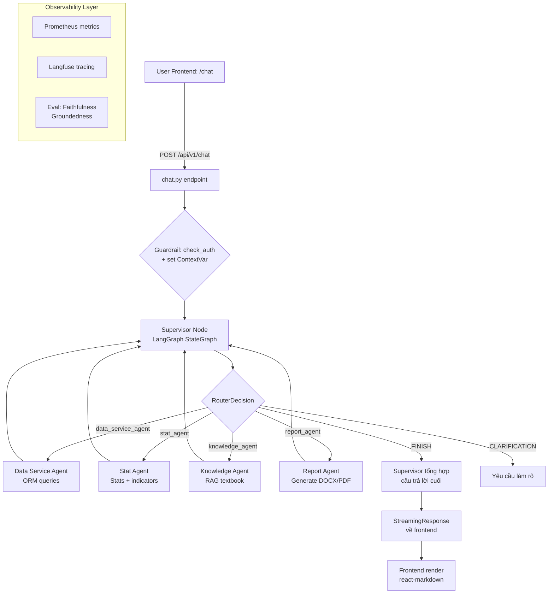

# Multi-Agent Chat Flow

- **Mục đích**: Người dùng (BGH/GV) hỏi đáp bằng tiếng Việt → Supervisor điều phối 4 sub-agent (data_service, stat, knowledge, report) → trả lời tổng hợp, có kèm file đính kèm, eval, observability.
- **Phân hệ**: Core — Multi-Agent LangGraph
- **Trạng thái**: ✅ Đang hoạt động

---

## 1. Sơ đồ luồng



---

## 2. Các bước chi tiết

| Bước | Nơi xử lý | Hành động | File liên quan |
|------|-----------|-----------|----------------|
| 1 | `frontend/src/app/chat/page.tsx` | User gõ câu hỏi + đính kèm file (tùy chọn) → gửi POST | `frontend/src/app/chat/page.tsx` |
| 2 | `src/api/v1/chat.py:128-250` | Nhận request, kiểm tra auth (`CurrentUser`), lấy session, cấu trúc messages (SystemMessage + HumanMessage + attachment block) | `src/api/v1/chat.py` |
| 3 | `src/api/v1/chat.py` | Set `current_user_school_id` + `current_user_role` + `current_user_id` vào ContextVar → agent lọc theo trường | `src/agents/context.py` |
| 4 | `src/agents/graph.py` | Supervisor node entry: xác định `next_agent` qua `RouterDecision` (structured output với LLM) | `src/agents/supervisor/node.py` |
| 5 | Nếu `data_service_agent` | Sub-agent chạy ReAct loop với tool ORM (SessionLocal) — xem scores/students/classes | `src/agents/data_service_agent/node.py` |
| 6 | Nếu `stat_agent` | Sub-agent chạy tool thống kê: GDI, Delta G, Learning Momentum, phân bố học lực | `src/agents/stat_agent/node.py`, `src/agents/stat_agent/tools.py` |
| 7 | Nếu `knowledge_agent` | Sub-agent gọi `search_textbook` (Qdrant vector search) + LLM tổng hợp có trích dẫn | `src/agents/knowledge_agent/node.py`, `src/agents/knowledge_agent/tools.py` |
| 8 | Nếu `report_agent` | Sub-agent gọi `get_report_data_summary` → `generate_report_download_link` / `generate_custom_report_docx` | `src/agents/report_agent/node.py`, `src/agents/report_agent/tools.py` |
| 9 | `src/agents/graph.py` | Sub-agent quay về Supervisor → Supervisor quyết định FINISH hoặc gọi tiếp agent khác | `src/agents/graph.py` |
| 10 | `src/api/v1/chat.py` | StreamingResponse gửi token về frontend, lưu lịch sử vào `ai_messages`, ghi telemetry | `src/api/v1/chat.py` |
| 11 | `src/services/eval.py` | (Nền) Judge LLM chấm Faithfulness/Groundedness nếu sample rate 5% | `src/services/eval.py` |
| 12 | `src/observability.py` | Ghi metrics: `agent_requests_total`, `agent_latency_seconds`, `sql_guardrail_rejections_total`, cost tracking | `src/observability.py` |

---

## 3. File map

```
📁 src/agents/
├── graph.py                          # StateGraph: supervisor + 4 sub-agent nodes
├── state.py                          # MultiAgentState: messages, next_agent, school_context
├── context.py                        # ContextVar: current_user_school_id/role/user_id
├── helpers.py                        # Agent helper utilities
├── supervisor/__init__.py            # supervisor_node export
├── supervisor/node.py                # RouterDecision + FINISH/CLARIFICATION logic
├── data_service_agent/node.py        # ORM tools (SessionLocal) — điểm/HS/lớp
├── stat_agent/node.py                # Stats tools — GDI, Delta G, Momentum
├── stat_agent/tools.py               # Chi tiết các tool thống kê
├── knowledge_agent/node.py           # RAG textbook — search_textbook tool
├── knowledge_agent/tools.py          # search_textbook function
├── report_agent/node.py              # Report generation ReAct agent
├── report_agent/tools.py             # get_report_data_summary, generate_report_download_link, generate_custom_report_docx
├── report_agent/queries.py           # SQL queries cho report data
├── report_agent/visual_contracts.py  # Taxonomy cho visualization
├── report_agent/chart_generator.py   # Sinh chart cho report
└── trace_adapter.py                  # Langfuse tracing adapter

📁 src/api/v1/
├── chat.py                            # POST /chat (streaming), sessions, feedback, telemetry

📁 src/services/
├── eval.py                            # Faithfulness/Groundedness judge
├── llm.py                             # get_llm(), get_judge_llm()
├── chat_attachments.py                # Xử lý file đính kèm
├── storage.py                         # Upload/download file từ cloud storage
├── alerting.py                        # Agent runaway detection, cost tracking
└── observability_snapshot.py          # Snapshot loop for AI trend chart

📁 src/repositories/
└── chat_repo.py                       # CRUD chat sessions + messages + attachments

📁 frontend/src/
├── app/chat/page.tsx                  # Chat UI
├── components/Sidebar.tsx             # Sidebar navigation
└── lib/api.ts                         # API client (gắn Bearer token)
```

---

## 4. RBAC — ai được dùng chat

| Vai trò | Quyền trong flow | Ghi chú |
|---------|------------------|---------|
| ADMIN | ✅ Chat + xem toàn bộ dữ liệu | Không giới hạn scope |
| PRINCIPAL | ✅ Chat + xem toàn trường read-only | Agent tự lọc theo school_id |
| GRADE_HEAD_PRIMARY | ✅ Chat + xem trong khối phụ trách | Agent giới hạn accessible_class_ids |
| HOMEROOM_TEACHER_PRIMARY | ✅ Chat + xem lớp chủ nhiệm, mọi môn | |
| HOMEROOM_TEACHER_SECONDARY | ✅ Chat + xem lớp chủ nhiệm | |
| SUBJECT_TEACHER | ✅ Chat + xem môn/lớp được phân công | |
| SUBJECT_HEAD | ✅ Chat + xem môn phụ trách mọi lớp | |

Chat endpoint tự set ContextVar `current_user_role`/`school_id` → các agent tool filter theo đó.

---

## 5. Database tables liên quan

| Bảng | Mục đích | Ghi chú |
|------|----------|---------|
| `ai_sessions` | Phiên chat | user_id, title, created_at |
| `ai_messages` | Tin nhắn từng session | role (user/ai), content, tokens, latency_ms, guardrail_status |
| `ai_feedback` | Phản hồi của user | rating, comment |
| `ai_session_attachments` | File đính kèm | file_name, extracted_text, truncated |
| `ai_observability_snapshots` | Snapshot cho trend chart | snapshot JSON, period |

---

## 6. Lưu ý kỹ thuật (Gotchas)

1. **⚠️ ContextVar tenant isolation**: Chat endpoint bắt buộc `current_user_school_id.set(...)` trước khi invoke agent graph. Mọi tool ORM/SQL phải lọc theo `current_user_school_id.get()`. Reset trong `finally` block.

2. **⚠️ SQL guardrail**: `pandas_agent` (data_service_agent) dùng SQL thô qua `execute_read_only_query` → bắt buộc đi qua `validate_and_secure_sql` (`sql_validator.py`): chỉ `SELECT`, whitelist 21 bảng, tự chèn `school_id` vào WHERE. Nếu reject → increment `sql_guardrail_rejections_total`.

3. **⚠️ Supervisor prompt ↔ Graph consistency**: Tên sub-agent trong `RouterDecision` + `SUPERVISOR_PROMPT` phải khớp với các node đăng ký ở `build_graph()` và nhánh `route_next`. Thêm/sửa sub-agent → cập nhật cả 3 chỗ.

4. **⚠️ Eval mặc định 5% sample**: `judge_faithfulness`/`judge_groundedness` chỉ chạy khi `should_sample()` = true. Có thể ép sample 100% bằng `JUDGE_SAMPLE_RATE=1.0` trong `.env`.

5. **Recursion limit**: Supervisor graph mặc định `recursion_limit=12` (report_agent). Khi cần agent loop sâu, có thể tăng nhưng cẩn trọng token cost.

6. **File attachments**: File được upload trước qua `POST /chat/attachments` (multipart) → trích xuất văn bản → lưu `extracted_text`. Nếu quá dài, bị truncate (có flag `truncated`).

---

## 7. Cách chạy thử

```bash
# 1. Khởi động backend
uvicorn src.main:app --reload --port 8000

# 2. Test chat API
curl -X POST http://localhost:8000/api/v1/chat \
  -H "Authorization: Bearer <token_admin>" \
  -H "Content-Type: application/json" \
  -d '{"session_id": null, "message": "Cho tôi xem điểm trung bình môn Toán của lớp 9A"}'

# 3. Test agent status
curl http://localhost:8000/api/v1/status
# → {"status": "ready", "agent": "LangGraph Agent v1.0"}
```

**Test tự động**: `pytest tests/test_agents/ -v`