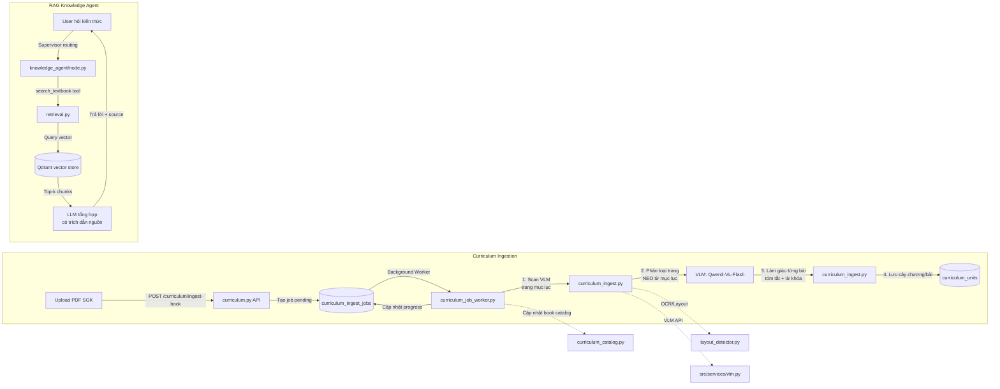

# Curriculum Ingestion + RAG Knowledge Agent Flow

- **Mục đích**: (1) Nạp sách giáo khoa (PDF) → VLM tự động tách mục lục, chương, bài → lưu vào `curriculum_units`. (2) RAG Knowledge Agent tra cứu nội dung SGK để trả lời câu hỏi kiến thức, có trích dẫn nguồn.
- **Phân hệ**: Curriculum / RAG
- **Trạng thái**: ✅ Đang hoạt động

---

## 1. Sơ đồ luồng



---

## 2. Các bước chi tiết — Curriculum Ingestion

| Bước | Nơi xử lý | Hành động | File liên quan |
|------|-----------|-----------|----------------|
| 1 | `frontend/src/app/curriculum/` | Admin upload PDF SGK (chọn môn, lớp, học kỳ) | `src/api/v1/curriculum.py` |
| 2 | `src/api/v1/curriculum.py` | Nhận file, lưu vào `uploads/curriculum_tmp/`, tạo `CurriculumIngestJob` status=pending | `src/api/v1/curriculum.py` |
| 3 | `src/services/curriculum_job_worker.py` | FIFO queue: timeout 60p → chống kẹt → lấy job pending → processing | `src/services/curriculum_job_worker.py` |
| 4 | `src/services/curriculum_ingest.py` | Đọc PDF bytes, gọi VLM scan (Lượt A): tìm trang mục lục (~15 trang đầu) → cây chương→bài + danh sách NEO | `src/services/curriculum_ingest.py` |
| 5 | `src/services/curriculum_ingest.py` | Gọi VLM scan (Lượt B): phân loại từng trang nội dung, chỉ chọn NEO từ danh sách mục lục (không tự đặt tên) | `src/services/curriculum_ingest.py` |
| 6 | `src/services/curriculum_ingest.py` | Làm giàu từng bài: tóm tắt, từ khóa, mục con. Gửi TOÀN BỘ trang bài đến VLM (tối đa 10 trang) | `src/services/curriculum_ingest.py` |
| 7 | `src/services/curriculum_ingest.py` | Chuẩn hóa tên bài (`_normalize_title`), lọc placeholder (`_is_placeholder`), gắn cờ phụ (`_is_phu_title`), sanity-check (`_sanity_check`) | `src/services/curriculum_ingest.py` |
| 8 | `src/services/curriculum_catalog.py` | Tạo/lấy `CurriculumBook` (môn+khối), ghi cây `CurriculumUnit` (chương→bài) | `src/services/curriculum_catalog.py` |
| 9 | `src/services/curriculum_job_worker.py` | Cập nhật progress 0→100%, đánh dấu completed, lưu result_json. Chạy job tiếp theo | `src/services/curriculum_job_worker.py` |

---

## 3. Các bước chi tiết — RAG Knowledge Agent

| Bước | Nơi xử lý | Hành động | File liên quan |
|------|-----------|-----------|----------------|
| 1 | `src/agents/supervisor/node.py` | Supervisor nhận câu hỏi → RouterDecision → `knowledge_agent` | `src/agents/supervisor/node.py` |
| 2 | `src/agents/knowledge_agent/node.py` | Khởi tạo ReAct agent với `search_textbook` tool | `src/agents/knowledge_agent/node.py` |
| 3 | `src/agents/knowledge_agent/tools.py` | `search_textbook(mon, lop, query)` → gọi vector search | `src/agents/knowledge_agent/tools.py` |
| 4 | `src/services/retrieval.py` | Query Qdrant collection → top-k chunks (kèm metadata: môn, lớp, chương, bài) | `src/services/retrieval.py` |
| 5 | `src/agents/knowledge_agent/node.py` | LLM tổng hợp câu trả lời từ chunks, BẮT BUỘC trích dẫn nguồn (môn, lớp, tên mục) | `src/agents/knowledge_agent/node.py` |
| 6 | `src/agents/graph.py` | Knowledge agent trả messages → Supervisor → FINISH → response về user | `src/agents/graph.py` |

---

## 4. File map

```
📁 src/services/
├── curriculum_ingest.py              # Core ingestion: VLM scan, enrich, normalize, save
├── curriculum_job_worker.py          # DB-backed FIFO queue worker (timeout 60p)
├── curriculum_catalog.py             # CurriculumBook + CurriculumUnit CRUD, resolve_subject_ids
├── vlm.py                            # VLM client (Qwen3-VL-Flash qua Replicate/OpenAI)
├── layout_detector.py                # Layout detection từ PDF
├── retrieval.py                      # RAG retrieval: Qdrant vector search, rag_mon_slug
├── entity_linker.py                  # Entity linking cho curriculum units
├── metadata_indexer.py               # Metadata indexing
├── knowledge_pipeline.py             # Legacy: MinIO + Airflow bridge (có thể không còn dùng)

📁 src/agents/knowledge_agent/
├── node.py                            # Knowledge Agent node (ReAct agent)
├── tools.py                           # search_textbook tool

📁 src/api/v1/
├── curriculum.py                      # POST /curriculum/ingest-book, GET /curriculum/books, GET /curriculum/ingest-book/jobs
├── knowledge.py                       # Knowledge search endpoints (nếu có)

📁 src/models/
├── tables.py                          # CurriculumUnit, CurriculumBook, CurriculumChunk, CurriculumIngestJob
```

---

## 5. RBAC

| Vai trò | Curriculum Ingestion | RAG Knowledge Agent |
|---------|---------------------|---------------------|
| ADMIN | ✅ Upload sách, quản lý catalog | ✅ Hỏi kiến thức |
| PRINCIPAL | ✅ Xem catalog, ❌ Upload | ✅ Hỏi kiến thức |
| SUBJECT_HEAD | ✅ Upload sách môn mình phụ trách | ✅ Hỏi kiến thức |
| SUBJECT_TEACHER | ❌ | ✅ Hỏi kiến thức |
| HOMEROOM_* | ❌ | ✅ Hỏi kiến thức |
| GRADE_HEAD | ❌ | ✅ Hỏi kiến thức |

Lưu ý: Knowledge Agent không cần ContextVar tenant isolation — nội dung SGK là toàn cục.

---

## 6. Database tables liên quan

| Bảng | Mục đích |
|------|----------|
| `curriculum_units` | Cây phân cấp chương/bài (parent_id, subject_id, grade_number, semester_number, unit_type: CHAPTER/LESSON/PHU) |
| `curriculum_books` | Đầu sách (subject_code, grade_number, semester_number, title, active) |
| `curriculum_chunks` | Chunks nội dung cho vector search (Qdrant sync) |
| `curriculum_ingest_jobs` | Hàng chờ nạp sách: status, progress, result_json |

---

## 7. Lưu ý kỹ thuật (Gotchas)

1. **⚠️ VLM 2 lượt quét**: Lượt A tìm mục lục → danh sách NEO (tên bài chuẩn). Lượt B phân loại trang, CHỈ chọn NEO từ danh sách, không tự đặt tên → chống VLM bịa đơn vị mới.

2. **⚠️ Không dùng số trang in**: Khoảng trang bài xác định theo TÊN bài (không dùng số trang từ mục lục) → chịu được file PDF cắt ngắn hoặc mục lục không có số trang.

3. **⚠️ Timeout 60 phút**: Nạp PDF toàn cuốn (VLM scan toàn bộ) + làm giàu từng bài → cần thời gian lớn. Worker timeout 60p.

4. **⚠️ Dry run**: Curriculum ingestion hỗ trợ `dry_run=true` → xem trước cây dự kiến trước khi ghi DB.

5. **⚠️ RAG không SEL**: Knowledge Agent tuyệt đối KHÔNG xử lý câu hỏi về điểm số/hồ sơ học sinh. Supervisor sẽ route các câu đó sang data_service_agent.

6. **⚠️ Qdrant vs ChromaDB**: Code có biến `CHROMA_PERSIST_DIR` trong config nhưng RAG hiện tại dùng Qdrant. Kiểm tra kỹ khi chuyển đổi.

---

## 8. Cách chạy thử

```bash
# 1. Nạp sách (dry run)
curl -X POST http://localhost:8000/api/v1/curriculum/ingest-book \
  -H "Authorization: Bearer <token_admin>" \
  -F "file=@sgk_toan6.pdf" \
  -F "subject_code=TOAN" \
  -F "grade_number=6" \
  -F "semester_number=1" \
  -F "dry_run=true"

# 2. Xem danh sách job
curl http://localhost:8000/api/v1/curriculum/ingest-book/jobs \
  -H "Authorization: Bearer <token_admin>"

# 3. Test knowledge agent qua chat
curl -X POST http://localhost:8000/api/v1/chat \
  -H "Authorization: Bearer <token>" \
  -H "Content-Type: application/json" \
  -d '{"session_id": null, "message": "Định nghĩa phân số là gì? (lớp 6)"}'

# 4. Test
pytest tests/test_curriculum_*.py tests/test_agents/test_knowledge_agent.py -v
```