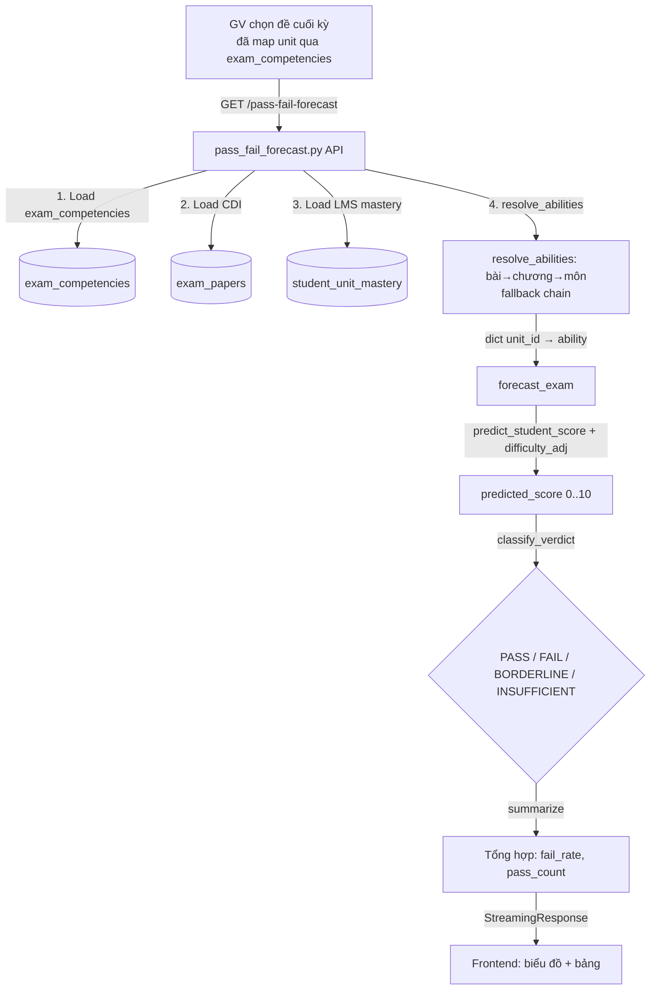

# Pass/Fail Forecast Flow

- **Mục đích**: Dự đoán tỷ lệ học sinh pass/fail đề thi cuối kỳ dựa trên năng lực LMS cấp bài (`student_unit_mastery.raw_mastery`) + trọng số unit của đề (`exam_competencies.weight`) + độ khó CDI của đề (`exam_papers.content_difficulty`). Không dùng ML model, là hàm tính thuần túy.
- **Phân hệ**: Analytics / Forecasting
- **Trạng thái**: ✅ Đang hoạt động

---

## 1. Sơ đồ luồng



---

## 2. Các bước chi tiết

| Bước | Nơi xử lý | Hành động | File liên quan |
|------|-----------|-----------|----------------|
| 1 | `frontend/src/app/pass-fail-forecast/` | GV nhập exam_paper_id + subject_id + semester_index | `src/api/v1/pass_fail_forecast.py` |
| 2 | `src/api/v1/pass_fail_forecast.py` | `_resolve_school_year()` — nếu không truyền, lấy năm hiện hành từ `s360.dim_school_year.is_current=1` | `src/api/v1/pass_fail_forecast.py` |
| 3 | `src/api/v1/pass_fail_forecast.py` | `_load_exam_units()` — load unit_id + weight từ `exam_competencies WHERE exam_paper_id = :eid` | `src/api/v1/pass_fail_forecast.py` |
| 4 | `src/api/v1/pass_fail_forecast.py` | `_load_cdi()` — load `content_difficulty` từ `exam_papers` (NULL nếu chưa phân tích) | `src/api/v1/pass_fail_forecast.py` |
| 5 | `src/api/v1/pass_fail_forecast.py` | `_calculate_forecast()` — batch query LMS mastery từ `student_unit_mastery` cho tất cả HS 1 lần (chống N+1) | `src/api/v1/pass_fail_forecast.py` |
| 6 | `src/services/pass_fail_forecast.py` | `resolve_abilities()` — chuỗi fallback: bài có LMS → raw×10; thiếu → TB chương; chương trống → TB toàn môn; không LMS → None (INSUFFICIENT) | `src/services/pass_fail_forecast.py` |
| 7 | `src/services/pass_fail_forecast.py` | `forecast_exam()` — gọi `predict_student_score()` cho từng HS | `src/services/pass_fail_forecast.py` |
| 8 | `src/services/pass_fail_forecast.py` | `predict_student_score()` = (Σ(weight_u × ability_u) / Σ weight) × CDI_adj, clamp [0,10]. CDI_adj = 1.0 + (0.5 - cdi) × 0.5 | `src/services/pass_fail_forecast.py` |
| 9 | `src/services/pass_fail_forecast.py` | `classify_verdict()`: score < 4.5 → FAIL; > 5.5 → PASS; giữa → BORDERLINE; None → INSUFFICIENT | `src/services/pass_fail_forecast.py` |
| 10 | `src/services/pass_fail_forecast.py` | `summarize()` — tổng hợp pass/fail/borderline/insufficient. `fail_rate` chỉ tính trên HS CÓ dự đoán | `src/services/pass_fail_forecast.py` |
| 11 | `src/services/pass_fail_forecast.py` | `compute_weak_units()` — top 2 bài HS yếu nhất (loss = (10 - ability) × weight) | `src/services/pass_fail_forecast.py` |
| 12 | `src/api/v1/pass_fail_forecast.py` | Trả `PassFailForecastResult` + `StudentForecastRow[]` về frontend | `src/api/v1/pass_fail_forecast.py` |

---

## 3. Công thức dự đoán

```
predicted_score = ( Σ_u(weight_u × ability_u) / Σ_u weight_u ) × difficulty_adj(CDI)

difficulty_adj(CDI) = 1.0 + (0.5 - CDI) × 0.5
  CDI = 0.5 → adj = 1.0 (trung tính)
  CDI = 0.0 → adj = 1.25 (đề dễ → điểm tăng)
  CDI = 1.0 → adj = 0.75 (đề khó → điểm giảm)

verdict:
  score ≥ 5.5 → PASS
  score < 4.5 → FAIL
  4.5 ≤ score ≤ 5.5 → BORDERLINE
  score = None → INSUFFICIENT (không có dữ liệu LMS)
```

---

## 4. File map

```
📁 src/services/
├── pass_fail_forecast.py            # Core logic: resolve_abilities, predict_student_score, forecast_exam, classify_verdict, summarize, compute_weak_units

📁 src/api/v1/
├── pass_fail_forecast.py            # GET /pass-fail-forecast?exam_paper_id=&subject_id=&...

📁 src/schemas/
├── pass_fail_forecast.py            # PassFailForecastResult, StudentForecastRow, ExamUnit schema

📁 frontend/src/app/
└── pass-fail-forecast/              # Trang frontend: nhập exam_paper_id, xem kết quả
```

---

## 5. RBAC

| Vai trò | Quyền | Ghi chú |
|---------|-------|---------|
| ADMIN | ✅ Xem mọi đề toàn trường | |
| PRINCIPAL | ✅ Xem mọi đề trong trường | |
| SUBJECT_HEAD | ✅ Xem đề môn phụ trách | Cần filter theo subject_id được phân công |
| SUBJECT_TEACHER | ✅ Xem đề môn/lớp dạy | Scope theo phân công |
| HOMEROOM_* | ⚠️ Chỉ xem, không ảnh hưởng kết quả | Hạn chế lớp chủ nhiệm |
| GRADE_HEAD | ✅ Xem đề trong khối phụ trách | |

---

## 6. Database tables liên quan

| Bảng | Mục đích |
|------|----------|
| `exam_papers` | Đề thi: content_difficulty (CDI), score_category |
| `exam_competencies` | Map đề thi → unit: unit_id, weight |
| `student_unit_mastery` | Năng lực LMS cấp bài: raw_mastery 0..1 |
| `curriculum_units` | Cây chương/bài: id, parent_id (bài→chương) |
| `s360.dim_school_year` | Năm học: is_current flag |
| `s360.dim_homeroom_class_student` | Học sinh theo lớp |

---

## 7. Lưu ý kỹ thuật (Gotchas)

1. **⚡ Module THUẦN**: `pass_fail_forecast.py` là pure function, không chạm DB, không LLM → dễ unit test. DB interaction chỉ ở API layer.

2. **⚠️ Chuỗi fallback ability**: Bài có LMS → raw×10; thiếu → trung bình chương; chương trống → trung bình toàn môn; hoàn toàn không có LMS → None (INSUFFICIENT). Không bịa số.

3. **⚠️ `fail_rate` chỉ tính trên HS có dự đoán**: Số HS INSUFFICIENT bị loại khỏi mẫu tính fail_rate → tránh nhiễu.

4. **⚠️ Ngưỡng BORDERLINE cấu hình được**: `BORDERLINE_LOW = 4.5`, `BORDERLINE_HIGH = 5.5` — có thể override theo trường/môn.

5. **⚠️ CDI có thể NULL**: Đề chưa phân tích nội dung → CDI mặc định 0.5 (trung tính), adj=1.0.

---

## 8. Cách chạy thử

```bash
# API
curl "http://localhost:8000/api/v1/pass-fail-forecast?exam_paper_id=101&subject_id=1&semester_index=1&school_year_id=2025" \
  -H "Authorization: Bearer <token>"

# Test unit (pure functions, không cần DB)
pytest tests/test_pass_fail_forecast.py -v
```