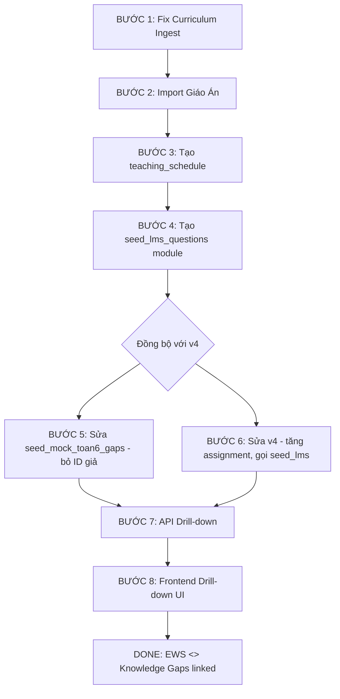

# 📌 PLAN TÍCH HỢP & ĐỒNG BỘ: LIÊN KẾT EWS - KNOWLEDGE GAPS

**Mục tiêu:** Xây dựng liên kết $1-1$ giữa bài tập tuần EWS (`dim_so_assignment`) và ngân hàng câu hỏi vi mô (`lms_question_bank`), tích hợp giáo án thật từ file docx, fix luồng add sách (curriculum ingest), và mock dữ liệu LMS cho TOÁN 6 làm pilot.

---

## 🔍 TỔNG QUAN HIỆN TRẠNG

### Dữ liệu đã có:

| Thành phần | Mô tả | Vị trí |
|-----------|-------|--------|
| **Giáo án TOÁN 6 HK1** | 73 tiết, 4 chương (CTST) | `docs_vsf/giao_an_toan_6/KHBD Toan 6 (CTST)-Ki.docx` |
| **Giáo án TOÁN 6 HK2** | 35+ bài, 5 chương (CTST) | `docs_vsf/giao_an_toan_6/KHBD Toan 6 (CTST)-KII.docx` |
| **Cây tri thức TOÁN 6** | `curriculum_units` với lesson_id 392-425 | Trong DB (đã seed) |
| **340 câu hỏi LMS mẫu** | 34 bài × 10 câu, ID giả 9001-9034 | `scripts/seed_mock_toan6_gaps.py` |
| **Dữ liệu giả v4** | 23 môn, 2 trường, Copula+AR(1) | `data_mock/mock_full_data/generate_full_system_mock_v4.py` |
| **Dim so assignment** | 4 bài/HK/môn (quá ít) | Trong DB (do v4 tạo) |
| **8 bảng cm_*** | Khung DB giáo án (rỗng) | `docs_vsf/plan_lesson_plan_integration.md` |

### Vấn đề hiện tại:

1. **`lms_question_bank`** dùng assignment_id **giả 9001-9034** — không đồng bộ với `dim_so_assignment` (ID 1,2,3...)
2. **v4 chỉ tạo 4 bài tập/HK/môn** — thực tế Toán 4 tiết/tuần cần 2-3 bài/tuần
3. **Curriculum ingest (add sách)** dễ mất dữ liệu khi VLM lỗi 1-2 trang
4. **Giáo án docx chưa được đưa vào DB** → chưa có timeline giảng dạy
5. **Chỉ TOÁN 6 là pilot** — các môn khác giữ nguyên

---

## 📊 CẤU TRÚC GIÁO ÁN (TỪ DOCX)

### FILE 1: `KHBD Toan 6 (CTST)-Ki.docx` (HK1) — 73 TIẾT

```
CHƯƠNG 1: SỐ TỰ NHIÊN (Tiết 1-24)
  Bài 1. Tập hợp. Phần tử (Tiết 1-2)
  Bài 2. Tập hợp số tự nhiên. Ghi số tự nhiên (Tiết 3)
  Bài 3. Các phép tính trong tập hợp số tự nhiên (Tiết 4)
  Bài 4. Lũy thừa với số mũ tự nhiên (Tiết 5)
  Bài 5. Thứ tự thực hiện các phép tính (Tiết 6-7)
  Bài 6. Chia hết và chia có dư. Tính chất chia hết (Tiết 8-9)
  Bài 7. Dấu hiệu chia hết cho 2, cho 5 (Tiết 10)
  Bài 8. Dấu hiệu chia hết cho 3, cho 9 (Tiết 11)
  Bài 9. Ước và bội (Tiết 12-13)
  Bài 10. Số nguyên tố. Hợp số. Phân tích ra thừa số nguyên tố (Tiết 14-15)
  Bài 11. Hoạt động thực hành và trải nghiệm (Tiết 16)
  Bài 12. Ước chung, Ước chung lớn nhất (Tiết 17-18)
  Bài 13. Bội chung, Bội chung nhỏ nhất (Tiết 19-20)
  Bài 14. Hoạt động thực hành và trải nghiệm (Tiết 21)
  BÀI TẬP CUỐI CHƯƠNG 1 (Tiết 22-24)

CHƯƠNG 2: SỐ NGUYÊN (Tiết 25-45)
  Bài 1. Số nguyên âm và tập hợp các số nguyên (Tiết 25-27)
  Bài 2. Thứ tự trong tập hợp số nguyên (Tiết 28-29)
  Bài 3. Phép cộng và phép trừ hai số nguyên (Tiết 30-35)
  Bài 4. Phép nhân và phép chia hai số nguyên (Tiết 36-41)
  Bài 5. Hoạt động thực hành và trải nghiệm (Tiết 42)
  BÀI TẬP CUỐI CHƯƠNG 2 (Tiết 43-45)

CHƯƠNG 3: HÌNH PHẲNG (Tiết 46-58)
  Bài 1. Hình vuông - Tam giác đều - Lục giác đều (Tiết 46-48)
  Bài 2. Hình chữ nhật - Hình thoi - Hình bình hành - Hình thang cân (Tiết 49-52)
  Bài 3. Chu vi và diện tích một số hình trong thực tiễn (Tiết 53-54)
  Bài 4. Hoạt động thực hành và trải nghiệm (Tiết 55)
  BÀI TẬP CUỐI CHƯƠNG 3 (Tiết 56-58)

CHƯƠNG 4: THỐNG KÊ (Tiết 59-73)
  Bài 1. Thu thập và phân loại dữ liệu (Tiết 59-60)
  Bài 2. Biểu diễn dữ liệu trên bảng (Tiết 61-63)
  Bài 3. Biểu đồ tranh (Tiết 64-65)
  Bài 4. Biểu đồ cột – Biểu đồ cột kép (Tiết 66-69)
  Bài 5. Hoạt động thực hành và trải nghiệm (Tiết 70)
  BÀI TẬP CUỐI CHƯƠNG 4 (Tiết 71-73)
```

### FILE 2: `KHBD Toan 6 (CTST)-KII.docx` (HK2) — 34 BÀI

```
CHƯƠNG 5: PHÂN SỐ
  Bài 1-8 + BÀI TẬP CUỐI CHƯƠNG
CHƯƠNG 6: SỐ THẬP PHÂN
  Bài 1-6 + BÀI TẬP CUỐI CHƯƠNG
CHƯƠNG 7: TÍNH ĐỐI XỨNG
  Bài 1-4 + BÀI TẬP CUỐI CHƯƠNG
CHƯƠNG 8: HÌNH HỌC PHẲNG
  Bài 1-8 + BÀI TẬP CUỐI CHƯƠNG
CHƯƠNG 9: XÁC SUẤT
  Bài 1-3 + BÀI TẬP CUỐI CHƯƠNG
```

### Cấu trúc 1 giáo án (cả HK1 và HK2 đều giống nhau):

```
I. MỤC TIÊU
   1. Kiến thức, kĩ năng
   2. Năng lực
   3. Phẩm chất
II. THIẾT BỊ DẠY HỌC VÀ HỌC LIỆU
III. TIẾN TRÌNH DẠY HỌC
   A. HOẠT ĐỘNG KHỞI ĐỘNG
   B. HÌNH THÀNH KIẾN THỨC MỚI
      Hoạt động 1, 2, 3...
   C. HOẠT ĐỘNG LUYỆN TẬP
   D. HOẠT ĐỘNG VẬN DỤNG
IV. KẾ HOẠCH ĐÁNH GIÁ
V. HỒ SƠ DẠY HỌC
```

---

## 📋 KẾ HOẠCH CHI TIẾT THEO THỨ TỰ

---

### 🔧 BƯỚC 1: FIX LUỒNG CURRICULUM INGEST (ADD SÁCH)

**Mục tiêu:** Khi VLM lỗi 1 vài trang → không mất dữ liệu đã xử lý. Người dùng không phải add lại cả cuốn sách.

#### File cần sửa:

| File | Vấn đề | Giải pháp |
|------|--------|-----------|
| `src/services/vlm.py` | `_chat_completions` retry 3 lần với backoff nhưng vẫn fail nếu lỗi kéo dài | Thêm fallback: nếu tất cả retry fail → trả về `None` + warning, không crash |
| `src/services/vlm.py` | `read_book_pages` gửi batch N trang/lần — nếu lỗi mất cả lô | Sửa: thêm chế độ "single page retry" khi batch fail |
| `src/services/curriculum_ingest.py` | `parse_into()` (dòng 381) — nếu _parse_scan_batch fail → mất hết trang trong batch | Thêm `_retry_single_pages()` để thử lại từng trang riêng lẻ khi batch lỗi |
| `src/services/curriculum_ingest.py` | `extract_book_structure()` — sau khi có TOC, nếu enrich fail → mất luôn TOC (chưa lưu) | Commit TOC vào DB ngay khi có (pre-save), enrich sau. Nếu enrich fail → chỉ mất phần enrich |
| `src/services/curriculum_ingest.py` | `_enrich_chapters()` — nếu VLM lỗi 1 bài → ghi warning, không retry | Thêm `retry(3)` decorator cho `process_one` |
| `src/api/v1/curriculum.py` | Frontend poll job nhưng không biết tiến độ cụ thể | Thêm `progress` field chi tiết: { scanned: 10/50, enriched: 5/30 } |

#### Kỹ thuật:

```python
# Ý tưởng: Retry từng trang khi batch fail
def _retry_single_pages(vlm, tmp, start_idx, count):
    """Thử lại từng trang một khi cả batch fail."""
    pages = []
    for i in range(count):
        try:
            raw = vlm.read_book_pages(tmp, start_page=start_idx + i, max_pages=1, 
                                       prompt=vlm._SINGLE_PAGE_PROMPT)
            pages.append(raw[0] if raw else None)
        except VlmUnavailableError:
            pages.append(None)  # Page này lỗi — ghi None, không mất các trang khác
    return pages
```

---

### 🔧 BƯỚC 2: TẠO DB CHO GIÁO ÁN

**Mục tiêu:** Đưa 2 file docx vào database, tạo cấu trúc timeline giảng dạy.

#### 2.1. Tạo bảng `teaching_schedule`

**File:** `src/db/mini_migrations.py` (thêm migration mới)

```sql
CREATE TABLE IF NOT EXISTS public.teaching_schedule (
    id BIGINT GENERATED ALWAYS AS IDENTITY PRIMARY KEY,
    subject_id INTEGER NOT NULL,
    grade_id INTEGER NOT NULL,
    semester_index INTEGER NOT NULL,
    week_number INTEGER NOT NULL,
    lesson_id BIGINT REFERENCES public.curriculum_units(id),
    lessonplan_id BIGINT REFERENCES s360.cm_lessonplan(id),
    topic VARCHAR(255),
    num_periods INTEGER DEFAULT 2,
    created_at TIMESTAMPTZ DEFAULT NOW(),
    UNIQUE (subject_id, grade_id, semester_index, week_number, lesson_id)
);
CREATE INDEX IF NOT EXISTS idx_ts_lookup ON public.teaching_schedule(subject_id, grade_id, semester_index);
```

#### 2.2. Tạo script import giáo án

**File mới:** `docs_vsf/giao_an_toan_6/import_toan6_lesson_plans.py`

**Luồng chính:**

```
Đọc 2 file docx
  │
  ├── 1. Parse HK1 (73 tiết):
  │      ├── Duyệt Heading 1 → detect các TIẾT
  │      │   Ví dụ: "TIẾT 1 - BÀI 1. TẬP HỢP. PHẦN TỬ CỦA TẬP HỢP"
  │      │         → tiết_number=1, bài_name="TẬP HỢP. PHẦN TỬ CỦA TẬP HỢP"
  │      ├── Phân đoạn: MỤC TIÊU → THIẾT BỊ → TIẾN TRÌNH
  │      ├── Trích: mục tiêu kiến thức, nội dung, bài tập SGK
  │      └── Map lesson_id từ curriculum_units (dùng tên bài)
  │
  ├── 2. Parse HK2 (34 bài):
  │      ├── Duyệt Heading 1 → detect các BÀI
  │      └── Tương tự nhưng nhóm theo BÀI (có thể nhiều tiết/bài)
  │
  ├── 3. Insert vào s360.cm_*:
  │      ├── cm_course → 2 rows (TOÁN 6 HK1, TOÁN 6 HK2)
  │      ├── cm_unit → 9 rows (4 chương HK1 + 5 chương HK2)
  │      ├── cm_lesson → ~107 rows (mỗi tiết/bài = 1 lesson)
  │      ├── cm_lessonplan → ~107 rows (nội dung giáo án)
  │      └── cm_lessontarget → ~300 rows (mục tiêu)
  │
  └── 4. Insert vào public.teaching_schedule:
         ├── Map lesson → week_number dựa vào số tiết/tuần (4 tiết/tuần)
         └── HK1: 73 tiết ÷ 4 tiết/tuần ≈ 18 tuần học
```

#### 2.3. Map lesson_id từ curriculum_units

Cần đối chiếu tên bài trong docx với lesson name trong `curriculum_units`:

| Bài trong docx | lesson_id (curriculum_units) |
|---------------|------------------------------|
| TẬP HỢP. PHẦN TỬ CỦA TẬP HỢP | 392 (Tập hợp) |
| TẬP HỢP SỐ TỰ NHIÊN. GHI SỐ TỰ NHIÊN | 393 (Ghi số tự nhiên) |
| CÁC PHÉP TÍNH TRONG TẬP HỢP SỐ TỰ NHIÊN | 394 (Phép tính) |
| ... | ... (xem `seed_mock_toan6_gaps.py` dòng 132-139) |

**Nếu tên không khớp chính xác:** script cần fallback fuzzy match hoặc mapping table tay.

---

### 🔧 BƯỚC 3: TẠO teaching_schedule & PHÂN TIMELINE

**Mục tiêu:** Biết chính xác tuần nào dạy bài gì, từ đó phân bổ câu hỏi LMS.

#### 3.1. Xây timeline HK1 (73 tiết ÷ 4 tiết/tuần ≈ 18 tuần)

| Tuần | Tiết | Nội dung | Số BT giao |
|------|------|---------|-----------|
| 1 | 1-2 | Bài 1: Tập hợp. Phần tử | 2 bài tập |
| 2 | 3-4 | Bài 2: Ghi số tự nhiên + Bài 3: Phép tính | 2 bài |
| 3 | 5-6 | Bài 4: Lũy thừa + Bài 5: Thứ tự TH | 2 bài |
| 4 | 7-8 | Bài 5 (tiếp) + Bài 6: Chia hết | 2 bài |
| 5 | 9-10 | Bài 7: Dấu hiệu 2,5 + Bài 8: Dấu hiệu 3,9 | 2 bài |
| 6 | 11-12 | Bài 9: Ước và bội + Bài 10: Số nguyên tố | 2 bài |
| 7 | 13-14 | Bài 10 (tiếp) + Bài 11: Thực hành | 2 bài |
| 8 | 15-16 | Bài 12: ƯCLN + Bài 13: BCNN | 3 bài (ôn tập) |
| 9 | 17-18 | Bài 13 (tiếp) + Bài 14: Thực hành | 2 bài |
| 10 | 19-21 | BÀI TẬP CUỐI CHƯƠNG 1 | 3 bài (ôn tập) |
| 11 | 22-24 | Ôn tập + Kiểm tra GK1 | 2 bài |
| 12 | 25-27 | Chương 2: Bài 1. Số nguyên âm | 2 bài |
| 13 | 28-30 | Bài 2. Thứ tự + Bài 3. Cộng trừ | 3 bài |
| 14 | 31-33 | Bài 3 (tiếp) | 3 bài |
| 15 | 34-36 | Bài 4. Nhân chia số nguyên | 3 bài |
| 16 | 37-39 | Bài 4 (tiếp) + Bài 5: Thực hành | 2 bài |
| 17 | 40-42 | BÀI TẬP CUỐI CHƯƠNG 2 | 2 bài |
| 18+ | 43-73 | Chương 3, 4 (các tuần còn lại) | ... |

**Tổng số bài tập LMS cho TOÁN 6 HK1:** ~40-50 bài (mỗi bài 10-12 câu)

#### 3.2. Mở rộng v4 để seed đủ số assignment

**File sửa:** `data_mock/mock_full_data/generate_full_system_mock_v4.py`

- Đổi số assignment từ `4 bài/HK` lên **40-50 bài/HK** cho TOÁN 6
- Các môn khác: giữ nguyên 4 bài/HK (hoặc 8-12 tùy)
- Đọc `teaching_schedule` để biết chính xác nội dung từng assignment

---

### 🔧 BƯỚC 4: TẠO MODULE SEED LMS QUESTIONS

**Mục tiêu:** Tạo ngân hàng câu hỏi đồng bộ với assignment_id thật, dùng template từ seed_mock_toan6_gaps.py.

#### File mới: `data_mock/mock_full_data/seed_lms_questions.py`

```python
"""
Module dùng chung: seed lms_question_bank + lms_question_response.
- TOAN_6: dùng QUESTION_TEMPLATES thật (từ textbook Cánh Diều)
- Các môn khác: dùng FALLBACK_TEMPLATES
"""
```

**Cấu trúc:**

```python
def seed_lms_questions(
    db, 
    subject_id, 
    grade_id, 
    semester_index,
    assignments,  # list of dicts from dim_so_assignment
    students,  # list of student dicts
    profiles,  # list of profile dicts (probability per unit)
    templates,  # QUESTION_TEMPLATES hoặc FALLBACK_TEMPLATES
):
    """Seed lms_question_bank + lms_question_unit + lms_question_response."""
    # Mỗi assignment → 10-12 câu hỏi
    # 70% thuộc bài hiện tại (theo teaching_schedule)
    # 20% ôn bài trước
    # 10% tổng hợp
```

#### Phân bổ câu hỏi cho 1 assignment (TOÁN 6):

```
Mỗi assignment = 10-12 câu hỏi:
  ├── 7-8 câu (70%): thuộc lesson tuần hiện tại (bloom_level 1-3)
  ├── 2-3 câu (20%): ôn tập lesson tuần trước (spaced repetition)
  └── 1-2 câu (10%): tổng hợp/chéo chương (bloom_level 4-6)
```

---

### 🔧 BƯỚC 5: SỬA seed_mock_toan6_gaps.py (BỎ ID GIẢ)

**File sửa:** `scripts/seed_mock_toan6_gaps.py`

**Sửa chính:**

```python
# THAY VÌ (hiện tại):
assignments = []
n = 1
for week in range(1, 17):
    count = 2 + (1 if week in {8, 16} else 0)
    for k in range(count):
        assignments.append({"assignment_id": 9000 + n, ...})

# THÀNH:
# Đọc assignment_id THẬT từ dim_so_assignment
cur.execute("""
    SELECT assignment_id, due_date 
    FROM s360.dim_so_assignment 
    WHERE subject_id = 106 AND grade_id = 6 AND semester_index = 1
    ORDER BY due_date
""")
real_assignments = [dict(r) for r in cur.fetchall()]
```

**Hoặc tối ưu hơn:** Bỏ hẳn `seed_mock_toan6_gaps.py`, gọi module `seed_lms_questions.py` từ v4.

---

### 🔧 BƯỚC 6: FIX generate_full_system_mock_v4.py

**File sửa:** `data_mock/mock_full_data/generate_full_system_mock_v4.py`

1. **Tăng số assignment** cho TOAN_6 từ 4 → 40-50 bài/HK
2. **Gọi `seed_lms_questions`** sau khi seed `dim_so_assignment`
3. **Gọi `seed_lms_question_response`** — dùng Copula latent variables để tính `is_correct` thay vì random
4. **Tính `student_unit_mastery`** sau khi có responses
5. **Thêm các bảng `teaching_schedule`** vào `clean_database()` nếu cần

---

### 🔧 BƯỚC 7: API ENDPOINT DRILL-DOWN

**File mới/sửa:** `src/api/v1/ews.py`

```python
@router.get("/assignments/{assignment_id}/drilldown")
def get_assignment_drilldown(
    assignment_id: int,
    student_code: str = Query(...),
    db: Session = Depends(get_db),
):
    """
    Trả danh sách câu hỏi của 1 bài tập + trạng thái làm của học sinh.
    Dùng cho EWS Drawer > tab LMS > click vào bài tập.
    """
    # JOIN: lms_question_bank + lms_question_response + curriculum_units
    # Mỗi câu: question_id, question_text, bloom_level, lesson_name, 
    #           is_correct, response_time, attempt_count
```

---

### 🔧 BƯỚC 8: FRONTEND DRILL-DOWN UI

**File sửa:** `frontend/src/components/dashboard/EwsDetailDrawer.tsx`

Thêm vào tab "Học tập LMS" (dòng 917-967):

```
Khi click vào 1 bài tập:
  → Expand danh sách 10 câu hỏi
    ├── Icon: ✅ Đúng / ❌ Sai
    ├── Nội dung câu hỏi
    ├── Bloom level + Tên bài học SGK
    ├── Thời gian làm (giây)
    └── Link tới Knowledge Gaps (nếu câu sai)
```

**File sửa:** `frontend/src/components/dashboard/LmsEvidenceBlock.tsx`

Thêm prop `drilldownData` và state expandable rows.

---

## 📊 MAP GIỮA BÀI HỌC TRONG DOCX VÀ lesson_id (CURRICULUM_UNITS)

### HK1 — CHƯƠNG 1: SỐ TỰ NHIÊN

| Tên bài (docx) | lesson_id | Tên curriculum_units |
|---------------|-----------|---------------------|
| TẬP HỢP. PHẦN TỬ CỦA TẬP HỢP | 392 | Tập hợp |
| TẬP HỢP SỐ TỰ NHIÊN. GHI SỐ TỰ NHIÊN | 393 | Ghi số tự nhiên |
| CÁC PHÉP TÍNH TRONG TẬP HỢP SỐ TỰ NHIÊN | 394 | Phép tính |
| LŨY THỪA VỚI SỐ MŨ TỰ NHIÊN | 395 | Lũy thừa |
| THỨ TỰ THỰC HIỆN CÁC PHÉP TÍNH | 396 | Thứ tự thực hiện |
| CHIA HẾT VÀ CHIA CÓ DƯ. TÍNH CHẤT CHIA HẾT | 397 | (chưa có) |
| DẤU HIỆU CHIA HẾT CHO 2, CHO 5 | 398 | Dấu hiệu chia hết 2,5 |
| DẤU HIỆU CHIA HẾT CHO 3, CHO 9 | 399 | Dấu hiệu 3,9 |
| ƯỚC VÀ BỘI | 400 | (chưa có) |
| SỐ NGUYÊN TỐ. HỢP SỐ. PHÂN TÍCH RA TSNT | 401 | Số nguyên tố |
| HOẠT ĐỘNG THỰC HÀNH VÀ TRẢI NGHIỆM (Ch1) | 402 | (chưa có) |
| ƯỚC CHUNG, ƯỚC CHUNG LỚN NHẤT | 403 | ƯCLN |
| BỘI CHUNG, BỘI CHUNG NHỎ NHẤT | 404 | BCNN |
| HOẠT ĐỘNG THỰC HÀNH VÀ TRẢI NGHIỆM (Ch1 lần 2) | 405 | (chưa có) |
| BÀI TẬP CUỐI CHƯƠNG 1 | 406 | BTCC |

> **⚠️ Ghi chú:** Một số lesson_id (397, 400, 402, 405) chưa có trong `curriculum_units` — cần seed thêm khi import giáo án.

---

## 📊 TỔNG QUAN FILE BỊ ẢNH HƯỞNG

| # | File | Action | Mô tả |
|---|------|--------|-------|
| 1 | `src/services/vlm.py` | 🛠 SỬA | Thêm single-page retry, fallback khi batch lỗi |
| 2 | `src/services/curriculum_ingest.py` | 🛠 SỬA | Retry/commit từng phần, không mất dữ liệu |
| 3 | `src/api/v1/curriculum.py` | 🛠 SỬA | Thêm progress tracking chi tiết |
| 4 | `src/db/mini_migrations.py` | ➕ THÊM | Bảng `teaching_schedule` |
| 5 | `docs_vsf/giao_an_toan_6/import_toan6_lesson_plans.py` | 🆕 TẠO MỚI | Parse docx → cm_* + teaching_schedule |
| 6 | `data_mock/mock_full_data/seed_lms_questions.py` | 🆕 TẠO MỚI | Module seed LMS questions dùng chung |
| 7 | `scripts/seed_mock_toan6_gaps.py` | 🛠 SỬA | Bỏ ID giả 9001..9034, dùng ID thật |
| 8 | `data_mock/mock_full_data/generate_full_system_mock_v4.py` | 🛠 SỬA | Tăng số assignment, gọi seed_lms |
| 9 | `src/api/v1/ews.py` | ➕ THÊM | Endpoint /assignments/{id}/drilldown |
| 10 | `frontend/.../EwsDetailDrawer.tsx` | 🛠 SỬA | UI drill-down từng câu hỏi |
| 11 | `frontend/.../LmsEvidenceBlock.tsx` | 🛠 SỬA | Expandable drill-down rows |

---

## 📐 LƯU ĐỒ THỰC HIỆN



---

## ⚠️ LƯU Ý KHI THỰC HIỆN

1. **TOÁN 6 là pilot** — các môn khác giữ nguyên cấu trúc v4 cũ (4 bài/HK)
2. **lesson_id mapping** cần kiểm tra tay: tên trong docx và tên trong `curriculum_units` có thể không khớp chính xác vì khác bộ SGK (CTST vs Cánh Diều)
3. **seed_mock_toan6_gaps.py** sẽ trở nên không cần thiết sau khi v4 đã seed đủ — có thể deprecate
4. **2 file docx gốc** là nguồn duy nhất — không sửa file gốc, chỉ đọc
5. **VLM ingest fix** là priority cao nhất vì ảnh hưởng trực tiếp tới UX khi add sách

---

## TÀI LIỆU THAM KHẢO

- File giáo án docx: `docs_vsf/giao_an_toan_6/`
  - `KHBD Toan 6 (CTST)-Ki.docx` (HK1, 73 tiết)
  - `KHBD Toan 6 (CTST)-KII.docx` (HK2, 34 bài)
- `scripts/seed_mock_toan6_gaps.py` (QUESTION_TEMPLATES, lesson_id map)
- `docs_vsf/plan_lesson_plan_integration.md` (8 bảng cm_*)
- `data_mock/mock_full_data/generate_full_system_mock_v4.py` (v4 seed)
- `src/services/curriculum_ingest.py` (VLM ingest hiện tại)
- `src/services/curriculum_catalog.py` (API upload catalog)