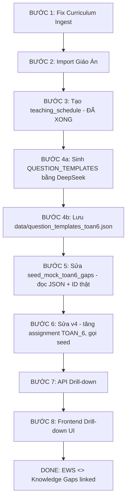

# 📌 PLAN TÍCH HỢP & ĐỒNG BỘ: LIÊN KẾT EWS - KNOWLEDGE GAPS

**Mục tiêu:** Xây dựng liên kết $1-1$ giữa bài tập tuần EWS (`dim_so_assignment`) và ngân hàng câu hỏi vi mô (`lms_question_bank`), tích hợp giáo án thật từ file docx, fix luồng add sách (curriculum ingest), và mock dữ liệu LMS cho TOÁN 6 làm pilot.

**CẬP NHẬT QUAN TRỌNG:** Thay vì hardcode câu hỏi trong `QUESTION_TEMPLATES`, dùng **DeepSeek API sinh tự động** dựa trên `teaching_schedules`. Chạy 1 lần, lưu JSON cố định, seed mock từ đó.

---

## 🔍 TỔNG QUAN HIỆN TRẠNG

### Dữ liệu đã có:

| Thành phần | Mô tả | Vị trí |
|-----------|-------|--------|
| **Giáo án TOÁN 6 HK1** | 73 tiết, 4 chương (CTST) | `docs_vsf/giao_an_toan_6/KHBD Toan 6 (CTST)-Ki.docx` |
| **Giáo án TOÁN 6 HK2** | 35+ bài, 5 chương (CTST) | `docs_vsf/giao_an_toan_6/KHBD Toan 6 (CTST)-KII.docx` |
| **Cây tri thức TOÁN 6** | `curriculum_units` với lesson_id 392-425 | Trong DB (đã seed) |
| **340 câu hỏi LMS mẫu (hardcode)** | 34 bài × 10 câu, ID giả 9001-9034 | `scripts/seed_mock_toan6_gaps.py` |
| **Dữ liệu giả v4** | 23 môn, 2 trường, Copula+AR(1) | `data_mock/mock_full_data/generate_full_system_mock_v4.py` |
| **Dim so assignment** | 4 bài/HK/môn (quá ít) | Trong DB (do v4 tạo) |
| **teaching_schedules** | 35 tuần cho TOÁN 6 (đã seed) | DB + `scripts/seed_teaching_schedules_toan6.py` |
| **8 bảng cm_*** | Khung DB giáo án (rỗng) | `docs_vsf/plan_lesson_plan_integration.md` |

### Vấn đề hiện tại:

1. **`lms_question_bank`** dùng assignment_id **giả 9001-9034** — không đồng bộ với `dim_so_assignment` (ID 1,2,3...)
2. **v4 chỉ tạo 4 bài tập/HK/môn** — thực tế Toán 4 tiết/tuần cần 2-3 bài/tuần → **đã có `teaching_schedules` để dựa vào**
3. **Câu hỏi hardcode** — không đa dạng, phân bố Bloom tệ, không test được pipeline classify thật
4. **Curriculum ingest (add sách)** dễ mất dữ liệu khi VLM lỗi 1-2 trang
5. **Giáo án docx chưa được đưa vào DB** → chưa có timeline giảng dạy
6. **Chỉ TOÁN 6 là pilot** — các môn khác giữ nguyên

---

## 📊 CẤU TRÚC GIÁO ÁN (TỪ DOCX)

### FILE 1: `KHBD Toan 6 (CTST)-Ki.docx` (HK1) — 73 TIẾT

```
CHƯƠNG 1: SỐ TỰ NHIÊN (Tiết 1-24)
  Bài 1. Tập hợp. Phần tử (Tiết 1-2)
  Bài 2. Tập hợp số tự nhiên. Ghi số tự nhiên (Tiết 3)
  Bài 3. Các phép tính trong tập hợp số tự nhiên (Tiết 4)
  Bài 4. Lũy thừa với số mũ tự nhiên (Tiết 5)
  Bài 5. Thứ tự thực hiện các phép tính (Tiết 6-7)
  Bài 6. Chia hết và chia có dư. Tính chất chia hết (Tiết 8-9)
  Bài 7. Dấu hiệu chia hết cho 2, cho 5 (Tiết 10)
  Bài 8. Dấu hiệu chia hết cho 3, cho 9 (Tiết 11)
  Bài 9. Ước và bội (Tiết 12-13)
  Bài 10. Số nguyên tố. Hợp số. Phân tích ra thừa số nguyên tố (Tiết 14-15)
  Bài 11. Hoạt động thực hành và trải nghiệm (Tiết 16)
  Bài 12. Ước chung, Ước chung lớn nhất (Tiết 17-18)
  Bài 13. Bội chung, Bội chung nhỏ nhất (Tiết 19-20)
  Bài 14. Hoạt động thực hành và trải nghiệm (Tiết 21)
  BÀI TẬP CUỐI CHƯƠNG 1 (Tiết 22-24)

CHƯƠNG 2: SỐ NGUYÊN (Tiết 25-45)
  Bài 1. Số nguyên âm và tập hợp các số nguyên (Tiết 25-27)
  Bài 2. Thứ tự trong tập hợp số nguyên (Tiết 28-29)
  Bài 3. Phép cộng và phép trừ hai số nguyên (Tiết 30-35)
  Bài 4. Phép nhân và phép chia hai số nguyên (Tiết 36-41)
  Bài 5. Hoạt động thực hành và trải nghiệm (Tiết 42)
  BÀI TẬP CUỐI CHƯƠNG 2 (Tiết 43-45)

CHƯƠNG 3: HÌNH PHẲNG (Tiết 46-58)
  Bài 1. Hình vuông - Tam giác đều - Lục giác đều (Tiết 46-48)
  Bài 2. Hình chữ nhật - Hình thoi - Hình bình hành - Hình thang cân (Tiết 49-52)
  Bài 3. Chu vi và diện tích một số hình trong thực tiễn (Tiết 53-54)
  Bài 4. Hoạt động thực hành và trải nghiệm (Tiết 55)
  BÀI TẬP CUỐI CHƯƠNG 3 (Tiết 56-58)

CHƯƠNG 4: THỐNG KÊ (Tiết 59-73)
  Bài 1. Thu thập và phân loại dữ liệu (Tiết 59-60)
  Bài 2. Biểu diễn dữ liệu trên bảng (Tiết 61-63)
  Bài 3. Biểu đồ tranh (Tiết 64-65)
  Bài 4. Biểu đồ cột – Biểu đồ cột kép (Tiết 66-69)
  Bài 5. Hoạt động thực hành và trải nghiệm (Tiết 70)
  BÀI TẬP CUỐI CHƯƠNG 4 (Tiết 71-73)
```

### FILE 2: `KHBD Toan 6 (CTST)-KII.docx` (HK2) — 34 BÀI

```
CHƯƠNG 5: PHÂN SỐ
  Bài 1-8 + BÀI TẬP CUỐI CHƯƠNG
CHƯƠNG 6: SỐ THẬP PHÂN
  Bài 1-6 + BÀI TẬP CUỐI CHƯƠNG
CHƯƠNG 7: TÍNH ĐỐI XỨNG
  Bài 1-4 + BÀI TẬP CUỐI CHƯƠNG
CHƯƠNG 8: HÌNH HỌC PHẲNG
  Bài 1-8 + BÀI TẬP CUỐI CHƯƠNG
CHƯƠNG 9: XÁC SUẤT
  Bài 1-3 + BÀI TẬP CUỐI CHƯƠNG
```

### Cấu trúc 1 giáo án (cả HK1 và HK2 đều giống nhau):

```
I. MỤC TIÊU
   1. Kiến thức, kĩ năng
   2. Năng lực
   3. Phẩm chất
II. THIẾT BỊ DẠY HỌC VÀ HỌC LIỆU
III. TIẾN TRÌNH DẠY HỌC
   A. HOẠT ĐỘNG KHỞI ĐỘNG
   B. HÌNH THÀNH KIẾN THỨC MỚI
      Hoạt động 1, 2, 3...
   C. HOẠT ĐỘNG LUYỆN TẬP
   D. HOẠT ĐỘNG VẬN DỤNG
IV. KẾ HOẠCH ĐÁNH GIÁ
V. HỒ SƠ DẠY HỌC
```

---

## 📋 KẾ HOẠCH CHI TIẾT THEO THỨ TỰ

---

### 🔧 BƯỚC 1: FIX LUỒNG CURRICULUM INGEST (ADD SÁCH)

**Mục tiêu:** Khi VLM lỗi 1 vài trang → không mất dữ liệu đã xử lý. Người dùng không phải add lại cả cuốn sách.

#### File cần sửa:

| File | Vấn đề | Giải pháp |
|------|--------|-----------|
| `src/services/vlm.py` | `_chat_completions` retry 3 lần với backoff nhưng vẫn fail nếu lỗi kéo dài | Thêm fallback: nếu tất cả retry fail → trả về `None` + warning, không crash |
| `src/services/vlm.py` | `read_book_pages` gửi batch N trang/lần — nếu lỗi mất cả lô | Sửa: thêm chế độ "single page retry" khi batch fail |
| `src/services/curriculum_ingest.py` | `parse_into()` (dòng 381) — nếu _parse_scan_batch fail → mất hết trang trong batch | Thêm `_retry_single_pages()` để thử lại từng trang riêng lẻ khi batch lỗi |
| `src/services/curriculum_ingest.py` | `extract_book_structure()` — sau khi có TOC, nếu enrich fail → mất luôn TOC (chưa lưu) | Commit TOC vào DB ngay khi có (pre-save), enrich sau. Nếu enrich fail → chỉ mất phần enrich |
| `src/services/curriculum_ingest.py` | `_enrich_chapters()` — nếu VLM lỗi 1 bài → ghi warning, không retry | Thêm `retry(3)` decorator cho `process_one` |
| `src/api/v1/curriculum.py` | Frontend poll job nhưng không biết tiến độ cụ thể | Thêm `progress` field chi tiết: { scanned: 10/50, enriched: 5/30 } |

#### Kỹ thuật:

```python
# Ý tưởng: Retry từng trang khi batch fail
def _retry_single_pages(vlm, tmp, start_idx, count):
    """Thử lại từng trang một khi cả batch fail."""
    pages = []
    for i in range(count):
        try:
            raw = vlm.read_book_pages(tmp, start_page=start_idx + i, max_pages=1, 
                                       prompt=vlm._SINGLE_PAGE_PROMPT)
            pages.append(raw[0] if raw else None)
        except VlmUnavailableError:
            pages.append(None)  # Page này lỗi — ghi None, không mất các trang khác
    return pages
```

---

### 🔧 BƯỚC 2: TẠO DB CHO GIÁO ÁN

**Mục tiêu:** Đưa 2 file docx vào database, tạo cấu trúc timeline giảng dạy.

#### 2.1. Tạo bảng `teaching_schedule`

**File:** `src/db/mini_migrations.py` (thêm migration mới)

```sql
CREATE TABLE IF NOT EXISTS public.teaching_schedule (
    id BIGINT GENERATED ALWAYS AS IDENTITY PRIMARY KEY,
    subject_id INTEGER NOT NULL,
    grade_id INTEGER NOT NULL,
    semester_index INTEGER NOT NULL,
    week_number INTEGER NOT NULL,
    lesson_id BIGINT REFERENCES public.curriculum_units(id),
    lessonplan_id BIGINT REFERENCES s360.cm_lessonplan(id),
    topic VARCHAR(255),
    num_periods INTEGER DEFAULT 2,
    created_at TIMESTAMPTZ DEFAULT NOW(),
    UNIQUE (subject_id, grade_id, semester_index, week_number, lesson_id)
);
CREATE INDEX IF NOT EXISTS idx_ts_lookup ON public.teaching_schedule(subject_id, grade_id, semester_index);
```

#### 2.2. Tạo script import giáo án

**File mới:** `docs_vsf/giao_an_toan_6/import_toan6_lesson_plans.py`

**Luồng chính:**

```
Đọc 2 file docx
  │
  ├── 1. Parse HK1 (73 tiết):
  │      ├── Duyệt Heading 1 → detect các TIẾT
  │      │   Ví dụ: "TIẾT 1 - BÀI 1. TẬP HỢP. PHẦN TỬ CỦA TẬP HỢP"
  │      │         → tiết_number=1, bài_name="TẬP HỢP. PHẦN TỬ CỦA TẬP HỢP"
  │      ├── Phân đoạn: MỤC TIÊU → THIẾT BỊ → TIẾN TRÌNH
  │      ├── Trích: mục tiêu kiến thức, nội dung, bài tập SGK
  │      └── Map lesson_id từ curriculum_units (dùng tên bài)
  │
  ├── 2. Parse HK2 (34 bài):
  │      ├── Duyệt Heading 1 → detect các BÀI
  │      └── Tương tự nhưng nhóm theo BÀI (có thể nhiều tiết/bài)
  │
  ├── 3. Insert vào s360.cm_*:
  │      ├── cm_course → 2 rows (TOÁN 6 HK1, TOÁN 6 HK2)
  │      ├── cm_unit → 9 rows (4 chương HK1 + 5 chương HK2)
  │      ├── cm_lesson → ~107 rows (mỗi tiết/bài = 1 lesson)
  │      ├── cm_lessonplan → ~107 rows (nội dung giáo án)
  │      └── cm_lessontarget → ~300 rows (mục tiêu)
  │
  └── 4. Insert vào public.teaching_schedule:
         ├── Map lesson → week_number dựa vào số tiết/tuần (4 tiết/tuần)
         └── HK1: 73 tiết ÷ 4 tiết/tuần ≈ 18 tuần học
```

#### 2.3. Map lesson_id từ curriculum_units

Cần đối chiếu tên bài trong docx với lesson name trong `curriculum_units`:

| Bài trong docx | lesson_id (curriculum_units) |
|---------------|------------------------------|
| TẬP HỢP. PHẦN TỬ CỦA TẬP HỢP | 392 (Tập hợp) |
| TẬP HỢP SỐ TỰ NHIÊN. GHI SỐ TỰ NHIÊN | 393 (Ghi số tự nhiên) |
| CÁC PHÉP TÍNH TRONG TẬP HỢP SỐ TỰ NHIÊN | 394 (Phép tính) |
| ... | ... (xem `seed_mock_toan6_gaps.py` dòng 132-139) |

**Nếu tên không khớp chính xác:** script cần fallback fuzzy match hoặc mapping table tay.

---

### 🔧 BƯỚC 3: TẠO teaching_schedule & PHÂN TIMELINE

**Mục tiêu:** Biết chính xác tuần nào dạy bài gì, từ đó phân bổ câu hỏi LMS.

#### 3.1. ✅ ĐÃ XONG — teaching_schedules 35 tuần cho TOÁN 6

Đã seed đầy đủ 35 tuần qua `scripts/seed_teaching_schedules_toan6.py`:
- HK1: tuần 1-18 (72 tiết)
- HK2: tuần 19-35 (68 tiết)
- Mỗi tuần: 4 tiết, map vào `unit_id` từ `curriculum_units`

**File:** `scripts/seed_teaching_schedules_toan6.py` (246 dòng)

#### 3.2. Sinh assignment từ teaching_schedules (thay vì v4 cũ)

**Mục tiêu:** Mỗi tuần trong teaching_schedules → 2-3 bài tập LMS về nhà. TOÁN 6 có 35 tuần × 2.5 = ~88 assignment, không phải 4 như v4 cũ.

**Phân phối cụ thể:**

| Tuần | Nội dung chính | Số bài LMS |
|:----:|:---------------|:----------:|
| 1-8 | Chương 1: Số tự nhiên (8 tuần × 3) | ~24 bài |
| 9 | Ôn tập + Kiểm tra GK1 | 2 bài |
| 10-17 | Chương 2-4 (8 tuần × 2-3) | ~20 bài |
| 18 | Ôn tập + Thi CK1 | 2 bài |
| 19-26 | Chương 5-6: Phân số + Số thập phân | ~16 bài |
| 27 | Kiểm tra GK2 | 2 bài |
| 28-34 | Chương 7-9 (7 tuần × 2-3) | ~18 bài |
| 35 | Ôn tập + Thi CK2 | 2 bài |
| | **Tổng** | **~86 assignment** |

**File sửa:** `data_mock/mock_full_data/generate_full_system_mock_v4.py`

- Đọc `dim_so_assignment` thực tế (sau khi seed từ teaching_schedules)
- TOAN_6: tạo đủ số assignment phù hợp với 35 tuần (không giới hạn 4 bài/HK như cũ)
- Các môn khác: giữ nguyên 4 bài/HK (hoặc 8-12 tùy)
- Mỗi assignment có `due_date` theo đúng tuần, `max_grade = 10`

---

### 🔧 BƯỚC 4: SINH QUESTION_TEMPLATES BẰNG DEEPSEEK

**Mục tiêu:** Gọi DeepSeek API sinh câu hỏi trắc nghiệm đa dạng, đúng phân bố Bloom, dựa trên `teaching_schedules`. Chạy 1 lần, lưu JSON cố định. Seed mock đọc từ JSON này.

#### ⚠️ TẠI SAO PHẢI ĐỔI?

Hiện tại `QUESTION_TEMPLATES` trong `seed_mock_toan6_gaps.py` là hardcode:
- 340 câu viết tay → không đa dạng, lặp pattern số
- Phân bố Bloom không kiểm soát được
- Không test được pipeline `/exam-difficulty` classify vì câu hỏi quá đơn giản

**Giải pháp:** DeepSeek API sinh 1 lần → JSON cố định → seed mock đọc từ đó.

#### File mới: `scripts/generate_question_templates.py`

**Luồng chính:**

```
teaching_schedules (35 tuần, unit_id cụ thể)
    ↓
Nhóm các unit_id duy nhất cần tạo câu hỏi
    ↓
Với mỗi unit_id:
    → Gọi DeepSeek với prompt:
        "Tạo 12 câu trắc nghiệm Toán 6 cho bài [tên bài]...
         Phân bố Bloom: 2 Nhớ + 3 Hiểu + 3 Vận dụng + 2 Phân tích + 1 Đánh giá + 1 Sáng tạo"
    → Parse JSON response
    ↓
Gộp → lưu file: data/question_templates_toan6.json
```

**Cấu trúc output JSON:**

```json
{
  "392": {
    "unit_name": "Tập hợp",
    "chapter_name": "SỐ TỰ NHIÊN",
    "questions": [
      {
        "text": "Cho tập hợp A = {x ∈ ℕ | x < 5}. Phần tử nào sau đây thuộc A?",
        "options": ["A) 5", "B) 4", "C) 6", "D) -1"],
        "correct": 1,
        "bloom_level": 1,
        "explanation": "Các số tự nhiên nhỏ hơn 5 là 0,1,2,3,4 → 4 thuộc A"
      },
      // ... 11 câu nữa, trải đều Bloom 1-6
    ]
  },
  "393": { ... },
  ...
}
```

**Prompt DeepSeek mẫu (cho 1 unit):**

```python
prompt = f"""
Bạn là chuyên gia khảo thí môn Toán lớp 6.
Hãy tạo 12 câu hỏi trắc nghiệm (4 đáp án A/B/C/D) cho:

📖 Chương: {chapter_name}
📖 Bài: {unit_name}

Yêu cầu phân bố Bloom:
- Bloom 1 (Nhớ - nhận biết kiến thức): 2 câu
- Bloom 2 (Hiểu - giải thích được): 3 câu  
- Bloom 3 (Vận dụng - áp dụng vào tình huống quen): 3 câu
- Bloom 4 (Phân tích - tách thành phần): 2 câu
- Bloom 5 (Đánh giá - nhận xét đúng sai): 1 câu
- Bloom 6 (Sáng tạo - tổng hợp, tình huống mới): 1 câu

Quy tắc:
1. Câu hỏi phải test kiến thức ĐẶC THÙ của bài này, không chung chung.
2. Có câu tính toán số cụ thể (học sinh phải làm ra kết quả).
3. Có câu lý thuyết (học sinh phải hiểu bản chất).
4. Có câu thực tế (áp dụng vào tình huống đời thường).
5. Đáp án sai (nhiễu) phải hợp lý — dựa trên lỗi sai phổ biến của học sinh.
6. KHÔNG dùng câu "Tất cả các đáp án trên" hoặc "Không có đáp án nào".

Trả về JSON array, mỗi object có: text, options (mảng 4 string), correct (0-3), bloom_level (1-6), explanation (string).
"""
```

**Chi phí:** ~86 unit × 12 câu × ~150 token = ~155K tokens ≈ $0.02 (DeepSeek).

#### File lưu: `data/question_templates_toan6.json` (cố định, không đổi khi seed)

#### Phân bố câu hỏi cho 1 assignment khi seed:

```
Mỗi assignment = 10-12 câu, chọn từ template của unit tương ứng:
  ├── 8 câu (70%): thuộc unit chính của tuần
  │     └── lấy ngẫu nhiên từ 12 câu template, đảm bảo đủ bloom
  ├── 2 câu (20%): ôn tập unit tuần trước (spaced repetition)
  └── 1-2 câu (10%): tổng hợp/chéo chương (Bloom 4-6)
```

---

### 🔧 BƯỚC 5: SỬA seed_mock_toan6_gaps.py (ĐỌC TỪ JSON, BỎ ID GIẢ)

**File sửa:** `scripts/seed_mock_toan6_gaps.py`

**Sửa chính:**

1. **Đọc `QUESTION_TEMPLATES` từ `data/question_templates_toan6.json`** thay vì hardcode trong file
2. **Đọc `assignment_id` thật từ `dim_so_assignment`** thay vì ID giả 9001-9034
3. **Dùng `teaching_schedules`** để biết assignment nào thuộc unit nào, tuần nào

```python
# THAY VÌ (hiện tại — hardcode):
QUESTION_TEMPLATES = {391: {1: [...], 2: [...], ...}}

# THÀNH (đọc từ JSON):
import json
with open("data/question_templates_toan6.json") as f:
    QUESTION_TEMPLATES = json.load(f)

# THAY VÌ ID GIẢ:
"assignment_id": 9000 + n

# THÀNH — đọc assignment thật từ DB:
cur.execute("""
    SELECT a.assignment_id, ts.unit_id, ts.week_number
    FROM s360.dim_so_assignment a
    JOIN public.teaching_schedules ts 
      ON a.subject_id = ts.subject_id 
     AND a.grade_id = ts.grade_number
     AND a.semester_index = ts.semester_number
    WHERE a.subject_id = 106
    ORDER BY a.assignment_id
""")
real_assignments = [dict(r) for r in cur.fetchall()]
```

**Tổng số câu hỏi LMS:** ~86 assignment × 10-12 câu = **~880 câu** (từ DeepSeek templates)

---

### 🔧 BƯỚC 6: FIX generate_full_system_mock_v4.py

**File sửa:** `data_mock/mock_full_data/generate_full_system_mock_v4.py`

1. **Tăng số assignment** cho TOAN_6 từ 4 → ~86 bài/HK (đọc từ teaching_schedules)
2. **Các môn khác:** giữ nguyên 4 bài/HK (hoặc 8-12 tùy)
3. **Gọi `seed_mock_toan6_gaps.py`** (đã sửa) sau khi seed `dim_so_assignment` — thay vì viết module mới
4. **Không cần module `seed_lms_questions.py` riêng** — logic nằm luôn trong seed_mock_toan6_gaps.py
5. **Tính `student_unit_mastery`** sau khi có responses (giống luồng cũ)
6. **Thêm bảng `teaching_schedules`** vào `clean_database()` nếu cần

---

### 🔧 BƯỚC 7: API ENDPOINT DRILL-DOWN

**File mới/sửa:** `src/api/v1/ews.py`

```python
@router.get("/assignments/{assignment_id}/drilldown")
def get_assignment_drilldown(
    assignment_id: int,
    student_code: str = Query(...),
    db: Session = Depends(get_db),
):
    """
    Trả danh sách câu hỏi của 1 bài tập + trạng thái làm của học sinh.
    Dùng cho EWS Drawer > tab LMS > click vào bài tập.
    """
    # JOIN: lms_question_bank + lms_question_response + curriculum_units
    # Mỗi câu: question_id, question_text, bloom_level, lesson_name, 
    #           is_correct, response_time, attempt_count
```

---

### 🔧 BƯỚC 8: FRONTEND DRILL-DOWN UI

**File sửa:** `frontend/src/components/dashboard/EwsDetailDrawer.tsx`

Thêm vào tab "Học tập LMS" (dòng 917-967):

```
Khi click vào 1 bài tập:
  → Expand danh sách 10 câu hỏi
    ├── Icon: ✅ Đúng / ❌ Sai
    ├── Nội dung câu hỏi
    ├── Bloom level + Tên bài học SGK
    ├── Thời gian làm (giây)
    └── Link tới Knowledge Gaps (nếu câu sai)
```

**File sửa:** `frontend/src/components/dashboard/LmsEvidenceBlock.tsx`

Thêm prop `drilldownData` và state expandable rows.

---

## 📊 MAP GIỮA BÀI HỌC TRONG DOCX VÀ lesson_id (CURRICULUM_UNITS)

### HK1 — CHƯƠNG 1: SỐ TỰ NHIÊN

| Tên bài (docx) | lesson_id | Tên curriculum_units |
|---------------|-----------|---------------------|
| TẬP HỢP. PHẦN TỬ CỦA TẬP HỢP | 392 | Tập hợp |
| TẬP HỢP SỐ TỰ NHIÊN. GHI SỐ TỰ NHIÊN | 393 | Ghi số tự nhiên |
| CÁC PHÉP TÍNH TRONG TẬP HỢP SỐ TỰ NHIÊN | 394 | Phép tính |
| LŨY THỪA VỚI SỐ MŨ TỰ NHIÊN | 395 | Lũy thừa |
| THỨ TỰ THỰC HIỆN CÁC PHÉP TÍNH | 396 | Thứ tự thực hiện |
| CHIA HẾT VÀ CHIA CÓ DƯ. TÍNH CHẤT CHIA HẾT | 397 | (chưa có) |
| DẤU HIỆU CHIA HẾT CHO 2, CHO 5 | 398 | Dấu hiệu chia hết 2,5 |
| DẤU HIỆU CHIA HẾT CHO 3, CHO 9 | 399 | Dấu hiệu 3,9 |
| ƯỚC VÀ BỘI | 400 | (chưa có) |
| SỐ NGUYÊN TỐ. HỢP SỐ. PHÂN TÍCH RA TSNT | 401 | Số nguyên tố |
| HOẠT ĐỘNG THỰC HÀNH VÀ TRẢI NGHIỆM (Ch1) | 402 | (chưa có) |
| ƯỚC CHUNG, ƯỚC CHUNG LỚN NHẤT | 403 | ƯCLN |
| BỘI CHUNG, BỘI CHUNG NHỎ NHẤT | 404 | BCNN |
| HOẠT ĐỘNG THỰC HÀNH VÀ TRẢI NGHIỆM (Ch1 lần 2) | 405 | (chưa có) |
| BÀI TẬP CUỐI CHƯƠNG 1 | 406 | BTCC |

> **⚠️ Ghi chú:** Một số lesson_id (397, 400, 402, 405) chưa có trong `curriculum_units` — cần seed thêm khi import giáo án.

---

## 📊 TỔNG QUAN FILE BỊ ẢNH HƯỞNG

| # | File | Action | Mô tả |
|---|------|--------|-------|
| 1 | `src/services/vlm.py` | 🛠 SỬA | Thêm single-page retry, fallback khi batch lỗi |
| 2 | `src/services/curriculum_ingest.py` | 🛠 SỬA | Retry/commit từng phần, không mất dữ liệu |
| 3 | `src/api/v1/curriculum.py` | 🛠 SỬA | Thêm progress tracking chi tiết |
| 4 | `src/db/mini_migrations.py` | ➕ THÊM | Bảng `teaching_schedule` |
| 5 | `docs_vsf/giao_an_toan_6/import_toan6_lesson_plans.py` | 🆕 TẠO MỚI | Parse docx → cm_* + teaching_schedule |
| 6 | `scripts/generate_question_templates.py` | 🆕 **TẠO MỚI** | Gọi DeepSeek sinh câu hỏi → lưu JSON |
| 7 | `data/question_templates_toan6.json` | 🆕 **TẠO MỚI** | Templates cố định, đọc bởi seed script |
| 8 | `scripts/seed_mock_toan6_gaps.py` | 🛠 SỬA | Đọc JSON templates + assignment_id thật |
| 9 | `data_mock/mock_full_data/generate_full_system_mock_v4.py` | 🛠 SỬA | Tăng assignment TOAN_6, gọi seed script |
| 10 | `src/api/v1/ews.py` | ➕ THÊM | Endpoint /assignments/{id}/drilldown |
| 11 | `frontend/.../EwsDetailDrawer.tsx` | 🛠 SỬA | UI drill-down từng câu hỏi |
| 12 | `frontend/.../LmsEvidenceBlock.tsx` | 🛠 SỬA | Expandable drill-down rows |

---

## 📐 LƯU ĐỒ THỰC HIỆN



---

## ⚠️ LƯU Ý KHI THỰC HIỆN

1. **TOÁN 6 là pilot** — các môn khác giữ nguyên cấu trúc v4 cũ (4 bài/HK)
2. **lesson_id mapping** cần kiểm tra tay: tên trong docx và tên trong `curriculum_units` có thể không khớp chính xác vì khác bộ SGK (CTST vs Cánh Diều)
3. **`generate_question_templates.py` chạy 1 lần** — output JSON được commit vào git, không cần chạy lại mỗi lần seed
4. **`seed_mock_toan6_gaps.py` vẫn giữ nguyên cấu trúc** — chỉ thay nguồn templates và assignment_id
5. **2 file docx gốc** là nguồn duy nhất — không sửa file gốc, chỉ đọc
6. **VLM ingest fix** là priority cao nhất vì ảnh hưởng trực tiếp tới UX khi add sách
7. **Chi phí DeepSeek** ~$0.02 cho ~86 unit × 12 câu — rẻ hơn rất nhiều so với viết tay

---

## TÀI LIỆU THAM KHẢO

- File giáo án docx: `docs_vsf/giao_an_toan_6/`
  - `KHBD Toan 6 (CTST)-Ki.docx` (HK1, 73 tiết)
  - `KHBD Toan 6 (CTST)-KII.docx` (HK2, 34 bài)
- `scripts/seed_mock_toan6_gaps.py` (QUESTION_TEMPLATES, lesson_id map)
- `docs_vsf/plan_lesson_plan_integration.md` (8 bảng cm_*)
- `data_mock/mock_full_data/generate_full_system_mock_v4.py` (v4 seed)
- `src/services/curriculum_ingest.py` (VLM ingest hiện tại)
- `src/services/curriculum_catalog.py` (API upload catalog)