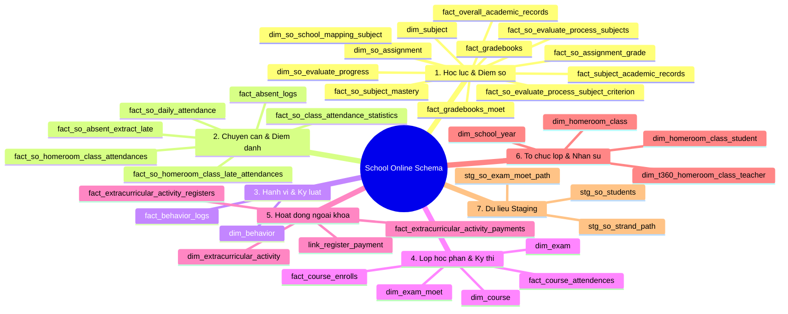

# Phân Nhóm và Phân Tích 36 Bảng Dữ Liệu (School Online Schema)
Tài liệu này phân nhóm và mô tả chi tiết 36 bảng dữ liệu của hệ thống **School Online** để làm cơ sở dữ liệu đầu vào cho hệ thống cảnh báo sớm rủi ro học đường **VSF Student Risk Alert (VSF SRA)**.

---

## Tổng quan phân nhóm
36 bảng dữ liệu được phân chia thành **7 phân hệ nghiệp vụ** logic dưới đây:

---

## Chi tiết các phân hệ nghiệp vụ

### Phân hệ 1: Học lực & Điểm số (12 bảng)
Đây là phân hệ cốt lõi cung cấp dữ liệu điểm số, đánh giá thường xuyên/định kỳ để mô hình AI Agent tính toán **Chỉ số rủi ro học lực ($P(Fail)$)**.

1. **`s360.dim_subject` (Danh mục môn học):** Lưu trữ mã và tên môn học chuẩn của hệ thống.
2. **`s360.dim_so_school_mapping_subject` (Ánh xạ môn học trường):** Ánh xạ cấu hình môn học riêng biệt của từng trường thành danh mục môn học chung.
3. **`s360.dim_so_assignment` (Danh mục bài tập/đánh giá):** Quản lý các loại bài tập, bài kiểm tra (tên bài, loại điểm, trọng số).
4. **`s360.fact_so_assignment_grade` (Điểm chi tiết bài tập):** Lưu điểm số chi tiết của học sinh cho từng bài tập/bài làm trên LMS.
5. **`s360.fact_gradebooks` (Sổ điểm học phần):** Chứa các đầu điểm chi tiết của học sinh (Điểm miệng, Điểm thường xuyên TX1-TX4, Điểm giữa kỳ GK, Điểm cuối kỳ CK).
6. **`s360.fact_gradebooks_moet` (Sổ điểm chuẩn Bộ):** Điểm số được định dạng và làm tròn theo đúng quy chế đánh giá của Bộ GD&ĐT.
7. **`s360.fact_subject_academic_records` (Học bạ tổng kết môn):** Lưu điểm tổng kết học kỳ/năm học của từng môn học cụ thể.
8. **`s360.fact_overall_academic_records` (Học bạ tổng kết chung):** Lưu điểm trung bình toàn diện (GPA), xếp loại học lực và hạnh kiểm của học sinh cuối kỳ/năm.
9. **`s360.fact_so_subject_mastery` (Độ thành thạo kiến thức):** Lưu mức độ nắm vững chuẩn kiến thức kỹ năng của học sinh theo từng chủ đề môn học.
10. **`s360.dim_so_evaluate_progress` (Danh mục tiến độ đánh giá):** Cấu hình các mốc thời gian đánh giá tiến trình định kỳ của trường.
11. **`s360.fact_so_evaluate_process_subjects` (Đánh giá tiến trình môn học):** Ghi nhận kết quả đánh giá năng lực môn học theo các mốc thời gian.
12. **`s360.fact_so_evaluate_process_subject_criterion` (Tiêu chí đánh giá tiến trình):** Chi tiết các tiêu chí đạt/chưa đạt trong đánh giá tiến trình của học sinh.

---

### Phân hệ 2: Chuyên cần & Điểm danh (6 bảng)
Phân hệ cung cấp các chỉ báo về **Chuyên cần** - một trong những yếu tố tác động lớn nhất đến nguy cơ trượt môn hoặc bỏ học của học sinh.

1. **`s360.fact_absent_logs` (Nhật ký vắng mặt):** Ghi nhận chi tiết từng ngày/tiết vắng học, lý do vắng (có phép/không phép) của học sinh.
2. **`s360.fact_so_daily_attendance` (Điểm danh hàng ngày):** Trạng thái điểm danh buổi sáng/chiều của học sinh tại trường.
3. **`s360.fact_so_class_attendance_statistics` (Thống kê chuyên cần lớp):** Dữ liệu thống kê tỷ lệ đi học, nghỉ học tổng hợp theo từng lớp học.
4. **`s360.fact_so_absent_extract_late` (Nhật ký đi muộn/về sớm):** Ghi nhận chi tiết các trường hợp học sinh đi học muộn hoặc ra về sớm.
5. **`s360.fact_so_homeroom_class_attendances` (Điểm danh lớp chủ nhiệm):** Nhật ký điểm danh chuyên cần tại các tiết sinh hoạt lớp chủ nhiệm.
6. **`s360.fact_so_homeroom_class_late_attendances` (Đi học muộn lớp chủ nhiệm):** Nhật ký chi tiết đi muộn ghi nhận bởi giáo viên chủ nhiệm.

---

### Phân hệ 3: Hành vi & Kỷ luật (2 bảng)
Cung cấp dữ liệu về **Hành vi rèn luyện** để phục vụ việc **Phân cụm học sinh đa chiều (NMF)** và phát hiện học sinh rủi ro kỷ luật sư phạm.

1. **`s360.dim_behavior` (Danh mục hành vi):** Khai báo các loại hành vi tích cực (được cộng điểm) và tiêu cực/vi phạm (bị trừ điểm) cùng thang điểm tương ứng.
2. **`s360.fact_behavior_logs` (Nhật ký hành vi):** Nhật ký thực tế ghi nhận các vụ việc học sinh vi phạm kỷ luật hoặc được tuyên dương, khen thưởng.

---

### Phân hệ 4: Lớp học phần & Kỳ thi (5 bảng)
Quản lý việc tổ chức các lớp môn học riêng biệt (khác lớp chủ nhiệm) và các kỳ thi tập trung.

1. **`s360.dim_course` (Danh mục lớp học phần):** Quản lý thông tin lớp học theo từng môn (ví dụ: Lớp Toán nâng cao 9A1, Lớp Tiếng Anh tăng cường).
2. **`s360.fact_course_enrolls` (Danh sách đăng ký học phần):** Liên kết học sinh tham gia học lớp học phần cụ thể.
3. **`s360.fact_course_attendences` (Điểm danh lớp học phần):** Nhật ký điểm danh chuyên cần của học sinh riêng theo từng lớp học phần.
4. **`s360.dim_exam` (Danh mục kỳ thi):** Quản lý thông tin các kỳ thi định kỳ tập trung của trường (Học kỳ 1, Giữa kỳ 2,...).
5. **`s360.dim_exam_moet` (Danh mục kỳ thi chuẩn MOET):** Định nghĩa cấu trúc kỳ thi theo quy chế kiểm tra của Bộ GD&ĐT.

---

### Phân hệ 5: Hoạt động ngoại khóa & Tài chính (4 bảng)
Cung cấp dữ liệu về mức độ năng động, tham gia cộng đồng của học sinh (một chỉ số phụ trong **Yếu tố tác động bên ngoài**).

1. **`s360.dim_extracurricular_activity` (Danh mục hoạt động ngoại khóa):** Lưu thông tin tên hoạt động, thời gian tổ chức, đối tượng tham gia và chi phí.
2. **`s360.fact_extracurricular_activity_registers` (Đăng ký ngoại khóa):** Ghi nhận danh sách học sinh đăng ký tham gia các câu luận bộ, sự kiện.
3. **`s360.fact_extracurricular_activity_payments` (Thanh toán ngoại khóa):** Ghi nhận thông tin đóng phí tham gia ngoại khóa của phụ huynh học sinh.
4. **`s360.link_register_payment` (Liên kết đăng ký - thanh toán):** Bảng trung gian liên kết giữa lượt đăng ký hoạt động và giao dịch đóng phí.

---

### Phân hệ 6: Tổ chức lớp học & Nhân sự (4 bảng)
Lưu thông tin nền tảng về sơ đồ trường lớp, năm học và phân quyền quản lý lớp học.

1. **`s360.dim_school_year` (Danh mục năm học):** Khai báo các năm học trên hệ thống (ví dụ: 2025-2026).
2. **`s360.dim_homeroom_class` (Danh mục lớp chủ nhiệm):** Khai báo danh sách các lớp học chính thức của trường.
3. **`s360.dim_homeroom_class_student` (Liên kết Lớp - Học sinh):** Sơ đồ phân lớp, xác định học sinh nào thuộc lớp chủ nhiệm nào theo từng năm học.
4. **`t360.dim_t360_homeroom_class_teacher` (Phân công giáo viên):** Danh mục phân công giáo viên làm chủ nhiệm hoặc giáo viên giảng dạy chính cho từng lớp học.

---

### Phân hệ 7: Dữ liệu Staging (3 bảng)
Các bảng chứa dữ liệu thô được đồng bộ tạm thời từ hệ thống nguồn trước khi biến đổi (ETL) vào mô hình dữ liệu chính s360.

1. **`default.stg_so_exam_moet_path` (Staging kỳ thi MOET):** Chứa đường dẫn/dữ liệu thô liên quan tới kỳ thi MOET.
2. **`default.stg_so_strand_path` (Staging mạch kiến thức):** Chứa thông tin thô về các nhóm/mạch kiến thức giáo trình.
3. **`default.stg_so_students` (Staging học sinh):** Chứa thông tin học sinh thô đồng bộ trực tiếp từ hệ thống tuyển sinh/School Online.

---

## Ứng dụng trong dự án VSF SRA
Khi xây dựng hệ thống **VSF SRA**, các AI Agents và thuật toán sẽ khai thác dữ liệu từ các nhóm bảng này như sau:

* **Tác tử Dự đoán (Prediction Agent):** Lấy dữ liệu điểm số (`fact_gradebooks`, `fact_overall_academic_records`) phối hợp với tỷ lệ nghỉ học (`fact_absent_logs`) để chạy mô hình hồi quy tuyến tính xu hướng học lực và dự báo xác suất $P(Fail)$.
* **Thuật toán Phân cụm NMF (Clustering):** Gom nhóm học sinh dựa trên việc kết hợp 3 ma trận:
  1. **Ma trận điểm số** (từ `fact_gradebooks`)
  2. **Ma trận hành vi** (từ `fact_behavior_logs`)
  3. **Ma trận tác động bên ngoài** (từ chuyên cần `fact_absent_logs` + ngoại khóa `fact_extracurricular_activity_registers`).
* **Trợ lý Text-to-Query:** Dùng SQLGlot dịch câu hỏi tự nhiên tiếng Việt và truy vấn an toàn trên 36 bảng này (ví dụ: *"Danh sách học sinh nghỉ học quá 3 buổi lớp 9A1"* sẽ tự động mapping vào `dim_homeroom_class` và `fact_absent_logs`).
