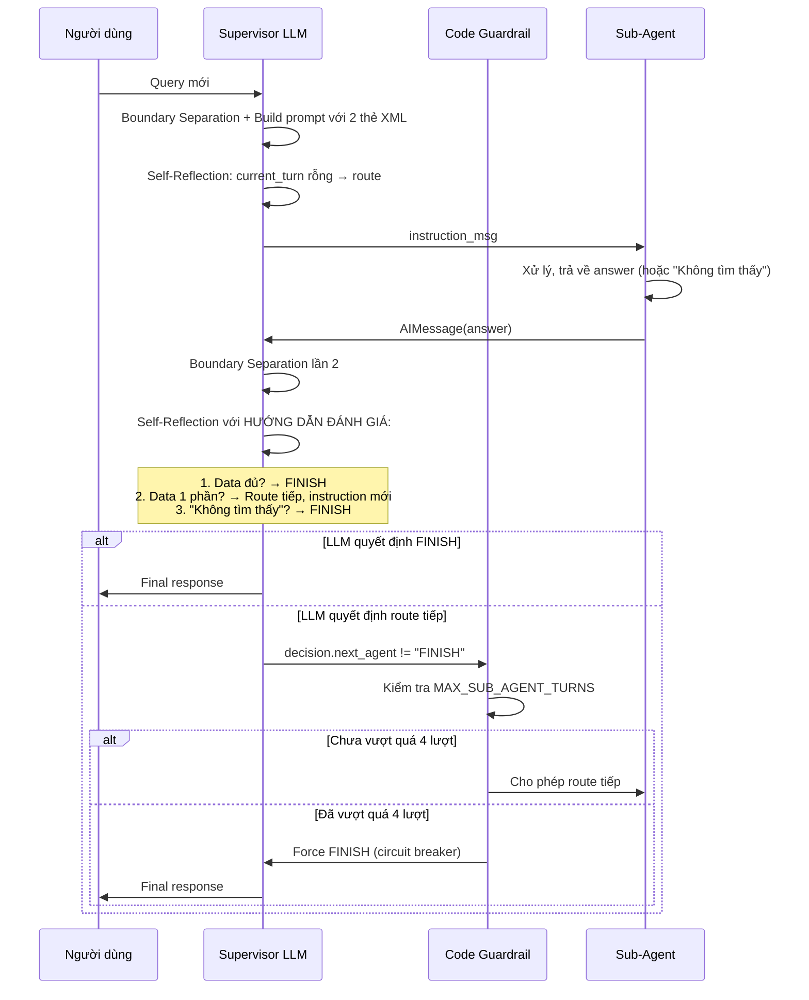

# Plan: Đơn Giản Hóa Anti-Loop Guardrail — "LLM làm não, Code làm cầu chì"

## 1. Vấn Đề

Anti-Loop Guardrail hiện tại (dòng 450-483) có 2 lớp check Code phức tạp:

```python
# Lớp 1: has_sub_answer → force FINISH (dòng 453-459)
#   ⛔ Quá khắc khe: chặn cả multi-step hợp lệ (vd: lấy 7A1 xong cần lấy thêm 7A2)

# Lớp 2: is_duplicate_instruction → force FINISH (dòng 461-483)
#   ⛔ So sánh chuỗi dễ false positive (vd: "Lấy điểm 7A1" vs "Lấy điểm 7A1 và 7A2")
```

## 2. Giải Pháp

### Nguyên Lý: Separation of Concerns

| Tầng | Vai trò | Cơ chế |
|------|---------|--------|
| **LLM (Prompt)** | Bộ não: Đánh giá đủ/thiếu/không có data | Self-Reflection rules trong HƯỚNG DẪN ĐÁNH GIÁ |
| **Code** | Cầu chì: Chỉ ngắt khi quá số lượt | `MAX_SUB_AGENT_TURNS = 4` |

### 2.1. Thay thế Anti-Loop Guardrail (dòng 450-483)

**Hiện tại** (38 dòng, 2 lớp check phức tạp):
```python
# ── Anti-Loop Guardrail (dùng pre-computed current_turn_messages + has_sub_answer) ──
has_sub_answer = bool(_collect_current_turn_answers(current_turn_messages))

if decision.next_agent != "FINISH" and has_sub_answer:
    ...
    decision.next_agent = "FINISH"

if decision.next_agent != "FINISH":
    previous_instructions = set()
    for msg in current_turn_messages:
        ...
    ...
```

**Thay thế bằng** (12 dòng, 1 circuit breaker — đếm bằng Supervisor instruction, không phải sub-agent answer):
```python
# ── Anti-Loop Guardrail: Circuit Breaker Only ──
MAX_SUB_AGENT_TURNS = 4
# Đếm số lần Supervisor đã route (dựa trên "Chuyển yêu cầu sang" trong content)
current_turn_sub_calls = sum(
    1 for msg in current_turn_messages
    if "Chuyển yêu cầu sang" in str(getattr(msg, "content", "") or "")
)

if decision.next_agent != "FINISH" and current_turn_sub_calls >= MAX_SUB_AGENT_TURNS:
    logger.warning(
        "supervisor_anti_loop",
        msg=f"Reached MAX_SUB_AGENT_TURNS ({MAX_SUB_AGENT_TURNS}). "
            f"Forcing FINISH as safety circuit breaker.",
    )
    decision.next_agent = "FINISH"
```

### 2.2. Gia cố Prompt Instruction (dòng 331-338)

**Hiện tại** (8 dòng, thiếu hướng dẫn xử lý "không có data" và "chống lặp"):
```text
HƯỚNG DẪN ĐÁNH GIÁ <current_turn_collected_data>:
- Đây là dữ liệu MỚI NHẤT mà các Sub-Agent vừa thu thập được...
- Hãy kiểm tra: dữ liệu trong thẻ này đã ĐỦ...
  * Nếu ĐỦ (có số liệu, bảng kết quả...) -> chọn FINISH...
  * Nếu CHƯA ĐỦ (chỉ có instruction...) -> tiếp tục định tuyến...
- QUAN TRỌNG: Tuyệt đối KHÔNG gọi lại Sub-Agent nếu...
```

**Thay thế bằng** (22 dòng, 3 quy tắc Self-Reflection):
```text
HƯỚNG DẪN ĐÁNH GIÁ <current_turn_collected_data>:
- Đây là dữ liệu MỚI NHẤT mà các Sub-Agent vừa thu thập được trong lượt xử lý HIỆN TẠI.

- ĐÁNH GIÁ SỰ ĐẦY ĐỦ (SUFFICIENCY ASSESSMENT):
  * Dữ liệu đã ĐỦ để trả lời câu hỏi gốc -> BẮT BUỘC chọn FINISH để tổng hợp.
  * Dữ liệu MỚI CHỈ ĐỦ 1 PHẦN -> Tiếp tục gọi Sub-Agent với instruction MỚI CHỈ RÕ phần dữ liệu còn thiếu.
    Tuyệt đối KHÔNG yêu cầu lấy lại phần dữ liệu đã thu thập.

- ĐÁNH GIÁ KHI KHÔNG CÓ DỮ LIỆU (NO DATA HANDLING):
  * Nếu Sub-Agent phản hồi "Không tìm thấy...", "Dữ liệu trống", "Không có học sinh/lớp học này"
    -> BẮT BUỘC chọn FINISH để phản hồi lịch sự cho người dùng.
  * TUYỆT ĐỐI KHÔNG thử lại hoặc sinh instruction truy vấn thông tin này nữa.

- NGUYÊN TẮC CHỐNG LẶP (NO DUPLICATE INSTRUCTION):
  * Đọc lại toàn bộ các [Supervisor] instruction đã phát ra trong lượt hiện tại.
  * TUYỆT ĐỐI KHÔNG tạo ra một instruction có nội dung hoặc mục tiêu trùng lặp
    với bất kỳ lệnh nào đã phát ra trước đó.
```

## 3. Files Cần Sửa

Chỉ 1 file: `src/agents/supervisor/node.py`

| Khu vực | Dòng | Thay đổi |
|---------|------|----------|
| Prompt Instruction | 331-338 | Mở rộng thành 3 quy tắc Self-Reflection |
| Anti-Loop Guardrail | 450-483 | Thay thế bằng `MAX_SUB_AGENT_TURNS` circuit breaker |

## 4. Flow Hoàn Chỉnh Sau Khi Sửa



## 5. Rủi Ro & Mitigation

| Rủi ro | Mitigation |
|--------|------------|
| LLM không tuân thủ "No Duplicate Instruction" tự sinh instruction giống hệt | MAX_SUB_AGENT_TURNS = 4 chặn ở lượt thứ 4 |
| LLM không chịu FINISH dù đã có data đầy đủ | MAX_SUB_AGENT_TURNS = 4 chặn ở lượt thứ 4 |
| LLM FINISH quá sớm khi data chưa đủ (false FINISH) | Đây là behavior mong muốn? Không, cần prompt instruction thật chặt. Nếu vẫn xảy ra, cần fine-tune prompt thêm. |
| Đếm bằng `"Chuyển yêu cầu sang"` trong content — nếu Supervisor đổi format instruction, pattern không match | Khi thay đổi format instruction, cần update pattern này đồng bộ. Dùng `startswith("[Supervisor]")` + `"Chuyển yêu cầu"` để linh hoạt hơn. |
