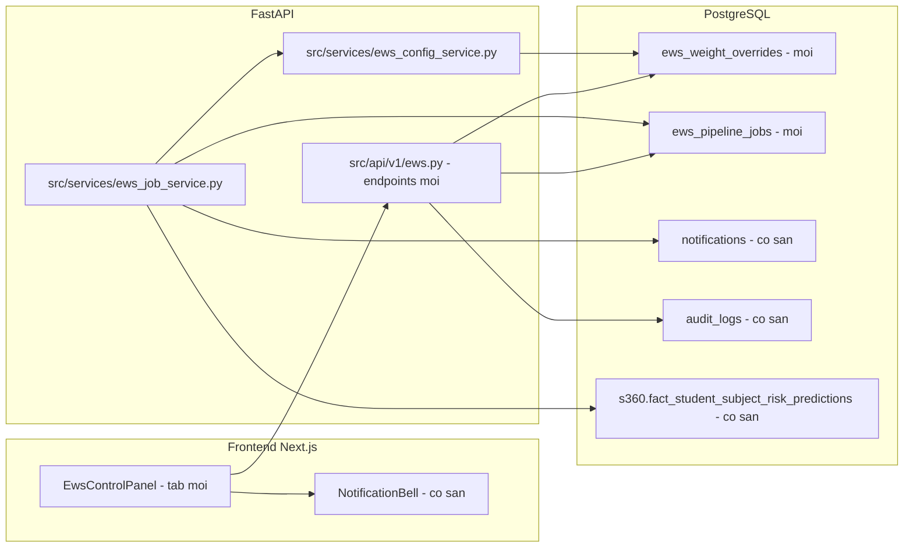
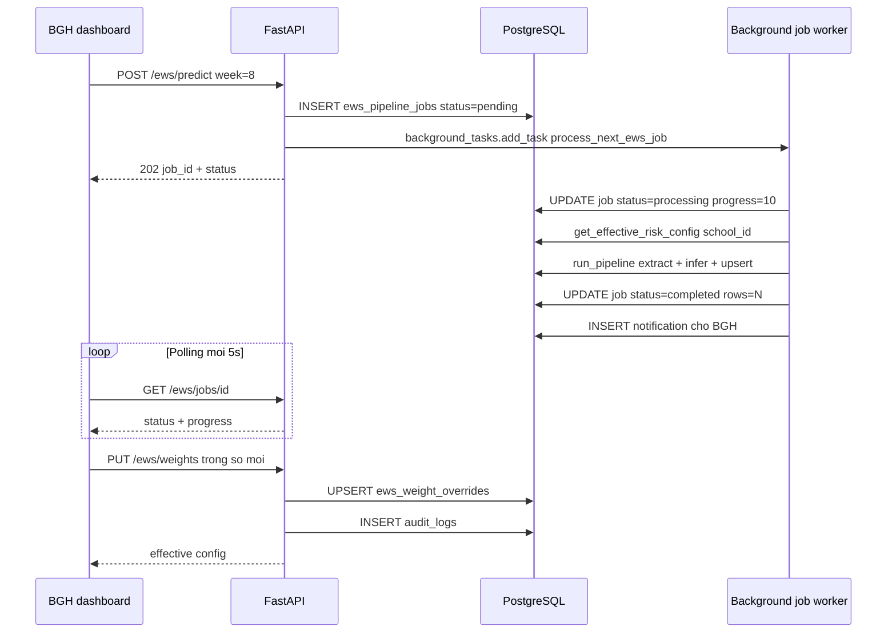

# Plan: Bảng điều khiển EWS cho BGH (Chạy dự đoán async + Tinh chỉnh trọng số)

## 1. Mục tiêu

Cung cấp cho BGH (vai `PRINCIPAL`, KHÔNG phải `ADMIN`) một bảng điều khiển trên Dashboard EWS để:

1. **Chạy dự đoán theo tuần đã chọn** — nhấn "Dự đoán" → gửi tín hiệu lên server → server chạy pipeline **bất đồng bộ** (BGH có thể thoát ra/ làm việc khác, quay lại vẫn thấy trạng thái; có thông báo khi hoàn tất).
2. **Tinh chỉnh các chỉ số** trong [`risk_weights.yaml`](src/ews/risk_weights.yaml) — **toàn bộ**: `weights` (4 yếu tố) + `dynamic.alpha` (4 yếu tố) + `weight_floor` + `worst_factor_beta` + `risk_level_thresholds` (4 mức), với giao diện nâng cao + cảnh báo khi chỉnh sai.
3. **Phân theo trường** — override config và job lưu và gắn với `school_id` (mỗi trường dùng bộ trọng số riêng, job riêng).

---

## 2. Trả lời câu hỏi: "Có cần thêm bảng dữ liệu mới không?"

| Loại | Kết luận | Giải thích |
|---|---|---|
| **Bảng dữ liệu NGUỒN** | ✅ **KHÔNG cần thêm** | Pipeline đọc từ các bảng s360 **đã có sẵn**: [`extract_live_features()`](src/ews/feature_extractor.py:412) dùng `fact_gradebooks`, `fact_gradebooks_moet`, `fact_so_assignment_grade`, `fact_so_daily_attendance`, `fact_absent_logs`, `fact_behavior_logs`, `dim_homeroom_class_student`, `dim_subject`. Kết quả UPSERT vào `s360.fact_student_subject_risk_predictions` (đã tồn tại, có cột `so_school_id`). |
| **Bảng QUẢN LÝ (mới — cần thêm)** | ⚠️ **CẦN 2 bảng** | (1) `ews_pipeline_jobs` — trạng thái job bền vững để BGH thoát/mở lại vẫn theo dõi được, chống chạy trùng. (2) `ews_weight_overrides` — lưu trọng số BGH chỉnh **theo trường**, giữ YAML gốc làm baseline (audit + rollback). |
| **Bảng dùng LẠI (đã có)** | ✅ Có sẵn | `notifications` ([`Notification`](src/models/tables.py:667)) — báo hoàn tất; `audit_logs` ([`AuditLog`](src/models/tables.py:641)) — vết chỉnh sửa. |

**Tóm tắt:** Không cần bảng nguồn mới. Cần **2 bảng quản lý** + thêm **2 giá trị enum `NotificationType`**.

> Tự động tạo bảng: [`main.py`](src/main.py:27) gọi `Base.metadata.create_all(bind=engine)` trong lifespan — bảng ORM mới sẽ tự tạo khi khởi động lại server. Vẫn bổ sung migration Alembic cho nhất quán (xem §9).

---

## 3. Kiến trúc tổng quan



**Luồng chạy dự đoán bất đồng bộ:**



---

## 4. Phân quyền & phạm vi trường

- Mọi endpoint mới dùng `require_roles(UserRole.ADMIN, UserRole.PRINCIPAL)` (pattern có sẵn trong [`src/api/deps.py`](src/api/deps.py:49)).
- `school_id` lấy từ `current_user.so_school_id` ([`User.so_school_id`](src/models/tables.py:78)).
- Override + job lưu kèm `school_id` → **mỗi trường một bộ trọng số, một hàng đợi job riêng**.
- **Lưu ý quan trọng:** override chỉ ảnh hưởng **`v2_ensemble`** — vì `v1_single` dùng trọng số **học được từ SHAP** ([`compute_v1_group_contributions()`](src/ews/inference_service.py:89)), không đọc `risk_weights.yaml`. UI phải ghi chú rõ + mặc định chạy `v2_ensemble`.

---

## 5. Backend — Bảng dữ liệu mới ([`src/models/tables.py`](src/models/tables.py))

### 5.1 `EwsPipelineJob` — bảng `ews_pipeline_jobs`

| Cột | Kiểu | Ghi chú |
|---|---|---|
| `id` | BigInteger PK | autoincrement |
| `school_id` | Integer NOT NULL | index `(school_id, created_at)` |
| `requested_by` | BigInteger FK `users.id` | người kích hoạt |
| `school_year_id` | Integer NOT NULL | |
| `semester_index` | Integer NOT NULL | |
| `evaluated_at_week` | Integer NOT NULL | |
| `cutoff_date` | Date | tính server-side |
| `model_version` | String | mặc định `v2_ensemble` |
| `status` | **String** NOT NULL | `pending/processing/completed/failed/cancelled` — dùng **String + CHECK** (giống `ClassroomRecording.status`), KHÔNG dùng PG enum để tránh phức tạp alter |
| `progress` | Integer | 0–100 |
| `rows_processed` | Integer nullable | |
| `error_message` | Text nullable | |
| `started_at` / `finished_at` | DateTime nullable | |
| `created_at` | DateTime | server_default NOW |

Index: `(school_id, created_at)`, `(status)`, `(school_id, status)`.

### 5.2 `EwsWeightOverride` — bảng `ews_weight_overrides`

- **1 dòng / 1 trường** (UniqueConstraint `school_id`), UPSERT khi chỉnh.
- Mọi cột số **nullable** — `NULL` = dùng baseline từ YAML.

| Cột | Kiểu |
|---|---|
| `id` | BigInteger PK |
| `school_id` | Integer UNIQUE NOT NULL |
| `weight_score`, `weight_lms`, `weight_attendance`, `weight_behavior` | Float nullable |
| `alpha_score`, `alpha_lms`, `alpha_attendance`, `alpha_behavior` | Float nullable |
| `weight_floor` | Float nullable |
| `worst_factor_beta` | Float nullable |
| `threshold_low`, `threshold_moderate`, `threshold_high`, `threshold_critical` | Float nullable |
| `updated_by` | BigInteger FK `users.id` |
| `updated_at` | DateTime NOT NULL |

- Rollback = **DELETE dòng** → về lại baseline YAML (ghi AuditLog trước khi xóa).
- Lịch sử chỉnh sửa do `audit_logs` nắm (old_values / new_values), không cần bảng version riêng.

### 5.3 Enum mới ([`src/models/enums.py`](src/models/enums.py:160))

Thêm vào `NotificationType`:
```python
EWS_PREDICTION_COMPLETED = "EWS_PREDICTION_COMPLETED"
EWS_PREDICTION_FAILED = "EWS_PREDICTION_FAILED"
```
> `NotificationType` là PG enum → migration cần `ALTER TYPE notification_type_enum ADD VALUE ...` (xem §9).

---

## 6. Backend — Merge config theo trường

### 6.1 Giữ nguyên baseline + cache

[`load_risk_config()`](src/ews/risk_config.py:149) (`@lru_cache`) giữ nguyên = **baseline YAML + env override**. **Không** cache-invalidate toàn hệ thống — vì override là theo trường, không thể đặt trong cache toàn cục.

### 6.2 Service mới `src/services/ews_config_service.py`

- `get_effective_risk_config(db, school_id) -> RiskConfig`:
  1. Load baseline qua `load_risk_config()` (cached).
  2. Load dòng `EwsWeightOverride` của `school_id` (nếu có).
  3. Merge field khác `None` vào → tạo **`RiskConfig` mới** (không đụng cache toàn cục).
  4. Validate lại (tái dùng logic [`_validate()`](src/ews/risk_config.py:128): tổng weights = 1.0, weights ≥ 0, ngưỡng tăng dần). Nếu sai → raise `ValueError`.
- `serialize_effective_config(cfg, override_row) -> dict`: trả về effective config + `overridden_fields` (field nào đang override + giá trị baseline để UI so sánh).

### 6.3 Thread cfg vào pipeline

- [`run_ensemble_inference()`](src/ews/inference_service.py:340): thêm tham số `cfg: RiskConfig | None = None`; dòng 356 giữ `cfg = cfg or load_risk_config()`; dòng 390 đổi thành `combine_risk_scores(row, cfg=cfg, available=available)`.
- [`run_pipeline()`](src/ews/pipeline_runner.py:145): thêm `school_id: int | None = None` và `risk_config: RiskConfig | None = None` → truyền `risk_config` xuống `run_ensemble_inference` (v2); `school_id` truyền xuống `extract_live_features`.

---

## 7. Backend — Scope dự đoán theo trường ([`feature_extractor.py`](src/ews/feature_extractor.py))

[`extract_live_features()`](src/ews/feature_extractor.py:412) hiện xử lý **toàn bộ** học sinh (không lọc trường). Thêm tham số:

```python
def extract_live_features(session, school_year_id, semester_index,
                          evaluated_at_week, cutoff_date=None, school_id: int | None = None):
    ...
    params = {...}
    if school_id is not None:
        params["school_id"] = school_id
        # thêm điều kiện lọc vào SQL_EXTRACT_FEATURES (mọi CTE đã có sẵn cột so_school_id):
        #   AND sg.so_school_id = :school_id
```

Giữ nguyên 2 dòng `SET LOCAL` quan trọng: `statement_timeout = 300000` và `enable_nestloop = off` (đã có, chống timeout khi xử lý dữ liệu lớn).

> Vì job chạy theo từng trường + cfg theo từng trường, bắt buộc phải lọc `school_id` ở bước Extract — nếu không, 2 trường có override khác nhau sẽ bị tính sai.

---

## 8. Backend — Job worker ([`src/services/ews_job_service.py`]())

Copy pattern **DB-backed FIFO** của [`process_next_vms_task()`](src/api/v1/recordings.py:253):

```python
def process_next_ews_job():
    db = SessionLocal()
    try:
        # 1. Timeout: job 'processing' quá 30 phút -> 'failed' (kèm error_message)
        # 2. Chọn job 'pending' cũ nhất mà KHÔNG có job active cùng school_id
        #    (cô lập hàng đợi theo trường — mỗi trường chạy tối đa 1 job)
        # 3. job.status = 'processing'; progress = 10; db.commit()
        # 4. cfg = get_effective_risk_config(db, job.school_id)
        #    df = run_pipeline(db, school_year_id, semester_index, week,
        #                      cutoff_date, skip_shap=True, model_version=job.model_version,
        #                      school_id=job.school_id, risk_config=cfg)
        # 5. job.status='completed'; rows_processed=len(df); progress=100
        #    except -> status='failed'; error_message=str(e)
        # 6. notify(...) cho requested_by (EWS_PREDICTION_COMPLETED / _FAILED)
        # 7. Đệ quy xử lý job tiếp theo
    finally:
        db.close()
```

- **Trigger:** `background_tasks.add_task(process_next_ews_job)` từ `POST /ews/predict`.
- **Self-healing:** gọi `process_next_ews_job()` trong lifespan [`main.py`](src/main.py:27) (giống pattern gọi `process_next_vms_task`) — server restart vẫn tiếp tục xử lý job pending.
- **Ghi chú:** `skip_shap=True` trong job để nhanh (chỉ số `shap_drivers` sẽ rỗng — không ảnh hưởng dashboard chính).

---

## 9. Backend — Endpoints mới ([`src/api/v1/ews.py`](src/api/v1/ews.py))

Tất cả dùng `Depends(require_roles(UserRole.ADMIN, UserRole.PRINCIPAL))`, `school_id = current_user.so_school_id`.

| Method | Path | Mô tả |
|---|---|---|
| `POST` | `/ews/predict` | Body: `school_year_id, semester_index, evaluated_at_week, model_version=v2_ensemble`. Validate tuần ∈ `VALID_WEEKS` (reuse [`run_ews_pipeline.py`](scripts/run_ews_pipeline.py:88)); tính `cutoff_date` qua [`estimate_cutoff_date()`](scripts/run_ews_pipeline.py:63). Tạo job `pending` → `background_tasks.add_task(process_next_ews_job)` → **202** `{job_id, status}` |
| `GET` | `/ews/jobs` | Danh sách job của trường (20 mới nhất, kèm phân trang) |
| `GET` | `/ews/jobs/{job_id}` | Chi tiết 1 job (dùng để polling) — chỉ trả nếu cùng `school_id` |
| `GET` | `/ews/valid-weeks` | Danh sách tuần hợp lệ theo học kỳ (từ `VALID_WEEKS`) cho dropdown |
| `GET` | `/ews/weights` | Effective config của trường (baseline + override + `overridden_fields`) |
| `PUT` | `/ews/weights` | Body: các field (null = không đổi). Validate phía server (tổng weights=1, ngưỡng tăng dần, dải hợp lý) → UPSERT `ews_weight_overrides` → ghi **AuditLog** (`action=UPDATE`, old/new values, `changed_by`) → trả effective config |
| `DELETE` | `/ews/weights` | Xóa override (rollback baseline) → ghi **AuditLog** (`action=DELETE`) |

**Thông báo:** dùng [`notify()`](src/services/notifications.py:86) có sẵn — `recipient_ids=[job.requested_by]`, `type_=NotificationType.EWS_PREDICTION_COMPLETED` (title: "EWS: Dự đoán tuần X hoàn tất", message kèm số dòng) / `EWS_PREDICTION_FAILED` kèm lỗi.

---

## 10. Frontend

### 10.1 Types mới ([`frontend/src/lib/types.ts`](frontend/src/lib/types.ts))

```ts
export type EwsJobStatus = "pending" | "processing" | "completed" | "failed" | "cancelled";
export interface EwsJob { id: number; school_id: number; requested_by: number;
  school_year_id: number; semester_index: number; evaluated_at_week: number;
  cutoff_date: string; model_version: string; status: EwsJobStatus;
  progress: number; rows_processed: number | null; error_message: string | null;
  created_at: string; started_at: string | null; finished_at: string | null; }
export interface EwsWeightConfig { weights: {score:number;lms:number;attendance:number;behavior:number};
  alpha: {score:number;lms:number;attendance:number;behavior:number};
  weight_floor: number; worst_factor_beta: number;
  thresholds: {LOW:number;MODERATE:number;HIGH:number;CRITICAL:number}; }
export interface EwsEffectiveConfig { config: EwsWeightConfig; overridden_fields: string[]; }
```

### 10.2 Component `frontend/src/components/dashboard/EwsControlPanel.tsx`

Gồm 3 khu vực (grid 2 cột trên màn hình lớn):

1. **Chạy dự đoán** — select Học kỳ + Tuần (từ `GET /ews/valid-weeks`), select model (`v2_ensemble` mặc định, ghi chú "Trọng số chỉ ảnh hưởng v2_ensemble"), nút **"Chạy dự đoán"**:
   - `POST /ews/predict` → nhận `job_id` → **polling** `GET /ews/jobs/{job_id}` mỗi 5 giây.
   - Hiện progress bar + status badge (pending/processing/completed/failed).
   - Khi hoàn tất: hiện số dòng dự đoán + nút "Xem Dashboard" (chuyển tab EWS).
   - **Không khóa UI** — BGH thoát/đi chỗ khác vẫn chạy; quay lại tab thấy trạng thái từ `GET /ews/jobs`.
   - NotificationBell (đã có trong [`NotificationBell.tsx`](frontend/src/components/NotificationBell.tsx:16)) tự hiện thông báo hoàn tất.
2. **Lịch sử job** — bảng các job gần đây: tuần, model, trạng thái, số dòng, thời gian, lỗi (nếu có).
3. **Chỉnh trọng số** — form đầy đủ:
   - `weights`: 4 thanh trượt, hiển thị % + **tự chuẩn hóa tổng = 1** khi kéo.
   - `alpha`: 4 input số (gợi ý dải 0.5–3.0).
   - `weight_floor` (0–0.5), `worst_factor_beta` (0–1).
   - `thresholds`: 4 input (LOW/MODERATE/HIGH/CRITICAL) + **validation tăng dần**.
   - Client-side validation + cảnh báo đỏ khi: tổng weights ≠ 1, ngưỡng không tăng dần, giá trị ngoài dải an toàn (vd alpha < 0.5 hoặc > 3.0, weight_floor > 0.2).
   - Badge "Đang override" cho từng field + hiện **baseline YAML** cạnh nhau để so sánh.
   - Nút **"Lưu"** (`PUT /ews/weights`) + nút **"Khôi phục mặc định"** (`DELETE /ews/weights`) + xác nhận trước khi xóa.

### 10.3 Tích hợp tab ([`frontend/src/app/(app)/dashboard/page.tsx`](frontend/src/app/(app)/dashboard/page.tsx:17))

- Thêm tab `"ews-control"` ("Điều khiển EWS") vào `TABS`.
- Render `<EwsControlPanel />` chỉ khi `user?.role === "ADMIN" || user?.role === "PRINCIPAL"` (pattern [`recordings/page.tsx`](frontend/src/app/(app)/recordings/page.tsx) qua `useAuth()`).

---

## 11. Migration — chèn tay vào merged schema + áp DDL snippet

Theo yêu cầu của BGH: **không chạy lại `apply_merged_schema.py`** để tránh rủi ro thay đổi toàn bộ schema. Thay vào đó:

1. **Chèn 2 bảng vào file [`docs_vsf/schemas/merged/score_focused_schema.sql`](docs_vsf/schemas/merged/score_focused_schema.sql:1)** bằng tay — đặt ngay sau khối `COMMENT ON TABLE ... fact_student_subject_risk_predictions` (hiện tại cuối section EWS, trước `train_student_subject_risk_dataset`), theo đúng style của file: `CREATE TABLE public.xxx`, cột canh lề, `CHECK`, `CREATE INDEX` ngay sau bảng, `TIMESTAMPTZ NOT NULL DEFAULT NOW()`.
2. **Áp DDL snippet bằng tay lên DB** — copy đúng đoạn §14 dưới đây chạy trực tiếp trên Postgres (idempotent, có `IF NOT EXISTS` nên chạy lại an toàn). KHÔNG chạy script apply toàn bộ.
3. **Enum notification:** `score_focused_schema.sql` không định nghĩa `notification_type_enum` (chỉ có trong `merged_vsf_sra_schema*.sql`) → 2 câu `ALTER TYPE` trong §14 dùng `IF NOT EXISTS` và chỉ áp lên DB thật, KHÔNG chèn vào file .sql.
4. **Alembic:** vẫn tạo migration mới (cùng nội dung §14) để giữ lịch sử đồng bộ cho môi trường mới; nhưng với DB hiện tại dùng đoạn chèn tay.
5. **Fallback an toàn:** `Base.metadata.create_all` trong [`main.py`](src/main.py:27) tự tạo 2 bảng thiếu khi khởi động — nhưng **không** tạo được giá trị enum mới, nên bước 2 là bắt buộc trước khi code gửi notification dùng `EWS_PREDICTION_*`.

---

## 12. Tests

- **Backend** ([`tests/test_api/test_ews_rbac.py`](tests/test_api/test_ews_rbac.py) + mới):
  - RBAC: `PRINCIPAL`/`ADMIN` được gọi predict + weights; `HOMEROOM_TEACHER`/`STUDENT` bị 403.
  - Validation weights: tổng ≠ 1 → 422/400; ngưỡng không tăng dần → lỗi; alpha ngoài dải → cảnh báo.
  - Effective config merge: trường A có override → trường B không → kết quả khác nhau đúng.
  - Job flow: `POST /predict` tạo job `pending` + trả 202; `process_next_ews_job` (monkeypatch `run_pipeline`) → `completed` + tạo notification.
- **Frontend:** `tsc --noEmit` + lint + build.

---

## 13. Rủi ro & ghi chú

- **Chạy job trong process FastAPI** bằng `BackgroundTasks` (pattern có sẵn) — đủ cho vài trường/trường. Nếu sau này nhiều trường → tách worker process riêng (giữ nguyên bảng `ews_pipeline_jobs` làm hàng đợi).
- **Timeout extract 300s:** nếu quá, job chuyển `failed` + thông báo lỗi cho BGH.
- **Override chỉ ảnh hưởng `v2_ensemble`** — phải hiển thị rõ trên UI để BGH không nhầm.
- **Không đụng cache toàn cục** — merge cfg theo trường từng lần, tránh lỗi tenant isolation giữa các trường trong cùng process.

---

## 14. Đoạn DDL chèn tay (sẵn sàng dán vào Postgres)

> **Cách dùng:** chèn **phần 1** vào đúng vị trí trong [`docs_vsf/schemas/merged/score_focused_schema.sql`](docs_vsf/schemas/merged/score_focused_schema.sql:1) (sau `COMMENT ON TABLE ... fact_student_subject_risk_predictions`, trước `train_student_subject_risk_dataset`). Sau đó chạy **toàn bộ** snippet này trực tiếp trên DB đích. Tất cả đều idempotent.

```sql
-- =====================================================================
-- EWS Control Panel — quản lý job dự đoán + override trọng số (BGH)
-- Dành cho file: score_focused_schema.sql (chèn tay)
-- =====================================================================

-- 1) Bảng job dự đoán theo yêu cầu của BGH (hàng đợi DB-backed FIFO)
CREATE TABLE IF NOT EXISTS public.ews_pipeline_jobs (
    id                BIGINT GENERATED ALWAYS AS IDENTITY PRIMARY KEY,
    so_school_id      INTEGER NOT NULL,
    requested_by      BIGINT NOT NULL REFERENCES public.users(id) ON DELETE CASCADE,
    school_year_id    INTEGER NOT NULL,
    semester_index    INTEGER NOT NULL CHECK (semester_index IN (1, 2)),
    evaluated_at_week INTEGER NOT NULL,
    cutoff_date       DATE,
    model_version     VARCHAR(20) NOT NULL DEFAULT 'v2_ensemble',
    status            VARCHAR(20) NOT NULL DEFAULT 'pending'
        CHECK (status IN ('pending', 'processing', 'completed', 'failed', 'cancelled')),
    progress          INTEGER NOT NULL DEFAULT 0 CHECK (progress BETWEEN 0 AND 100),
    rows_processed    INTEGER,
    error_message     TEXT,
    started_at        TIMESTAMPTZ,
    finished_at       TIMESTAMPTZ,
    created_at        TIMESTAMPTZ NOT NULL DEFAULT NOW()
);

CREATE INDEX IF NOT EXISTS idx_ews_jobs_school_created
    ON public.ews_pipeline_jobs(so_school_id, created_at DESC);
CREATE INDEX IF NOT EXISTS idx_ews_jobs_status
    ON public.ews_pipeline_jobs(status);

COMMENT ON TABLE public.ews_pipeline_jobs IS
    'Lịch chạy dự đoán EWS do BGH yêu cầu, theo từng trường (so_school_id).';

-- 2) Bảng override trọng số EWS theo trường (BGH tinh chỉnh)
CREATE TABLE IF NOT EXISTS public.ews_weight_overrides (
    id                 BIGINT GENERATED ALWAYS AS IDENTITY PRIMARY KEY,
    so_school_id       INTEGER NOT NULL UNIQUE,
    weight_score       DOUBLE PRECISION,
    weight_lms         DOUBLE PRECISION,
    weight_attendance  DOUBLE PRECISION,
    weight_behavior    DOUBLE PRECISION,
    alpha_score        DOUBLE PRECISION,
    alpha_lms          DOUBLE PRECISION,
    alpha_attendance   DOUBLE PRECISION,
    alpha_behavior     DOUBLE PRECISION,
    weight_floor       DOUBLE PRECISION,
    worst_factor_beta  DOUBLE PRECISION,
    threshold_low      DOUBLE PRECISION,
    threshold_moderate DOUBLE PRECISION,
    threshold_high     DOUBLE PRECISION,
    threshold_critical DOUBLE PRECISION,
    updated_by         BIGINT REFERENCES public.users(id) ON DELETE SET NULL,
    updated_at         TIMESTAMPTZ NOT NULL DEFAULT NOW()
);

COMMENT ON TABLE public.ews_weight_overrides IS
    'Override trọng số/phân loại rủi ro EWS theo từng trường; NULL = dùng baseline YAML.';

-- 3) Mở rộng enum thông báo (áp trực tiếp lên DB, không chèn vào file .sql)
ALTER TYPE public.notification_type_enum ADD VALUE IF NOT EXISTS 'EWS_PREDICTION_COMPLETED';
ALTER TYPE public.notification_type_enum ADD VALUE IF NOT EXISTS 'EWS_PREDICTION_FAILED';
```

**Lưu ý quan trọng khi chèn tay:**
- Phần 1–2 đặt vào file `.sql` (giữ style căn lề/`CHECK`/index riêng theo từng bảng như file gốc).
- Phần 3 (`ALTER TYPE`) **chỉ chạy trên DB thật** — vì `score_focused_schema.sql` không chứa enum `notification_type_enum`, nếu dán vào file sẽ khiến `apply_merged_schema.py` lỗi khi chạy sau này.
- Nếu DB chưa có enum `notification_type_enum` (môi trường cũ), chạy 2 câu `ALTER TYPE` sẽ báo lỗi — kiểm tra trước bằng:
  `SELECT typname FROM pg_type WHERE typname = 'notification_type_enum';`
