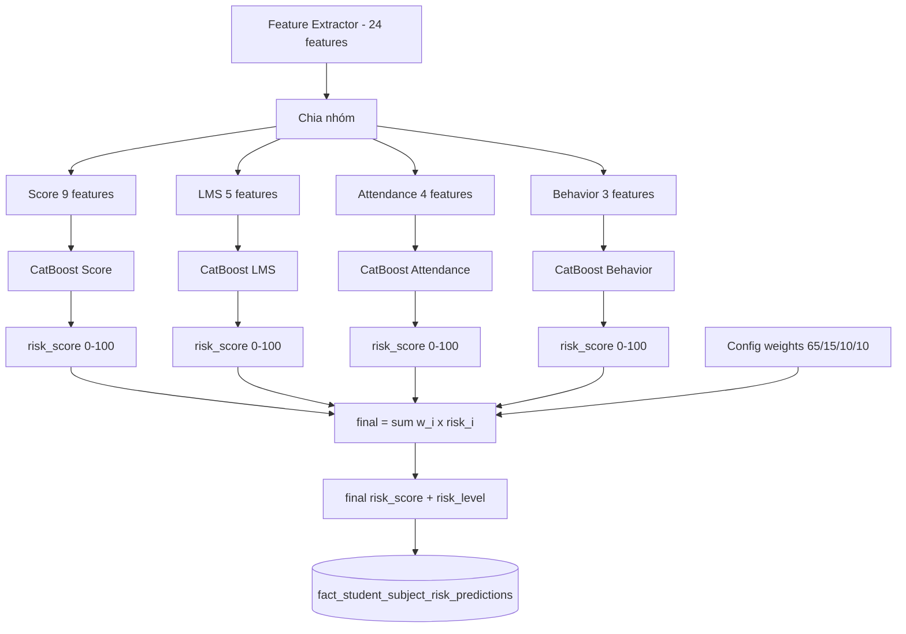

# Kế hoạch: EWS Factor-Ensemble — 4 cây quyết định + trọng số cấu hình

## 1. Bối cảnh & Vấn đề

Hiện tại EWS dùng **1 model CatBoost đơn lẻ** học trên 24 features, nhãn `actual_risk_level`
được sinh từ dữ liệu mock với trọng số **hardcode 65/15/10/10**
([`generate_train_dataset.py`](../../data_mock/mock_train_data/generate_train_dataset.py:86)).

Hệ quả: trọng số bị "nhúng ngầm" vào model. Khi có dữ liệu thật, tỷ lệ học được không khớp
thực tế → model "vỡ mộng", và đối tác **không thể chỉnh trọng số** nếu không retrain.

## 2. Mục tiêu

Chuyển sang **factor-ensemble**: train **4 sub-model** (mỗi cây một nhóm yếu tố), mỗi cây xuất
risk score + risk level riêng, rồi **kết hợp bằng trọng số cấu hình được** (file YAML/JSON + env).

- Trọng số đổi được **không cần retrain**.
- Mỗi yếu tố có score/level riêng → giải thích được.
- Retrain mô-đun theo từng nguồn dữ liệu.

## 3. Kiến trúc



## 4. Nhóm feature cho 4 sub-model

Mỗi sub-model dùng **context chung** (3) + **feature của nhóm nó**:

| Sub-model | Features (ngoài context) | Số lượng |
|-----------|--------------------------|----------|
| `score` | weighted_early_avg, weighted_late_avg, score_slope, score_volatility, max_drop, last_score, max_coefficient_so_far, high_weight_score_count, last_high_weight_score | 9 |
| `lms` | lms_avg_score, lms_recent_drop, lms_submission_rate, lms_recent_submission_rate, lms_gradebook_gap | 5 |
| `attendance` | daily_absence_rate, unexcused_absent_rate, excused_absent_days, total_late_count | 4 |
| `behavior` | total_demerit_points, repeat_offense_count, severe_sanction_count | 3 |

Context chung: `subject_id`, `subject_category`, `grade_level` (categorical).

## 5. Cấu hình trọng số (file YAML/JSON + env)

File mới: `src/ews/risk_weights.yaml` (hoặc `.json`), đọc qua env override.

```yaml
# src/ews/risk_weights.yaml
weights:
  score: 0.65
  lms: 0.15
  attendance: 0.10
  behavior: 0.10
risk_level_thresholds:   # ngưỡng trên final risk_score [0,100]
  LOW: 17.5
  MODERATE: 52.5
  HIGH: 85.0
  CRITICAL: 100.0
```

- Env override: `EWS_WEIGHT_SCORE`, `EWS_WEIGHT_LMS`, `EWS_WEIGHT_ATTENDANCE`, `EWS_WEIGHT_BEHAVIOR`.
- Module loader `src/ews/risk_config.py`: load YAML → merge env → validate `sum(weights)==1.0` (sai số nhỏ) → expose dataclass.
- **Fallback khi thiếu dữ liệu**: nếu một nhóm không có dữ liệu (vd chưa có LMS), trọng số nhóm đó
  được **phân bổ lại tỷ lệ** cho các nhóm còn lại (chuẩn hóa lại về 1.0) và ghi cờ `weight_*_applied`.

## 6. Lưu trữ (migration fact table)

Thêm cột vào `s360.fact_student_subject_risk_predictions` (idempotent):

```sql
ALTER TABLE s360.fact_student_subject_risk_predictions
    ADD COLUMN IF NOT EXISTS score_risk        DECIMAL(5,2),
    ADD COLUMN IF NOT EXISTS lms_risk          DECIMAL(5,2),
    ADD COLUMN IF NOT EXISTS attendance_risk   DECIMAL(5,2),
    ADD COLUMN IF NOT EXISTS behavior_risk     DECIMAL(5,2),
    ADD COLUMN IF NOT EXISTS weight_score      DECIMAL(5,4),
    ADD COLUMN IF NOT EXISTS weight_lms        DECIMAL(5,4),
    ADD COLUMN IF NOT EXISTS weight_attendance DECIMAL(5,4),
    ADD COLUMN IF NOT EXISTS weight_behavior   DECIMAL(5,4);
```

- `risk_score`/`risk_level` giữ nguyên = **final** (kết hợp).
- Các cột `*_risk` = sub-score từng yếu tố; `weight_*` = trọng số **đã dùng** (audit).
- Cập nhật `UPSERT_SQL` + `UPSERT_REQUIRED_COLS` trong [`pipeline_runner.py`](../../src/ews/pipeline_runner.py).

## 7. Quy tắc final risk_level

- `final_risk_score = Σ w_i × sub_risk_i` (w chuẩn hóa về 1.0).
- `final_risk_level` = ngưỡng trên `final_risk_score` (cấu hình trong `risk_weights.yaml`).
- Đảm bảo score và level hiển thị luôn nhất quán.

## 7b. Trọng số động theo từng học sinh (Dynamic Adaptive Weighting)

Nâng cấp bước kết hợp: thay vì trọng số cố định, mỗi học sinh có bộ trọng số riêng,
tự điều chỉnh theo mức rủi ro từng yếu tố của chính học sinh đó.

### Cơ chế chính: Dynamic Softmax Attention

$$w_k^{(i)} = \frac{w_k^{\text{gốc}} \cdot e^{\alpha \cdot S_k^{(i)}}}{\sum_{m} w_m^{\text{gốc}} \cdot e^{\alpha \cdot S_m^{(i)}}}$$

- `w_k^gốc`: trọng số gốc cấu hình (65/15/10/10) — **neo chính sách trường**.
- `S_k^(i)`: risk score yếu tố k của học sinh i (chuẩn hóa 0–1).
- `α`: hệ số khuếch đại rủi ro cá biệt (cấu hình, mặc định 2.0–3.0).

Ví dụ: học sinh giỏi (S_score≈0) nghỉ học nhiều (S_attend=0.9) → w_attend tự nhảy
từ 10% lên ~62%, w_score giảm từ 65% xuống ~27% → báo động đỏ kịp thời.

### 2 lớp an toàn (khắc phục nhược điểm)

1. **Sàn trọng số** (floor, cấu hình, vd ≥5%): tránh một yếu tố bị triệt tiêu hoàn toàn.
2. **Blend Worst-Factor Dominance**: `final = (1−β)×softmax_avg + β×max(S_k)` với β nhỏ
   (vd 0.15–0.25) — đảm bảo mảng tồi nhất **luôn** có tác động tối thiểu.

### Cấu hình bổ sung (`risk_weights.yaml`)

```yaml
dynamic:
  enabled: true
  alpha: 2.5          # hệ số khuếch đại softmax
  weight_floor: 0.05  # sàn trọng số tối thiểu mỗi yếu tố
  worst_factor_beta: 0.20  # pha trộn max(S_k) vào final
```

### Lưu trữ

- Lưu **trọng số động đã dùng** (`weight_score/lms/attendance/behavior`) + `alpha`, `beta`
  vào fact table để audit & giải thích cho GV.
- Frontend hiển thị: *"Do chuyên cần rủi ro 90% nên trọng số chuyên cần tự tăng lên 62%"*.

### Phương án thay thế (nâng cao, cần baseline lịch sử)

**Deviation-from-Baseline**: dùng độ lệch so với baseline của chính học sinh (hoặc bạn cùng
lớp) thay vì risk tuyệt đối → bắt đúng "bất thường" (học sinh giỏi đột ngột nghỉ học) thay vì
"kém tuyệt đối". Sư phạm nhất nhưng cần dữ liệu lịch sử baseline — để giai đoạn sau.

## 7c. Hai phiên bản EWS song song (demo)

Yêu cầu: giữ **phiên bản hiện tại** (model đơn) và **phiên bản mới** (factor-ensemble) chạy
song song để demo so sánh, đối tác chọn phương án.

### Cơ chế: versioned EWS

- **Cột `model_version VARCHAR`** trong fact table: `'v1_single'` (hiện tại) và `'v2_ensemble'` (mới).
- **UNIQUE constraint** phải thêm `model_version`:
  `(student_code, subject_id, school_year_id, semester_index, evaluated_at_week, model_version)`
  — nếu không, upsert version 2 sẽ xung đột với version 1.
- **Cấu hình `EWS_MODEL_VERSION`** (env/config) chọn model pipeline sẽ chạy; mặc định = active.
- **Model files riêng biệt**, không đè nhau:
  - v1: `catboost_ews_model.cbm`
  - v2: `catboost_ews_score.cbm`, `_lms.cbm`, `_attendance.cbm`, `_behavior.cbm`

### API

- Endpoint predictions nhận tham số `model_version` (mặc định = active), trả `model_version` trong response.
- Cho phép query 2 version cùng lúc để so sánh.

### Frontend

- Thêm **toggle chọn phiên bản** (v1/v2) trên dashboard EWS để demo.
- Hiển thị breakdown yếu tố (chỉ có ở v2) khi chọn v2.

### Migration

- `ALTER TABLE ... ADD COLUMN IF NOT EXISTS model_version VARCHAR(20) DEFAULT 'v1_single'`.
- Drop constraint cũ + tạo constraint mới có `model_version` (idempotent, cẩn thận dữ liệu cũ).
- Backfill `model_version='v1_single'` cho dữ liệu hiện có.

## 8. Triển khai

### 8.1 Training
- Script mới `src/models/gbdt/train_catboost_ews_ensemble.py` (kế thừa logic từ
  [`train_catboost_ews.py`](../../src/models/gbdt/train_catboost_ews.py)):
  - Load cùng dataset `train_risk_dataset.csv`.
  - Train 4 CatBoost (cùng target `actual_risk_level`, cùng `RISK_SCORE_WEIGHTS`).
  - Lưu 4 file `.cbm`: `catboost_ews_score.cbm`, `_lms.cbm`, `_attendance.cbm`, `_behavior.cbm`.
  - Đánh giá từng sub-model (F1, confusion matrix) + **calibration check** (đảm bảo sub-score
    cùng thang 0–100; nếu lệch → thêm bước chuẩn hóa min-max hoặc isotonic).

### 8.2 Inference
- [`inference_service.py`](../../src/ews/inference_service.py): thêm `load_ensemble()`, `run_ensemble_inference()`
  → trả dict gồm 4 sub-score + final score/level + weights đã dùng.
- [`pipeline_runner.py`](../../src/ews/pipeline_runner.py): persist thêm các cột mới.

### 8.3 API & Schema
- [`src/schemas/ews.py`](../../src/schemas/ews.py): thêm trường sub-scores + weights vào `EwsPredictionRow`.
- [`src/api/v1/ews.py`](../../src/api/v1/ews.py): query chọn các cột mới.

### 8.4 Frontend
- [`frontend/src/lib/types.ts`](../../frontend/src/lib/types.ts): thêm type sub-scores/weights.
- [`EwsDetailDrawer.tsx`](../../frontend/src/components/dashboard/EwsDetailDrawer.tsx): hiển thị
  breakdown "rủi ro theo yếu tố" (score/lms/attendance/behavior) + trọng số đã dùng.

### 8.5 Migration & Backfill
- Áp dụng `ALTER TABLE` (idempotent) vào DB.
- Backfill sub-scores/weights cho dữ liệu hiện có bằng cách chạy lại inference ensemble.

## 9. Rủi ro & Lưu ý

1. **Calibration**: sub-score 4 cây phải cùng thang → kiểm tra/chuẩn hóa trước khi cộng.
2. **Tương quan Điểm–LMS**: weighted sum "đếm trùng" thông tin tương quan; chấp nhận vì yêu cầu
   điểm chiếm 65%, nhưng cần ghi nhận trong tài liệu.
3. **Thiếu dữ liệu yếu tố**: cơ chế phân bổ lại trọng số + ghi cờ.
4. **Backward compat**: giữ `risk_score`/`risk_level` là final để không vỡ API/frontend cũ.
5. **Ngưỡng risk_level**: cấu hình được, cần thống nhất với đối tác.

## 10. Tiêu chí hoàn thành

- [ ] 4 sub-model train được, lưu 4 file `.cbm`.
- [ ] Trọng số đọc từ YAML + env, đổi được không cần retrain.
- [ ] Inference trả sub-scores + final score/level + weights đã dùng.
- [ ] Migration + backfill thành công; API/frontend hiển thị breakdown.
- [ ] `py_compile` + `tsc --noEmit` pass.
