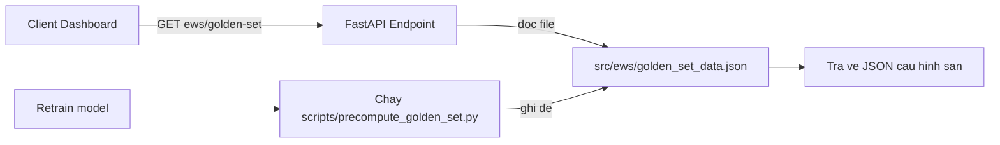

# Kế hoạch: Chuyển Golden Set API sang Static JSON Cache

## 1. Bối cảnh & Root cause

Endpoint `GET /ews/golden-set` hiện chạy **inference ML thật** mỗi lần khởi động:

```
API → run_golden_set() → load_ensemble() (nạp 4 file .cbm CatBoost)
    → run_ensemble_inference() → tính risk_score/risk_level → format JSON
```

Điểm yếu (đã xác minh trong codebase):
- [`load_ensemble()`](src/ews/inference_service.py:326) yêu cầu 4 file model tại `src/models/gbdt/saved/*.cbm`.
- Thư mục `src/models/gbdt/saved/` **chỉ chứa các file JSON báo cáo** (`catboost_evaluation_report.json`, `catboost_ews_ensemble_report.json`, `shap_feature_importance.json`), **không chứa** file `.cbm` → `FileNotFoundError` → HTTP 500 trong môi trường runtime thiếu model / thiếu gói `catboost`.
- Các endpoint khác (`/ews/predictions`, `/ews/overview`, ...) chỉ đọc SQL từ PostgreSQL nên không bị ảnh hưởng — đây là lý do "chỉ API golden-set lỗi".
- Endpoint hiện đã cache trong process bằng [`_cached_golden_set()`](src/api/v1/ews.py:830) (`@lru_cache(maxsize=1)`), nhưng lần gọi đầu vẫn chạy inference → vẫn lỗi nếu thiếu model.
- Bộ 8 case (GS-01..GS-08) là **cố định**, kết quả chỉ thay đổi khi retrain mô hình → phù hợp để cache static.

## 2. Giải pháp

1. **Sinh trước** file `src/ews/golden_set_data.json` (chứa đúng payload của `EwsGoldenSetResult`) và **commit vào git**.
2. **Endpoint chỉ đọc file JSON** → phản hồi < 1ms, 0% phụ thuộc model/ML tại runtime.
3. **Script `scripts/precompute_golden_set.py`** để tái sinh file sau mỗi lần retrain model.

Giữ nguyên `run_golden_set()` + CLI `scripts/ews_golden_set.py` như **nguồn sự thật (source of truth)** để tái sinh & kiểm chứng — không xoá.

## 3. Các bước triển khai

### Bước 1 — Viết script sinh cache `scripts/precompute_golden_set.py`
- Gọi `run_golden_set()` (cần môi trường có model `.cbm` + catboost).
- Validate JSON serializable bằng `json.dumps(..., allow_nan=False)` — tái sử dụng logic kiểm tra `NaN/Inf` từ `scripts/_debug_golden_serialize.py`.
- Validate payload đúng schema bằng `EwsGoldenSetResult.model_validate(...)`.
- Ghi file `src/ews/golden_set_data.json` với `ensure_ascii=False`, `indent=2` (UTF-8).
- In summary `total/passed/accuracy`; so sánh accuracy với file cũ (nếu có) để cảnh báo thay đổi.

### Bước 2 — Sinh file JSON & commit
- Chạy script trên máy có model để tạo `src/ews/golden_set_data.json`, đảm bảo file được **commit vào git** để runtime không cần model.

### Bước 3 — Sửa endpoint [`src/api/v1/ews.py`](src/api/v1/ews.py:830)
- Thay `_cached_golden_set()` (chạy inference) bằng `_load_golden_set_json()`:
  - Đường dẫn tương đối theo module: `Path(__file__).resolve().parent.parent / "ews" / "golden_set_data.json"` (khớp pattern của [`risk_config.py`](src/ews/risk_config.py:31)).
  - Đọc file + `json.loads` mỗi request (file nhỏ, < 1ms) → luôn tươi khi tái sinh mà không cần restart.
  - Nếu file thiếu → `HTTPException(503, ...)` kèm hướng dẫn chạy `scripts/precompute_golden_set.py` (thay vì 500 mơ hồ). Không fallback sang inference ở runtime để giữ runtime gọn.
- Giữ nguyên route `/golden-set` + `response_model=EwsGoldenSetResult` → **không đổi hợp đồng API**, frontend không phải sửa.

### Bước 4 — (Tùy chọn) Metadata cho phản hồi
- Mở rộng `EwsGoldenSetResult` với `model_version: Optional[str]`, `generated_at: Optional[datetime]` (non-breaking) để dashboard hiển thị phiên bản model / thời điểm sinh cache.
- Frontend [`EwsWarningTab.tsx`](frontend/src/components/dashboard/EwsWarningTab.tsx:293) có thể hiển thị thêm.

### Bước 5 — Tests
- Tạo `tests/test_api/test_ews_golden_set.py` (chạy offline, không cần model):
  - `test_cache_file_matches_schema`: đọc `src/ews/golden_set_data.json`, parse bằng `EwsGoldenSetResult.model_validate` → chặn commit file hỏng/stale.
  - `test_loader_returns_expected_shape`: gọi `_load_golden_set_json()` → đúng `{total, passed, accuracy, cases}`.
  - `test_endpoint_503_when_file_missing`: monkeypatch đường dẫn file → endpoint trả 503 (TestClient + override dependency `get_db`).

### Bước 6 — Dọn dẹp
- Chuyển logic `scripts/_debug_golden_serialize.py` vào `scripts/precompute_golden_set.py`; xoá file debug (hoặc giữ nếu cần để tái hiện lỗi cũ).
- Cập nhật ghi chú frontend (optional): đổi chuỗi "thiếu model" → "thiếu file golden set cache".

### Bước 7 — Cập nhật tài liệu
- Thêm mục "Quy trình tái sinh sau retrain" vào `plans/risk_alert/plan_ews_golden_set.md`.

## 4. Luồng dữ liệu mới



## 5. Rủi ro & quyết định

| Vấn đề | Quyết định |
|--------|-----------|
| File JSON bị stale sau khi retrain | Quy trình: retrain → chạy `precompute_golden_set.py` → commit file mới |
| File cache thiếu ở runtime | Trả 503 rõ ràng kèm hướng dẫn tái sinh (không 500 mơ hồ, không fallback inference) |
| Hợp đồng API thay đổi | Không — response_model giữ nguyên; metadata mới đều Optional |
| Mất khả năng kiểm chứng model | Không — `run_golden_set()` + CLI vẫn là source of truth để chạy & tái sinh |

## 6. Tiêu chí chấp nhận
- `GET /ews/golden-set` trả 200 < 1ms mà **không cần** model `.cbm` / gói `catboost` ở runtime.
- `src/ews/golden_set_data.json` được commit, parse đúng `EwsGoldenSetResult`.
- `scripts/precompute_golden_set.py` tái sinh file khớp schema và in summary.
- Toàn bộ test mới xanh; test suite cũ không hỏng.
