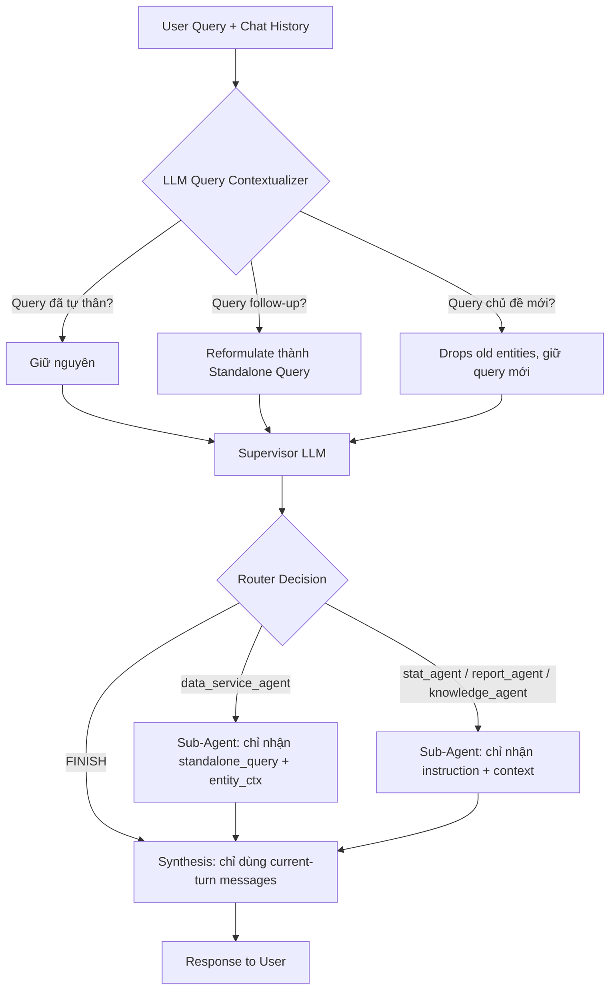

# Fix Plan: Context Contamination Across Independent Chat Queries (v2)

## Problem Summary

Khi người dùng hỏi một câu hỏi **độc lập mới** (không liên quan đến chủ đề trước đó), hệ thống vẫn giữ nguyên toàn bộ lịch sử hội thoại cũ, khiến LLM bị nhiễu context và trả lời sai trọng tâm.

### Root Cause

**Context Poisoning + Attention Bias**: Khi toàn bộ Chat History chứa entity cụ thể (Bùi Đình Nghĩa, HS125071002, lớp 7A1) được truyền dưới dạng mảng message phẳng, Attention Heads của Transformer bị thu hút bởi các định danh cụ thể trong History, tạo ra **False Association**.

---

## Fix Strategy: 3 Design Patterns

### Mẫu 1: LLM Query Contextualizer (Standalone Query Reformulation - Hướng 1 Enterprise Standard)

Dùng một LLM call siêu nhẹ (< 0.15s với `deepseek-v4-flash` / `gpt-4o-mini`) để **tự động quy đổi** `User Query mới` + `Chat History` thành một **câu hỏi độc lập tự thân (Standalone Query)**.

Cơ chế hoạt động:
- **Turn 1 Early Exit**: Nếu chưa có history (Turn 1), return thẳng `current_query` (tiết kiệm 100% latency).
- **Turn 2+ Always Contextualize**: Từ Turn 2 trở đi, luôn quy đổi query qua LLM Contextualizer để đảm bảo 100% không bị bỏ sót các nuance follow-up tiếng Việt.
- **Không Regex** — loại bỏ rủi ro false positive / false negative.
- **Không Scope State** — không cần `active_scope`, `active_student_ids` thủ công trong state.

Ví dụ:
| History | User Query | Standalone Query |
|---------|-----------|-----------------|
| "điểm của Bùi Đình Nghĩa" | "có 2 học sinh tên đó?" | "Trong trường hiện tại có bao nhiêu học sinh cùng mang tên Bùi Đình Nghĩa?" |
| "điểm của Bùi Đình Nghĩa" | "danh sách lớp 7a1" | "Cho danh sách toàn bộ học sinh thuộc lớp 7A1 năm học 2025-2026." |
| "điểm lớp 7A1" | "còn lớp 7A2 thì sao?" | "Cho xem điểm của lớp 7A2." |
| "thông tin Nguyễn Văn A" | "điểm toán của bạn ấy" | "Cho xem điểm toán của Nguyễn Văn A." |

### Mẫu 2: Topic Boundary Rule (Prompt-Level Guard)

Giữ nguyên — thêm rule vào `SUPERVISOR_PROMPT` để LLM biết phân biệt `<conversation_history_FOR_REFERENCE_ONLY>` và `<current_user_query>`.

### Mẫu 3: Sub-Agent Context Isolation

Chỉ truyền **Standalone Query + Entity Context** xuống sub-agent, không truyền toàn bộ `state["messages"]`.

---

## Detailed Changes

### CHANGE 1: SUPERVISOR_PROMPT — Add Topic Boundary Rule

**File:** [`src/agents/supervisor/node.py`](src/agents/supervisor/node.py:35)

**Thêm vào cuối `SUPERVISOR_PROMPT`:**

```text
🔴 QUY TẮC PHÂN BIỆT CHỦ ĐỀ (TOPIC BOUNDARY RULE):
1. BẮT BUỘC ưu tiên xử lý thông tin nằm trong thẻ <current_user_query>.
2. Thẻ <conversation_history_FOR_REFERENCE_ONLY> CHỈ ĐƯỢC SỬ DỤNG KHI câu hỏi hiện tại thiếu thành phần câu.
3. Nếu <current_user_query> đã là câu hỏi hoàn chỉnh về đối tượng mới, BẮT BUỘC BỎ QUA các entity cũ trong history.
```

---

### CHANGE 2: Thêm LLM Query Contextualizer (Standalone Query Reformulation)

**File:** [`src/agents/supervisor/node.py`](src/agents/supervisor/node.py) — Thêm function mới

**Thay thế hoàn toàn Change 2 + Change 3 cũ** bằng một hàm Contextualizer:

```python
async def _reformulate_standalone_query(
    messages_list: list,
    current_query: str,
) -> str:
    """
    LLM Query Contextualizer: Quy đổi User Query + Chat History thành 
    Standalone Query độc lập tự thân.
    
    - Nếu query đã độc lập: giữ nguyên (không reformulate)
    - Nếu query là follow-up: tích hợp context từ history
    - Latency target: < 0.15s (dùng fast LLM)
    """
    # Nếu query đã có đủ thành phần (chủ ngữ + vị ngữ + đối tượng rõ ràng),
    # không cần reformulate để tiết kiệm latency
    if _is_self_contained_query(current_query):
        return current_query
    
    # Build context từ 2-3 turn gần nhất
    recent_history = _build_recent_context(messages_list, max_turns=2)
    
    from src.services.llm import get_llm
    from langchain_core.messages import SystemMessage, HumanMessage
    
    llm = get_llm()
    prompt = (
        "Bạn là Query Contextualizer. Nhiệm vụ: dựa vào Lịch sử Chat và Câu hỏi Hiện tại, "
        "hãy viết lại câu hỏi hiện tại thành một câu hỏi độc lập tự thân (Standalone Query) "
        "có thể đứng một mình mà không cần lịch sử.\n\n"
        "NGUYÊN TẮC:\n"
        "1. Nếu câu hỏi hiện tại ĐÃ hoàn chỉnh (có đầy đủ chủ ngữ, đối tượng, ngữ cảnh) -> "
        "GIỮ NGUYÊN, không thay đổi.\n"
        "2. Nếu câu hỏi hiện tại DỰA VÀO lịch sử (dùng đại từ 'bạn ấy', 'em đó', 'còn...thì sao', "
        "'thế còn', 'như trên') -> tích hợp thông tin từ lịch sử để tạo câu hỏi hoàn chỉnh.\n"
        "3. Nếu câu hỏi hiện tại là CHỦ ĐỀ MỚI hoàn toàn -> KHÔNG đưa thông tin từ lịch sử vào.\n"
        "4. Giữ nguyên năm học, học kỳ, lớp học nếu được nhắc đến.\n"
        "5. Trả về CHỈ câu hỏi đã reformulate, không giải thích gì thêm."
    )
    
    result = await llm.ainvoke([
        SystemMessage(content=prompt),
        HumanMessage(content=(
            f"[LỊCH SỬ CHAT (2 TURN GẦN NHẤT)]:\n{recent_history}\n\n"
            f"[CÂU HỎI HIỆN TẠI]: {current_query}\n\n"
            f"Hãy viết lại [CÂU HỎI HIỆN TẠI] thành Standalone Query:"
        ))
    ])
    
    standalone = (result.content or "").strip()
    return standalone if standalone else current_query


# Lightweight check trước khi gọi LLM: query đã self-contained chưa?
# Phát hiện nhanh query có chứa đại từ/cấu trúc follow-up không
_RE_FOLLOWUP_PATTERN = re.compile(
    r"(bạn ấy|em đó|em ấy|học sinh này|học sinh đó|còn|thế còn|tương tự|như trên|"
    r"nói trên|ở trên|đã hỏi|của nó|của bạn)", 
    re.IGNORECASE
)


def _is_self_contained_query(query: str) -> bool:
    """Kiểm tra nhanh xem query có cần reformulate không."""
    # Query quá ngắn (1-2 từ) -> cần context
    if len(query.strip().split()) <= 3:
        return False
    # Query chứa đại từ/cấu trúc follow-up -> cần reformulate
    if _RE_FOLLOWUP_PATTERN.search(query):
        return False
    return True


def _build_recent_context(messages_list: list, max_turns: int = 2) -> str:
    """Build text context từ 2-3 turn gần nhất."""
    # Tìm vị trí các HumanMessage để xác định turn
    human_indices = []
    for idx, msg in enumerate(messages_list):
        if getattr(msg, "type", None) == "human" or msg.__class__.__name__ in ("HumanMessage", "HumanMessageChunk"):
            human_indices.append(idx)
    
    # Chỉ lấy max_turns turn gần nhất
    if len(human_indices) > max_turns:
        start_idx = human_indices[-max_turns]
    else:
        start_idx = 0
    
    recent_msgs = messages_list[start_idx:]
    
    lines = []
    for msg in recent_msgs:
        msg_type = getattr(msg, "type", "unknown")
        content = str(getattr(msg, "content", "") or "")
        if content.strip():
            role_label = "Người dùng" if msg_type == "human" else "AI"
            lines.append(f"{role_label}: {content[:500]}")  # Giới hạn độ dài
    
    return "\n".join(lines)
```

**Gọi trong `supervisor_node()`:** Sau dòng 93 (`query = state.get("query", "")`):
```python
# LLM Query Contextualizer: reformulate query thành standalone query
standalone_query = await _reformulate_standalone_query(messages_list, query)
```

Sau đó dùng `standalone_query` thay vì `query` cho tất cả các bước tiếp theo.

---

### CHANGE 3: supervisor_node() — Sliding Window + Clean Context

**File:** [`src/agents/supervisor/node.py`](src/agents/supervisor/node.py:117-127)

**Thay thế** logic build `system_prompt` và `messages` cũ bằng:

```python
# ── Build SystemMessage với Sliding Window (3-5 turns gần nhất) ──
# Giữ nguyên cấu trúc Message Object để bảo toàn Native Tool Call

# Lấy recent history (sliding window)
recent_messages = _get_sliding_window(messages_list, max_turns=3)

# Build system prompt (mở rộng với standalone query)
system_prompt = SUPERVISOR_PROMPT + (
    f"\n\nTHÔNG TIN NGỮ CẢNH HỆ THỐNG HIỆN TẠI:\n"
    f"- Niên khóa hiện tại: {current_year_str}\n"
    f"- Học kỳ hiện tại: {current_semester_str}\n"
    f"- STT: Câu hỏi hiện tại sau khi reformulate: {standalone_query}\n"
    f"Nếu người dùng hỏi về điểm số, báo cáo, hay đề thi của học kỳ hiện tại hoặc không chỉ định rõ niên khóa/năm học, "
    f"hãy tự động sử dụng thông tin niên khóa và học kỳ hiện tại này làm mặc định để phân tích/lập báo cáo."
)

# Nếu có history, đóng gói XML tags trong SystemMessage
if recent_messages:
    history_text = _messages_to_text(recent_messages)
    system_prompt += (
        f"\n\n<conversation_history_FOR_REFERENCE_ONLY>\n"
        f"{history_text}\n"
        f"</conversation_history_FOR_REFERENCE_ONLY>"
    )

# Tách user query sang HumanMessage riêng (đã reformulate)
user_message = HumanMessage(
    content=f"<current_user_query>\n{standalone_query}\n</current_user_query>"
)

messages = [SystemMessage(content=system_prompt), user_message]
```

Và thêm 2 hàm helper:
```python
def _get_sliding_window(messages_list: list, max_turns: int = 3) -> list:
    """Lấy max_turns turn gần nhất, bảo toàn Message Object structure."""
    human_indices = []
    for idx, msg in enumerate(messages_list):
        if getattr(msg, "type", None) == "human" or msg.__class__.__name__ in ("HumanMessage", "HumanMessageChunk"):
            human_indices.append(idx)
    
    if len(human_indices) > max_turns:
        start_idx = human_indices[-max_turns]
    else:
        start_idx = 0
    
    return messages_list[start_idx:]


def _messages_to_text(messages: list) -> str:
    """Chuyển messages thành text an toàn (giữ được content, skip tool call chi tiết)."""
    lines = []
    for msg in messages:
        msg_type = getattr(msg, "type", "unknown")
        content = str(getattr(msg, "content", "") or "")
        if content.strip():
            role_label = {"human": "Người dùng", "ai": "AI", "tool": "Công cụ"}.get(msg_type, msg_type)
            lines.append(f"{role_label}: {content}")
    return "\n".join(lines)
```

---

### CHANGE 4: Synthesis Phase — Current-Turn Only Transcript

**File:** [`src/agents/supervisor/node.py`](src/agents/supervisor/node.py:382-414)

Giữ nguyên như bản cũ — chỉ build transcript từ messages trong **current turn**.

```python
last_human_idx = -1
for idx, msg in enumerate(messages_list):
    if getattr(msg, "type", None) == "human" or msg.__class__.__name__ in ("HumanMessage", "HumanMessageChunk"):
        last_human_idx = idx

current_turn_msgs = messages_list[last_human_idx + 1:] if last_human_idx != -1 else messages_list

# ... (phần còn lại giữ nguyên)
```

---

### CHANGE 5: Loại bỏ MultiAgentState scope fields (Không cần thiết)

**File:** [`src/agents/state.py`](src/agents/state.py:9)

**Không thêm** `active_scope`, `active_student_ids`, `active_student_names`, `active_class_ids` vào state.

LLM Query Contextualizer đã xử lý tất cả scope logic tự nhiên — không cần state management thủ công.

---

### CHANGE 6: data_service_agent Context Isolation

**File:** [`src/agents/data_service_agent/node.py`](src/agents/data_service_agent/node.py:64-71)

**Giữ nguyên** logic như bản cập nhật trước — chỉ truyền instruction + entity_ctx, không truyền full messages.

Nhưng thay vì dùng `last_instruction` từ Supervisor message, giờ đây có thể dùng `standalone_query` trực tiếp:

```python
# ── Thay thế: Chỉ dùng standalone_query + entity_ctx ──
messages = state.get("messages", [])
query = state.get("query", "")
standalone_query = state.get("standalone_query", query)  # Đã được reformulate ở supervisor

combined_context = (
    f"[YÊU CẦU ĐỘC LẬP]: {standalone_query}\n\n"
    f"[YÊU CẦU GỐC CỦA NGƯỜI DÙNG]: {query}"
)

# ... phần còn lại giữ nguyên ...

# TẦNG 2: Dynamic SQL Generator
exec_messages = [
    HumanMessage(
        content=(
            f"{entity_ctx.formatted_prompt_context}\n\n"
            f"[YÊU CẦU NGƯỜI DÙNG & HƯỚNG DẪN]: {combined_context}"
        )
    )
]
```

**Lưu ý:** Cần thêm `standalone_query` vào `MultiAgentState` (dòng return của supervisor_node):
```python
# Trong supervisor_node, thêm standalone_query vào updates
updates["standalone_query"] = standalone_query
```

Và thêm vào `MultiAgentState`:
```python
standalone_query: str  # Query đã được reformulate, độc lập tự thân
```

---

## Implementation Checklist

| # | File | Mô tả | Độ ưu tiên |
|---|------|-------|-----------|
| **1** | [`src/agents/supervisor/node.py:35`](src/agents/supervisor/node.py:35) | **SUPERVISOR_PROMPT** — Thêm Topic Boundary Rule | **P0** |
| **2** | [`src/agents/supervisor/node.py:79`](src/agents/supervisor/node.py:79) | **supervisor_node()** — Thêm `_reformulate_standalone_query()`, `_is_self_contained_query()`, `_build_recent_context()`, `_get_sliding_window()`, `_messages_to_text()`. Áp dụng Sliding Window + Standalone Query. | **P0** |
| **3** | [`src/agents/supervisor/node.py:382-414`](src/agents/supervisor/node.py:382) | **Synthesis Phase** — Fix transcript: chỉ dùng current-turn messages | **P0** |
| **4** | [`src/agents/state.py:9`](src/agents/state.py:9) | **MultiAgentState** — Chỉ thêm `standalone_query: str` | **P1** |
| **5** | [`src/agents/data_service_agent/node.py:64`](src/agents/data_service_agent/node.py:64) | **data_service_agent_node** — Context isolation: dùng standalone_query + entity_ctx | **P1** |

---

## Revised Architecture Diagram



---

## Edge Case Analysis

### Tại sao LLM Contextualizer xử lý được các case Regex không xử lý được:

| Edge Case | Regex Approach | LLM Contextualizer |
|-----------|---------------|-------------------|
| "Cho coi sĩ số 7A1" | ❌ Không match "lớp" → UNKNOWN | ✅ LLM hiểu "sĩ số 7A1" = "danh sách lớp 7A1" |
| "Thằng Nghĩa thế nào rồi" | ❌ Không match "học sinh" → UNKNOWN | ✅ LLM hiểu "Nghĩa" là học sinh đã nhắc trước đó |
| "Học sinh Bùi Đình Nghĩa có thuộc lớp 7A1 không?" | ❌ STUDENT scope → reset CLASS context | ✅ LLM giữ cả 2 entity tự nhiên |
| "Em muốn xem điểm của em" | ❌ Regex cũ: false positive "em" | ✅ LLM hiểu "em" là đại từ, không phải tên |
| "Trường mình có ai bị rủi ro không?" | ❌ Không match pattern nào → UNKNOWN | ✅ LLM infer scope là SCHOOL/CLASS từ context |

---

## Test Scenarios

### Scenario 1: Independent query (bug case)
```
Turn 1: "trình độ học tập môn âm nhạc và mỹ thuật của Bùi Đình Nghĩa HK1 2025-2026"
→ Agent trả lời về Bùi Đình Nghĩa (STUDENT)

Turn 2: "có 2 học sinh tên Bùi Đình Nghĩa?"
→ Standalone Query: "Có bao nhiêu học sinh tên Bùi Đình Nghĩa trong trường?"
→ Agent trả lời về 2 Bùi Đình Nghĩa (follow-up correct)

Turn 3: "danh sách học sinh lớp 7a1 năm 2025-2026 học kỳ 2"
→ Standalone Query: "Cho danh sách học sinh lớp 7A1 năm học 2025-2026."
→ Agent trả lời danh sách 7A1 (chủ đề mới, không còn Bùi Đình Nghĩa)
```

### Scenario 2: Student pronoun "em" (regression)
```
Turn 1: "Cho em xem điểm toán của em"
→ Standalone Query: "Cho xem điểm toán của tôi." (hoặc giữ nguyên nếu đã đủ)
→ Không trigger false positive STUDENT
```

### Scenario 3: Cross-scope query
```
Turn 1: "sĩ số lớp 7A1"
Turn 2: "Học sinh Bùi Đình Nghĩa có thuộc lớp 7A1 không?"
→ Standalone Query giữ cả 2 entity:
  "Học sinh Bùi Đình Nghĩa có thuộc lớp 7A1 không?"
→ Không mất context lớp học
```

### Scenario 4: Sub-agent isolation
```
Turn 1: "điểm của Bùi Đình Nghĩa"
Turn 2: "sĩ số lớp 7A1"
→ data_service_agent chỉ nhận standalone query:
  "Sĩ số lớp 7A1"
→ Không thấy "Bùi Đình Nghĩa" trong context
```
