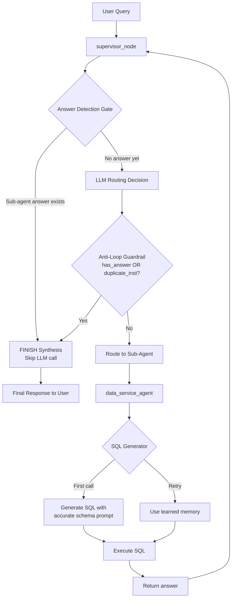

# Kế Hoạch Fix: Redundant Supervisor Loop & Short-Term Amnesia

## 1. Phân Tích Root Cause

### Bug 1: Redundant Supervisor Loop

**Flow thực tế (dựa vào log):**

```
Lượt 1: Supervisor → data_service_agent (SQL chạy thành công → 21 học sinh)
Lượt 2: Supervisor → data_service_agent (lại chạy lại từ đầu!)
Lượt 3: Supervisor → FINISH (sau khi chạy lại xong)
```

**3 nguyên nhân gốc phối hợp:**

**1a. Prompt supervisor dòng 79 — "Ignore history for complete sentences"**
```
Thẻ <conversation_history_FOR_REFERENCE_ONLY> CHỈ ĐƯỢC SỬ DỤNG KHI
câu hỏi hiện tại thiếu thành phần câu...
```
Khi query là câu hoàn chỉnh ("lớp 7A1 có bao nhiêu bạn..."), model được "cho phép" bỏ qua history → không thấy rằng đã có câu trả lời từ lượt 1 → route lại.

**1b. Anti-loop guardrail (dòng 394-396) chỉ check instruction, không check answer**
```python
# Chỉ check: instruction có bị lặp không?
is_duplicate_instruction = (curr_inst_norm in prev_inst or prev_inst in curr_inst_norm)
```
Ở log, instruction lượt 2 khác instruction lượt 1 (thêm `grade_id=7`, `code='CAM_MATH'`) → guardrail không phát hiện → không force FINISH.

**1c. Thiếu "answer detection gate" trước khi gọi LLM**
Không có code nào kiểm tra: "đã có sub-agent trả lời chưa?" TRƯỚC khi gọi LLM tốn kém.

### Bug 2: Short-Term Amnesia (SQL Generator)

**Nguyên nhân:** Context isolation ở data_service_agent (dòng 78, 205-212) quá triệt để:

```python
# data_service_agent/node.py:78
standalone_query = state.get("standalone_query", query)
...
exec_messages = [HumanMessage(content=combined_context)]
```

Khi supervisor route lại lần 2 → data_service_agent khởi tạo lại `exec_messages` từ `standalone_query`, **không giữ lại memory** gì từ lần chạy trước (cả entity context lẫn bài học SQL đã học).

Hậu quả: SQL generator lại viết `fce.homeroom_class_id = 3` (cột không tồn tại) → lặp lại lỗi → tốn thêm 1 call `information_schema.columns` để học lại.

---

## 2. Giải Pháp Tổng Quan (Không Hardcode)

### Fix #1: Answer Detection Gate (Code-level, trước LLM call)

**File:** `src/agents/supervisor/node.py`

**Vị trí:** Ngay sau dòng 263 (`messages = [SystemMessage(...), user_message]`), trước dòng 265 (`llm = get_llm()`)

**Logic:**
```python
# ── Answer Detection Gate ──────────────────────────────────────────
# Kiểm tra: sub-agent đã trả lời trong lượt hiện tại chưa?
# Nếu có → skip LLM routing, FINISH trực tiếp
last_human_idx = _find_last_human_idx(messages_list)
turn_msgs = messages_list[last_human_idx+1:] if last_human_idx != -1 else messages_list

if _has_complete_answer(turn_msgs):
    logger.info("supervisor_answer_gate", msg="Sub-agent already returned answer, skipping LLM routing → FINISH")
    decision = RouterDecision(
        next_agent="FINISH",
        instruction="Tổng hợp câu trả lời từ dữ liệu đã thu thập."
    )
    # Bỏ qua LLM call, nhảy thẳng xuống FINISH synthesis
    # goto logic hiện tại (từ dòng 400 trở đi)
```

**Hàm helper:**
```python
def _find_last_human_idx(messages_list: list) -> int:
    for idx in range(len(messages_list)-1, -1, -1):
        msg = messages_list[idx]
        if getattr(msg, "type", None) == "human" or msg.__class__.__name__ in ("HumanMessage", "HumanMessageChunk"):
            return idx
        if isinstance(msg, dict) and (msg.get("type") == "human" or msg.get("role") in ("user", "human")):
            return idx
    return -1

def _is_non_supervisor_ai_message(msg) -> bool:
    """Check if message is from a sub-agent (not supervisor instruction)"""
    is_ai = (getattr(msg, "type", None) == "ai" or 
             msg.__class__.__name__ in ("AIMessage", "AIMessageChunk") or
             (isinstance(msg, dict) and (msg.get("type") == "ai" or msg.get("role") in ("assistant", "ai"))))
    if not is_ai:
        return False
    content = str(getattr(msg, "content", "") or "")
    if "[Supervisor]:" in content or "Chuyển yêu cầu sang" in content:
        return False
    return True

def _has_complete_answer(turn_msgs: list) -> bool:
    """Check if any sub-agent returned a substantive answer"""
    for msg in turn_msgs:
        if _is_non_supervisor_ai_message(msg):
            content = str(getattr(msg, "content", "") or "").strip()
            if len(content) > 50:  # Threshold: meaningful answer
                return True
    return False
```

**Tác động:**
- ✅ Loại bỏ hoàn toàn redundant loop ở code-level (không phụ thuộc model)
- ✅ Tiết kiệm 100% LLM call cho lượt supervisor thứ 2 (từ 2 call → 1 call)
- ✅ Fix luôn bug amnesia (vì không route lại → SQL generator không bị gọi lại)

### Fix #2: Strengthen Anti-Loop Guardrail

**File:** `src/agents/supervisor/node.py` — dòng 394-396

**Hiện tại:**
```python
if is_duplicate_instruction and decision.next_agent != "FINISH":
    decision.next_agent = "FINISH"
```

**Sửa thành:**
```python
# Kiểm tra cả: instruction bị lặp HOẶC đã có answer trong turn
has_sub_answer = bool([
    m for m in current_turn_msgs
    if _is_non_supervisor_ai_message(m) and len(str(getattr(m, "content", "") or "").strip()) > 50
])

if (is_duplicate_instruction or has_sub_answer) and decision.next_agent != "FINISH":
    logger.info("supervisor_anti_loop", 
                msg=f"Forcing FINISH. duplicate_inst={is_duplicate_instruction}, has_answer={has_sub_answer}")
    decision.next_agent = "FINISH"
```

**Tác động:**
- ✅ Safety net cho Fix #1 (nếu Answer Detection Gate không kịp trigger)
- ✅ Guardrail dựa trên answer content thay vì instruction text

### Fix #3: Supervisor Prompt — Gỡ bỏ "Ignore History" Rule

**File:** `src/agents/supervisor/node.py` — dòng 77-80

**Hiện tại:**
```
🔴 QUY TẮC PHÂN BIỆT CHỦ ĐỀ (TOPIC BOUNDARY RULE):
1. BẮT BUỘC ưu tiên xử lý thông tin nằm trong thẻ <current_user_query>.
2. Thẻ <conversation_history_FOR_REFERENCE_ONLY> CHỈ ĐƯỢC SỬ DỤNG KHI câu hỏi hiện tại thiếu thành phần câu...
3. ...
```

**Sửa thành:**
```
🔴 QUY TẮC PHÂN BIỆT CHỦ ĐỀ (TOPIC BOUNDARY RULE):
1. <current_user_query> chứa câu hỏi hiện tại của người dùng.
2. <conversation_history_FOR_REFERENCE_ONLY> chứa lịch sử các thao tác trong lượt xử lý HIỆN TẠI.
   - Nếu trong lịch sử đã có kết quả trả về từ Sub-Agent (ví dụ: dữ liệu điểm số, danh sách học sinh...),
     điều đó nghĩa là Sub-Agent đã thực thi xong. Bạn PHẢI chọn FINISH để tổng hợp câu trả lời.
   - Nếu lịch sử chỉ có tin nhắn điều hướng của Supervisor mà chưa có kết quả từ Sub-Agent,
     hãy dùng <current_user_query> để quyết định route tiếp.
3. ...
```

**Tác động:**
- ✅ Model hiểu rõ: history có answer → FINISH
- ✅ Vẫn giữ context isolation (không cho model "học" từ lịch sử cũ)

### Fix #4: DB Schema Prompt (Cho SQL Generator)

**File:** `src/agents/data_service_agent/prompts.py` (hoặc nơi chứa schema prompt)

Thêm mô tả cột cho mỗi table trong schema. Hiện tại prompt chỉ liệt kê tên table mà không mô tả column nào tồn tại.

**Cần thêm:**
```
Table `s360.fact_course_enrolls`:
  - id, so_school_id, student_code, subject_id, grade_id, 
    class_id, is_moved_out, is_student, semester_id, school_year_id
  - KHÔNG có cột: homeroom_class_id

Table `s360.dim_homeroom_class_student`:
  - id, so_school_id, student_code, homeroom_class_id, is_moved_out

Table `s360.dim_homeroom_class`:
  - id, so_school_id, class_name, grade_id
```

**Tác động:**
- ✅ SQL generator biết trước cột nào có/không → giảm hallucination ngay lần đầu
- ✅ Giảm số lần gọi `information_schema.columns` (tốn thời gian + token)

---

## 3. Thứ Tự Ưu Tiên

| # | Fix | File | Effort | Impact |
|---|-----|------|--------|--------|
| 1 | Answer Detection Gate | `supervisor/node.py` | Thêm ~15 dòng | **CAO**: loại redundant loop hoàn toàn |
| 2 | Strengthen Guardrail | `supervisor/node.py` | Sửa ~5 dòng | **CAO**: safety net |
| 3 | Prompt: gỡ ignore history | `supervisor/node.py` | Sửa ~5 dòng | **TRUNG BÌNH**: hướng dẫn model đúng |
| 4 | DB Schema cột | `data_service_agent/prompts.py` | Thêm ~30 dòng | **CAO**: giảm SQL hallucination |

## 4. Mermaid Flow — Sau Khi Fix



## 5. Rủi Ro & Mitigation

| Rủi ro | Mitigation |
|--------|------------|
| Answer Detection Gate quá tham (false positive) | Threshold `len(content) > 50` — lọc instruction ngắn |
| Bỏ sót edge case (multi-step query cần nhiều agent) | Guardrail không force FINISH cho multi-step; chỉ force khi instruction duplicate |
| Prompt change ảnh hưởng behavior khác | Chỉ sửa 1 rule cụ thể, giữ nguyên các rule khác |
