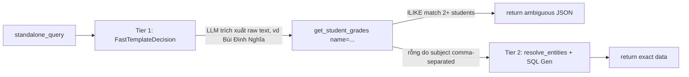
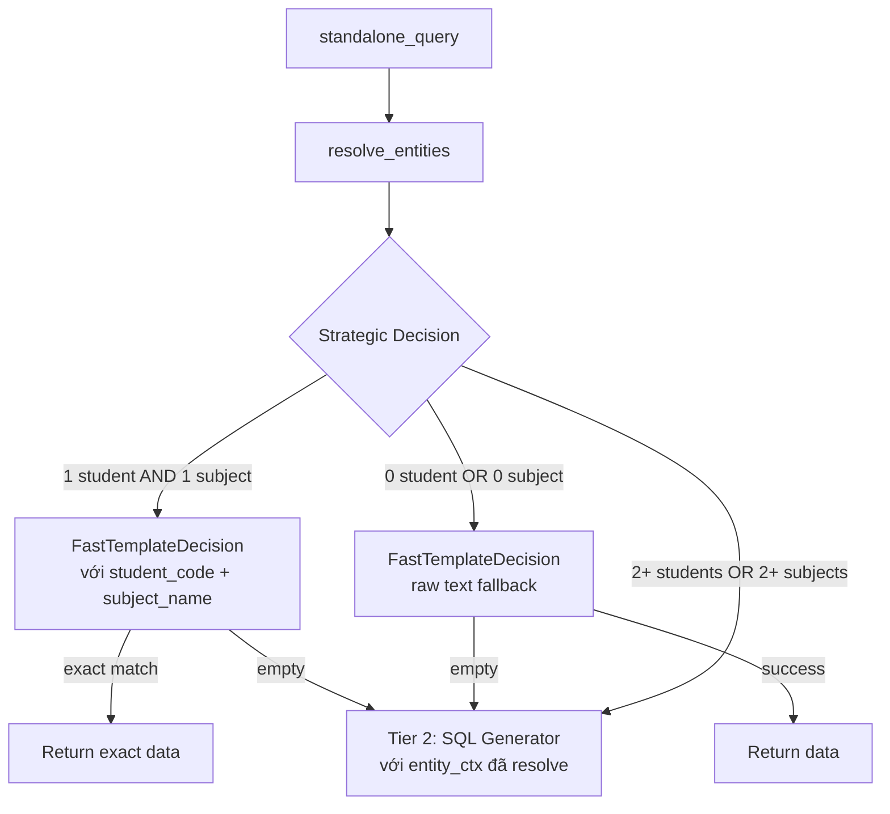
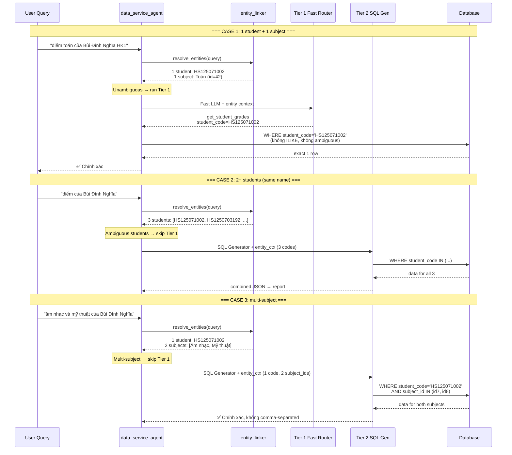

# Plan: Pre-Resolve Entity Linker trước Tier 1 Fast Router

> **Systemic Root Cause**: Tier 1 Fast Router bypasses `entity_linker.resolve_entities()`. Khi Fast LLM trích xuất `extracted_param` dạng **raw text** (tên học sinh), tool `get_student_grades` dùng `ILIKE` → match **nhiều students cùng tên** → dữ liệu sai / supervisor loop.

---

## 1. Kiến trúc hiện tại (sai)



**Vấn đề**: Tier 1 dùng raw text (name). Tool dùng ILIKE → ambiguous. Tier 2 dùng entity_linker (exact codes) nhưng chỉ là fallback.

## 2. Kiến trúc mới (fix)



**Nguyên tắc**:
- `resolve_entities()` chạy **1 lần duy nhất**, share cho cả Tier 1 và Tier 2
- **Identifier Priority Rule**: Nếu entity_linker resolve được **chính xác 1 student** → Tier 1 dùng `student_code` (không ILIKE, không ambiguous)
- **Multi-subject detection**: Nếu entity_linker phát hiện **2+ explicit subjects** → skip Tier 1 vì Tier 2 xử lý multi-subject tốt hơn qua `entity_ctx.subjects` với exact subject_ids.
- **Fail-soft entity resolution**: `resolve_entities()` bọc trong try/except. Nếu fail/timeout → dùng `DynamicEntityContext()` rỗng, hệ thống vẫn hoạt động.
- **No LLM for-loop hack**: Không bắt LLM lặp từng môn. Multi-subject là responsibility của Tier 2, nơi có SQL Generator + exact IDs từ entity_linker.
- **0 student / 0 subject** → Tier 1 fallback xử lý raw text như cũ (query có thể là class_name, grade_level, không phải student/subject query)

---

## 3. Chi tiết thay đổi

### 3.1. [`src/agents/data_service_agent/node.py`](src/agents/data_service_agent/node.py) — REFACTOR CHÍNH

#### Thay đổi flow tại hàm `data_service_agent_node()`

**Before (current)**:
```python
# 1. Lấy query
standalone_query = state.get("standalone_query", query)
context_for_agent = standalone_query or query

# 2. Tầng 1: Fast LLM Router
llm_router = llm.bind_tools([FastTemplateDecision], tool_choice="FastTemplateDecision")
router_res = await llm_router.ainvoke([SystemMessage(...), HumanMessage(content=context_for_agent)])
# ... parse decision, gọi tool với raw extracted_param ...

# 3. Nếu Tier 1 rỗng → Tầng 2: resolve_entities + SQL Generator
entity_ctx = resolve_entities(context_for_agent, so_school_id)
# ...
```

**After**:
```python
# 1. Lấy query
standalone_query = state.get("standalone_query", query)
context_for_agent = standalone_query or query

# 2. Entity Resolution TRƯỚC TIÊN (share cho cả 2 tầng) — FAIL-SOFT
from src.services.entity_linker import resolve_entities, DynamicEntityContext
entity_ctx = DynamicEntityContext()  # fallback mặc định rỗng
try:
    entity_ctx = resolve_entities(context_for_agent, so_school_id)
except Exception as e:
    logger.warning(f"[data_service_agent] Entity linker failed-soft: {e} -> tiếp tục với context rỗng")

# 3. Strategic Decision: có nên chạy Tier 1 không?
student_code = None
skip_tier1 = False

# Identifier Priority Rule: nếu có exact 1 student_code → dùng cho Tier 1
if len(entity_ctx.students) == 1:
    student_code = entity_ctx.students[0]["code"]
    logger.info(f"[data_service_agent] Entity linker: 1 student resolved -> code={student_code}")
elif len(entity_ctx.students) > 1:
    codes = [s["code"] for s in entity_ctx.students]
    logger.info(f"[data_service_agent] Entity linker: {len(entity_ctx.students)} students ambiguous {codes} -> skip Tier 1")
    skip_tier1 = True

# Multi-subject detection:
# - entity_ctx.subjects chỉ chứa subjects từ subject_keywords (những gì user nói rõ)
# - Nếu user nói "Âm nhạc và Mỹ thuật" → subject_keywords=["Âm nhạc","Mỹ thuật"] → 2+ subjects → skip Tier 1
# - Nếu user nói "bảng điểm" → subject_keywords=[] → 0 subjects → không skip
n_subjects = len(entity_ctx.subjects)
if n_subjects >= 2:
    subject_names = [s["name"] for s in entity_ctx.subjects]
    logger.info(f"[data_service_agent] Entity linker: {n_subjects} explicit subjects {subject_names} -> skip Tier 1")
    skip_tier1 = True

# 4. Tầng 1: Fast LLM Router (chỉ chạy nếu không ambiguous)
if not skip_tier1:
    llm_router = llm.bind_tools([FastTemplateDecision], tool_choice="FastTemplateDecision")
    
    # Enrich prompt với resolved context (Identifier Priority Rule)
    tier1_context = context_for_agent
    if entity_ctx.formatted_prompt_context:
        tier1_context = f"{entity_ctx.formatted_prompt_context}\n\nYÊU CẦU: {context_for_agent}"
    
    router_res = await llm_router.ainvoke([
        SystemMessage(content=SYSTEM_PROMPT_TIER1),  # updated prompt
        HumanMessage(content=tier1_context)
    ])
    # ... parse decision (existing logic) ...
    
    if decision and decision.selected_tool != "NONE" and decision.extracted_param:
        # Tool invocation: Identifier Priority → dùng student_code nếu đã resolve
        # Chỉ get_student_grades được xử lý ở Tier 1 (single student + single subject)
        kwargs = {}
        if decision.selected_tool == "get_student_grades":
            kwargs["student_id"] = student_code or decision.extracted_param.strip()
        
        if decision.semester:
            kwargs["semester"] = decision.semester
        if decision.subject:
            kwargs["subject"] = decision.subject
        
        template_result = get_student_grades.invoke(kwargs)
        
        if template_result and not template_result.startswith("Không tìm thấy"):
            return {"messages": [AIMessage(content=f"Kết quả tra cứu dữ liệu:\n\n```json\n{template_result}\n```")]}

# 5. Tầng 2: Dynamic SQL Generator (chạy khi Tier 1 rỗng / ambiguous / lỗi / multi-subject)
# entity_ctx đã có sẵn từ bước 2 → KHÔNG resolve lại
combined_context = build_tier2_context(entity_ctx, standalone_query, query)
exec_messages = [HumanMessage(content=combined_context)]
result = await agent_instance.ainvoke({"messages": exec_messages})
return {"messages": result["messages"]}
```

#### Thay đổi cụ thể trong code:

**A. Import `resolve_entities` lên đầu file** (thêm vào dòng 15-16):
```python
from src.agents.state import MultiAgentState
from src.observability import logger
from src.services.llm import get_llm
from src.services.entity_linker import resolve_entities  # ← THÊM DÒNG NÀY
```

**B. Thêm Strategic Decision block** (sau dòng `context_for_agent = ...`, trước Tầng 1):
```python
# Entity Resolution + Strategic Decision — FAIL-SOFT
from src.services.entity_linker import resolve_entities, DynamicEntityContext
entity_ctx = DynamicEntityContext()  # fallback rỗng nếu fail
try:
    entity_ctx = resolve_entities(context_for_agent, so_school_id)
except Exception as e:
    logger.warning(f"[data_service_agent] Entity linker failed-soft: {e}")

student_code = None
skip_tier1 = False

# Identifier Priority: 1 student → exact code; 2+ → ambiguous → skip
if len(entity_ctx.students) == 1:
    student_code = entity_ctx.students[0]["code"]
    logger.info(f"[data_service_agent] Entity linker: 1 student resolved -> code={student_code}")
elif len(entity_ctx.students) > 1:
    codes = [s["code"] for s in entity_ctx.students]
    logger.info(f"[data_service_agent] Entity linker: {len(entity_ctx.students)} students ambiguous {codes} -> skip Tier 1")
    skip_tier1 = True

# Multi-subject detection: 2+ explicit subjects → skip Tier 1
n_subjects = len(entity_ctx.subjects)
if n_subjects >= 2:
    subject_names = [s["name"] for s in entity_ctx.subjects]
    logger.info(f"[data_service_agent] Entity linker: {n_subjects} explicit subjects {subject_names} -> skip Tier 1")
    skip_tier1 = True
```

**C. Wrap Tầng 1 code trong `if not skip_tier1:`**:
```python
if not skip_tier1:
    # === [Tầng 1: Fast Router] ===
    llm = get_llm()
    llm_router = llm.bind_tools([FastTemplateDecision], tool_choice="FastTemplateDecision")
    
    # Enrich context với resolved entities
    tier1_context = context_for_agent
    if entity_ctx.formatted_prompt_context:
        tier1_context = f"{entity_ctx.formatted_prompt_context}\n\nYÊU CẦU HIỆN TẠI: {context_for_agent}"
    
    router_res = await llm_router.ainvoke([
        SystemMessage(content=(
            "Bạn là Fast Router Tầng 1. Nhiệm vụ của bạn là chọn đúng công cụ Fast Template hoặc chọn 'NONE'.\n"
            "QUY TẮC BẮT BUỘC:\n"
            "- Nếu câu hỏi tra cứu điểm 1 học sinh -> chọn 'get_student_grades'.\n"
            "- Nếu câu hỏi về SĨ SỐ, SO SÁNH, THỐNG KÊ, DANH SÁCH LỚP -> BẮT BUỘC CHỌN 'NONE'.\n"
            "- Identifier Priority Rule: Nếu đã có student_code chính xác trong phần THÔNG TIN DANH MỤC ở trên, "
            "hãy dùng student_code đó làm extracted_param (thay vì tên học sinh). Student_code luôn unique, tên có thể trùng.\n"
            "- Nếu câu hỏi đề cập rõ HỌC KỲ -> điền vào field 'semester'.\n"
            "- Nếu câu hỏi đề cập rõ MÔN HỌC -> điền vào field 'subject'."
        )),
        HumanMessage(content=tier1_context)
    ])

    # Rest of existing Tier 1 logic (parse decision, invoke tool)...
    decision = None
    if hasattr(router_res, "tool_calls") and router_res.tool_calls:
        try:
            tc = router_res.tool_calls[0]
            decision = FastTemplateDecision(**tc["args"])
        except Exception:
            decision = None

    if decision is None:
        text_c = getattr(router_res, "content", "") or ""
        j_match = re.search(r"\{.*\}", text_c, re.DOTALL)
        if j_match:
            try:
                data = json.loads(j_match.group(0))
                decision = FastTemplateDecision(
                    selected_tool=data.get("selected_tool", "NONE"),
                    extracted_param=data.get("extracted_param"),
                    semester=data.get("semester"),
                    subject=data.get("subject"),
                )
            except Exception:
                pass

    if decision:
        logger.info(f"[data_service_agent] Tầng 1: tool={decision.selected_tool}, param={decision.extracted_param}, semester={decision.semester}, subject={decision.subject}")

        if decision.selected_tool == "get_student_grades" and (decision.extracted_param or student_code):
            # Identifier Priority: dùng student_code nếu có
            kwargs = {"student_id": (student_code or decision.extracted_param.strip())}
            if decision.semester:
                kwargs["semester"] = decision.semester
            if decision.subject:
                kwargs["subject"] = decision.subject
            template_result = get_student_grades.invoke(kwargs)
        if template_result and not template_result.startswith("Không tìm thấy"):
            ai_msg = AIMessage(content=f"Kết quả tra cứu dữ liệu:\n\n```json\n{template_result}\n```")
            return {"messages": [ai_msg]}

        if decision.selected_tool != "NONE":
            logger.info("[data_service_agent] Tầng 1 trả về rỗng/không khớp -> Fallback sang Tầng 2.")
```

**D. Xóa `resolve_entities` thứ 2 ở Tier 2** (đoạn code dòng ~154-165 cũ):
```python
# XÓA toàn bộ đoạn này vì đã chạy ở đầu:
# from src.services.entity_linker import resolve_entities
# entity_ctx = resolve_entities(context_for_agent, so_school_id)

# Giữ nguyên code dùng entity_ctx để build messages (đã có entity_ctx từ trên)
```

**E. Tier 2 context giữ nguyên** nhưng dùng `entity_ctx` đã có từ bước 2:
```python
combined_context = f"[YÊU CẦU ĐỘC LẬP]: {standalone_query}"
if query and query != standalone_query:
    combined_context += f"\n[YÊU CẦU GỐC]: {query}"

if entity_ctx.formatted_prompt_context:
    exec_messages = [HumanMessage(content=f"{entity_ctx.formatted_prompt_context}\n\n{combined_context}")]
else:
    exec_messages = [HumanMessage(content=combined_context)]
```

### 3.2. Prompt Tier 1 cập nhật

**Thay đổi**: Chỉ giữ Identifier Priority Rule. **KHÔNG** có "one subject at a time" hack.

```python
SystemMessage(content=(
    "Bạn là Fast Router Tầng 1. Nhiệm vụ của bạn là chọn đúng công cụ Fast Template hoặc chọn 'NONE'.\n"
    "QUY TẮC BẮT BUỘC:\n"
    "- Nếu câu hỏi tra cứu điểm 1 học sinh -> chọn 'get_student_grades'.\n"
    "- Nếu câu hỏi về SĨ SỐ, SO SÁNH, THỐNG KÊ, DANH SÁCH LỚP -> BẮT BUỘC CHỌN 'NONE'.\n"
    "- Identifier Priority Rule: Nếu đã có student_code chính xác trong phần THÔNG TIN DANH MỤC ở trên, "
    "hãy dùng student_code đó làm extracted_param (thay vì tên học sinh). Student_code luôn unique, tên có thể trùng.\n"
    "- Nếu câu hỏi đề cập rõ HỌC KỲ -> điền vào field 'semester'.\n"
    "- Nếu câu hỏi đề cập rõ MÔN HỌC -> điền vào field 'subject'."
))
```

### 3.3. Multi-subject handling

**Vấn đề**: subject="Âm nhạc, Mỹ thuật" là comma-separated string → ILIKE không khớp.

**Giải pháp (systemic, không phải quick fix)**:
- `resolve_entities()` bóc tách "Âm nhạc" và "Mỹ thuật" thành 2 entries trong `entity_ctx.subjects`
- Strategic decision phát hiện `len(entity_ctx.subjects) > 1` → **skip Tier 1**, xuống Tier 2
- Tier 2 (SQL Generator) nhận `entity_ctx.subjects` với exact `subject_ids` → SQL dùng `WHERE subject_id IN (id1, id2)` → chính xác, không ILIKE, không comma-separated

Đây là cách xử lý **đúng kiến trúc**: không ép LLM làm for-loop, không parse comma-separated string thủ công, mà để entity_linker + SQL Generator xử lý multi-subject tự nhiên.

### 3.4. [`data_mock/generate_full_system_mock.py`](data_mock/generate_full_system_mock.py)

Giữ nguyên seed HK2 như đã plan trong [`plans/fix_fast_router_filters_and_mock_hk2.md`](plans/fix_fast_router_filters_and_mock_hk2.md):
- Nhân bản scored grades với `semester_index = 2`
- Nhân bản remark grades với `semester_index = 2`
- Dùng số liệu khác HK1 để phân biệt

---

## 4. Sequence Diagram: Luồng xử lý mới



---

## 5. Rủi ro và mitigation

| Rủi ro | Tác động | Mitigation |
|--------|----------|------------|
| `resolve_entities()` thêm ~0.5s | Latency tăng | Latency shared cho cả Tier 1 và Tier 2. Trước đây Tier 2 chạy resolve_entities riêng → **Net: ~0s thêm**. |
| Entity linker 0 student + 0 subject | Tier 1 fallback raw text | Đúng behavior. Query có thể là class_name, grade_level. |
| False positive (entity linker chọn sai student) | Tier 1 dùng sai student_code | Rất hiếm (pg_trgm threshold >= 0.60). Tier 1 fallback Tier 2 nếu rỗng. |
| **resolve_entities() fail/timeout** | **Node crash** | **Fail-soft**: try/except + `DynamicEntityContext()` rỗng. Hệ thống vẫn hoạt động, Tier 1 dùng raw text. |
| **Multi-subject hallucination** | Entity linker trả nhiều subjects cho query tổng quát | entity_ctx.subjects chỉ chứa subject_keywords từ slot extractor. Query "bảng điểm" → 0 keywords → 0 subjects → không skip. |

---

## 6. Eval test cases cần thêm

Thêm vào [`eval/eval_text_to_sql/eval_dataset.json`](eval/eval_text_to_sql/eval_dataset.json):

| TC ID | Query | Kỳ vọng |
|-------|-------|---------|
| TC_021 | điểm môn toán của Bùi Đình Nghĩa | Trả data cho TẤT CẢ học sinh tên "Bùi Đình Nghĩa" (hiện chỉ trả 1) |
| TC_022 | trình độ học tập môn âm nhạc và mỹ thuật của Bùi Đình Nghĩa học kỳ 1 | Trả data cho cả 2 môn, không bị comma-separated |
| TC_023 | học lực môn toán của em này (sau context) | Dùng student_code từ context, không bị ambiguous |

---

### 3.5. Tool Docstrings — Chỉ `get_student_grades` nhận Unique Identifier

**Vấn đề**: Tool docstring là prompt cho LLM tool-calling. Hiện tại docstring ghi "Mã HS hoặc Họ tên học sinh" → LLM router thoải mái truyền tên. SQL dùng ILIKE → match nhiều students.

**Nguyên tắc**: Fast Template Tầng 1 **CHỈ NHẬN UNIQUE IDENTIFIERS** cho `get_student_grades`. Các tool khác (`get_student_info`, `get_class_grades`) giữ nguyên — mở rộng sau.

**Phạm vi tối thiểu**: Chỉ sửa `get_student_grades` + `FastTemplateDecision.extracted_param` description.

**Thay đổi tại [`src/agents/data_service_agent/tools.py`](src/agents/data_service_agent/tools.py)**:

#### A. `get_student_grades(student_id: str, ...)` → đổi thành `get_student_grades(student_code: str, ...)`

```python
@tool
def get_student_grades(student_code: str, year: int | None = None, semester: int | None = None, subject: str | None = None) -> str:
    """Tra cứu điểm số và kết quả đánh giá của một học sinh theo Mã học sinh.

    Args:
        student_code: Mã học sinh duy nhất (bắt buộc). Ví dụ: 'HS125071002'.
                      CHỈ nhập Mã học sinh. TUYỆT ĐỐI KHÔNG nhập tên học sinh.
                      Nếu chỉ có tên mà không có mã, hãy chọn 'NONE'.
        year: ID năm học (ví dụ: 2025).
        semester: Học kỳ (tùy chọn: 1 hoặc 2).
        subject: Tên môn học (tùy chọn: 'Toán học', 'Ngữ văn', 'Âm nhạc', 'Mỹ thuật').

    Returns:
        Chuỗi JSON chứa danh sách điểm số và kết quả đánh giá chi tiết của học sinh.
    """
```

Và sửa SQL:
```python
WHERE g.so_school_id = :sid AND g.student_code = :scode
```
(bỏ branch `OR st.student_name ILIKE :scode_like`)

#### B. FastTemplateDecision — field `extracted_param` description

```python
extracted_param: str | None = Field(
    default=None,
    description=(
        "Chỉ nhập Mã học sinh (vd 'HS125071002'). "
        "TUYỆT ĐỐI KHÔNG nhập tên học sinh. "
        "Nếu câu hỏi không chứa mã số cụ thể, hãy chọn 'NONE' để chuyển sang Dynamic SQL Generator."
    )
)
```

---

## 7. Tóm tắt thay đổi

| File | Thay đổi | Vị trí |
|------|----------|--------|
| `src/agents/data_service_agent/node.py` | Thêm import `resolve_entities`, `DynamicEntityContext` | Đầu file |
| `src/agents/data_service_agent/node.py` | Thêm Strategic Decision block: entity resolution + skip logic (fail-soft) | Sau `context_for_agent`, trước Tầng 1 |
| `src/agents/data_service_agent/node.py` | Wrap Tầng 1 trong `if not skip_tier1:` | Toàn bộ Tầng 1 |
| `src/agents/data_service_agent/node.py` | Update prompt Tier 1: Identifier Priority Rule | SystemMessage của Tầng 1 |
| `src/agents/data_service_agent/node.py` | Tool invocation: dùng `student_code` nếu đã resolve | `get_student_grades` |
| `src/agents/data_service_agent/node.py` | Xóa `resolve_entities` thứ 2 ở Tier 2 | Đoạn ~154-165 cũ |
| `src/agents/data_service_agent/tools.py` | `get_student_grades`: đổi `student_id` → `student_code`, fix docstring, bỏ ILIKE | Hàm `get_student_grades` |
| `src/agents/data_service_agent/node.py` | FastTemplateDecision.extracted_param: description strict chỉ nhận mã HS | Field definition |
| `data_mock/generate_full_system_mock.py` | Seed HK2 data | Như plan riêng |
