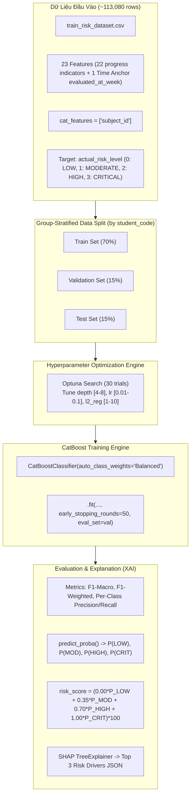

# Plan: Huấn Luyện & Triển Khai Mô Hình CatBoost EWS Risk Prediction (v2.0 Revised)

> **Mục tiêu:** Thiết kế, tối ưu hóa (Optuna Tuning) và huấn luyện mô hình **CatBoost Multiclass Classifier** trên dữ liệu `data_mock/mock_train_data/train_risk_dataset.csv` (~113,080 bản ghi, 23 Features) để dự báo 4 mức rủi ro (`LOW`, `MODERATE`, `HIGH`, `CRITICAL`), tính dải điểm `risk_score` chuẩn hóa [0.0, 100.0] và xuất giải thích SHAP Values (Top 3 Risk Drivers).

---

## I. KIẾN TRÚC TỔNG THỂ HUẤN LUYỆN CATBOOST EWS

---

## II. CHI TIẾT KỸ THUẬT & THAM SỐ HUẤN LUYỆN

### 1. Phân chia Dataset (GroupShuffleSplit by `student_code`)
- **Phương pháp Split:** Sử dụng `GroupShuffleSplit` (từ `sklearn.model_selection`) để phân chia độc lập theo nhóm học sinh (`student_code`). Đảm bảo 100% học sinh ở tập Train không bao giờ xuất hiện ở tập Validation hay Test, chống hoàn toàn rò rỉ dữ liệu (Data Leakage).
- **Tỷ lệ:** Train 70%, Validation 15%, Test 15%.

### 2. Danh Sách 22 Feature Columns Chính Thức (`FEATURE_COLS`)
- Loại bỏ `student_code` (ID), `school_year_id` (hằng số), `evaluated_at_week`, `semester_index` và các cột Ground Truth (`actual_final_grade`, `actual_risk_level`, `is_at_risk`).
- **Danh sách 22 Features Vector ($X$):**
  1. `subject_id` (Categorical)
  2. `grade_level` (Categorical / Integer: 6, 7, 8, 9, 10, 11, 12)
  3. `subject_category` (Categorical: `MATH_SCIENCE`, `HUMANITIES`, `TECHNOLOGY`, `ARTS_PE`)
  4. `weighted_early_avg`, 5. `weighted_late_avg`, 6. `score_slope`, 7. `score_volatility`, 8. `max_drop`, 9. `last_score`, 10. `max_coefficient_so_far`, 11. `high_weight_score_count`, 12. `last_high_weight_score`
  13. `lms_avg_score`, 14. `lms_recent_drop`, 15. `lms_submission_rate`, 16. `lms_recent_submission_rate`, 17. `lms_gradebook_gap`
  18. `daily_absence_rate`, 19. `unexcused_absent_rate`, 20. `excused_absent_days`, 21. `total_late_count`
  22. `total_demerit_points` (kèm `repeat_offense_count`, `severe_sanction_count`).

### 3. Xử lý Categorical Features & Class Imbalance
- **Categorical Features:** `cat_features = ['subject_id', 'subject_category', 'grade_level']`.
- **Class Imbalance:** Sử dụng `auto_class_weights='Balanced'` để khắc phục tình trạng lệch lớp (LOW 61.2%, CRITICAL 7.4%), đảm bảo mô hình nhạy bén với lớp CRITICAL/HIGH.

### 4. Công thức Risk Score Chuẩn Hóa [0.00, 100.00]
Hệ số lớp `LOW` được gán bằng $0.00$ để đảm bảo học sinh an toàn 100% có điểm rủi ro bằng $0.00$:

$$\text{risk\_score} = \text{round}\Big(\big(0.00 \times P(\text{LOW}) + 0.35 \times P(\text{MODERATE}) + 0.70 \times P(\text{HIGH}) + 1.00 \times P(\text{CRITICAL})\big) \times 100, 2\Big)$$

---

## III. WORKFLOW THỰC THI (TRAINING PIPELINE)

1. **Script Train chính:** Tạo file `src/models/gbdt/train_catboost_ews.py`.
2. **Load & Preprocess Data:** Đọc `train_risk_dataset.csv`, mã hóa target nhãn ordinal (0: LOW, 1: MODERATE, 2: HIGH, 3: CRITICAL), khai báo 23 Features (gồm `evaluated_at_week`).
3. **Hyperparameter Tuning (Optuna):** Chạy 50 trials tìm tham số tối ưu (`depth` [4-8], `learning_rate` [0.01-0.1], `l2_leaf_reg` [1-10], `subsample` [0.6-1.0]).
4. **Execute Training:** Huấn luyện CatBoost với `.fit(X_train, y_train, eval_set=(X_val, y_val), early_stopping_rounds=50)`.
5. **Evaluate Model:** Đánh giá Accuracy, F1-Macro, F1-Weighted, Per-Class Precision & Recall, Confusion Matrix trên Test set.
6. **SHAP Explanation:** Sử dụng `shap.TreeExplainer` trích xuất Top 3 tính chất ảnh hưởng rủi ro nhất cho từng bản ghi.
7. **Export Artifacts:**
   - Save model binary: `src/models/gbdt/saved/catboost_ews_model.cbm`
   - Save metrics report: `src/models/gbdt/saved/catboost_evaluation_report.json`
   - Save SHAP summary: `src/models/gbdt/saved/shap_feature_importance.json`
