# Senior Review: `plan_catboost_ews_model.md` — v2.0 ✅ Approved (3 minor notes)

> **Tác giả:** Senior Technical Review  
> **Trạng thái:** ✅ **Approved** — 7/7 lỗi đã được fix trong v2.0

---

## I. XÁC NHẬN: 7 LỖI CŨ ĐÃ FIX

| # | Lỗi cũ (v1.0) | Mức | Trạng thái v2.0 | Dòng |
|---|---------------|-----|-----------------|------|
| 1 | `early_stopping_rounds` không phải CatBoost param | 🔴 | ✅ Đã chuyển xuống `.fit()` — CatBoost hỗ trợ từ v0.24+ | 30, 70 |
| 2 | Risk Score range [10, 100] | 🔴 | ✅ Đã đổi `0.00 × P(LOW)` → range [0, 100] | 61 |
| 3 | Không xử lý class imbalance | 🟡 | ✅ `auto_class_weights='Balanced'` | 56 |
| 4 | SHAP missing trong pipeline | 🟡 | ✅ Thêm workflow step 6 + artifacts | 72, 76 |
| 5 | Không có Hyperparameter Tuning | 🟡 | ✅ Optuna 30 trials | 69 |
| 6 | `evaluated_at_week` ambiguous | 🔵 | ✅ 23 Features (22 + Time Anchor) | 13, 68 |
| 7 | `cat_features` thiếu | 🔵 | ✅ `cat_features = ['subject_id']` | 55 |

---

## II. 3 MINOR NOTES (không blocking, đề xuất cho implementation)

### Note 1: `GroupKFold` → `GroupShuffleSplit` cho single split

**Dòng 51:** `GroupKFold` dùng cho k-fold cross-validation, không phải single train/val/test split.

```python
# Hiện tại (dòng 51):
# "Tách theo nhóm học sinh (student_code) bằng GroupKFold / Group Split"

# Đề xuất khi implement:
from sklearn.model_selection import GroupShuffleSplit

gss = GroupShuffleSplit(n_splits=1, train_size=0.7, test_size=0.3, random_state=42)
train_idx, temp_idx = next(gss.split(X, y, groups=student_codes))

# Split temp thành val(50%) + test(50%) → 15% + 15%
gss2 = GroupShuffleSplit(n_splits=1, train_size=0.5, test_size=0.5, random_state=42)
val_idx, test_idx = next(gss2.split(X.iloc[temp_idx], y.iloc[temp_idx], groups=student_codes[temp_idx]))
```

### Note 2: Cần loại `student_code` và `school_year_id` khỏi features

Dữ liệu có 29 columns, khi tách X và y cần:

```python
FEATURE_COLS = [
    'evaluated_at_week',           # Time Anchor
    'weighted_early_avg',          # Temporal (9)
    'weighted_late_avg',
    'score_slope', 'score_volatility', 'max_drop', 'last_score',
    'max_coefficient_so_far', 'high_weight_score_count', 'last_high_weight_score',
    'lms_avg_score', 'lms_recent_drop',                     # LMS (5)
    'lms_submission_rate', 'lms_recent_submission_rate', 'lms_gradebook_gap',
    'daily_absence_rate', 'unexcused_absent_rate',          # Attendance (4)
    'excused_absent_days', 'total_late_count',
    'total_demerit_points', 'repeat_offense_count',         # Behavior (3)
    'severe_sanction_count',
]

# ❌ KHÔNG đưa vào feature:
# - student_code (unique identifier → overfitting)
# - school_year_id (chỉ có 2025 trong mock data)
# - semester_index (có thể fine, nhưng evaluated_at_week đã hàm ý semester)
# - actual_final_grade, actual_risk_level, is_at_risk (ground truth)
```

### Note 3: Optuna 30 trials — nên tăng lên 50-100

30 trials cho 3 hyperparameters (depth, lr, l2_leaf_reg) với không gian:
- `depth`: 5 discrete values [4,5,6,7,8]
- `learning_rate`: continuous range [0.01, 0.1]
- `l2_leaf_reg`: continuous range [1, 10]

30 trials chỉ explore được ~30% không gian. Ok cho v1, nhưng nên note có thể tăng.

---

## III. KẾT LUẬN

**✅ Plan v2.0 đã đáp ứng đủ các tiêu chuẩn để chuyển sang Code mode.**

Tóm tắt kiến trúc cuối cùng:

```mermaid
flowchart LR
    subgraph INPUT["Input"]
        CSV["train_risk_dataset.csv<br/>113,080 rows"]
    end
    subgraph PREP["Prep"]
        F["23 Features<br/>(loại student_code,<br/>school_year_id)"]
        Y["Target: actual_risk_level<br/>mapped to 0/1/2/3"]
        CAT2["cat_features: subject_id<br/>auto_class_weights: Balanced"]
    end
    subgraph SPLIT2["Split"]
        GSS["GroupShuffleSplit<br/>by student_code<br/>70/15/15"]
    end
    subgraph OPT2["Tuning"]
        OPT2A["Optuna 30 trials<br/>depth, lr, l2_leaf_reg"]
    end
    subgraph CB2["Training"]
        CB2A["CatBoostClassifier"]
        CB2B[".fit early_stopping_rounds=50"]
    end
    subgraph EVAL2["Eval"]
        E1["F1-Macro / Weighted"]
        E2["Precision/Recall per class"]
        E3["SHAP TreeExplainer"]
    end
    subgraph OUT2["Export"]
        O1["model.cbm"]
        O2["evaluation_report.json"]
        O3["shap_feature_importance.json"]
    end
    INPUT --> PREP --> SPLIT2 --> OPT2 --> CB2 --> EVAL2 --> OUT2
```


