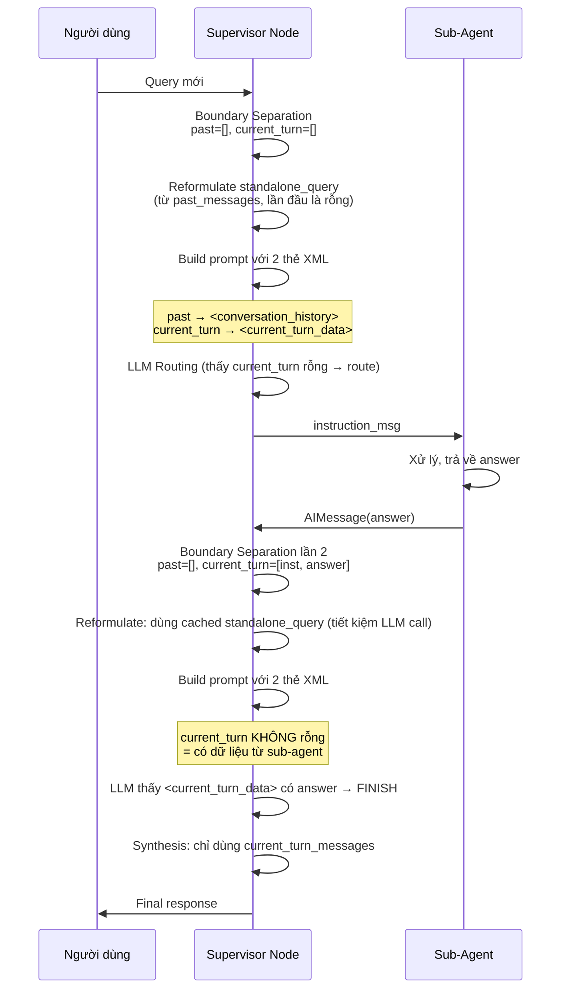

# Plan: Hybrid Boundary Separation Refactor — `supervisor_node`

## 1. Vấn Đề Hiện Tại

Hiện tại, `supervisor_node` dùng **1 thẻ XML duy nhất** `<conversation_history_FOR_REFERENCE_ONLY>` chứa **cả quá khứ lẫn dữ liệu turn hiện tại**, khiến model không phân biệt được đâu là dữ liệu cũ cần tham khảo, đâu là dữ liệu vừa thu thập để đánh giá "đã đủ chưa".

Hậu quả:
- Dòng 79 prompt: *"CHỈ ĐƯỢC SỬ DỤNG KHI câu hỏi hiện tại thiếu thành phần câu"* → model bỏ qua toàn bộ history, kể cả dữ liệu sub-agent vừa trả về
- Supervisor route lại sub-agent dù đã có answer → loop vô ích
- `_reformulate_standalone_query` nhận cả dữ liệu điểm số → nhiễu

---

## 2. Giải Pháp: Hybrid Boundary Separation

### Nguyên Lý

```text
messages_list = [HumanMessage(Q1), AIMessage(A1), HumanMessage(Q2), AIMessage(inst1), AIMessage(answer1)]
                                                   ^
                                                   |
                                            last_human_idx (Q2)
                    ┌──────────────────────────────┴──────────────────────────────┐
                    │                                                             │
            past_messages                                                current_turn_messages
            [HumanMessage(Q1), AIMessage(A1)]                          [AIMessage(inst1), AIMessage(answer1)]
                    │                                                             │
                    ▼                                                             ▼
      <conversation_history_FOR_REFERENCE_ONLY>                    <current_turn_collected_data>
      (dùng cho reformulate khi query thiếu                       (scratchpad: đánh giá đã đủ chưa?)
       thông tin, tham khảo chủ đề cũ)
```

### Chi Tiết Các Thay Đổi

### 2.1. Thêm Helper Functions (đầu file, sau imports)

```python
def _find_last_human_idx(messages_list: list) -> int:
    """Tìm index của HumanMessage cuối cùng trong messages_list."""
    for idx in range(len(messages_list) - 1, -1, -1):
        msg = messages_list[idx]
        # Check type, class, dict format
        if getattr(msg, "type", None) == "human" or msg.__class__.__name__ in ("HumanMessage", "HumanMessageChunk"):
            return idx
        if isinstance(msg, dict) and (msg.get("type") == "human" or msg.get("role") in ("user", "human")):
            return idx
        if getattr(msg, "role", None) in ("user", "human"):
            return idx
    return -1


def _is_non_supervisor_ai_message(msg) -> bool:
    """Check if message is from a sub-agent (not supervisor instruction)."""
    is_ai = (
        getattr(msg, "type", None) == "ai"
        or msg.__class__.__name__ in ("AIMessage", "AIMessageChunk")
        or (isinstance(msg, dict) and (msg.get("type") == "ai" or msg.get("role") in ("assistant", "ai")))
    )
    if not is_ai:
        return False
    content = str(getattr(msg, "content", "") or "")
    if "Chuyển yêu cầu sang" in content or "[Supervisor]:" in content:
        return False
    return True


def _collect_current_turn_answers(current_turn_messages: list) -> list[str]:
    """Lấy tất cả sub-agent responses từ current_turn_messages."""
    answers = []
    for msg in current_turn_messages:
        if _is_non_supervisor_ai_message(msg):
            content = str(getattr(msg, "content", "") or "").strip()
            if content:
                answers.append(content)
    return answers
```

### 2.2. Refactor `supervisor_node` — Boundary Separation

**THAY THẾ** đoạn code từ dòng 209-263 (từ `messages_list = state.get(...)` đến `messages = [SystemMessage(...), ...]`)

**Code mới:**

```python
    # ── Bước 1: Lấy messages và query ──
    messages_list = state.get("messages", [])
    query = state.get("query", "")

    # Khởi tạo tin nhắn đầu tiên nếu lịch sử rỗng
    has_initial_message = len(messages_list) > 0
    if not has_initial_message and query:
        messages_list = [HumanMessage(content=query)]

    # ── Bước 2: Boundary Separation ──
    last_human_idx = _find_last_human_idx(messages_list)
    if last_human_idx > 0:
        past_messages = messages_list[:last_human_idx]
    else:
        past_messages = []
    if last_human_idx != -1:
        current_turn_messages = messages_list[last_human_idx + 1:]
    else:
        current_turn_messages = []

    # ── Bước 3: Standalone Query với Caching ──
    # Cache trong state: nếu đã reformulate từ lần trước trong cùng turn → reuse
    standalone_query = state.get("standalone_query")
    if not standalone_query:
        # CHỈ dùng past_messages để reformulate (tránh nhiễu từ current_turn_data)
        standalone_query = await _reformulate_standalone_query(past_messages, query)
        logger.info("supervisor_standalone_query", original=query, standalone=standalone_query)
    else:
        logger.info("supervisor_standalone_query_cached", standalone=standalone_query)

    # ── Bước 4: Lấy thông tin năm học/học kỳ ──
    current_year_str = "2025-2026"
    current_semester_str = "HK2"
    try:
        from src.db.session import SessionLocal
        from sqlalchemy import text
        with SessionLocal() as db_session:
            row = db_session.execute(text("""
                SELECT fullname FROM s360.dim_school_year ORDER BY id DESC LIMIT 1
            """)).first()
            if row and row[0]:
                current_year_str = row[0]
    except Exception as e:
        logger.warning(f"Note: using default academic year context ({current_year_str}): {e}")

    # ── Bước 5: Build System Prompt với 2 thẻ XML riêng biệt ──
    system_prompt = SUPERVISOR_PROMPT + (
        f"\n\nTHÔNG TIN NGỮ CẢNH HỆ THỐNG HIỆN TẠI:\n"
        f"- Niên khóa hiện tại: {current_year_str}\n"
        f"- Học kỳ hiện tại: {current_semester_str}\n"
        f"- Câu hỏi hiện tại (sau reformulate): {standalone_query}\n"
        f"Nếu người dùng hỏi về điểm số, báo cáo, hay đề thi của học kỳ hiện tại hoặc không chỉ định rõ niên khóa/năm học, "
        f"hãy tự động sử dụng thông tin niên khóa và học kỳ hiện tại này làm mặc định để phân tích/lập báo cáo."
    )

    # Thẻ 1: Lịch sử quá khứ (CHỈ dùng khi query thiếu thông tin)
    if past_messages:
        past_text = _messages_to_text(past_messages)
        system_prompt += (
            f"\n\n<conversation_history_FOR_REFERENCE_ONLY>\n"
            f"{past_text}\n"
            f"</conversation_history_FOR_REFERENCE_ONLY>"
        )

    # Thẻ 2: Dữ liệu lượt hiện tại (SCRATCHPAD — đánh giá đã đủ chưa)
    if current_turn_messages:
        scratchpad_text = _messages_to_text(current_turn_messages)
        system_prompt += (
            f"\n\n<current_turn_collected_data>\n"
            f"{scratchpad_text}\n"
            f"</current_turn_collected_data>\n\n"
            f"📋 HƯỚNG DẪN ĐÁNH GIÁ <current_turn_collected_data>:\n"
            f"- Đây là dữ liệu MỚI NHẤT mà các Sub-Agent vừa thu thập được trong lượt xử lý HIỆN TẠI.\n"
            f"- Hãy kiểm tra: dữ liệu trong thẻ này đã ĐỦ để trả lời câu hỏi gốc của người dùng chưa?\n"
            f"  * Nếu ĐỦ (có số liệu, bảng kết quả, câu trả lời cụ thể) → chọn FINISH.\n"
            f"  * Nếu CHƯA ĐỦ (chỉ có instruction của Supervisor, không có kết quả thực tế) → "
            f"tiếp tục định tuyến đến Sub-Agent phù hợp.\n"
            f"- QUAN TRỌNG: Tuyệt đối KHÔNG gọi lại Sub-Agent nếu trong <current_turn_collected_data> "
            f"đã có kết quả trả về. Điều này gây lặp vô ích và tăng latency."
        )

    # Tách user query sang HumanMessage riêng
    user_message = HumanMessage(
        content=f"<current_user_query>\n{standalone_query}\n</current_user_query>"
    )

    messages = [SystemMessage(content=system_prompt), user_message]
```

### 2.3. Sửa `SUPERVISOR_PROMPT` — Gỡ bỏ "Ignore History" Rule

**THAY THẾ** dòng 77-80 (🔴 QUY TẮC PHÂN BIỆT CHỦ ĐỀ) bằng:

```text
🔴 QUY TẮC PHÂN BIỆT CHỦ ĐỀ (TOPIC BOUNDARY RULE):
1. <current_user_query>: Chứa câu hỏi HIỆN TẠI của người dùng (đã reformulate). Đây là ưu tiên cao nhất để quyết định routing.
2. <conversation_history_FOR_REFERENCE_ONLY>: Chứa lịch sử các lượt hội thoại TRƯỚC đây (các câu hỏi - câu trả lời cũ).
   - Chỉ dùng thẻ này khi câu hỏi hiện tại thiếu thành phần (ẩn chủ ngữ, đại từ chỉ định: "bạn ấy", "em đó").
   - Nếu câu hỏi hiện tại là một câu hỏi hoàn chỉnh về đối tượng mới → BỎ QUA thẻ này.
3. <current_turn_collected_data>: Chứa dữ liệu các Sub-Agent vừa thu thập được trong lượt xử lý HIỆN TẠI.
   - Đây là thẻ QUAN TRỌNG NHẤT để quyết định FINISH hay route tiếp.
   - Nếu trong thẻ này đã có kết quả dữ liệu từ Sub-Agent → BẮT BUỘC chọn FINISH.
   - Nếu thẻ này CHỈ chứa instruction của Supervisor (chưa có kết quả) → route tiếp Sub-Agent.
```

### 2.4. Sửa `_reformulate_standalone_query` — Nhận `past_messages` thay vì `messages_list`

**Đổi chữ ký hàm:**
```python
async def _reformulate_standalone_query(
    past_messages: list,
    current_query: str,
) -> str:
```

**Sửa logic Turn 1 detection** (dòng 122):
```python
    # Turn 1: không có past messages → return ngay
    if not past_messages:
        return current_query
```

**Sửa `_build_recent_context` call** (dòng 126):
```python
    recent_history = _build_recent_context(past_messages, max_turns=2)
```

### 2.5. Sửa Synthesis Section — Dùng `current_turn_messages` từ Boundary Separation

**THAY THẾ** toàn bộ block FINISH synthesis (dòng 415-562) để dùng `current_turn_messages` đã có từ Bước 2, thay vì phải tìm lại `last_human_index` và `current_turn_messages`.

Code hiện tại (dòng 415-432) tự tìm `last_human_index` và `current_turn_messages` lần nữa — việc này đã làm ở Bước 2. **Cần refactor** để dùng biến có sẵn.

```python
    if decision.next_agent == "FINISH":
        # Dùng current_turn_messages đã có từ Boundary Separation (Bước 2)
        # Không cần tìm last_human_index lại
        
        # Check if a report file was generated
        has_file = any("/reports/download/" in str(getattr(m, "content", "") or "") for m in current_turn_messages)
        
        # Collect sub-agent responses
        sub_agent_responses = _collect_current_turn_answers(current_turn_messages)
        
        # ... (phần còn lại giữ nguyên, chỉ thay thế biến current_turn_messages)
```

### 2.6. Sửa Anti-Loop Guardrail — Dùng `current_turn_messages` có sẵn

**THAY THẾ** dòng 367-396 (tìm `last_human_idx` và `current_turn_msgs` lần nữa) bằng:

```python
    # ── Anti-Loop Guardrail ──
    # current_turn_messages đã có từ Boundary Separation (Bước 2)
    previous_instructions = set()
    for msg in current_turn_messages:
        content_str = str(getattr(msg, "content", "") or "")
        if "Chuyển yêu cầu sang" in content_str or "Instruction:" in content_str:
            norm_c = re.sub(r"\s+", " ", content_str.lower().strip())
            previous_instructions.add(norm_c)

    curr_inst_norm = re.sub(r"\s+", " ", (decision.instruction or "").lower().strip())

    is_duplicate_instruction = any(curr_inst_norm in prev_inst or prev_inst in curr_inst_norm for prev_inst in previous_instructions)
    
    # Stronger guardrail: cũng check nếu đã có sub-agent answer
    has_sub_answer = bool(_collect_current_turn_answers(current_turn_messages))

    if (is_duplicate_instruction or has_sub_answer) and decision.next_agent != "FINISH":
        logger.info(
            "supervisor_anti_loop",
            msg=f"Forcing FINISH. duplicate_inst={is_duplicate_instruction}, has_answer={has_sub_answer}",
        )
        decision.next_agent = "FINISH"
```

### 2.7. Cập nhật `updates` — Cache `standalone_query` trong state

**SỬA** dòng 398:
```python
    updates = {
        "next_agent": decision.next_agent,
        "standalone_query": standalone_query,  # Cache để lần sau reuse
    }
```

---

## 3. Tổng Quan File Thay Đổi

| Khu vực | Dòng hiện tại | Thay đổi |
|---------|---------------|----------|
| Helper functions | (chưa có) | **Thêm mới** 3 hàm: `_find_last_human_idx`, `_is_non_supervisor_ai_message`, `_collect_current_turn_answers` |
| `SUPERVISOR_PROMPT` | 77-80 | **Sửa** TOPIC BOUNDARY RULE: thêm rule cho `<current_turn_collected_data>`, bỏ "ignore history" |
| `_reformulate_standalone_query` | 110-164 | **Sửa** tham số: `past_messages` thay vì `messages_list` |
| `supervisor_node`: Boundary Separation | 209-263 | **Thay thế** toàn bộ: thêm step 2, 3, 5 |
| `supervisor_node`: Anti-Loop Guardrail | 367-396 | **Sửa** dùng `current_turn_messages` có sẵn + `has_sub_answer` check |
| `supervisor_node`: FINISH synthesis | 415-432 | **Sửa** dùng `current_turn_messages` có sẵn |
| `supervisor_node`: updates | 398 | **Sửa** cache `standalone_query` |

---

## 4. Flow Sau Khi Refactor



---

## 5. Rủi Ro & Mitigation

| Rủi ro | Mitigation |
|--------|------------|
| `past_messages` bị empty ở turn 2 (nếu chỉ có 1 human message) | OK vì reformulate có cache → không gọi LLM lại |
| `<current_turn_collected_data>` quá dài (nhiều tool call response) | `_messages_to_text` filter tool messages (dòng 189: `"tool": "Công cụ"`) → giảm noise |
| Model vẫn ignore `<current_turn_collected_data>` | Anti-Loop Guardrail vẫn giữ `has_sub_answer` check làm safety net |
