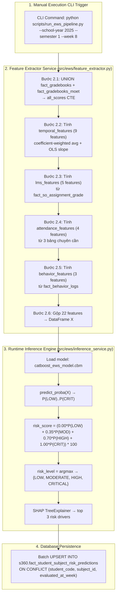

# Plan: Tích Hợp Mô Hình CatBoost EWS Vào Hệ Thống TTS_SRA (`plan_ews_model_integration.md`)

> **Mục tiêu:** Xây dựng Pipeline suy luận Runtime (Inference Pipeline), kết nối mô hình CatBoost đã train (`catboost_ews_model.cbm`) với cơ sở dữ liệu thô PostgreSQL schema `s360`, lưu trữ kết quả vào bảng `s360.fact_student_subject_risk_predictions`, và phục vụ cho Text-to-SQL Agent cùng Dashboard UI.

> **Nguồn tham khảo:**
> - Feature SQL & công thức: `plans/risk_alert/plan_1_v3_senior_review.md` (Section IV)
> - Mock data ground truth: `plans/risk_alert/plan_score_focused_dataset_generator.md`
> - Model training: `src/models/gbdt/train_catboost_ews.py`
> - Schema DB: `docs_vsf/schemas/merged/score_focused_schema.sql`

---

## I. TỔNG QUAN KIẾN TRÚC TÍCH HỢP HỆ THỐNG



---

## II. CHI TIẾT TỪNG MODULE TRONG THƯ MỤC `src/ews/`

### 2.1. Feature Extractor Service (`src/ews/feature_extractor.py`)

Hàm chính:
```python
def extract_live_features(
    session: Session,
    school_year_id: int,
    semester_index: int,
    evaluated_at_week: int,
    cutoff_date: date,
) -> pd.DataFrame:
    """
    Chạy SQL query trên DB s360, trả về DataFrame 22 features
    cho tất cả (student_code, subject_id) tại checkpoint.
    """
```

#### 2.1.1. Temporal Scores (9 features) — UNION `fact_gradebooks` + `fact_gradebooks_moet`

**Nguồn bảng:** `fact_gradebooks` + `dim_exam.coefficient` UNION ALL `fact_gradebooks_moet` + `dim_exam_moet.coefficient`

**Công thức từng feature:**

| # | Feature | Công thức | Ghi chú |
|---|---------|-----------|---------|
| 1 | `weighted_early_avg` | Σ(score × coeff) / Σ(coeff) cho bài trước median week | ✅ Dùng coefficient |
| 2 | `weighted_late_avg` | Σ(score × coeff) / Σ(coeff) cho bài sau median week | ✅ Dùng coefficient |
| 3 | `score_slope` | COVAR_POP(week_float, score) / VAR_POP(week_float) | ❌ KHÔNG dùng coefficient |
| 4 | `score_volatility` | STDDEV_POP(score) | ❌ KHÔNG dùng coefficient |
| 5 | `max_drop` | MAX(LAG(score) - score) với drop > 0 | ❌ KHÔNG dùng coefficient |
| 6 | `last_score` | score của bài kiểm tra gần nhất (theo created_at) | - |
| 7 | `max_coefficient_so_far` | MAX(coefficient) đến cutoff | - |
| 8 | `high_weight_score_count` | COUNT(*) WHERE coefficient >= 2.0 | - |
| 9 | `last_high_weight_score` | score của bài hệ số >= 2.0 gần nhất | - |

**SQL đầy đủ:**

```sql
WITH all_scores AS (
    -- NGUỒN 1: fact_gradebooks (Cambridge/IB/Honor)
    SELECT
        fg.student_code,
        fg.subject_id,
        fg.semester_index,
        fg.final_grade,
        de.coefficient,
        de.exam_code AS exam_type,
        fg.created_at,
        fg.school_year_id,
        'SCHOOL_ONLINE' AS source_system
    FROM s360.fact_gradebooks fg
    JOIN s360.dim_exam de ON fg.so_exam_id = de.id
    WHERE fg.is_locked = 1
        AND fg.school_year_id = @school_year_id

    UNION ALL

    -- NGUỒN 1b: fact_gradebooks_moet (Bộ GD)
    SELECT
        fgm.student_code,
        fgm.subject_id,
        fgm.semester_index,
        fgm.final_grade,
        dem.coefficient,
        dem.gradebook_type_items_code AS exam_type,
        fgm.created_at,
        fgm.school_year_id,
        'MOET_APP' AS source_system
    FROM s360.fact_gradebooks_moet fgm
    JOIN s360.dim_exam_moet dem ON fgm.gradebook_type_item_id = dem.gradebook_type_item_id
    WHERE fgm.is_locked = 1
        AND fgm.school_year_id = @school_year_id
),
score_series AS (
    SELECT
        s.*,
        -- Tính week_float từ start_date của năm học
        EXTRACT(EPOCH FROM (s.created_at - sy.start_date)) / 86400 / 7 AS week_float,
        ROW_NUMBER() OVER (
            PARTITION BY s.student_code, s.subject_id, s.semester_index
            ORDER BY s.created_at
        ) AS seq
    FROM all_scores s
    JOIN s360.dim_school_year sy ON s.school_year_id = sy.id
    WHERE s.created_at <= @cutoff_date
        AND s.semester_index = @semester_index
        AND sy.start_date IS NOT NULL  -- 🔴 An toàn: nếu NULL thì week_float sẽ NULL → hỏng toàn bộ temporal features
),
medians AS (
    -- Median week để split early/late
    SELECT
        student_code,
        subject_id,
        semester_index,
        PERCENTILE_CONT(0.5) WITHIN GROUP (ORDER BY week_float) AS median_week
    FROM score_series
    GROUP BY student_code, subject_id, semester_index
),
diffs AS (
    -- Tính drop giữa 2 bài kiểm tra liên tiếp (cho max_drop)
    SELECT
        student_code,
        subject_id,
        semester_index,
        LAG(final_grade) OVER (
            PARTITION BY student_code, subject_id, semester_index
            ORDER BY created_at
        ) - final_grade AS drop_amount
    FROM score_series
),
max_drops AS (
    SELECT
        student_code,
        subject_id,
        semester_index,
        MAX(drop_amount) AS max_drop
    FROM diffs
    WHERE drop_amount > 0
    GROUP BY student_code, subject_id, semester_index
),
temporal_features AS (
    SELECT
        ss.student_code,
        ss.subject_id,
        ss.semester_index,

        -- FEATURE 1: weighted_early_avg
        -- Σ(score × coeff) nửa đầu / Σ(coeff) nửa đầu
        ROUND(
            SUM(CASE WHEN ss.week_float <= m.median_week
                     THEN ss.final_grade * ss.coefficient END)
            / NULLIF(SUM(CASE WHEN ss.week_float <= m.median_week
                              THEN ss.coefficient END), 0)
        , 2) AS weighted_early_avg,

        -- FEATURE 2: weighted_late_avg
        -- Σ(score × coeff) nửa sau / Σ(coeff) nửa sau
        ROUND(
            SUM(CASE WHEN ss.week_float > m.median_week
                     THEN ss.final_grade * ss.coefficient END)
            / NULLIF(SUM(CASE WHEN ss.week_float > m.median_week
                              THEN ss.coefficient END), 0)
        , 2) AS weighted_late_avg,

        -- FEATURE 3: score_slope (OLS — KHÔNG dùng coefficient)
        -- Công thức: COVAR_POP(x,y) / VAR_POP(x)
        ROUND(
            COVAR_POP(ss.week_float, ss.final_grade)
            / NULLIF(VAR_POP(ss.week_float), 0)
        , 4) AS score_slope,

        -- FEATURE 4: score_volatility (raw std dev — KHÔNG dùng coefficient)
        ROUND(STDDEV_POP(ss.final_grade), 4) AS score_volatility,

        -- FEATURE 5: max_drop (từ CTE diffs)
        COALESCE(md.max_drop, 0) AS max_drop,

        -- FEATURE 6: last_score (bài gần nhất theo created_at)
        ROUND(
            MAX(ss.final_grade) KEEP (DENSE_RANK LAST ORDER BY ss.created_at)
        , 2) AS last_score,

        -- FEATURE 7: max_coefficient_so_far
        MAX(ss.coefficient) AS max_coefficient_so_far,

        -- FEATURE 8: high_weight_score_count (số bài hệ số >= 2.0)
        COUNT(CASE WHEN ss.coefficient >= 2.0 THEN 1 END) AS high_weight_score_count,

        -- FEATURE 9: last_high_weight_score
        ROUND(
            MAX(ss.final_grade) KEEP (DENSE_RANK LAST ORDER BY
                CASE WHEN ss.coefficient >= 2.0 THEN ss.created_at END)
        , 2) AS last_high_weight_score

    FROM score_series ss
    JOIN medians m
        ON ss.student_code = m.student_code
        AND ss.subject_id = m.subject_id
        AND ss.semester_index = m.semester_index
    LEFT JOIN max_drops md
        ON ss.student_code = md.student_code
        AND ss.subject_id = md.subject_id
        AND ss.semester_index = md.semester_index
    GROUP BY ss.student_code, ss.subject_id, ss.semester_index, md.max_drop
)
```

#### 2.1.2. LMS Features (5 features) — `fact_so_assignment_grade`

**Nguồn bảng:** `fact_so_assignment_grade` (`final_grade`, `assignment_id`) + `dim_so_assignment` (`subject_id`, `due_date`)

**Công thức từng feature:**

| # | Feature | Công thức | Giải thích |
|---|---------|-----------|------------|
| 10 | `lms_avg_score` | AVG(fag.final_grade) toàn kỳ | Điểm TB LMS |
| 11 | `lms_recent_drop` | lms_avg_score - lms_recent_avg | 🌟 Mức rớt điểm 4 tuần gần |
| 12 | `lms_submission_rate` | submitted_count / total_assigned | % nộp bài toàn kỳ |
| 13 | `lms_recent_submission_rate` | recent_submitted / recent_assigned | 🌟 % nộp bài 4 tuần gần |
| 14 | `lms_gradebook_gap` | lms_avg_score - last_score | 🌟 Độ lệch LMS vs thi thật |

**SQL đầy đủ:**

```sql
lms_features AS (
    SELECT
        fag.student_code,
        dsa.subject_id,
        -- FEATURE 10: lms_avg_score
        ROUND(AVG(fag.final_grade), 2) AS lms_avg_score,
        -- FEATURE 11: lms_recent_drop (tính sau ở Python layer)
        -- Cần lms_recent_avg để tính: lms_avg_score - lms_recent_avg
        ROUND(AVG(CASE WHEN dsa.due_date >= (@cutoff_date - INTERVAL '28 days')
                       THEN fag.final_grade END), 2) AS lms_recent_avg,
        -- FEATURE 12: lms_submission_rate
        COUNT(fag.id) * 1.0 / NULLIF(total.total_assigned, 0) AS lms_submission_rate,
        -- FEATURE 13: lms_recent_submission_rate
        COUNT(CASE WHEN dsa.due_date >= (@cutoff_date - INTERVAL '28 days')
                   THEN fag.id END) * 1.0
            / NULLIF(total_recent.recent_assigned, 0) AS lms_recent_submission_rate,
        -- FEATURE 14: lms_gradebook_gap (tính sau ở Python layer)
        -- Công thức: lms_avg_score - last_score (last_score từ temporal_features)

    FROM s360.fact_so_assignment_grade fag
    JOIN s360.dim_so_assignment dsa
        ON fag.assignment_id = dsa.assignment_id
    LEFT JOIN (
        SELECT subject_id, COUNT(*) AS total_assigned
        FROM s360.dim_so_assignment
        WHERE due_date <= @cutoff_date
        GROUP BY subject_id
    ) total ON dsa.subject_id = total.subject_id
    LEFT JOIN (
        SELECT subject_id, COUNT(*) AS recent_assigned
        FROM s360.dim_so_assignment
        WHERE due_date BETWEEN (@cutoff_date - INTERVAL '28 days') AND @cutoff_date
        GROUP BY subject_id
    ) total_recent ON dsa.subject_id = total_recent.subject_id
    WHERE fag.is_locked = 1
    GROUP BY fag.student_code, dsa.subject_id,
             total.total_assigned, total_recent.recent_assigned
)
```

> **Ghi chú:** `lms_recent_drop` và `lms_gradebook_gap` là derived features — được tính sau ở Python layer sau khi JOIN kết quả từ temporal_features.

#### 2.1.3. Attendance Features (4 features) — 3 bảng chuyên cần

**Nguồn bảng:**
1. `fact_so_daily_attendance` — tỷ lệ vắng mặt theo tiết học, có phân loại phép/không phép
2. `fact_absent_logs` — số ngày nghỉ có đơn xin phép
3. `fact_so_homeroom_class_late_attendances` — số lần đi học muộn

**Công thức từng feature:**

| # | Feature | Công thức | Bảng nguồn |
|---|---------|-----------|------------|
| 15 | `daily_absence_rate` | SUM(absent_periods) / SUM(total_periods) | `fact_so_daily_attendance` |
| 16 | `unexcused_absent_rate` | SUM(absent_no_permission) / SUM(total_periods) | `fact_so_daily_attendance` |
| 17 | `excused_absent_days` | COUNT(DISTINCT absent_date) WHERE is_approved=1 | `fact_absent_logs` |
| 18 | `total_late_count` | COUNT(*) WHERE is_late=1 | `fact_so_homeroom_class_late_attendances` |

**SQL đầy đủ:**

```sql
attendance_features AS (
    SELECT
        fda.student_code,
        -- FEATURE 15: daily_absence_rate (% tiết vắng / tổng tiết)
        ROUND(
            SUM(fda.absent_periods) * 1.0 / NULLIF(SUM(fda.total_periods), 0)
        , 4) AS daily_absence_rate,
        -- FEATURE 16: unexcused_absent_rate (% vắng không phép / tổng tiết)
        ROUND(
            SUM(fda.absent_no_permission) * 1.0 / NULLIF(SUM(fda.total_periods), 0)
        , 4) AS unexcused_absent_rate,
        -- FEATURE 17: excused_absent_days (từ fact_absent_logs)
        COALESCE(fal.excused_days, 0) AS excused_absent_days,
        -- FEATURE 18: total_late_count (từ fact_so_homeroom_class_late_attendances)
        COALESCE(fla.late_count, 0) AS total_late_count

    FROM s360.fact_so_daily_attendance fda
    LEFT JOIN (
        SELECT student_code, COUNT(DISTINCT absent_date) AS excused_days
        FROM s360.fact_absent_logs
        WHERE absent_date <= @cutoff_date AND is_approved = 1
        GROUP BY student_code
    ) fal ON fda.student_code = fal.student_code
    LEFT JOIN (
        SELECT student_code, COUNT(*) AS late_count
        FROM s360.fact_so_homeroom_class_late_attendances
        WHERE attendance_date <= @cutoff_date AND is_late = 1
        GROUP BY student_code
    ) fla ON fda.student_code = fla.student_code
    WHERE fda._date <= @cutoff_date
        AND fda.school_year_id = @school_year_id
    GROUP BY fda.student_code, fal.excused_days, fla.late_count
)
```

#### 2.1.4. Behavior Features (3 features) — `fact_behavior_logs`

**Nguồn bảng:** `fact_behavior_logs` (`behavior_point`, `sanction_code`, `comment_date`, `behavior_id`)

**Công thức từng feature:**

| # | Feature | Công thức | Giải thích |
|---|---------|-----------|------------|
| 19 | `total_demerit_points` | SUM(ABS(behavior_point)) WHERE behavior_point < 0 | Tổng điểm phạt |
| 20 | `repeat_offense_count` | SUM(cnt - 1) cho behavior_id có COUNT > 1 | 🌟 Số lần tái phạm |
| 21 | `severe_sanction_count` | COUNT(*) WHERE sanction_code IS NOT NULL | Số lần bị kỷ luật |

**SQL đầy đủ:**

```sql
behavior_features AS (
    SELECT
        fbl.student_code,
        -- FEATURE 19: total_demerit_points
        ROUND(
            SUM(CASE WHEN fbl.behavior_point < 0 THEN ABS(fbl.behavior_point) ELSE 0 END)
        , 2) AS total_demerit_points,
        -- FEATURE 20: repeat_offense_count
        -- Đếm số lần vi phạm lặp: behavior_id xuất hiện > 1 lần
        COALESCE(rep.repeat_count, 0) AS repeat_offense_count,
        -- FEATURE 21: severe_sanction_count (có sanction_code)
        COUNT(CASE WHEN fbl.sanction_code IS NOT NULL THEN 1 END) AS severe_sanction_count

    FROM s360.fact_behavior_logs fbl
    LEFT JOIN (
        SELECT student_code, SUM(cnt - 1) AS repeat_count
        FROM (
            SELECT student_code, behavior_id, COUNT(*) AS cnt
            FROM s360.fact_behavior_logs
            WHERE comment_date <= @cutoff_date AND behavior_point < 0
            GROUP BY student_code, behavior_id
            HAVING COUNT(*) > 1
        ) t
        GROUP BY student_code
    ) rep ON fbl.student_code = rep.student_code
    WHERE fbl.comment_date <= @cutoff_date
        AND fbl.school_year_id = @school_year_id
    GROUP BY fbl.student_code, rep.repeat_count
)
```

#### 2.1.5. Final Feature Assembly (Python layer)

Sau khi chạy 4 CTE SQL trên, Python sẽ:

```python
def assemble_feature_vector(
    temporal_df: pd.DataFrame,
    lms_df: pd.DataFrame,
    attendance_df: pd.DataFrame,
    behavior_df: pd.DataFrame,
    evaluated_at_week: int,
    semester_index: int,
) -> pd.DataFrame:
    """
    Gộp 4 nguồn feature + context columns → DataFrame 22 features.
    Tính các derived features (lms_recent_drop, lms_gradebook_gap).
    """
    # Merge all feature sources on (student_code, subject_id)
    X = temporal_df.merge(lms_df, on=["student_code", "subject_id"], how="left")
    X = X.merge(attendance_df, on="student_code", how="left")
    X = X.merge(behavior_df, on="student_code", how="left")

    # FEATURE 11: lms_recent_drop = lms_avg_score - lms_recent_avg
    X["lms_recent_drop"] = X["lms_avg_score"] - X["lms_recent_avg"]

    # FEATURE 14: lms_gradebook_gap = lms_avg_score - last_score
    X["lms_gradebook_gap"] = X["lms_avg_score"] - X["last_score"]

    # Context columns
    X["evaluated_at_week"] = evaluated_at_week
    X["semester_index"] = semester_index
    # subject_id đã có sẵn từ merge

    # 22 features + metadata columns
    feature_cols = [
        # Context (3)
        "evaluated_at_week", "subject_id", "semester_index",
        # Temporal (9)
        "weighted_early_avg", "weighted_late_avg", "score_slope",
        "score_volatility", "max_drop", "last_score",
        "max_coefficient_so_far", "high_weight_score_count", "last_high_weight_score",
        # LMS (5)
        "lms_avg_score", "lms_recent_drop", "lms_submission_rate",
        "lms_recent_submission_rate", "lms_gradebook_gap",
        # Attendance (4)
        "daily_absence_rate", "unexcused_absent_rate",
        "excused_absent_days", "total_late_count",
        # Behavior (3)
        "total_demerit_points", "repeat_offense_count", "severe_sanction_count",
    ]

    # Drop temporary columns (lms_recent_avg không phải feature đầu ra)
    X = X[feature_cols]

    # 🔴 XỬ LÝ NULL (Critical cho Runtime Inference)
    # LEFT JOIN với LMS/Attendance/Behavior có thể trả về NULL cho học sinh mới/chưa có dữ liệu.

    # -- Nhóm Attendance (vắng/phép/muộn): không có dữ liệu = 0
    attendance_cols = [
        "daily_absence_rate", "unexcused_absent_rate",
        "excused_absent_days", "total_late_count",
    ]
    X[attendance_cols] = X[attendance_cols].fillna(0)

    # -- Nhóm Behavior (kỷ luật): không có vi phạm = 0
    behavior_cols = [
        "total_demerit_points", "repeat_offense_count", "severe_sanction_count",
    ]
    X[behavior_cols] = X[behavior_cols].fillna(0)

    # -- Nhóm LMS rate features: không có bài nộp = 0% (an toàn hơn fill 100%)
    X["lms_submission_rate"] = X["lms_submission_rate"].fillna(0.0)
    X["lms_recent_submission_rate"] = X["lms_recent_submission_rate"].fillna(0.0)

    # -- lms_avg_score: không có dữ liệu LMS → fill 5.0 (neutral, thang 0-10)
    #    Tránh NaN vì lms_recent_drop và lms_gradebook_gap phụ thuộc vào nó
    X["lms_avg_score"] = X["lms_avg_score"].fillna(5.0)

    # -- Các derived features (lms_recent_drop, lms_gradebook_gap): đã được tính từ
    #    lms_avg_score (đã fill) và last_score (từ temporal, đã có COALESCE), nên an toàn.

    # -- Nhóm Temporal (score_slope, score_volatility, ...): GIỮ NGUYÊN NaN
    #    CatBoost xử lý missing values natively — không cần fill.
    #    Nếu học sinh chưa có bài kiểm tra nào, các temporal features sẽ là NaN,
    #    CatBoost tự động tách nhánh riêng khi gặp missing value.

    # 🔴 ÉP KIỂU subject_id → string (BẮT BUỘC cho CatBoost categorical feature)
    X["subject_id"] = X["subject_id"].astype(str)

    return X
```

---

### 2.2. Runtime Inference Service (`src/ews/inference_service.py`)

```python
import catboost as cb
import shap
import numpy as np
import pandas as pd
from pathlib import Path

MODEL_PATH = Path("src/models/gbdt/saved/catboost_ews_model.cbm")
CAT_FEATURES = ["subject_id"]  # same as training

# Trọng số risk score — giống training
RISK_SCORE_WEIGHTS = np.array([0.00, 0.35, 0.70, 1.00], dtype=np.float64)
RISK_LEVELS = ["LOW", "MODERATE", "HIGH", "CRITICAL"]


def load_model(path: Path = MODEL_PATH) -> cb.CatBoostClassifier:
    """Load CatBoost model từ .cbm file."""
    model = cb.CatBoostClassifier()
    model.load_model(str(path))
    return model


def compute_risk_score(probs: np.ndarray) -> np.ndarray:
    """
    Tính risk_score [0, 100] từ probability matrix (N, 4).

    Công thức (từ plan v2.0):
        risk_score = (0.00*P(LOW) + 0.35*P(MOD) + 0.70*P(HIGH) + 1.00*P(CRIT)) * 100

    Giải thích:
    - LOW=0.00: không rủi ro → score 0
    - MODERATE=0.35: rủi ro nhẹ
    - HIGH=0.70: rủi ro cao
    - CRITICAL=1.00: rủi ro cực cao → score gần 100
    """
    raw = probs @ RISK_SCORE_WEIGHTS  # (N,)
    return np.round(raw * 100.0, 2)


def assign_risk_level(probs: np.ndarray) -> np.ndarray:
    """argmax trên 4 classes."""
    return np.array([RISK_LEVELS[i] for i in probs.argmax(axis=1)])


def compute_shap_drivers(
    model: cb.CatBoostClassifier,
    X: pd.DataFrame,
    n_samples: int = 100,
) -> list:
    """
    Tính SHAP TreeExplainer cho batch inference.
    Trả về top 3 features có |SHAP| lớn nhất cho mỗi row.

    Output: list[dict] với keys: student_code, subject_id, shap_drivers
    """
    # Subsample nếu batch quá lớn (SHAP O(n^2))
    if len(X) > n_samples:
        rng = np.random.default_rng(42)
        idx = rng.choice(len(X), n_samples, replace=False)
        X_shap = X.iloc[idx]
    else:
        X_shap = X

    explainer = shap.TreeExplainer(model)
    shap_values = explainer.shap_values(X_shap)

    # Xử lý SHAP output format (3D array hoặc list)
    feature_names = X_shap.columns.tolist()
    n_classes = len(RISK_LEVELS)

    if isinstance(shap_values, list):
        shap_by_class = shap_values
    elif shap_values.ndim == 3 and shap_values.shape[2] == n_classes:
        shap_by_class = [shap_values[:, :, i] for i in range(n_classes)]
    else:
        shap_by_class = [shap_values]

    # Top 3 overall features per row
    mean_shap = np.mean([np.abs(sv) for sv in shap_by_class], axis=0)  # (N, F)
    top3_idx = np.argsort(-mean_shap, axis=1)[:, :3]  # (N, 3)

    drivers = []
    for i in range(len(X_shap)):
        row_drivers = []
        for rank, fidx in enumerate(top3_idx[i]):
            row_drivers.append({
                "rank": rank + 1,
                "feature": feature_names[fidx],
                "shap_value": float(mean_shap[i, fidx]),
            })
        drivers.append(row_drivers)

    return drivers


def run_inference(
    model: cb.CatBoostClassifier,
    X: pd.DataFrame,
    return_shap: bool = True,
) -> pd.DataFrame:
    """
    Inference pipeline hoàn chỉnh.

    Input:
        X: DataFrame 22 features (cùng thứ tự như training)

    Output:
        DataFrame với các cột:
        - student_code, subject_id, evaluated_at_week
        - risk_score, risk_level, risk_probability
        - shap_drivers (JSON, optional)
    """
    # Step 1: Predict probabilities
    y_proba = model.predict_proba(X)  # (N, 4)

    # Step 2: Tính risk_score
    risk_scores = compute_risk_score(y_proba)

    # Step 3: Gán risk_level
    risk_levels = assign_risk_level(y_proba)

    # Step 4: Lấy probability của predicted class
    max_probs = y_proba.max(axis=1)

    # Step 5: SHAP (optional, chậm)
    shap_drivers = None
    if return_shap:
        shap_drivers = compute_shap_drivers(model, X)

    # Gộp kết quả
    result = X[["student_code", "subject_id", "evaluated_at_week"]].copy()
    result["risk_score"] = risk_scores
    result["risk_level"] = risk_levels
    result["risk_probability"] = max_probs.round(4)
    if shap_drivers is not None:
        result["shap_drivers"] = [json.dumps(d) for d in shap_drivers]

    return result
```

---

### 2.3. Database Persistence (UPSERT)

```python
from sqlalchemy import text

UPSERT_SQL = """
INSERT INTO s360.fact_student_subject_risk_predictions (
    student_code, subject_id, school_year_id, semester_index,
    evaluated_at_week, evaluated_at_date,
    weighted_early_avg, weighted_late_avg, score_slope,
    score_volatility, max_drop, last_score,
    max_coefficient_so_far, high_weight_score_count, last_high_weight_score,
    lms_avg_score, lms_recent_drop, lms_submission_rate,
    lms_recent_submission_rate, lms_gradebook_gap,
    daily_absence_rate, unexcused_absent_rate,
    excused_absent_days, total_late_count,
    total_demerit_points, repeat_offense_count, severe_sanction_count,
    risk_score, risk_level, risk_probability
)
VALUES (
    :student_code, :subject_id, :school_year_id, :semester_index,
    :evaluated_at_week, CURRENT_DATE,
    :weighted_early_avg, :weighted_late_avg, :score_slope,
    :score_volatility, :max_drop, :last_score,
    :max_coefficient_so_far, :high_weight_score_count, :last_high_weight_score,
    :lms_avg_score, :lms_recent_drop, :lms_submission_rate,
    :lms_recent_submission_rate, :lms_gradebook_gap,
    :daily_absence_rate, :unexcused_absent_rate,
    :excused_absent_days, :total_late_count,
    :total_demerit_points, :repeat_offense_count, :severe_sanction_count,
    :risk_score, :risk_level, :risk_probability
)
ON CONFLICT (student_code, subject_id, evaluated_at_week)
DO UPDATE SET
    risk_score = EXCLUDED.risk_score,
    risk_level = EXCLUDED.risk_level,
    risk_probability = EXCLUDED.risk_probability,
    evaluated_at_date = CURRENT_DATE;
"""


def persist_predictions(session, df: pd.DataFrame):
    """Batch UPSERT results into fact_student_subject_risk_predictions."""
    rows = df.to_dict("records")
    session.execute(text(UPSERT_SQL), rows)
    session.commit()
```

---

### 2.4. Pipeline Runner CLI (`scripts/run_ews_pipeline.py` / `src/ews/pipeline_runner.py`)

```python
#!/usr/bin/env python3
"""
scripts/run_ews_pipeline.py
Pipeline tích hợp EWS: Extract Features → Inference → Persist

Usage:
    python scripts/run_ews_pipeline.py --school-year 2025 --semester 1 --week 8

Args:
    --school-year: năm học (VD: 2025)
    --semester: học kỳ (1 hoặc 2)
    --week: tuần đánh giá (5, 8, 11, 14, 16 cho HK1; 23, 26, 29, 32, 34 cho HK2)
    --cutoff-date: (optional) ngày cutoff, mặc định tính từ week
    --skip-shap: (optional) bỏ qua SHAP để tăng tốc
"""


def run_pipeline(school_year_id, semester_index, evaluated_at_week, cutoff_date, skip_shap: bool = False):
    """
    Pipeline tích hợp EWS hoàn chỉnh.

    Args:
        skip_shap: Nếu True, bỏ qua SHAP TreeExplainer để tăng tốc
                    (hữu ích khi chạy batch lớn hoặc chạy hàng ngày)
    """
    # Step 1: Extract features
    X = extract_live_features(session, school_year_id, semester_index, evaluated_at_week, cutoff_date)

    # Step 2: Load model & inference
    model = load_model()
    result = run_inference(model, X, return_shap=not skip_shap)

    # Step 3: Persist to DB
    persist_predictions(session, result)

    print(f"✅ Pipeline complete: {len(result)} predictions written to DB")
    if skip_shap:
        print("   (SHAP skipped — use --skip-shap to re-enable)")
    return result
```

---

## III. BẢNG OUTPUT — `fact_student_subject_risk_predictions`

### 3.1. DDL

```sql
CREATE TABLE s360.fact_student_subject_risk_predictions (
    id                      BIGINT PRIMARY KEY GENERATED ALWAYS AS IDENTITY,
    student_code            VARCHAR(50) NOT NULL,
    subject_id              INTEGER NOT NULL REFERENCES s360.dim_subject(id),
    school_year_id          INTEGER NOT NULL REFERENCES s360.dim_school_year(id),
    semester_index          INTEGER NOT NULL CHECK (semester_index IN (1, 2)),

    -- === KHÓA ĐỊNH VỊ THỜI GIAN DỰ BÁO ===
    evaluated_at_week       INTEGER NOT NULL,                     -- Mốc tuần học
    evaluated_at_date       DATE NOT NULL DEFAULT CURRENT_DATE,   -- Ngày chạy dự báo thực tế
    target_scope            VARCHAR(20) DEFAULT 'SEMESTER',       -- 'SEMESTER' hoặc 'FULL_YEAR'

    -- === TEMPORAL SCORES — từ UNION fact_gradebooks + fact_gradebooks_moet ===
    weighted_early_avg      DECIMAL(10,2),  -- Σ(score×coeff)/Σ(coeff) nửa đầu
    weighted_late_avg       DECIMAL(10,2),  -- Σ(score×coeff)/Σ(coeff) nửa sau
    score_slope             DECIMAL(10,4),  -- OLS slope (KHÔNG weight)
    score_volatility        DECIMAL(10,4),  -- raw std dev (KHÔNG weight)
    max_drop                DECIMAL(10,2),  -- raw max(LAG-score) (KHÔNG weight)
    last_score              DECIMAL(10,2),  -- điểm kiểm tra mới nhất
    max_coefficient_so_far  DECIMAL(5,2),   -- hệ số lớn nhất đã có (1.0, 2.0...)
    high_weight_score_count INTEGER DEFAULT 0, -- số bài kiểm tra hệ số >= 2.0
    last_high_weight_score  DECIMAL(10,2),  -- điểm bài thi hệ số cao gần nhất

    -- === LMS CỤM TIẾN TRÌNH TỰ HỌC — từ fact_so_assignment_grade ===
    lms_avg_score           DECIMAL(10,2),  -- Điểm TB LMS toàn kỳ
    lms_recent_drop         DECIMAL(10,2),  -- Mức rớt điểm LMS 4 tuần gần nhất
    lms_submission_rate     DECIMAL(5,4),   -- Tỷ lệ nộp bài LMS toàn kỳ
    lms_recent_submission_rate DECIMAL(5,4),-- Tỷ lệ nộp bài LMS 4 tuần gần nhất
    lms_gradebook_gap       DECIMAL(10,2),  -- Độ lệch năng lực vs thái độ

    -- === ATTENDANCE — từ 3 bảng chuyên cần ===
    daily_absence_rate          DECIMAL(5,4),  -- % tiết vắng (fact_so_daily_attendance)
    unexcused_absent_rate       DECIMAL(5,4),  -- % vắng không phép (fact_so_daily_attendance)
    excused_absent_days         INTEGER DEFAULT 0,  -- Số ngày nghỉ có phép (fact_absent_logs)
    total_late_count            INTEGER DEFAULT 0,  -- Số lần đi muộn (fact_late_attendances)

    -- === BEHAVIOR — từ fact_behavior_logs ===
    total_demerit_points        DECIMAL(10,2) DEFAULT 0.0, -- Tổng điểm phạt
    repeat_offense_count        INTEGER DEFAULT 0,         -- Số lần tái phạm
    severe_sanction_count       INTEGER DEFAULT 0,         -- Số lần bị kỷ luật

    -- === KẾT QUẢ DỰ BÁO EWS RUNTIME ===
    risk_score              DECIMAL(5,2),         -- Thang điểm rủi ro 0.00 -> 100.00
    risk_level              VARCHAR(15) NOT NULL, -- 'LOW', 'MODERATE', 'HIGH', 'CRITICAL'
    risk_probability        DECIMAL(5,4),         -- Xác suất rủi ro (0.0000 -> 1.0000)
    created_at              TIMESTAMPTZ DEFAULT NOW()
);

-- UNIQUE constraint cho UPSERT: mỗi (student, subject, week) chỉ 1 prediction
ALTER TABLE s360.fact_student_subject_risk_predictions
    ADD CONSTRAINT uq_fssrp_student_subject_week
    UNIQUE (student_code, subject_id, evaluated_at_week);

CREATE INDEX idx_fssrp_student_subject
    ON s360.fact_student_subject_risk_predictions(student_code, subject_id);

CREATE INDEX idx_fssrp_risk
    ON s360.fact_student_subject_risk_predictions(risk_level);
```

### 3.2. Dữ liệu Train (cho team Data hiểu)

Bảng `train_student_subject_risk_dataset` tách biệt (xem chi tiết trong `plan_1_v3_senior_review.md` Section VIII). Bảng này chứa 22 features + ground truth labels (`actual_final_grade`, `actual_risk_level`, `is_at_risk`) — dùng để train mô hình, không phải runtime.

---

## IV. FLOW DỮ LIỆU HOÀN CHỈNH (TỪNG BƯỚC)

```
BẮT ĐẦU: CLI python scripts/run_ews_pipeline.py --school-year 2025 --semester 1 --week 8
│
├─ Bước 1: Xác định cutoff_date từ week 8 của HK1, năm 2025
│
├─ Bước 2: Feature Extraction (SQL)
│  ├─ 2.1 Temporal Scores (9 features)
│  │   ├─ Bảng: fact_gradebooks + dim_exam
│  │   ├─ Bảng: fact_gradebooks_moet + dim_exam_moet
│  │   ├─ Bảng: dim_school_year (để tính week_float)
│  │   └─ Output: temporal_features (student_code, subject_id, 9 features)
│  │
│  ├─ 2.2 LMS (5 features)
│  │   ├─ Bảng: fact_so_assignment_grade + dim_so_assignment
│  │   └─ Output: lms_features (student_code, subject_id, 5 features)
│  │
│  ├─ 2.3 Attendance (4 features)
│  │   ├─ Bảng: fact_so_daily_attendance
│  │   ├─ Bảng: fact_absent_logs (LEFT JOIN)
│  │   ├─ Bảng: fact_so_homeroom_class_late_attendances (LEFT JOIN)
│  │   └─ Output: attendance_features (student_code, 4 features)
│  │
│  ├─ 2.4 Behavior (3 features)
│  │   ├─ Bảng: fact_behavior_logs
│  │   └─ Output: behavior_features (student_code, 3 features)
│  │
│  └─ 2.5 Python Assembly
│      ├─ Merge 4 CTE trên
│      ├─ Tính derived: lms_recent_drop, lms_gradebook_gap
│      ├─ Thêm context: evaluated_at_week, semester_index
│      └─ Output: X DataFrame (22 features × N students)
│
├─ Bước 3: Inference
│  ├─ Load model: catboost_ews_model.cbm
│  ├─ predict_proba(X) → (N, 4) probability matrix
│  ├─ risk_score = (0.00*P(LOW) + 0.35*P(MOD) + 0.70*P(HIGH) + 1.00*P(CRIT)) * 100
│  ├─ risk_level = argmax(P) → LOW/MODERATE/HIGH/CRITICAL
│  ├─ SHAP TreeExplainer → top 3 risk drivers per student (optional)
│  └─ Output: result DataFrame (student_code, subject_id, evaluated_at_week, risk_score, risk_level, risk_probability, [shap_drivers])
│
├─ Bước 4: Persist to DB
│  ├─ UPSERT INTO s360.fact_student_subject_risk_predictions
│  └─ ON CONFLICT (student_code, subject_id, evaluated_at_week) DO UPDATE
│
└─ KẾT THÚC: Log số lượng predictions + thời gian chạy
```

### Checkpoints hợp lệ theo học kỳ

| Học kỳ | Tuần | Checkpoints | Target Scope |
|:-------|:-----|:------------|:-------------|
| HK1 | 1-18 | [5, 8, 11, 14, 16] | SEMESTER_1 |
| HK2 | 19-36 | [23, 26, 29, 32, 34] | SEMESTER_2, FULL_YEAR |

---

## V. DANH SÁCH 22 FEATURES ĐẦY ĐỦ (X)

| # | Feature | Type | Công thức / Nguồn | Bảng DB | Cách lấy dữ liệu (giải thích đơn giản bằng lời) |
|---|---------|------|-------------------|---------|--------------------------------------------------|
| 0 | `evaluated_at_week` | Context | Tham số CLI | - | Tuần đang đánh giá, do người dùng nhập vào khi chạy pipeline (vd: tuần 10) |
| 1 | `subject_id` | Categorical | ID môn học | `dim_subject` | Lấy mã định danh môn học từ bảng danh mục môn học |
| 2 | `semester_index` | Context | 1 hoặc 2 | - | Kỳ học (1 = Học kỳ 1, 2 = Học kỳ 2), do người dùng nhập |
| **Temporal (9)** | | | | | |
| 3 | `weighted_early_avg` | float | Σ(score×coeff)/Σ(coeff) nửa đầu | `fact_gradebooks` + `fact_gradebooks_moet` | Gom toàn bộ bài kiểm tra từ đầu kỳ đến giữa kỳ, lấy từng điểm nhân với hệ số tương ứng, cộng dồn lại rồi chia cho tổng hệ số |
| 4 | `weighted_late_avg` | float | Σ(score×coeff)/Σ(coeff) nửa sau | `fact_gradebooks` + `fact_gradebooks_moet` | Gom toàn bộ bài kiểm tra từ giữa kỳ đến thời điểm hiện tại, làm tương tự: nhân điểm với hệ số, cộng dồn, chia tổng hệ số |
| 5 | `score_slope` | float | COVAR_POP(week,score)/VAR_POP(week) | `fact_gradebooks` + `fact_gradebooks_moet` | Vẽ một đường thẳng xu hướng xuyên qua các điểm số theo thời gian (tuần) — nếu dốc lên là đang tiến bộ, dốc xuống là đang sa sút |
| 6 | `score_volatility` | float | STDDEV_POP(score) | `fact_gradebooks` + `fact_gradebooks_moet` | Đo độ "nhảy múa" của điểm số — điểm càng lúc cao lúc thấp thì volatility càng lớn, báo hiệu bất ổn |
| 7 | `max_drop` | float | MAX(LAG(score)-score) | `fact_gradebooks` + `fact_gradebooks_moet` | So sánh từng cặp bài kiểm tra liên tiếp, tìm ra lần điểm bị tụt giảm nhiều nhất |
| 8 | `last_score` | float | Bài kiểm tra gần nhất | `fact_gradebooks` + `fact_gradebooks_moet` | Lấy điểm số của bài kiểm tra có ngày tạo gần đây nhất |
| 9 | `max_coefficient_so_far` | float | MAX(coefficient) đến cutoff | `dim_exam` + `dim_exam_moet` | Tìm hệ số (coefficient) lớn nhất trong tất cả các bài kiểm tra mà học sinh đã có đến thời điểm hiện tại |
| 10 | `high_weight_score_count` | int | COUNT(WHERE coeff>=2.0) | `dim_exam` + `dim_exam_moet` | Đếm xem học sinh đã có bao nhiêu bài kiểm tra thuộc loại hệ số cao (hệ số >= 2.0, tức bài quan trọng) |
| 11 | `last_high_weight_score` | float | Score bài hệ số >=2.0 gần nhất | `fact_gradebooks` + `fact_gradebooks_moet` | Lấy điểm số của bài kiểm tra hệ số cao gần đây nhất |
| **LMS (5)** | | | | | |
| 12 | `lms_avg_score` | float | AVG(fag.final_grade) | `fact_so_assignment_grade` | Tính điểm trung bình của tất cả bài tập học sinh đã làm trên hệ thống LMS |
| 13 | `lms_recent_drop` | float | lms_avg_score - lms_recent_avg | Derived (Python) | Lấy điểm LMS trung bình toàn kỳ trừ đi điểm LMS trung bình 4 tuần gần nhất — nếu âm là đang sụt giảm |
| 14 | `lms_submission_rate` | float | submitted / total_assigned | `fact_so_assignment_grade` + `dim_so_assignment` | Đếm tổng số bài tập học sinh đã nộp, chia cho tổng số bài tập được giao trên LMS |
| 15 | `lms_recent_submission_rate` | float | recent_submitted / recent_assigned | `fact_so_assignment_grade` + `dim_so_assignment` | Chỉ đếm trong 4 tuần gần đây: số bài đã nộp chia cho số bài được giao, để xem gần đây có lười nộp bài không |
| 16 | `lms_gradebook_gap` | float | lms_avg_score - last_score | Derived (Python) | Lấy điểm LMS trung bình toàn kỳ trừ đi điểm bài kiểm tra trên lớp gần nhất — nếu chênh nhiều là có vấn đề |
| **Attendance (4)** | | | | | |
| 17 | `daily_absence_rate` | float | SUM(absent_periods)/SUM(total_periods) | `fact_so_daily_attendance` | Tổng số tiết học sinh vắng mặt (có phép + không phép) chia cho tổng số tiết phải học |
| 18 | `unexcused_absent_rate` | float | SUM(absent_no_permission)/SUM(total_periods) | `fact_so_daily_attendance` | Chỉ tính số tiết vắng không phép chia cho tổng số tiết — đo mức độ trốn học |
| 19 | `excused_absent_days` | int | COUNT(DISTINCT absent_date) WHERE is_approved=1 | `fact_absent_logs` | Đếm số ngày nghỉ học có đơn xin phép được duyệt (không trùng ngày) |
| 20 | `total_late_count` | int | COUNT(*) WHERE is_late=1 | `fact_so_homeroom_class_late_attendances` | Đếm tổng số lần học sinh đi học muộn (điểm danh vào muộn) |
| **Behavior (3)** | | | | | |
| 21 | `total_demerit_points` | float | SUM(ABS(behavior_point)) WHERE < 0 | `fact_behavior_logs` | Cộng tổng điểm phạt của tất cả lần vi phạm bị trừ điểm hạnh kiểm (lấy giá trị tuyệt đối) |
| 22 | `repeat_offense_count` | int | SUM(cnt-1) cho behavior_id lặp | `fact_behavior_logs` | Nhóm các lần vi phạm theo cùng một loại lỗi (behavior_id), nếu loại nào bị lặp lại > 1 lần thì tính số lần tái phạm |
| 23 | `severe_sanction_count` | int | COUNT(WHERE sanction_code IS NOT NULL) | `fact_behavior_logs` | Đếm số lần học sinh bị áp dụng hình thức kỷ luật (có mã sanction_code như khiển trách, cảnh cáo,... |

> **Note:** Tổng cộng 24 columns trong output table = 22 features + 2 context (school_year_id, target_scope). Feature vector cho model là 22 features (evaluated_at_week, subject_id, semester_index + 19 features còn lại).

---

## VI. ĐÁNH GIÁ ĐÚNG/SAI/ĐỦ

### ✅ Đúng
- **Nguồn dữ liệu:** SQL được đối chiếu với schema thật (`score_focused_schema.sql`), tất cả columns đều tồn tại
- **Công thức:** Coefficient-weighted avg cho early/late, OLS thuần cho slope/volatility/max_drop (không dùng coefficient sai chỗ)
- **Risk score:** Công thức [0, 100] với LOW=0.00 weight (không còn lỗi range [10, 100])
- **Class imbalance:** Được xử lý trong training (`auto_class_weights='Balanced'`), không cần trong inference
- **NULL/NaN Imputation:** Đã xử lý đầy đủ trong `assemble_feature_vector()` — Attendance/Behavior fill 0, LMS rates fill 0.0, lms_avg_score fill 5.0 (neutral), Temporal features giữ nguyên cho CatBoost native handling ✅
- **subject_id ép kiểu string:** Đã có `X['subject_id'] = X['subject_id'].astype(str)` — bắt buộc cho CatBoost categorical feature ✅
- **SHAP --skip-shap flag:** Đã implement `return_shap=not skip_shap` trong `run_pipeline()`, cho phép bỏ qua SHAP khi chạy batch lớn hàng ngày ✅
- **An toàn week_float:** Đã thêm `AND sy.start_date IS NOT NULL` trong SQL CTE `score_series` — tránh NULL week_float khi dim_school_year chưa config ✅

### ⚠️ Cần kiểm tra thêm
1. **Tên bảng thật trong DB:** Schema `score_focused_schema.sql` có thể khác với DB production. Cần verify tên bảng, column, và data type trước khi chạy.
2. **Hiệu năng:** SQL với UNION + nhiều LEFT JOIN + PERCENTILE_CONT có thể chậm trên DB lớn. Cần test với production data volume.
3. **UPSERT conflict:** Cần đảm bảo UNIQUE constraint `(student_code, subject_id, evaluated_at_week)` tồn tại trong bảng.
4. **SHAP vẫn chậm khi bật:** Dù đã có `--skip-shap`, nếu bật SHAP trên batch >1000 students vẫn mất 15-30 giây. Cần test threshold phù hợp.

### ❌ Thiếu (cần bổ sung)
1. **Error handling:** Chưa có retry logic nếu DB connection timeout
2. **Monitoring:** Chưa có logging/metrics cho thời gian chạy từng stage
3. **Caching:** Không cache features cho cùng (student, subject, week) — có thể chạy lại toàn bộ mỗi lần
4. **Incremental mode:** Hiện tại chạy cho tất cả students mỗi lần. Có thể tối ưu: chỉ chạy cho students có thay đổi dữ liệu từ lần chạy trước.
5. **Safety check Python layer:** Thiếu validation check đầu ra — ví dụ nếu `score_slope` toàn bộ là NaN thì nên raise error ngay thay vì để CatBoost infer mù quáng.
