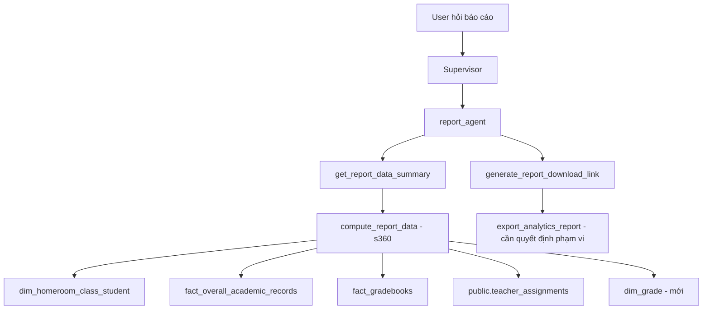

# Kế hoạch Migration Report Agent sang Schema mới (s360)

## 1. Bối cảnh

`report_agent` hiện được lập trình cho **schema cũ** (legacy ORM: `Class`, `Grade`, `Semester`,
`Subject`, `Student`, `Enrollment`, `Score`, `StudentTermReport`, `TeacherAssignment` — ID dạng UUID).
Dữ liệu mới nằm trong [`score_focused_schema.sql`](../docs_vsf/schemas/merged/score_focused_schema.sql)
(schema `s360`, ID dạng INTEGER).

`report_agent` có 3 công cụ:
1. `get_report_data_summary` → `compute_report_data` (legacy ORM) — **đường hỏi-đáp chính**.
2. `generate_report_download_link` → `export_analytics_report` ([`reports.py`](../src/api/v1/reports.py:187), 849 dòng, legacy) + `report_renderer.py`.
3. `generate_custom_report_docx` → chỉ render markdown, **không phụ thuộc DB**.

## 2. Khuyến nghị: Có nên thêm `dim_grade`?

**Khuyến nghị: CÓ — thêm bảng `s360.dim_grade` (nhẹ).**

### Lý do
- **Nguồn dữ liệu chuẩn duy nhất** cho metadata khối (tên, cấp THCS/THPT, thứ tự). Hiện `grade_name`
  chỉ được denormalize trong `dim_homeroom_class_student` dưới dạng chuỗi `"Khối {grade_id}"` — dễ vỡ.
- **Các bảng fact chỉ có `grade_id`** (`fact_gradebooks_moet`, `fact_overall_academic_records`,
  `dim_exam`, `dim_so_assignment`) không có tên khối. Muốn hiển thị tên khối trong báo cáo phải join
  qua bảng học sinh — không sạch. `dim_grade` cho phép join trực tiếp.
- **Phù hợp mô hình star schema** (đã có `dim_school_year`, `dim_subject`, `dim_homeroom_class`).
- **Hỗ trợ RBAC theo khối** (`get_user_assignment_constraints` dùng `grade_id`) và lọc khối cho report_agent.

### Lưu ý / đánh đổi
- `grade_id` hiện **đã mã hóa số khối (6–12)**, nên nhu cầu tức thời thấp; `dim_grade` chủ yếu phục vụ
  hiển thị tên khối + cấp học + thứ tự một cách chuẩn hóa.
- Schema đã deploy → cần migration + backfill (nhỏ, chỉ 7 dòng 6–12).

### Định nghĩa đề xuất
```sql
CREATE TABLE s360.dim_grade (
    id            INTEGER PRIMARY KEY,                 -- = grade_id (6..12)
    code          VARCHAR(20) NOT NULL,                -- '6', '7', ..., '12'
    name          VARCHAR(50) NOT NULL,                -- 'Khối 6', 'Khối 7', ...
    grade_number  SMALLINT NOT NULL CHECK (grade_number BETWEEN 1 AND 12),
    level         VARCHAR(20) NOT NULL DEFAULT 'THCS', -- 'THCS' (6-9) | 'THPT' (10-12)
    is_active     INTEGER DEFAULT 1,
    created_at    TIMESTAMPTZ DEFAULT NOW(),
    updated_at    TIMESTAMPTZ DEFAULT NOW(),
    source_system VARCHAR(50) DEFAULT 'SCHOOL_ONLINE'
);
-- Backfill: 6..9 -> THCS, 10..12 -> THPT
```

## 3. Bản đồ ánh xạ dữ liệu cũ → s360

| Dữ liệu cũ (legacy) | Schema mới (s360) |
|---|---|
| `Class` (UUID) | `s360.dim_homeroom_class` (id, so_school_id, school_year_id, grade_id, code, fullname) |
| `Student` + `Enrollment` | `s360.dim_homeroom_class_student` (student_code, student_name, homeroom_class_id, class_name, grade_id, grade_name, so_school_id, school_year_id) |
| `Subject` (UUID) | `s360.dim_subject` (id, code, name, assessment_type) |
| `Semester` + `AcademicYear` | `s360.dim_school_year` (id, code, fullname, is_current) + `semester_index` (1/2) |
| `Score` (FINAL/APPROVED) | `s360.fact_gradebooks` (final_grade, subject_id, homeroom_class_id, semester_index) + `s360.fact_gradebooks_moet` |
| `StudentTermReport.conduct` | `s360.fact_overall_academic_records` (conduct, s1_conduct, s2_conduct) |
| `TeacherAssignment` | `public.teacher_assignments` (role_context, academic_year_id) |
| `Grade` (grade_number) | `s360.dim_grade` (grade_number, name, level) — **bảng mới** |

**Lưu ý:** Schema mới **không có `grade_number`** trong `dim_homeroom_class`; lọc khối dùng `grade_id`
(6–12) hoặc `dim_grade.grade_number`. `conduct_enum` = (`TOT`, `KHA`, `TRUNG_BINH`, `YEU`).

## 4. Các bước thực hiện

### Bước 1 — Schema: thêm `dim_grade`
- Thêm `s360.dim_grade` vào `score_focused_schema.sql`.
- Backfill 6–12 (THCS 6–9, THPT 10–12).
- Áp dụng lên DB local (`scripts/apply_merged_schema.py` hoặc ALTER + INSERT).

### Bước 2 — Viết lại `resolve_uuid_parameters` → `resolve_report_filters` (dùng s360, ID integer)
- **Rename** để tránh nợ kỹ thuật (ID giờ là INTEGER, không còn UUID).
- Resolve `class_id` (tên/mã lớp → `dim_homeroom_class.id`).
- Resolve `subject_id` (tên/mã môn → `dim_subject.id`).
- Resolve `semester_id` (tên HK + niên khóa → `dim_school_year.id` + `semester_index`).
- Trả về **dict** `{homeroom_class_id, subject_id, school_year_id, semester_index}` dạng integer.

### Bước 3 — Viết lại `compute_report_data` (dùng s360) + **BẮT BUỘC Multi-Tenant**
Tính các chỉ số cho 4 loại báo cáo. **Mọi SELECT từ bảng có `so_school_id` BẮT BUỘC gắn
`so_school_id = :school_id`** để tránh rò rỉ giữa các trường:
- Có `so_school_id` (bắt buộc filter): `dim_homeroom_class`, `dim_homeroom_class_student`,
  `fact_gradebooks`, `fact_gradebooks_moet`, `fact_overall_academic_records`.
- KHÔNG có `so_school_id` (dim toàn cục): `dim_subject`, `dim_school_year`, `dim_grade` —
  không filter trực tiếp, nhưng **mọi JOIN phải đi qua bảng có `so_school_id`**.
- `public.teacher_assignments` không có `so_school_id` → scope qua `user_id`/`class_id`/`grade_id`
  (đã được RBAC xác định).

Các chỉ số:
- `total_students` / `total_classes`: từ `dim_homeroom_class_student` / `dim_homeroom_class`
  (lọc `so_school_id`, `school_year_id`, `grade_id`, `homeroom_class_id`).
- `gpa` (ĐTB): từ `fact_overall_academic_records.final_grade` (hoặc `fact_gradebooks`).
- `at_risk` (số lớp ĐTB < 5.0): group `fact_gradebooks`/`fact_overall_academic_records` theo lớp.
- `subject_averages`: group `fact_gradebooks` theo `subject_id` → join `dim_subject.name`.
- `conduct_stats`: từ `fact_overall_academic_records.conduct` (TOT/KHA/TRUNG_BINH/YEU).
- `active_teachers_count` / `homeroom_count` / `subject_teacher_count`: từ `public.teacher_assignments`
  (role_context, academic_year_id).

### Bước 4 — Cập nhật `get_report_data_summary`
- Giữ nguyên cấu trúc; chỉ tiêu thụ output mới của `compute_report_data`.

### Bước 5 — `generate_report_download_link` (Phương án A+)
- **Phase 1:** Migrate luồng Q&A (`compute_report_data` + `get_report_data_summary`).
- **Phase 2:** Khi người dùng yêu cầu xuất file báo cáo tổng hợp, report_agent tận dụng
  `generate_custom_report_docx` (render từ Markdown kết quả `get_report_data_summary`) — **không phụ
  thuộc API legacy `export_analytics_report`**.
- **Giới hạn cần ghi rõ:** `generate_custom_report_docx` **chỉ xuất DOCX + bản xem trước HTML,
  KHÔNG xuất PDF**; và là báo cáo dạng tự do (không có biểu đồ/chữ ký như 4 mẫu chuẩn). Nếu người
  dùng yêu cầu PDF, cần giữ legacy hoặc thông báo Phase 1 chỉ hỗ trợ DOCX/HTML.

### Bước 6 — Test + xác minh
- Test hiện tại đã mock `compute_report_data` trực tiếp (không chạm DB) → phần lớn pass không đổi.
- **Thêm unit test riêng cho `compute_report_data`** với session s360 mock
  (`dim_homeroom_class`, `fact_overall_academic_records`, `dim_grade`) để bảo vệ logic mới.
- Chạy test + kiểm tra thủ công qua chat.

## 5. Phạm vi chuỗi export — ĐÃ CHỐT: Phương án A+

Chuỗi `generate_report_download_link` → `export_analytics_report` ([`reports.py`](../src/api/v1/reports.py:187))
+ `report_renderer.py` rất lớn và nằm ở tầng API dùng chung cho web dashboard.

- **B (migrate toàn bộ 849 dòng):** phạm vi quá lớn, chạm API endpoint dùng chung → **loại**.
- **C (disable tool export):** ảnh hưởng trải nghiệm người dùng hỏi AI xuất file → **loại**.
- **A+ (CHỌN):** migrate luồng Q&A; xuất file qua `generate_custom_report_docx` từ Markdown
  `get_report_data_summary`, không phụ thuộc API legacy. Giới hạn: DOCX/HTML, không PDF.

## 6. Sơ đồ luồng


