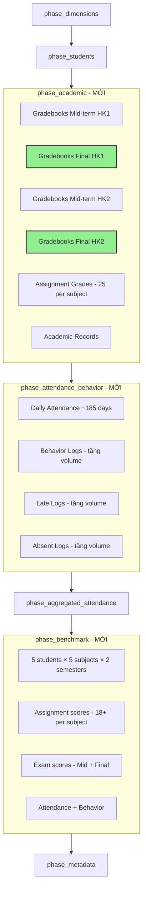

# Kế hoạch Fix Data Volume & Benchmark cho Mock Data Generator

## Phân tích gốc rễ

Sau khi audit code [`data_mock/generate_full_system_mock.py`](data_mock/generate_full_system_mock.py), xác định được **5 vấn đề** chính:

### Vấn đề 1: Risk Predictions bị mock không cần thiết
- **`phase_risk_predictions()`** (dòng 1092-1152) đang seed heuristic risk cho 1,023 students × 4 checkpoints
- **Benchmark loop** (dòng 1310-1325) cũng seed risk predictions
- **Fix**: Xoá hoàn toàn phase này và các INSERT tương ứng

### Vấn đề 2: Thiếu điểm Cuối Kỳ (Final Exam)
- `phase_academic()` chỉ insert gradebook với `so_exam_id=1` (Mid HK1) và `so_exam_id=3` (Mid HK2)
- **Thiếu** `so_exam_id=2` (Final HK1) và `so_exam_id=4` (Final HK2)
- Cả `fact_gradebooks` lẫn `fact_gradebooks_moet` đều thiếu final exam rows

### Vấn đề 3: Assignment Coverage chưa đủ
- Hiện tại: 12 assignments/môn/HK (tuần 2-13)
- Chỉ cover ~12 tuần / ~19 tuần của HK → bỏ sót ~7 tuần đầu/cuối mỗi học kỳ
- **Fix**: Mở rộng lên 25 assignments/môn/HK (tuần 1-18 HK1, tuần 1-17 HK2)

### Vấn đề 4: Benchmark Students quá sơ sài
- Chỉ có 12 điểm cho **duy nhất môn TOAN_7 (subject_id=107)**, semester 1
- Không có điểm Văn, Anh, KHTN, Sử-Địa
- Không có điểm HK2
- Không có mid-term/final exam scores trong fact_gradebooks

### Vấn đề 5: School Dates thiếu ngày cuối
- `_get_weekdays(end_dt)` dùng `range(days)` loại trừ `end_dt`
- Jan 15 (Thursday) là ngày học nhưng bị loại → mất 1 ngày HK1

---

## Kế hoạch thực hiện (8 Tasks)

### Task A: Xoá Risk Predictions Mocking

**File**: [`data_mock/generate_full_system_mock.py`](data_mock/generate_full_system_mock.py)

1. **Xoá function `phase_risk_predictions()`** (dòng 1092-1152)
2. **Xoá risk prediction INSERT trong `phase_benchmark()`** (dòng 1310-1325)
3. **Xoá `_compute_risk_level()`** (dòng 115-139) — không còn dùng ở đâu
4. **Xoá `risk_predictions` khỏi CLI choices** (dòng 1489-1491)
5. **Xoá dispatch block** (dòng 1404-1412)
6. **Giữ nguyên DDL** `score_focused_schema.sql` để user tự fill sau

### Task B: Fix School Dates (full coverage ~185 ngày)

**File**: [`data_mock/generate_full_system_mock.py`](data_mock/generate_full_system_mock.py)

1. **Sửa `_get_weekdays()`** — dùng `range(days + 1)` để bao gồm `end_dt`:
   ```python
   def _get_weekdays(start_dt, end_dt):
       days = (end_dt - start_dt).days
       return [start_dt + timedelta(days=i) for i in range(days + 1) 
               if (start_dt + timedelta(days=i)).weekday() < 5]
   ```
2. **Đồng bộ `_get_all_school_dates()`** với cùng logic
3. **Thêm `print()`** log số ngày chi tiết: *"HK1: {n} weekdays, HK2: {n} weekdays, Total: {n}"*

### Task C: Thêm điểm Cuối Kỳ (Final Exam) cho mọi học sinh

**File**: [`data_mock/generate_full_system_mock.py`](data_mock/generate_full_system_mock.py) — `phase_academic()`

Sau khi insert HK1 mid-term (dòng 608-632), **thêm**:

```python
# Final exam HK1 (exam_id=2)
for sub_id, score_val in student_scored_subjects:
    final_score_hk1 = round(float(np.clip(score_val + random.uniform(-0.5, 0.5), 0.0, 10.0)), 1)
    session.execute(text("""
        INSERT INTO s360.fact_gradebooks (...) VALUES (...) 
    """), {"id": gradebook_id, ..., "so_exam_id": 2, "score": final_score_hk1, ...})
    session.execute(text("""
        INSERT INTO s360.fact_gradebooks_moet (...) VALUES (...)
    """), {"id": gradebook_id, ..., "gradebook_type_item_id": 2, "score": final_score_hk1, ...})
    gradebook_id += 1
```

Tương tự cho HK2 final (exam_id=4, gradebook_type_item_id=4), sau dòng 650.

**Kết quả**: Mỗi học sinh có **4 dòng gradebook/môn** (Mid HK1, Final HK1, Mid HK2, Final HK2) thay vì 2 như hiện tại.

### Task D: Mở rộng Assignment Coverage

**File**: [`data_mock/generate_full_system_mock.py`](data_mock/generate_full_system_mock.py) — `phase_dimensions()`

Sửa vòng lặp assignment generation (dòng 330):

```python
# HK1: Sep 5 → Jan 15 ≈ 19 weeks → assignments weeks 1-18
# HK2: Jan 20 → May 31 ≈ 18 weeks → assignments weeks 1-17

for sem_idx in [1, 2]:
    sem_start = SEMESTER_STARTS[sem_idx]
    if sem_idx == 1:
        num_assignments = 18  # weeks 1-18 (Sep 5 → Jan 5)
    else:
        num_assignments = 17  # weeks 1-17 (Jan 20 → May 18)
    
    for week_off in range(num_assignments):
        week_num = week_off + 1  # weeks 1-18 or 1-17
        ...
```

**Kết quả**: Từ ~1,584 assignments → ~2,800 assignments, coverage gần như toàn bộ năm học.

### Task E: Fix Benchmark Students (đầy đủ điểm)

**File**: [`data_mock/generate_full_system_mock.py`](data_mock/generate_full_system_mock.py) — `phase_benchmark()`

Thay đổi cấu trúc benchmark data:

```python
CORE_SUBJECTS_GRADE7 = [107, 2, 3, 7, 8]  # TOAN_7, VAN, ANH, KHTN, LS_DL

benchmark_students = [
    {
        "scode": "HS000EDGE01",
        ...,
        "grade_id": 7,
        "homeroom_class_id": 3,
        "subjects": [107, 2, 3, 7, 8],
        "assignment_scores": {
            # Per-subject dict: {subject_id: {week: score, ...}}
            107: {1: 9.5, 2: 9.2, ..., 18: 1.5},  # 18 scores HK1
            2:   {1: 8.5, 2: 8.0, ..., 18: 1.0},
            3:   {1: 9.0, 2: 8.5, ..., 18: 2.0},
            7:   {1: 8.0, 2: 8.0, ..., 18: 2.5},
            8:   {1: 9.0, 2: 8.8, ..., 18: 2.0},
        },
        "midterm_hk1": {107: 8.5, 2: 7.5, 3: 8.0, 7: 7.0, 8: 8.0},
        "final_hk1":   {107: 3.0, 2: 2.5, 3: 3.5, 7: 2.0, 8: 3.0},
        "midterm_hk2": {107: 2.5, 2: 2.0, 3: 3.0, 7: 1.5, 8: 2.5},
        "final_hk2":   {107: 1.5, 2: 1.0, 3: 2.0, 7: 1.0, 8: 1.5},
        "war_rate": 2.0, "demerits": 1,
        "attendance_profile": "good",  # kiểm soát absent probability
    },
    # ... tương tự cho EDGE02-05
]
```

**Logic mới cho benchmark**:
1. **Assignment scores**: Lặp qua từng subject_id trong `subjects`, tìm matching assignments trong `all_assignments` (so khớp school_id, grade_id, subject_id, semester_index). Insert scores từ dict `assignment_scores[subject_id]` theo week.
2. **Gradebook scores**: Insert mid-term (exam_id=1, 3) và final (exam_id=2, 4) cho từng subject
3. **Attendance**: Giữ nguyên logic cũ (dựa trên war_rate)
4. **Behavior**: Giữ nguyên logic cũ (dựa trên demerits)
5. **Academic records**: Insert `fact_subject_academic_records` và `fact_overall_academic_records`

### Task F: Tăng tổng thể Data Volume

**File**: [`data_mock/generate_full_system_mock.py`](data_mock/generate_full_system_mock.py) — `phase_attendance_behavior()`

1. **Behavior logs**: Tăng số lượng
   - Academic_At_Risk: 15-35 → 20-50
   - STEM_Focus/Humanities/Diligent: 4-10 → 8-18
   - High_Achiever: 0-1 → 2-5

2. **Late logs**: Tăng số lượng tương tự

3. **Absent logs**: Tăng số lượng
   - Academic_At_Risk: 10-30 → 15-40
   - Khác: 3-8 → 5-15

### Task G: Xác nhận Attendance

Sau khi thực thi các task trên, chạy generator và verify:
- `SELECT COUNT(DISTINCT _date) FROM s360.fact_so_daily_attendance` = ~185
- `SELECT COUNT(DISTINCT student_code) FROM s360.fact_so_daily_attendance` = 1,028
- `SELECT COUNT(*) FROM s360.fact_gradebooks WHERE so_exam_id=2` > 0 (final exams exist)
- `SELECT COUNT(*) FROM s360.dim_so_assignment` ≈ 2,800

### Task H: Cập nhật CLI & Documentation

1. Bỏ `risk_predictions` khỏi argparse choices
2. Cập nhật `print()` summary messages phản ánh đúng data volume mới
3. Cập nhật docstring của `generate_full_system_mock_data()`

---

## Sơ đồ luồng dữ liệu sau khi fix



---

## Rủi ro & Lưu ý

| Rủi ro | Mitigation |
|---------|------------|
| Insert 25 assignments × 5 subjects × 2 schools × 6 grades × 2 semesters = ~3,000 assignments | Dùng batch insert hoặc ON CONFLICT DO NOTHING (đã có) |
| Benchmark student scores cần match với assignment catalog | Dùng `next()` lookup với điều kiện khớp school_id + grade_id + subject_id + semester_index |
| Thời gian chạy có thể tăng do nhiều dữ liệu hơn | Các phase đã tách riêng, có thể chạy `--phase` riêng lẻ |
| Gradebook IDs có thể bị trùng nếu không quản lý global counter | Dùng biến `gradebook_id` global trong phase_academic (đã có) |
