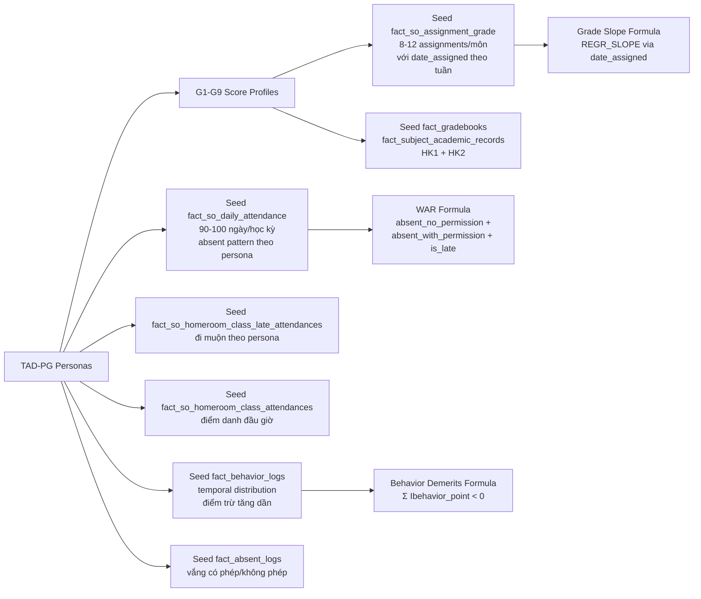

# Kế Hoạch Sửa `generate_full_system_mock.py` Để Hỗ Trợ Plan 1 (EWS)

> **Cập nhật sau Schema Review**: Schema `score_focused_schema.sql` ĐÃ ĐỦ cho input features của Plan 1 Giai đoạn 1.
>
> **Tuy nhiên**, cần **THÊM 1 bảng mới** — `s360.fact_student_risk_predictions` — là bảng OUTPUT chứa kết quả dự báo rủi ro do model .pkl xuất ra. Bảng này chưa có trong cả `score_focused_schema.sql` lẫn `School Online Schema.csv`.
>
> **Grade Slope** dùng `fact_so_assignment_grade` + `dim_so_assignment.date_assigned` để tính `week_number` động (không cần thêm cột `week_number` vào schema).
>
> **WAR** dùng `fact_so_daily_attendance.absent_no_permission` / `absent_with_permission` + `fact_so_homeroom_class_late_attendances.is_late` (tất cả đã có trong schema).
>
> **Behavior Demerits** dùng `fact_behavior_logs.behavior_point` (đã có).

---

## 1. Vấn Đề Hiện Tại

File [`data_mock/generate_full_system_mock.py`](data_mock/generate_full_system_mock.py) hiện tại:

| Bảng | Seed? | Vấn đề |
|------|-------|--------|
| `fact_so_assignment_grade` | ✅ Có, nhưng chỉ 4 assignments/môn | ❌ Không đủ time points cho Grade Slope |
| `fact_so_daily_attendance` | ❌ **Chưa seed** | ❌ WAR không tính được |
| `fact_so_homeroom_class_attendances` | ❌ Chưa seed | ❌ Thiếu điểm danh đầu giờ |
| `fact_so_homeroom_class_late_attendances` | ❌ Chưa seed | ❌ WAR thiếu tardy data |
| `fact_behavior_logs` | ✅ Có, nhưng volume thấp, không temporal | ❌ Demerits không có trend |
| `fact_absent_logs` | ✅ Có, nhưng 2-4 records/HS nguy cơ | ❌ Không đủ cho WAR phân tích |
| `fact_gradebooks` | ✅ Có, HK1+HK2 | ✅ Tạm ổn |
| `fact_subject_academic_records` | ✅ Có, HK1+HK2 | ✅ Đủ cho overall GPA |
| `fact_student_risk_predictions` | ❌ **Chưa có trong schema** | ❌ Bảng OUTPUT của model EWS — cần tạo mới |

---

## 📌 Bảng MỚI Cần Thêm: `s360.fact_student_risk_predictions`

Đây là bảng OUTPUT của EWS — nơi model .pkl GHI kết quả dự báo rủi ro. Cần:
1. **Thêm DDL** vào `score_focused_schema.sql`
2. **Seed dữ liệu** trong `generate_full_system_mock.py` — tính predictions từ features đã sinh

### DDL đề xuất

```sql
CREATE TABLE s360.fact_student_risk_predictions (
    id                  BIGINT PRIMARY KEY GENERATED ALWAYS AS IDENTITY,
    student_code        VARCHAR(50) NOT NULL,
    school_year_id      INTEGER NOT NULL REFERENCES s360.dim_school_year(id),
    semester_index      INTEGER NOT NULL CHECK (semester_index IN (1, 2)),
    evaluated_at_week   INTEGER NOT NULL,           -- Tuần đánh giá (5, 6, 8...)
    risk_level          VARCHAR(10) NOT NULL,        -- HIGH, MEDIUM, LOW
    gpa                 DECIMAL(10,1),               -- Điểm TB tại thời điểm quét
    grade_slope         DECIMAL(10,4),               -- Độ dốc điểm số
    war_rate            DECIMAL(10,2),               -- Tỷ lệ vắng có trọng số
    demerits_count      INTEGER,                     -- Số lần bị trừ điểm rèn luyện
    created_at          TIMESTAMPTZ DEFAULT NOW()
);

CREATE INDEX idx_fsrp_student ON s360.fact_student_risk_predictions(student_code);
CREATE INDEX idx_fsrp_week ON s360.fact_student_risk_predictions(evaluated_at_week);
CREATE INDEX idx_fsrp_risk ON s360.fact_student_risk_predictions(risk_level);
COMMENT ON TABLE s360.fact_student_risk_predictions IS 'Kết quả dự báo rủi ro học tập do model EWS xuất ra';
```

### Logic seed predictions từ features

```python
def compute_risk_level(gpa, grade_slope, war_rate, demerits_count):
    """Mô phỏng model output dựa trên rules heuristic."""
    risk_score = 0
    # Điểm thấp
    if gpa < 5.0: risk_score += 3
    elif gpa < 6.5: risk_score += 1
    # Độ dốc âm
    if grade_slope < -0.5: risk_score += 3
    elif grade_slope < -0.2: risk_score += 1
    # Vắng nhiều
    if war_rate > 20: risk_score += 3
    elif war_rate > 10: risk_score += 1
    # Hành vi xấu
    if demerits_count > 15: risk_score += 3
    elif demerits_count > 5: risk_score += 1
    
    if risk_score >= 6: return "HIGH"
    elif risk_score >= 3: return "MEDIUM"
    else: return "LOW"

def seed_risk_predictions(conn, students, assignments, attendances, behaviors, school_year_id):
    """Tính predictions từ features đã sinh và seed vào fact_student_risk_predictions."""
    for student_code in students:
        for week_num in [5, 8, 12, 16]:  # Quét định kỳ
            # Tính các features tại time point này
            gpa = compute_gpa_up_to_week(student_code, week_num)
            grade_slope = compute_slope_up_to_week(student_code, week_num)
            war_rate = compute_war_up_to_week(student_code, week_num)
            demerits = count_demerits_up_to_week(student_code, week_num)
            
            risk = compute_risk_level(gpa, grade_slope, war_rate, demerits)
            
            conn.execute("""
                INSERT INTO s360.fact_student_risk_predictions
                (student_code, school_year_id, semester_index, evaluated_at_week,
                 risk_level, gpa, grade_slope, war_rate, demerits_count)
                VALUES (%s, %s, %s, %s, %s, %s, %s, %s, %s)
            """, (student_code, school_year_id, sem_idx, week_num, risk, gpa, grade_slope, war_rate, demerits))
```

Kết quả kỳ vọng:
- **Academic_At_Risk**: risk_level = HIGH ở tuần 5-8 (grade_slope âm, war_rate cao)
- **High_Achiever**: risk_level = LOW ở tất cả các tuần
- **G7 (Sụt giảm)**: risk_level = LOW ở tuần 5 → MEDIUM/HIGH ở tuần 12+

---

## 2. Kế Hoạch Sửa — 3 Giai Đoạn

### GIAI ĐOẠN 1: DỮ LIỆU CỐT LÕI CHO PLAN 1 FORMULAS

#### 1.1 Tăng số lượng `fact_so_assignment_grade` — Cho **Grade Slope**

**Mục tiêu:** Mỗi học sinh có 8-12 assignment grades/môn/học kỳ, trải đều theo tuần.

**Cách làm:**
- Trong `dim_so_assignment`, thêm 8-12 assignments/môn thay vì 4 như hiện tại
- `date_assigned` trải từ tuần 2 đến tuần 17 của học kỳ
- Điểm số theo G1-G9 profile, có trend:
  - `G7` (Sụt giảm): điểm giảm dần theo tuần
  - `G3` (Tiến bộ): điểm tăng dần theo tuần
  - Còn lại: random quanh baseline

```python
# Seed assignment grades với date_assigned trải đều theo tuần
for sub_id in subject_ids:
    for week_num in range(2, 18):  # Tuần 2-17
        date_assigned = semester_start + timedelta(weeks=week_num - 1)
        # Tạo assignment record
        assignment_id = next_id()
        dim_assignments.append({
            "assignment_id": assignment_id,
            "subject_id": sub_id,
            "semester_index": sem_idx,
            "date_assigned": date_assigned,
            "due_date": date_assigned + timedelta(days=7),
            ...
        })
        # Tạo grade cho mỗi học sinh
        for scode in students:
            score = gen_score_by_profile(gcode, week_idx=week_num, ...)
            assignment_grades.append({
                "assignment_id": assignment_id,
                "student_code": scode,
                "final_grade": score,
                "created_at": date_assigned + timedelta(days=random.randint(1, 5))
            })
```

**SQL cho Grade Slope (chạy trên dữ liệu này):**
```sql
SELECT 
    fag.student_code,
    fag.subject_id,
    REGR_SLOPE(fag.final_grade, EXTRACT(WEEK FROM dsa.date_assigned)) AS grade_slope,
    REGR_INTERCEPT(fag.final_grade, EXTRACT(WEEK FROM dsa.date_assigned)) AS grade_intercept
FROM s360.fact_so_assignment_grade fag
JOIN s360.dim_so_assignment dsa ON fag.assignment_id = dsa.assignment_id
GROUP BY fag.student_code, fag.subject_id;
```

#### 1.2 Seed `fact_so_daily_attendance` — Cho **WAR**

**Mục tiêu:** 90-100 school days/học kỳ × student với absent pattern theo persona.

**Cách làm:**
```python
# Tạo school dates cho học kỳ
def generate_school_dates(semester_start, semester_end):
    dates = []
    current = semester_start
    while current <= semester_end:
        if current.weekday() < 5:  # Thứ 2 - thứ 6
            dates.append(current)
        current += timedelta(days=1)
    return dates  # ~90-100 ngày

# Seed daily attendance theo persona
for student_code, meta in student_map.items():
    persona = meta["persona"]
    for day in school_dates:
        week_start = day - timedelta(days=day.weekday())
        
        # Academic_At_Risk: 25-35% absent rate
        if persona == "Academic_At_Risk":
            is_absent = random.random() < 0.30
            if is_absent:
                absent_periods = random.choices([2, 3, 4, 5], weights=[0.2, 0.4, 0.3, 0.1])
                absent_no_perm = random.choices([0, absent_periods], weights=[0.3, 0.7])
            else:
                absent_periods = absent_no_perm = 0
            absent_with_perm = max(0, absent_periods - absent_no_perm)
        # High_Achiever: 0-3% absent rate
        elif persona == "High_Achiever":
            is_absent = random.random() < 0.02
            absent_periods = random.randint(1, 2) if is_absent else 0
            absent_no_perm = 0  # High achiever luôn xin phép
            absent_with_perm = absent_periods
        # Các persona khác: 5-15% absent rate
        else:
            ...
        
        daily_attendance_rows.append({
            "_date": day,
            "week_start": week_start,
            "month_start": day.replace(day=1),
            "student_code": student_code,
            "total_periods": 5,
            "absent_periods": absent_periods,
            "absent_no_permission": absent_no_perm,
            "absent_with_permission": absent_with_perm,
            "any_absence_flag": 1 if absent_periods > 0 else 0,
        })
```

#### 1.3 Seed `fact_so_homeroom_class_late_attendances` — Cho **WAR (Tardy)**

**Mục tiêu:** Học sinh đi muộn với `is_late`, `attendance_date`, `time_late`.

```python
# Academic_At_Risk: 40% đi muộn ít nhất 1 lần/tuần
if persona == "Academic_At_Risk":
    for week_num in range(1, 19):
        if random.random() < 0.4:
            late_date = semester_start + timedelta(weeks=week_num - 1, days=random.randint(0, 4))
            late_rows.append({
                "student_code": student_code,
                "attendance_date": late_date,
                "is_late": 1,
                "time_late": random.randint(5, 30),
                "status_name": "DI_MUON",
            })
```

#### 1.4 Seed `fact_so_homeroom_class_attendances` — Điểm danh đầu giờ

**Mục tiêu:** Điểm danh lớp chủ nhiệm hàng ngày.

```python
# Mỗi ngày, mỗi lớp, mỗi học sinh có 1 record điểm danh đầu giờ
for class_id in homeroom_classes:
    for student in class_students:
        status = 1  # Có mặt
        if persona == "Academic_At_Risk" and random.random() < 0.15:
            status = 2  # Vắng
        attendances_rows.append({
            "homeroom_class_id": class_id,
            "attendance_date": day,
            "student_code": student_code,
            "status": status,
        })
```

#### 1.5 Tăng volume + temporal distribution cho `fact_behavior_logs` — Cho **Behavior Demerits**

**Mục tiêu:** Behavior logs có temporal distribution, không flat.

```python
# Academic_At_Risk: behavior xấu tăng dần về cuối kỳ
for week_num in range(1, 19):
    # Xác suất tăng dần theo thời gian
    prob = 0.10 + (week_num / 18) * 0.35  # Từ 10% lên 45%
    
    if random.random() < prob:
        log_date = semester_start + timedelta(weeks=week_num - 1, days=random.randint(1, 5))
        # Điểm trừ càng về cuối càng nặng
        if week_num < 6:
            points = random.choices([-1, -2, -3], weights=[0.5, 0.3, 0.2])[0]
        elif week_num < 12:
            points = random.choices([-2, -3, -5], weights=[0.3, 0.4, 0.3])[0]
        else:
            points = random.choices([-3, -5, -10], weights=[0.3, 0.4, 0.3])[0]
        
        behavior_logs.append({
            "student_code": student_code,
            "behavior_point": points,
            "comment_date": log_date,
            "behavior_code": random.choice(BEHAVIOR_CODES),
        })
```
 
#### 1.6 Sửa `fact_so_class_attendance_statistics` — Tính từ daily_attendance thay vì hardcode

**Mục tiêu:** Bỏ hardcode `(30, 28, 2)` cho tất cả học sinh, thay bằng aggregate từ `fact_so_daily_attendance`.

**Cách làm:**
```python
# Sau khi seed daily_attendance xong, tính statistics từ dữ liệu thật
for scode, meta in student_meta_map.items():
    sid, syid, gid, cid = meta["school_id"], meta["school_year_id"], meta["grade_id"], meta["homeroom_class_id"]
    persona = meta["persona"]
    
    # Đếm từ daily_attendance data đã seed
    student_days = [d for d in daily_attendance_rows if d["student_code"] == scode]
    total_lessons = sum(d["total_periods"] for d in student_days)
    absent_lessons = sum(d["absent_periods"] for d in student_days)
    attended_lessons = total_lessons - absent_lessons
    
    # Academic_At_Risk có attendance_rate ~65-75%, High_Achiever ~97-100%
    attendance_rate = attended_lessons / total_lessons if total_lessons > 0 else 1.0
    status = "DU_TET" if attendance_rate >= 0.8 else "CAN_BAO_CHA_ME" if attendance_rate >= 0.5 else "VI_PHAM"
    
    session.execute(text("""
        INSERT INTO s360.fact_so_class_attendance_statistics
        (student_code, date, status, total_lesson, lesson_attend, lesson_not_attend, so_school_id, school_year_id, grade_id, homeroom_class_id)
        VALUES (:scode, :sdate, :status, :total, :attend, :absent, :sid, :syid, :gid, :cid)
        ON CONFLICT (student_code, date) DO UPDATE SET
            total_lesson = EXCLUDED.total_lesson,
            lesson_attend = EXCLUDED.lesson_attend,
            lesson_not_attend = EXCLUDED.lesson_not_attend,
            status = EXCLUDED.status;
    """), {
        "scode": scode, "sdate": semester_end_date,
        "status": status, "total": total_lessons,
        "attend": attended_lessons, "absent": absent_lessons,
        "sid": sid, "syid": syid, "gid": gid, "cid": cid
    })
```

Kết quả kỳ vọng:
- **Academic_At_Risk**: total_lesson ~450-500, attendance_rate ~65-75%, status = CAN_BAO_CHA_ME
- **High_Achiever**: total_lesson ~450-500, attendance_rate ~97-100%, status = DU_TET
- **Diligent_Average**: attendance_rate ~85-95%, status = DU_TET

---

### GIAI ĐOẠN 2: TĂNG QUY MÔ & TÍNH THỰC TẾ

#### 2.1 Tăng số học sinh (tuỳ chọn)

Hiện tại: 1,023 học sinh. Có thể tăng lên 2,000-3,000 bằng cách thêm class, nhưng **ưu tiên chất lượng dữ liệu hơn số lượng**. Giữ nguyên cấu hình 2 schools nếu data đã realistic.

#### 2.2 Thêm tương quan dữ liệu

Dùng latent variable `eff` (đã có trong code) để tạo tương quan:

```python
# eff thấp → vắng nhiều, behavior xấu, điểm thấp
absent_prob = 1 / (1 + math.exp(1.5 * eff - 2.0))  # eff càng thấp, absent càng cao
behavior_prob = 1 / (1 + math.exp(1.2 * eff - 1.5))
lms_completion = 1 / (1 + math.exp(-2.0 * eff + 1.0))
```

#### 2.3 Thêm benchmark students

5-10 edge case students với kịch bản đặc biệt:

| Mã | Kịch Bản | Test cho |
|----|---------|----------|
| HS...EDGE01 | Điểm cao → sụt giảm đột ngột tuần 12 | Grade Slope âm mạnh |
| HS...EDGE02 | Vắng không phép liên tục nhưng điểm vẫn cao | WAR vs Score mismatch |
| HS...EDGE03 | Đi muộn 5-10 phút mỗi ngày | Tardy accumulation |
| HS...EDGE04 | LMS full điểm nhưng thi thấp (G6) | LMS-Exam gap |
| HS...EDGE05 | Điểm TB nhưng đang giảm mạnh (G7) | Early warning despite mid GPA |

#### 2.4 Cải thiện sinh tên học sinh theo phân phối thực tế

**Vấn đề:** Code hiện tại dùng danh sách họ/đệm/tên cứng với 10 lựa chọn mỗi loại:
```python
ho_names = ["Bùi", "Nguyễn", "Trần", "Lê", "Phạm", "Hoàng", "Vũ", "Đặng", "Bùi", "Đỗ"]
dem_names = ["Thanh", "Đình", "Thành", "Minh", "Quang", "Đức", "Ngọc", "Văn", "Hữu"]
ten_names = ["Tú", "Hải", "Nghĩa", "Nam", "Hương", "Anh", "Long", "Đạt", "Phúc", "Thảo"]
sname = f"{random.choice(ho_names)} {random.choice(dem_names)} {random.choice(ten_names)}"
```
→ Không phản ánh phân phối thực tế dân cư Việt Nam. Ví dụ: "Nguyễn" chiếm 31.5% dân số nhưng code chỉ cho 10% (1/10).

**Giải pháp:** Kế thừa `AdvancedVietnameseNameGenerator` từ `generate_mock_data.py`:

```python
# --- PHÂN PHỐI HỌ VÀ TÊN VIỆT NAM (Thống kê dân cư thực tế) ---
FAMILY_PROBABILITIES = {
    "Nguyễn": 31.5, "Trần": 10.9, "Lê": 8.9, "Phạm": 5.9,
    "Hoàng": 2.6, "Huỳnh": 2.5, "Võ": 2.5, "Vũ": 2.4,
    "Phan": 2.8, "Trương": 2.2, "Bùi": 2.1, "Đặng": 1.9,
    "Đỗ": 1.9, "Ngô": 1.7, "Hồ": 1.5, "Dương": 1.4,
    "Đinh": 1.0, "Đoàn": 0.94, "Lâm": 0.92, "Mai": 0.86,
    "Trịnh": 0.82, "Đào": 0.76, "Cao": 0.75, "Lý": 0.74,
    "Hà": 0.66, "Lưu": 0.65, "Lương": 0.65, "Thái": 0.45,
    "Châu": 0.45, "Tạ": 0.38, "Phùng": 0.36, "Tô": 0.36
}

class AdvancedVietnameseNameGenerator:
    def __init__(self):
        self.families = list(FAMILY_PROBABILITIES.keys())
        self.family_weights = list(FAMILY_PROBABILITIES.values())
        # ... (male/female middle + given names với probability weights)
    
    def generate(self, gender=None):
        # Chọn họ theo phân phối xác suất, đệm và tên theo giới tính
        family = random.choices(self.families, weights=self.family_weights, k=1)[0]
        # ...
        return f"{family} {middle} {given}", gender
```

**Thay đổi trong code:** Dòng 273-276 của `generate_full_system_mock.py` — thay thế 3 list cứng bằng `AdvancedVietnameseNameGenerator().generate()`:
```python
name_generator = AdvancedVietnameseNameGenerator()
# ...
sname, gender = name_generator.generate()
```

Kết quả: Họ "Nguyễn" xuất hiện ~31.5% thay vì 10%, tên nữ "Anh" ~7.9%, tên nam "Huy" ~4.9%, v.v. — phản ánh đúng phân bố dân cư Việt Nam.

---

### GIAI ĐOẠN 3: TÁI CẤU TRÚC CODE (TUỲ CHỌN)

#### 3.1 Tách functions

Hiện tại 1 function `generate_full_system_mock_data()` quá lớn (752 dòng). Tách thành:

```python
def generate_full_system_mock_data():
    seed_dimension_tables()    # schools, years, subjects, classes, students
    seed_academic_data()       # gradebooks, academic records
    seed_assignment_grades()   # fact_so_assignment_grade + dim_so_assignment
    seed_attendance_data()     # daily + homeroom + late attendances
    seed_absent_logs()         # fact_absent_logs
    seed_behavior_data()       # fact_behavior_logs
    seed_benchmark_students()  # edge cases
```

#### 3.2 Thêm CLI arguments (tuỳ chọn)

```python
python data_mock/generate_full_system_mock.py --phase all
python data_mock/generate_full_system_mock.py --phase academic
python data_mock/generate_full_system_mock.py --phase attendance
python data_mock/generate_full_system_mock.py --phase behavior
```

---

## 3. Kiểm Tra Kết Quả

Sau khi chạy xong, kiểm tra:

### Grade Slope
```sql
-- Phải có grade_slope khác 0 cho G3 (tăng) và G7 (giảm)
SELECT 
    fag.student_code,
    dsa.subject_id,
    REGR_SLOPE(fag.final_grade, EXTRACT(WEEK FROM dsa.date_assigned)) AS slope,
    COUNT(*) AS num_grades
FROM s360.fact_so_assignment_grade fag
JOIN s360.dim_so_assignment dsa ON fag.assignment_id = dsa.assignment_id
GROUP BY fag.student_code, dsa.subject_id
ORDER BY slope;
-- G3 phải có slope > 0, G7 phải có slope < 0
```

### WAR
```sql
SELECT 
    student_code,
    SUM(absent_no_permission * 1.0 + absent_with_permission * 0.2) 
    / NULLIF(SUM(total_periods), 0) * 100 AS war_rate
FROM s360.fact_so_daily_attendance
GROUP BY student_code;
-- Academic_At_Risk phải có WAR > 15%, High_Achiever < 3%
```

### Behavior Demerits
```sql
SELECT 
    student_code,
    COUNT(*) FILTER (WHERE behavior_point < 0) AS demerits
FROM s360.fact_behavior_logs
GROUP BY student_code
ORDER BY demerits DESC;
-- Academic_At_Risk phải có demerits > 10, High_Achiever < 3
```

---

## 4. Tổng Quan Luồng Dữ Liệu



---

## 5. Các Bước Implement

| Step | Mô tả | File tác động |
|------|-------|---------------|
| 1 | **DDL**: Thêm bảng `s360.fact_student_risk_predictions` vào schema | `docs_vsf/schemas/merged/score_focused_schema.sql` |
| 2 | Tăng `dim_so_assignment` từ 4 lên 10-12 assignments/môn/học kỳ với `date_assigned` theo tuần | `data_mock/generate_full_system_mock.py` — phần seed assignments |
| 3 | Seed `fact_so_assignment_grade` tương ứng với assignment mới, điểm theo G1-G9 profile có trend | `data_mock/generate_full_system_mock.py` — phần seed grades |
| 4 | Seed `fact_so_daily_attendance` với 90-100 school days/học kỳ, absent pattern theo persona | `data_mock/generate_full_system_mock.py` — thêm function mới |
| 5 | Seed `fact_so_homeroom_class_attendances` (điểm danh đầu giờ hàng ngày) | `data_mock/generate_full_system_mock.py` — thêm function mới |
| 6 | Seed `fact_so_homeroom_class_late_attendances` (đi muộn) | `data_mock/generate_full_system_mock.py` — thêm function mới |
| 7 | Tăng volume `fact_behavior_logs` với temporal distribution, điểm trừ tăng dần về cuối kỳ | `data_mock/generate_full_system_mock.py` — sửa phần behavior |
| 8 | Tăng volume `fact_absent_logs` (vắng có phép/không phép) | `data_mock/generate_full_system_mock.py` — sửa phần absent |
| 9 | Sửa `fact_so_class_attendance_statistics` — tính từ daily_attendance thay vì hardcode | `data_mock/generate_full_system_mock.py` — sửa phần statistics |
| 10 | Thay thế name generator primitive (3 list cứng) bằng `AdvancedVietnameseNameGenerator` với phân phối xác suất thực tế | `data_mock/generate_full_system_mock.py` — thay thế dòng 273-276 |
| 11 | Seed `fact_student_risk_predictions` — tính risk_level từ features đã sinh | `data_mock/generate_full_system_mock.py` — thêm function mới |
| 12 | Thêm 5-10 benchmark edge case students | `data_mock/generate_full_system_mock.py` — thêm function mới |
| 13 | (Tuỳ chọn) Tái cấu trúc code thành functions riêng | `data_mock/generate_full_system_mock.py` — refactor |
| 14 | (Tuỳ chọn) Thêm CLI arguments | `data_mock/generate_full_system_mock.py` — argparse |
