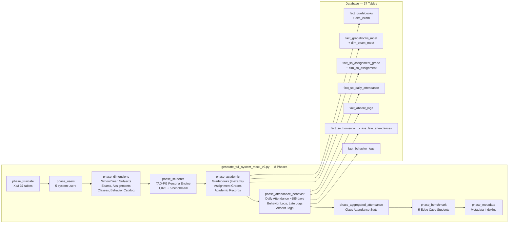
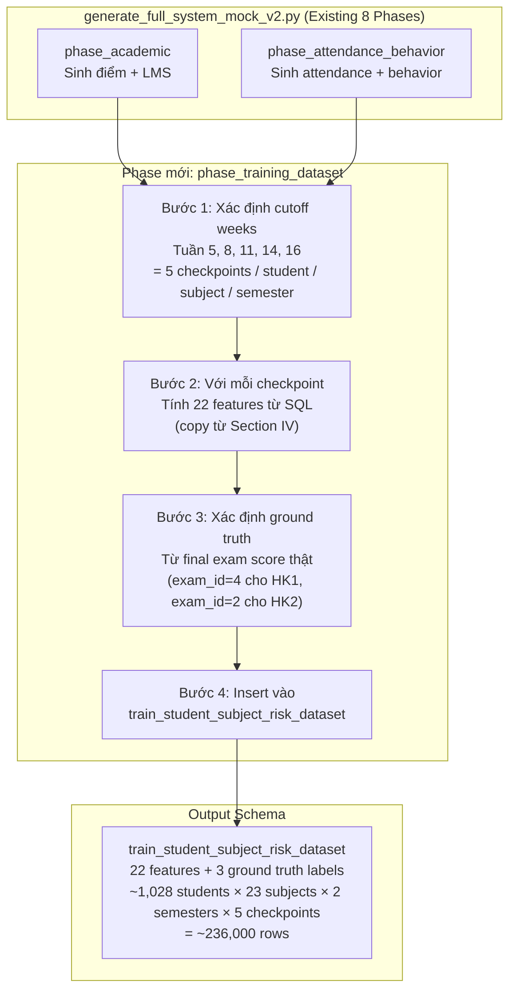
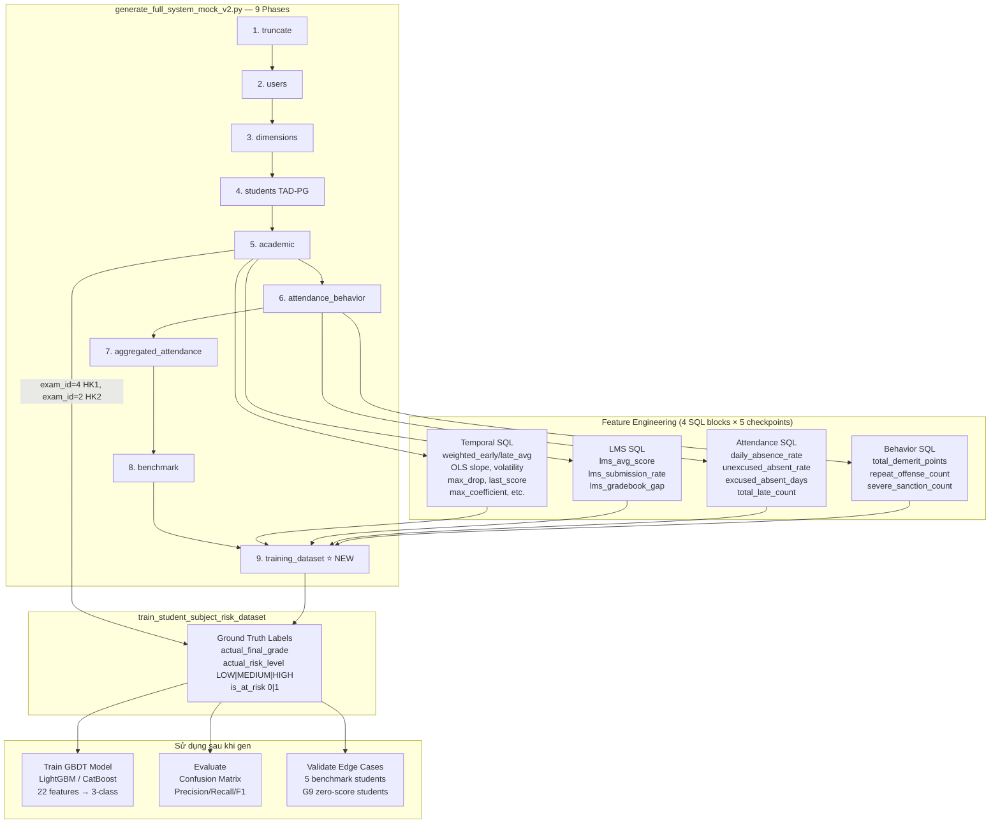

# Kế hoạch Mock Training Data cho GBDT (22 features)

> **Mục tiêu:** Sinh dữ liệu mock cho bảng `train_student_subject_risk_dataset` (định nghĩa tại [`plan_1_v3_senior_review.md`](plans/risk_alert/plan_1_v3_senior_review.md:571)) tương thích hoàn toàn với [`generate_full_system_mock_v2.py`](data_mock/mock_full_data/generate_full_system_mock_v2.py).

---

## I. HIỆN TRẠNG: v2 ĐÃ GENERATE ĐỦ 6 NGUỒN CHO 22 FEATURES

File [`generate_full_system_mock_v2.py`](data_mock/mock_full_data/generate_full_system_mock_v2.py) hiện tại đã có **8 phases**, generate **37 tables**, bao gồm đầy đủ **6 nguồn dữ liệu** cần cho 22 features của GBDT:

| # | Source Table | Phase | Feature Cluster | Số lượng records |
|---|-------------|-------|-----------------|-----------------|
| 1 | `fact_gradebooks` + `dim_exam.coefficient` | `academic` | Temporal (weighted_early_avg, score_slope, ...) | ~1,023 students × 23 subjects × 4 exams |
| 2 | `fact_gradebooks_moet` + `dim_exam_moet.coefficient` | `academic` | Temporal (UNION với fact_gradebooks) | ~1,023 students × 23 subjects × 4 exams |
| 3 | `fact_so_assignment_grade` + `dim_so_assignment` | `academic` | LMS (lms_avg_score, submission_rate, ...) | ~1,023 students × ~2,800 assignments |
| 4 | `fact_so_daily_attendance` | `attendance_behavior` | Attendance (daily_absence_rate, unexcused_absent_rate) | ~1,023 students × ~185 days |
| 5 | `fact_absent_logs` + `fact_so_homeroom_class_late_attendances` | `attendance_behavior` | Attendance (excused_absent_days, total_late_count) | ~1,023 students × variable |
| 6 | `fact_behavior_logs` | `attendance_behavior` | Behavior (total_demerit_points, repeat_offense, severe_sanction) | ~1,023 students × variable |

### KIẾN TRÚC DỮ LIỆU HIỆN TẠI



### VẤN ĐỀ: THIẾU PHASE GENERATE TRAINING DATASET

Hiện tại **KHÔNG có phase nào** thực hiện:

1. Chạy feature engineering SQL (từ Section IV của [`plan_1_v3_senior_review.md`](plans/risk_alert/plan_1_v3_senior_review.md:130)) để tính 22 features từ 6 nguồn
2. Insert kết quả vào bảng [`s360.train_student_subject_risk_dataset`](plans/risk_alert/plan_1_v3_senior_review.md:571)
3. Gắn ground truth labels (`actual_final_grade`, `actual_risk_level`, `is_at_risk`)

---

## II. GIẢI PHÁP: PHASE MỚI — `phase_training_dataset`

### 2.1 Luồng xử lý



### 2.2 Chi tiết các bước

#### Bước 1: Checkpoints thời gian

Mỗi student-subject-semester sẽ có **5 checkpoints** dựa theo số tuần (evaluated_at_week):

| Checkpoint | Week | Ý nghĩa | Cutoff Date (HK1, 2025) |
|-----------|------|---------|------------------------|
| 1 | 5 | Đầu HK — sau 5 tuần | 2025-10-10 |
| 2 | 8 | Giữa HK (trước thi Mid-term) | 2025-10-31 |
| 3 | 11 | Sau thi Mid-term | 2025-11-21 |
| 4 | 14 | Trước thi Final | 2025-12-12 |
| 5 | 16 | Cuối HK (sát Final) | 2025-12-26 |

#### Bước 2: Feature Engineering SQL

Copy trực tiếp các SQL block từ Section IV của [`plan_1_v3_senior_review.md`](plans/risk_alert/plan_1_v3_senior_review.md:134):

- **Temporal (9 features):** [`temporal_features` query](plans/risk_alert/plan_1_v3_senior_review.md:134) — UNION `fact_gradebooks` + `fact_gradebooks_moet`, với `@cutoff_date` là tham số
- **LMS (5 features):** [`lms_features` query](plans/risk_alert/plan_1_v3_senior_review.md:274) — từ `fact_so_assignment_grade` + `dim_so_assignment`, filter `due_date <= @cutoff_date`
- **Attendance (4 features):** [`attendance_features` query](plans/risk_alert/plan_1_v3_senior_review.md:318) — từ `fact_so_daily_attendance` + `fact_absent_logs` + `fact_so_homeroom_class_late_attendances`, filter `_date <= @cutoff_date`
- **Behavior (3 features):** [`behavior_features` query](plans/risk_alert/plan_1_v3_senior_review.md:357) — từ `fact_behavior_logs`, filter `comment_date <= @cutoff_date`

#### Bước 3: Ground Truth Labels

**Nguồn ground truth:** Điểm final exam từ `fact_gradebooks` và `fact_gradebooks_moet`:

| Trường | Nguồn | Logic |
|--------|-------|-------|
| `actual_final_grade` | `fact_gradebooks.final_grade` WHERE `exam_id = 4` (HK1) hoặc `exam_id = 2` (HK2) | Điểm thi cuối kỳ thực tế |
| `actual_risk_level` | Derived | `>= 6.5` → `LOW`, `4.0 - 6.4` → `MEDIUM`, `< 4.0` → `HIGH` |
| `is_at_risk` | Derived | `1` nếu `actual_final_grade < 5.0`, `0` nếu `>= 5.0` |

**Lưu ý quan trọng:** Ground truth chỉ có thể lấy từ exam_id 'sau' checkpoint. Ví dụ:
- HK1 checkpoints (week 5, 8, 11, 14, 16): ground truth = Final HK1 score (exam_id=4, khoảng week 18-19)
- HK2 checkpoints (week 5, 8, 11, 14, 16): ground truth = Final HK2 score (exam_id=2, khoảng week 18-19)

#### Bước 4: INSERT vào `train_student_subject_risk_dataset`

Schema đã được định nghĩa tại [`plan_1_v3_senior_review.md:571`](plans/risk_alert/plan_1_v3_senior_review.md:571). Dùng batch insert pattern giống các phase khác (chunk size 10,000).

---

## III. ƯỚC TÍNH KHỐI LƯỢNG DỮ LIỆU

| Dimension | Value |
|-----------|-------|
| Students (thường) | 1,023 |
| Benchmark students | 5 |
| Subjects/student | ~11 (trung bình) |
| Semesters | 2 |
| Checkpoints/semester | 5 |
| **Tổng rows ước tính** | **~113,000** (1,028 × 11 × 2 × 5) |

Với chunk size 10,000, cần ~12 batch inserts.

---

## IV. CẬP NHẬT `generate_full_system_mock_v2.py`

### 4.1 Thêm phase mới

```python
# ---------------------------------------------------------------------------
# Phase 9: Generate GBDT Training Dataset
# ---------------------------------------------------------------------------
def phase_training_dataset(session):
    """Tính 22 features từ 6 nguồn và insert vào train_student_subject_risk_dataset
    cho mỗi student-subject-semester-checkpoint combination."""
    print("\n🧠 [9/9] Generating GBDT Training Dataset (22 features × 5 checkpoints)...")
    
    # Bước 1: Lấy danh sách students và subjects
    # Bước 2: Với mỗi checkpoint, chạy 4 query blocks (temporal, lms, attendance, behavior)
    # Bước 3: Xác định ground truth từ final exam scores
    # Bước 4: Batch insert vào train_student_subject_risk_dataset
```

### 4.2 Cập nhật orchestrator

```python
def generate_full_system_mock_data(phase="all"):
    # ... existing phases ...
    if phase in ("all", "training_dataset"):
        phase_training_dataset(session)
```

### 4.3 Cập nhật CLI

```python
parser.add_argument(
    "--phase",
    choices=["all", "truncate", "users", "dimensions", "students",
             "academic", "attendance_behavior", "aggregated_attendance",
             "benchmark", "metadata", "training_dataset"],
    default="all",
)
```

### 4.4 Cập nhật truncate list

Thêm `s360.train_student_subject_risk_dataset` vào danh sách truncate trong [`phase_truncate`](data_mock/mock_full_data/generate_full_system_mock_v2.py:141).

---

## V. XỬ LÝ EDGE CASES

### 5.1 Benchmark Students (5 special codes)

5 benchmark students ([defined at line 471](data_mock/mock_full_data/generate_full_system_mock_v2.py:471)) có persona/profile đặc biệt:

| Code | Persona | Profile | Kỳ vọng ground truth |
|------|---------|---------|---------------------|
| `HS125071000` | High_Achiever | G1 | actual_final_grade ~8.0-10.0 → LOW risk |
| `HS125071001` | STEM_Focus | G3 | actual_final_grade ~7.0-9.0 → LOW risk |
| `HS125071002` | Diligent_Average | G2 | actual_final_grade ~5.5-7.8 → LOW/MEDIUM |
| `HS225071000` | Humanities_Focus | G4 | actual_final_grade ~4.0-6.0 → MEDIUM |
| `HS225061568` | Academic_At_Risk | G7 | actual_final_grade ~3.0-4.0 → HIGH risk |

### 5.2 Students with missing data

- **IB students** (persona=High_Achiever, 30% probability): Only ~30% have IB subject scores
- **Cambridge students** (persona in High_Achiever/STEM/Humanities, 85%): Most have Cambridge scores
- **Benchmark students** always have full subject coverage (dòng 601-606)

### 5.3 Students với 0 assignments hoặc 0 attendance

Các student G9 (profile cuối cùng) có `lms_score = 0.0` và `exam_m, exam_e = 0.0` — đây là edge case cho việc test model với dữ liệu missing.

---

## VI. KIẾN TRÚC TỔNG THỂ SAU KHI THÊM PHASE



---

## VII. TÓM TẮT CÔNG VIỆC

| # | Task | File | Mô tả |
|---|------|------|-------|
| 1 | Thêm `phase_training_dataset()` | `generate_full_system_mock_v2.py` | Function mới tính 22 features từ 4 SQL blocks |
| 2 | Cập nhật orchestrator | `generate_full_system_mock_v2.py` | Thêm `"training_dataset"` vào phase list |
| 3 | Cập nhật CLI | `generate_full_system_mock_v2.py` | Thêm `"training_dataset"` vào choices |
| 4 | Cập nhật truncate | `generate_full_system_mock_v2.py` | Thêm `train_student_subject_risk_dataset` vào truncate list |

---

## VIII. CÂU HỎI CHO USER

Trước khi implement, cần xác nhận:

1. **Nên implement `phase_training_dataset` như một function Python thuần** (tương tự các phase khác) hay nên tạo một **script riêng biệt** (VD: `generate_training_dataset.py`) để tách biệt concerns?
2. **Checkpoints cố định** (5, 8, 11, 14, 16) hay nên cho phép config qua CLI argument?
3. **Cách tính ground truth:** Lấy `actual_final_grade` từ `fact_gradebooks` hay từ `fact_subject_academic_records` (bảng tổng kết có sẵn)?
