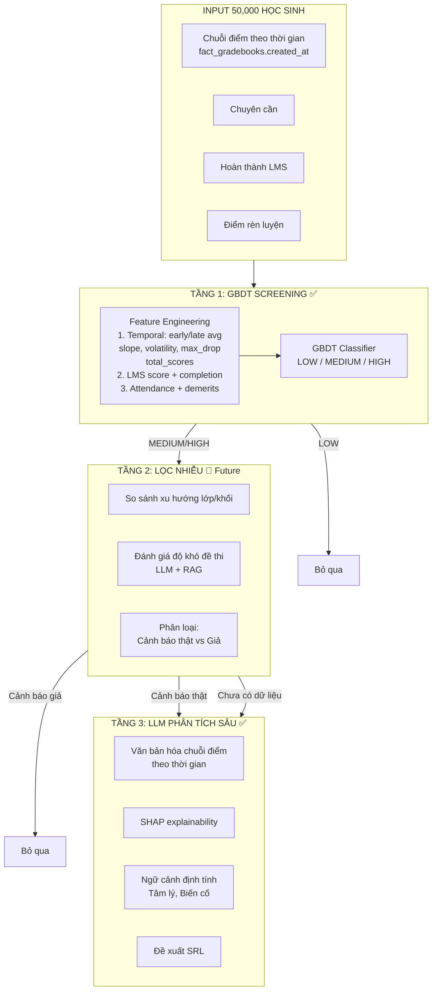

# Revision plan_1.md: Hệ thống Cảnh báo Rủi ro Học thuật 3 Tầng

## Kiến trúc Tổng thể (3-Tier Architecture)

```
TẦNG 1: GBDT SCREENING ✅ — LÀM NGAY
  Mục tiêu: Phân loại nhanh 50,000 học sinh theo nguy cơ học thuật
  Input:   Chuỗi điểm theo thời gian + Chuyên cần + LMS + Điểm rèn luyện
  Output:  Risk groups (HIGH / MEDIUM / LOW) theo từng môn
  Model:   1 GBDT Classifier duy nhất

TẦNG 2: LỌC NHIỄU 🔮 — TÍNH NĂNG SAU (future)
  Mục tiêu: Lọc cảnh báo giả (false alarm)
  Input:   Điểm TB cả lớp/cả khối, Độ khó đề thi (LLM + RAG)
  Output:  Cảnh báo thật (cần can thiệp) vs Cảnh báo giả (đề quá khó)
  Trạng thái: Thiết kế schema đã dự phòng, chưa implement

TẦNG 3: LLM PHÂN TÍCH SÂU ✅ — LÀM NGAY
  Mục tiêu: Phân tích nguyên nhân + đề xuất SRL
  Input:   Văn bản hóa dữ liệu điểm + SHAP + Ngữ cảnh định tính
  Output:  Giải thích SHAP + Phương án can thiệp SRL
```

---

## 1. Lý do chỉnh sửa

**Vấn đề 1:** [`plan_1.md`](plans/risk_alert/plan_1.md) dùng GPA hiện tại làm feature chính. GPA là một **giá trị trung bình** — nó làm mất thông tin về quá trình điểm (coefficient=1: 10, coefficient=2: 6 → GPA=8 vẫn "ổn" nhưng thực chất đang giảm mạnh).

**Vấn đề 2:** Bản revision trước đó cố gắng nhóm điểm theo `coefficient` (avg_coeff1, avg_coeff2) và `exam_code` (avg_oral, avg_regular, midterm_score). Cả 2 cách đều là **gom nhóm và tính trung bình** — vẫn làm mất thông tin về **thứ tự thời gian.** GBDT không biết điểm nào đến trước, điểm nào đến sau, không thể phát hiện xu hướng tăng/giảm.

**Giải pháp:** Không gom nhóm gì cả. Chỉ xử lý **chuỗi điểm thuần túy theo thời gian:**
- Lấy tất cả điểm từ đầu học kỳ đến tuần dự đoán
- Sắp xếp theo `created_at` (thời gian ghi điểm)
- Tính các đặc trưng về xu hướng, biến động, phân bố

---

## 2. NGUYÊN TẮC ZERO SCHEMA ALTERATION

Không `ALTER TABLE` trên bảng nào. Chỉ dùng cột có sẵn:

| Cột sẵn có | Cách dùng |
|-------------|-----------|
| [`fact_gradebooks.created_at`](docs_vsf/schemas/merged/score_focused_schema.sql:515) | **THỜI GIAN** — sắp xếp điểm, lọc theo tuần dự đoán |
| [`fact_gradebooks.final_grade`](docs_vsf/schemas/merged/score_focused_schema.sql:507) | **GIÁ TRỊ ĐIỂM** — điểm số của mỗi đầu điểm |
| [`dim_exam.coefficient`](docs_vsf/schemas/merged/score_focused_schema.sql:428) | Metadata cho LLM (Tier 3) — không dùng trong feature |

### Luồng xử lý thời gian:

```
Đầu học kỳ (Tuần 1)                      Tuần dự đoán (W)              Cuối kỳ
     │───────────────────────────────────────│─────────────────────────────│
     │  ←── scores được include ──→          │
     │  (tất cả điểm có created_at           │
     │   <= cutoff_date của tuần W)          │
     │                                       │
     │  Sắp xếp theo created_at ASC          │
     │  Tính temporal features:              │
     │    • early_avg (nửa đầu)              │
     │    • late_avg (nửa sau)               │
     │    • score_slope (độ dốc)             │
     │    • volatility (biến động)           │
     │    • max_drop (giảm mạnh nhất)         │
     │    • total_scores (tổng số điểm)      │
```

---

## 3. BẢNG OUTPUT DUY NHẤT

```sql
CREATE TABLE s360.fact_student_subject_risk_predictions (
    id                      BIGINT PRIMARY KEY GENERATED ALWAYS AS IDENTITY,
    student_code            VARCHAR(50) NOT NULL,
    subject_id              INTEGER NOT NULL REFERENCES s360.dim_subject(id),
    school_year_id          INTEGER NOT NULL REFERENCES s360.dim_school_year(id),
    semester_index          INTEGER NOT NULL CHECK (semester_index IN (1, 2)),
    evaluated_at_week       INTEGER NOT NULL,

    -- === TẦNG 1: FEATURES CHUỖI THỜI GIAN CÓ HỆ SỐ (COEFFICIENT-WEIGHTED TEMPORAL) ===
    weighted_early_avg      DECIMAL(10,2),  -- TB nửa đầu có nhân coefficient từng bài
    early_count             INTEGER DEFAULT 0,
    weighted_late_avg       DECIMAL(10,2),  -- TB nửa sau có nhân coefficient từng bài
    late_count              INTEGER DEFAULT 0,

    -- Xu hướng & biến động tính theo trọng số WLS
    weighted_score_slope    DECIMAL(10,4),  -- Độ dốc WLS (bài HS2, HS3 kéo slope mạnh hơn)
    score_volatility        DECIMAL(10,4),  -- Độ lệch chuẩn biến động của điểm
    weighted_max_drop       DECIMAL(10,2),  -- Giảm điểm lớn nhất (nhân coefficient bài bị rớt)
    last_score              DECIMAL(10,2),  -- Điểm bài kiểm tra mới nhất
    last_exam_coefficient   DECIMAL(5,2),   -- Hệ số bài mới nhất (1, 2, 3)
    has_midterm_exam        INTEGER DEFAULT 0, -- Đã có điểm Giữa kỳ (HS2)?
    has_final_exam          INTEGER DEFAULT 0,   -- Đã có điểm Cuối kỳ (HS3)?
    total_completed_coeff   DECIMAL(5,2),   -- Tổng hệ số đã tích lũy (CWP)
    total_scores            INTEGER DEFAULT 0,  -- Tổng số đầu điểm tính đến tuần W

    -- === TẦNG 1: LMS & Behavior ===
    lms_assignment_score    DECIMAL(10,2),  -- Điểm TB các bài LMS
    lms_completion_rate     DECIMAL(5,2),   -- % hoàn thành bài tập LMS
    attendance_rate         DECIMAL(5,2),   -- % đi học
    behavior_demerits       INTEGER DEFAULT 0, -- Số lần vi phạm

    -- === TẦNG 2: DỰ PHÒNG CHO TƯƠNG LAI (chưa dùng) ===
    -- class_avg_weighted      DECIMAL(10,2),
    -- student_z_score         DECIMAL(10,2),
    -- exam_difficulty_score   DECIMAL(5,2),

    -- === KẾT QUẢ DỰ BÁO ===
    risk_level              VARCHAR(10) NOT NULL, -- HIGH, MEDIUM, LOW
    risk_probability        DECIMAL(5,2),   -- Xác suất từ GBDT (confidence)

    -- Metadata
    created_at              TIMESTAMPTZ DEFAULT NOW()
);

CREATE INDEX idx_fssrp_student_subject
    ON s360.fact_student_subject_risk_predictions(student_code, subject_id);

CREATE INDEX idx_fssrp_risk_level
    ON s360.fact_student_subject_risk_predictions(risk_level);
```

---

## 4. FEATURE ENGINEERING — TẦNG 1 (COEFFICIENT-WEIGHTED)

### 4.1 Bước nền: Lấy chuỗi điểm kèm Coefficient theo thời gian

```sql
-- @prediction_week: tuần dự đoán (VD: 10)
-- @cutoff_date: ngày kết thúc của tuần dự đoán

WITH student_scores AS (
    SELECT
        fg.student_code,
        fg.subject_id,
        fg.final_grade,
        de.exam_code,        -- Dùng cho LLM display
        de.coefficient,      -- TRỌNG SỐ CHO MỖI ĐẦU ĐIỂM (1.0, 2.0, 3.0)
        fg.created_at,
        EXTRACT(DAY FROM (fg.created_at - sy.start_date)) / 7.0 AS week_float,
        ROW_NUMBER() OVER (
            PARTITION BY fg.student_code, fg.subject_id
            ORDER BY fg.created_at
        ) AS seq
    FROM s360.fact_gradebooks fg
    JOIN s360.dim_exam de ON fg.so_exam_id = de.id
    JOIN s360.dim_school_year sy ON fg.school_year_id = sy.id
    WHERE fg.is_locked = 1
        AND fg.created_at <= @cutoff_date
        AND fg.semester_index = @semester_index
)
```

### 4.2 Coefficient-Weighted Temporal Features (Python Layer)

Mỗi đầu điểm $i$ có cặp $(\text{score}_i, \text{coeff}_i)$ và thời điểm $\text{week}_i$. TẤT CẢ các chỉ số temporal đều nhân trọng số $\text{coeff}_i$ của chính cột điểm đó:

```python
import numpy as np
import pandas as pd

def compute_weighted_temporal_features(scores_df):
    """
    Tính Temporal Features có nhân trọng số Coefficient của TỪNG cột điểm.
    """
    results = []

    for (student, subject), group in scores_df.groupby(['student_code', 'subject_id']):
        group = group.sort_values('seq')
        scores = group['final_grade'].values.astype(float)
        coeffs = group['coefficient'].values.astype(float)
        weeks = group['week_float'].values.astype(float)
        n = len(scores)

        row = {'student_code': student, 'subject_id': subject}

        # 1. WEIGHTED EARLY vs LATE AVERAGE
        mid = n // 2
        if mid > 0:
            early_scores, early_coeffs = scores[:mid], coeffs[:mid]
            late_scores, late_coeffs = scores[mid:], coeffs[mid:]
        else:
            early_scores, early_coeffs = scores[:1], coeffs[:1]
            late_scores, late_coeffs = scores[-1:], coeffs[-1:]

        row['weighted_early_avg'] = round(np.average(early_scores, weights=early_coeffs), 2)
        row['early_count'] = len(early_scores)
        row['weighted_late_avg'] = round(np.average(late_scores, weights=late_coeffs), 2)
        row['late_count'] = len(late_scores)

        # 2. WEIGHTED LEAST SQUARES SLOPE (WLS)
        # Bài thi Giữa kỳ (HS2) / Cuối kỳ (HS3) sẽ kéo slope mạnh hơn hẳn bài HS1
        if n >= 3 and np.var(weeks) > 0:
            # Formula: WLS slope = sum(w * (x - x_bar) * (y - y_bar)) / sum(w * (x - x_bar)^2)
            w_mean_x = np.average(weeks, weights=coeffs)
            w_mean_y = np.average(scores, weights=coeffs)
            cov_xy = np.sum(coeffs * (weeks - w_mean_x) * (scores - w_mean_y))
            var_x = np.sum(coeffs * (weeks - w_mean_x) ** 2)
            wls_slope = cov_xy / var_x if var_x != 0 else 0.0
            row['weighted_score_slope'] = round(float(wls_slope), 4)
        else:
            row['weighted_score_slope'] = 0.0

        # 3. VOLATILITY — Độ lệch chuẩn biến động điểm
        row['score_volatility'] = round(float(scores.std()), 4) if n >= 2 else 0.0

        # 4. WEIGHTED MAX DROP — Giảm điểm nhân hệ số bài bị rớt
        if n >= 2:
            diffs = np.diff(scores)
            drop_coeffs = coeffs[1:]  # Hệ số của bài bị rớt
            drops = (diffs < 0) * abs(diffs) * drop_coeffs
            weighted_max_drop = float(drops.max()) if np.any(drops > 0) else 0.0
            row['weighted_max_drop'] = round(weighted_max_drop, 2)
        else:
            row['weighted_max_drop'] = 0.0

        # 5. LAST SCORE & LAST COEFFICIENT & EXAM FLAGS
        row['last_score'] = round(float(scores[-1]), 2)
        row['last_exam_coefficient'] = float(coeffs[-1])
        row['has_midterm_exam'] = 1 if 2.0 in coeffs else 0
        row['has_final_exam'] = 1 if 3.0 in coeffs else 0
        row['total_completed_coeff'] = float(np.sum(coeffs))
        row['total_scores'] = n

        results.append(row)

    return pd.DataFrame(results)
```

### 4.3 LMS & Behavior Features

```sql
lms_features AS (
    SELECT
        fg.student_code,
        fg.subject_id,
        AVG(fg.final_grade) AS lms_assignment_score,
        COUNT(CASE WHEN fg.final_grade IS NOT NULL THEN 1 END)
            / NULLIF(COUNT(*), 0) * 100 AS lms_completion_rate
    FROM s360.fact_gradebooks fg
    JOIN s360.dim_so_assignment da ON fg.so_assignment_id = da.id
    WHERE fg.is_locked = 1
        AND fg.created_at <= @cutoff_date
        AND fg.semester_index = @semester_index
        AND da.assignment_type_code IN ('LMS', 'HOMEWORK', 'PROJECT')
    GROUP BY fg.student_code, fg.subject_id
)
```

### 4.4 Feature Vector cho GBDT

```python
features = [
    # ===== CHUỖI ĐIỂM CÓ TRỌNG SỐ COEFFICIENT TỪNG BÀI =====
    weighted_early_avg,     # float: TB nửa đầu điểm (nhân coeff từng bài)
    early_count,            # int: số điểm nửa đầu
    weighted_late_avg,      # float: TB nửa sau điểm (nhân coeff từng bài)
    late_count,             # int: số điểm nửa sau
    weighted_score_slope,   # float: độ dốc WLS (bài HS2, HS3 kéo slope mạnh hơn)
    score_volatility,       # float: độ lệch chuẩn biến động
    weighted_max_drop,      # float: sụt giảm mạnh nhất (nhân coeff bài bị rớt)
    last_score,             # float: điểm bài kiểm tra mới nhất
    last_exam_coefficient,  # float: hệ số bài kiểm tra mới nhất (1, 2, 3)
    has_midterm_exam,       # 0/1: đã có điểm Giữa kỳ (HS2)?
    has_final_exam,         # 0/1: đã có điểm Cuối kỳ (HS3)?
    total_completed_coeff,  # float: tổng hệ số tích lũy (CWP)
    total_scores,           # int: tổng số đầu điểm

    # ===== LMS =====
    lms_assignment_score,   # float: điểm TB các bài LMS
    lms_completion_rate,    # float: % đã nộp bài

    # ===== Hành vi & Chuyên cần =====
    attendance_rate,        # float: % đi học
    behavior_demerits,      # int: số lần vi phạm

    # ===== Metadata =====
    subject_id_encoded,     # int: one-hot subject
]
```

---

## 5. KIẾN TRÚC MÔ HÌNH — TẦNG 1

### Single GBDT Classifier — End-to-End

```
┌──────────────────────────────────────────────────────────────────────┐
│                    INPUT FEATURES (COEFFICIENT-WEIGHTED)              │
│  [weighted_early_avg, weighted_late_avg, weighted_score_slope,       │
│   weighted_max_drop, score_volatility, last_score,                   │
│   last_exam_coefficient, has_midterm_exam, has_final_exam,          │
│   total_completed_coeff, lms_score, lms_rate, att_rate, demerits]    │
└────────────────────────────┬─────────────────────────────────────────┘
                             ▼
┌──────────────────────────────────────────────────────────────────────┐
│  GBDT Classifier (1 model duy nhất)                                  │
│  • LightGBM / CatBoost                                               │
│  • Multi-class: LOW / MEDIUM / HIGH                                  │
│  • Loss: multiclass log loss                                         │
│                                                                      │
│  Output: risk_level + probability (confidence)                       │
└────────────────────────────┬─────────────────────────────────────────┘
                             ▼
┌──────────────────────────────────────────────────────────────────┐
│  Lưu vào fact_student_subject_risk_predictions                   │
└──────────┬───────────────────────────────────┬───────────────────┘
           ▼                                   ▼
    (LOW risk)                     (MEDIUM / HIGH risk)
    Dừng lại                         ▼
                            ┌────────────────────────────────────────┐
                            │  TẦNG 2: LỌC NHIỄU (FUTURE)           │
                            │  • So sánh điểm TB lớp/khối            │
                            │  • Độ khó đề thi (LLM+RAG)             │
                            │  → Cảnh báo thật / giả                 │
                            └──────────┬─────────────────────────────┘
                                       ▼
                            ┌────────────────────────────────────────┐
                            │  TẦNG 3: LLM PHÂN TÍCH SÂU            │
                            │  • Văn bản hóa chuỗi điểm + SHAP      │
                            │  • Ngữ cảnh định tính (tâm lý,..)     │
                            │  • Đề xuất SRL                        │
                            └────────────────────────────────────────┘
```

---

## 6. DATA SERIALIZATION CHO TẦNG 3 (LLM)

Chỉ gọi LLM khi risk_level = `MEDIUM` hoặc `HIGH`.

```python
def serialize_subject_risk_profile(student_code, subject_id, row, raw_scores):
    """
    Văn bản hóa chuỗi điểm theo thời gian — mỗi điểm có:
    - Tên đầu điểm (từ dim_exam.exam_name hoặc exam_code)
    - Hệ số (coefficient)
    - Điểm số
    - Tuần học
    """
    profile = f"📚 MÔN: {subject_name} ({student_code})\n"
    profile += "=" * 40 + "\n\n"

    # 1. CHUỖI ĐIỂM THEO THỜI GIAN
    profile += "📅 DIỄN BIẾN ĐIỂM THEO THỜI GIAN:\n"
    profile += "-" * 40 + "\n"
    for s in sorted(raw_scores, key=lambda x: x['date']):
        profile += (f"  • Tuần {s['week']:2d} | {s['exam_type']:12s} "
                    f"(HS{s['coefficient']}) → {s['score']}/10\n")

    # 2. THỐNG KÊ THỜI GIAN
    profile += "\n📊 THỐNG KÊ CHUỖI THỜI GIAN:\n"
    profile += f"  • Nửa đầu:   {row.early_avg:.1f} (trung bình {row.early_count} bài)\n"
    profile += f"  • Nửa sau:   {row.late_avg:.1f} (trung bình {row.late_count} bài)\n"

    # 3. XU HƯỚNG
    profile += "\n📈 XU HƯỚNG:\n"
    if row.score_slope:
        if row.score_slope < -0.3:
            profile += f"  ⚠️  Điểm đang GIẢM dần: {abs(row.score_slope):.2f} điểm/tuần\n"
        elif row.score_slope > 0.3:
            profile += f"  ✅  Điểm đang TĂNG dần: {row.score_slope:.2f} điểm/tuần\n"
        else:
            profile += f"  ➡️  Điểm ổn định (slope = {row.score_slope:.2f})\n"

    if row.max_score_drop and row.max_score_drop > 1.5:
        profile += f"  🔴  Giảm mạnh: -{row.max_score_drop:.1f} điểm giữa 2 lần kiểm tra\n"

    if row.score_volatility and row.score_volatility > 2.0:
        profile += f"  🔴  Biến động lớn: ±{row.score_volatility:.1f} (điểm không ổn định)\n"

    profile += f"\n🔮 DỰ BÁO: {row.risk_level} RISK (xác suất: {row.risk_probability}%)"
    return profile
```

**Prompt LLM (Tier 3):**
```
Học sinh {student_code} — Môn {subject_name} — {risk_level} RISK
Dự đoán tại tuần {evaluated_at_week}

Quá trình điểm theo thời gian:
{serialized_profile}

Ngữ cảnh bổ sung:
- Điểm rèn luyện: {conduct_score}/100
- Số buổi vắng: {absent_count}
- Biến cố gia đình (nếu có): {family_incidents}

Yêu cầu:
1. Phân tích NGUYÊN NHÂN gốc rễ dẫn đến rủi ro (dựa trên xu hướng thời gian)
2. Đề xuất phương pháp SRL (Self-Regulated Learning) phù hợp
3. Gợi ý can thiệp cụ thể cho giáo viên bộ môn và phụ huynh
```

---

## 7. PIPELINE 3 TẦNG HOÀN CHỈNH



---

## 8. VÍ DỤ CỤ THỂ

### Ví dụ: Môn Toán — Tuần 10

```
Học sinh A — Môn Toán — Tuần 10:

Điểm theo thời gian (từ đầu kỳ đến tuần 10):
  ┌──────────┬─────────────┬──────┬───────┐
  │ Tuần     │ Đầu điểm    │ HS   │ Điểm  │
  ├──────────┼─────────────┼──────┼───────┤
  │ Tuần 2   │ Kiểm tra    │ 1    │ 9     │
  │ Tuần 4   │ Kiểm tra    │ 1    │ 8     │
  │ Tuần 6   │ Kiểm tra    │ 1    │ 7     │
  │ Tuần 8   │ Kiểm tra    │ 1    │ 6     │
  │ Tuần 9   │ Giữa kỳ     │ 2    │ 5     │
  └──────────┴─────────────┴──────┴───────┘

Feature Engineering (CHỈ temporal + behavior):
  • early_avg = (9+8)/2 = 8.5 (2 điểm đầu)
  • late_avg  = (7+6+5)/3 = 6.0 (3 điểm sau)
  • slope     = -0.45/tuần → GIẢM MẠNH ⚠️
  • volatility = 1.58 (biến động cao)
  • max_drop  = 2.0 (từ 8→6 ở tuần 6-8)
  • total_scores = 5

TẦNG 1 — GBDT:
  → HIGH RISK (xác suất 91%)
  Lý do: slope âm, late_avg thấp hơn early_avg 2.5 điểm

TẦNG 2 — LỌC NHIỄU (FUTURE):
  Cả lớp: slope_tb = -0.1, late_avg_tb = 7.0
  → A giảm mạnh hơn lớp → cảnh báo thật

TẦNG 3 — LLM:
  "Toán: 9 → 8 → 7 → 6 → 5. Giảm đều mỗi tuần.
   Nguyên nhân: Mất tập trung từ tuần 6, không nộp 2 bài LMS.
   Đề xuất: Gặp giáo viên tuần 11, SRL: lập kế hoạch học tập."
```

---

## 9. Schema mở rộng cho Tương lai (Tier 2)

Khi implement Tier 2, Migration cần:

```sql
ALTER TABLE s360.fact_student_subject_risk_predictions
    ADD COLUMN class_early_avg          DECIMAL(10,2),
    ADD COLUMN class_late_avg           DECIMAL(10,2),
    ADD COLUMN class_slope              DECIMAL(10,4),
    ADD COLUMN grade_early_avg          DECIMAL(10,2),
    ADD COLUMN grade_late_avg           DECIMAL(10,2),
    ADD COLUMN grade_slope              DECIMAL(10,4),
    ADD COLUMN exam_difficulty_score    DECIMAL(5,2),
    ADD COLUMN tier2_verdict            VARCHAR(20); -- 'REAL', 'FALSE', 'INCONCLUSIVE'
```

Đồng thời, để phục vụ Tier 2:

| Thành phần | Mô tả | Trạng thái |
|------------|-------|------------|
| `dim_exam.exam_code` & `coefficient` | Tra cứu + kết nối với đề thi | **Đã có sẵn** |
| LLM + RAG cho đề thi | Đánh giá độ khó, phân tích nội dung | Sau này |
| `fact_course_enrolls` | Để biết học sinh thuộc lớp nào | **Đã có sẵn** |
| View tổng hợp temporal TB lớp/khối | `v_class_temporal_stats` | Sau này |

---

## 10. TIẾN ĐỘ DỰ BÁO THEO THỜI GIAN

| Mốc | Tuần | Số điểm TB | Temporal features hoạt động ra sao |
|-----|------|-----------|-----------------------------------|
| Sớm | 5-6 | 2-4 điểm | early_avg có, late_avg khó tính, slope chưa đủ (cần ≥3 điểm). Dựa nhiều vào LMS + attendance. |
| Giữa | 10-12 | 5-8 điểm | early/late split rõ, slope bắt đầu có ý nghĩa, max_drop phát hiện giảm đột ngột. |
| Muộn | 16-18 | 8-12 điểm | Đầy đủ temporal features, confidence cao nhất. |
| Cuối kỳ | Sau 18 | 10-15 điểm | Ghi nhận kết quả thực tế để đánh giá model. |
