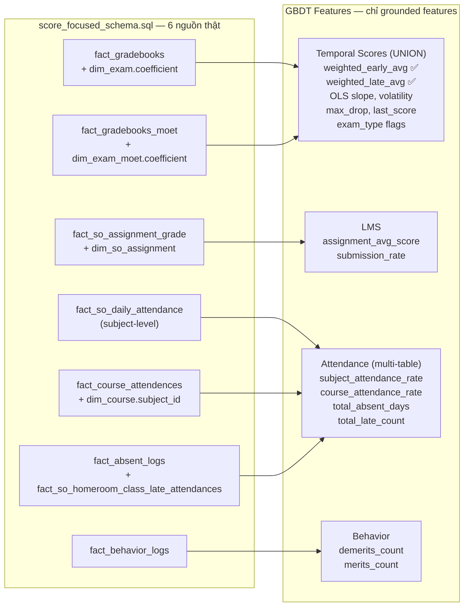
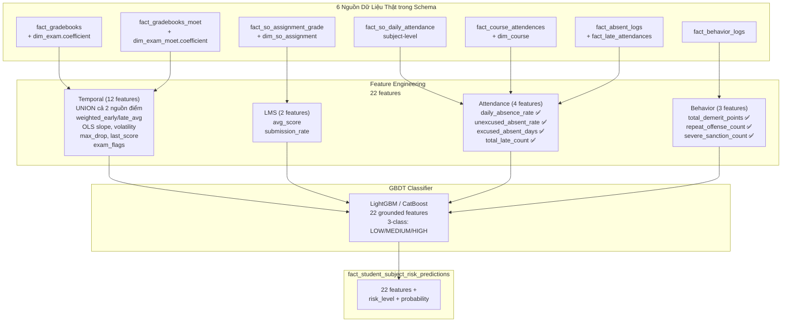

# Senior Review: plan_1_v2.md — Phát hiện 6 lỗi "bịa" feature và đề xuất giải pháp grounded

> **Tác giả:** Senior Technical Review  
> **Mục đích:** Đối chiếu từng feature trong [plan_1_v2.md](plans/risk_alert/plan_1_v2.md) với [score_focused_schema.sql](docs_vsf/schemas/merged/score_focused_schema.sql) thật, chỉ ra cái nào KHÔNG có thật, và đề xuất con đường đúng.

---

## I. TỔNG QUAN: 6 LỖI NGHIÊM TRỌNG

| # | Feature bịa trong plan_1_v2.md | Lỗi | Mức độ |
|---|-------------------------------|------|--------|
| 1 | `dim_so_assignment.assignment_type_code` | Column KHÔNG tồn tại trong schema | 🔴 Fatal |
| 2 | `fact_gradebooks.so_assignment_id` | Column KHÔNG tồn tại, join sai bảng | 🔴 Fatal |
| 3 | LMS completion_rate qua `fact_gradebooks` | Sai nguồn dữ liệu (phải qua `fact_so_assignment_grade`) | 🔴 Fatal |
| 4 | `attendance_rate` | Không có SQL nào — feature "ma" | 🟡 Missing |
| 5 | `behavior_demerits` | Không có SQL nào — feature "ma" | 🟡 Missing |
| 6 | Coefficient-weighted WLS slope | Dùng coefficient làm trọng số hồi quy là sai bản chất | 🟡 Flawed logic |

---

## II. PHÂN TÍCH CHI TIẾT TỪNG LỖI

### LỖI 1 & 2: LMS hoàn toàn sai bảng

**Trong plan_1_v2.md (Section 4.3):**
```sql
FROM s360.fact_gradebooks fg
JOIN s360.dim_so_assignment da ON fg.so_assignment_id = da.id   -- ❌
WHERE da.assignment_type_code IN ('LMS', 'HOMEWORK', 'PROJECT')  -- ❌
```

**Schema thật:**
- [`fact_gradebooks`](docs_vsf/schemas/merged/score_focused_schema.sql:496) có `so_exam_id` → [`dim_exam`](docs_vsf/schemas/merged/score_focused_schema.sql:420), **KHÔNG có** `so_assignment_id`.
- [`dim_so_assignment`](docs_vsf/schemas/merged/score_focused_schema.sql:457) có columns: `assignment_id`, `code`, `fullname`, `max_grade`, `due_date`, `date_assigned`. **KHÔNG có** `assignment_type_code`.
- [`fact_so_assignment_grade`](docs_vsf/schemas/merged/score_focused_schema.sql:547) là bảng LMS đúng: có `assignment_id`, `student_code`, `final_grade`, `created_at`.

**Root cause:** Tác giả plan_1_v2.md đã **tự suy luận** cấu trúc bảng mà không đọc schema thật. `fact_gradebooks` là điểm thi định kỳ (ORAL/REGULAR/MIDTERM/FINAL), KHÔNG phải LMS.

### LỖI 3: Completion_rate vô nghĩa

**Công thức trong plan:**
```sql
COUNT(CASE WHEN fg.final_grade IS NOT NULL THEN 1 END)
    / NULLIF(COUNT(*), 0) * 100 AS lms_completion_rate
```
Trên `fact_gradebooks`, `final_grade` hầu như luôn có giá trị (vì điểm đã locked). Do đó completion_rate sẽ luôn ~100%, vô dụng.

**Cách đúng:** Phải đếm số assignment được giao (trong `dim_so_assignment`) vs số có điểm trong `fact_so_assignment_grade`.

### LỖI 4 & 5: Thiếu SQL cho attendance và behavior

plan_1_v2.md **liệt kê** `attendance_rate` và `behavior_demerits` trong feature vector nhưng **không có** phần SQL nào tính chúng. Đây là "ghost features" — được bịa ra để cho đủ danh sách.

**Schema thật có đủ dữ liệu:**
- Attendance: [`fact_so_daily_attendance`](docs_vsf/schemas/merged/score_focused_schema.sql:766) (`total_periods`, `absent_periods`, `absent_no_permission`, `absent_with_permission`)
- Behavior: [`fact_behavior_logs`](docs_vsf/schemas/merged/score_focused_schema.sql:710) (`behavior_point`, `comment_date`)

### LỖI 6: WLS slope sai bản chất

plan dùng `coefficient` (1.0, 2.0, 3.0) làm **trọng số hồi quy WLS**. Sai ở chỗ:
- Coefficient là **hệ số nhân điểm trung bình môn**, không phải độ tin cậy của điểm
- Bài HS1 (coeff=1) có thể chính xác như HS2 (coeff=2) — không có lý do gì để nó bị "nhẹ" hơn trong slope
- WLS khác OLS không đáng kể khi số điểm ít (5-10 điểm) — càng thêm nhiễu

---

## III. GIẢI PHÁP SENIOR: 6 NGUỒN DỮ LIỆU THẬT



### NGUỒN 1: Scores — `fact_gradebooks` + `dim_exam` (`coefficient`) + `dim_school_year` (`start_date`)

- **Cột thật:** `fg.final_grade`, `fg.created_at`, `de.coefficient`, `de.exam_code`/`exam_name`, `sy.start_date`
- **Cách dùng coefficient:**
  - ✅ **early_avg, late_avg:** Dùng coefficient-weighted average (giống công thức GPA thật của Bộ GD)
  - ❌ **score_slope, max_drop, volatility:** KHÔNG dùng coefficient (không có ý nghĩa thống kê)

### NGUỒN 1b (BỔ SUNG): `fact_gradebooks_moet` + `dim_exam_moet`

- **Cấu trúc tương tự:** `final_grade`, `created_at`, `student_code`, `subject_id`, `semester_index`
- **Coefficient từ:** `dim_exam_moet.coefficient` (thông qua `gradebook_type_item_id`)
- **Cách dùng:** `UNION ALL` với `fact_gradebooks` để lấy đầy đủ điểm số từ cả 2 hệ thống

### NGUỒN 2: LMS — `fact_so_assignment_grade` + `dim_so_assignment`

- **Cột thật:** `fag.final_grade`, `dsa.date_assigned`, `dsa.due_date`, `dsa.fullname`
- **Submission rate:** Đếm assignment_id trong `fact_so_assignment_grade` (`final_grade IS NOT NULL`) / tổng assignment được giao trong `dim_so_assignment` cho subject đó

### NGUỒN 3: Attendance — 3 nguồn chính (Chuẩn hóa 4 Biến Độc Lập, 0 Đa Cộng Tuyến)

| Bảng | Level | Target Column | Feature |
|------|-------|:-----------:|---------|
| [`fact_so_daily_attendance`](docs_vsf/schemas/merged/score_focused_schema.sql:767) | Student-day | `absent_periods`, `absent_no_permission`, `total_periods` | `daily_absence_rate`, `unexcused_absent_rate` |
| [`fact_absent_logs`](docs_vsf/schemas/merged/score_focused_schema.sql:738) | Student | `absent_date`, `is_approved` | `excused_absent_days` |
| [`fact_so_homeroom_class_late_attendances`](docs_vsf/schemas/merged/score_focused_schema.sql:830) | Student-day | `is_late` | `total_late_count` |

### NGUỒN 4: Behavior — `fact_behavior_logs` (Cụm Kỷ Luật & Rèn Luyện — 3 Features Rủi Ro)

- **Cột thật:** `behavior_point` (đã gồm điểm phạt tái diễn), `sanction_code`, `comment_date`, `behavior_id`
- **Chỉ số:** `total_demerit_points` (tổng điểm phạt), `repeat_offense_count` (số lần tái phạm cùng mã lỗi), `severe_sanction_count` (số lần có quyết định kỷ luật)

---

## IV. FEATURE ENGINEERING CHI TIẾT (CÓ SQL THẬT)

### 4.1 Temporal Scores — UNION `fact_gradebooks` + `fact_gradebooks_moet`

```sql
-- Bước 1: UNION điểm từ cả 2 nguồn
WITH all_scores AS (
    SELECT
        fg.student_code,
        fg.subject_id,
        fg.semester_index,
        fg.final_grade,
        de.coefficient,
        de.exam_code AS exam_type,
        fg.created_at,
        fg.school_year_id,
        'SCHOOL_ONLINE' AS source_system
    FROM s360.fact_gradebooks fg
    JOIN s360.dim_exam de ON fg.so_exam_id = de.id
    WHERE fg.is_locked = 1

    UNION ALL

    SELECT
        fgm.student_code,
        fgm.subject_id,
        fgm.semester_index,
        fgm.final_grade,
        dem.coefficient,
        dem.gradebook_type_items_code AS exam_type,
        fgm.created_at,
        fgm.school_year_id,
        'MOET_APP' AS source_system
    FROM s360.fact_gradebooks_moet fgm
    JOIN s360.dim_exam_moet dem ON fgm.gradebook_type_item_id = dem.gradebook_type_item_id
    WHERE fgm.is_locked = 1
),
-- Bước 2: Thêm week_float và sequence
score_series AS (
    SELECT
        s.*,
        EXTRACT(EPOCH FROM (s.created_at - sy.start_date)) / 86400 / 7 AS week_float,
        ROW_NUMBER() OVER (
            PARTITION BY s.student_code, s.subject_id, s.semester_index
            ORDER BY s.created_at
        ) AS seq
    FROM all_scores s
    JOIN s360.dim_school_year sy ON s.school_year_id = sy.id
    WHERE s.created_at <= @cutoff_date
        AND s.semester_index = @semester_index
),
-- Bước 3: Median week
medians AS (
    SELECT
        student_code,
        subject_id,
        semester_index,
        PERCENTILE_CONT(0.5) WITHIN GROUP (ORDER BY week_float) AS median_week
    FROM score_series
    GROUP BY student_code, subject_id, semester_index
),
-- Bước 4: Tính max_drop riêng
diffs AS (
    SELECT
        student_code,
        subject_id,
        semester_index,
        LAG(final_grade) OVER (
            PARTITION BY student_code, subject_id, semester_index
            ORDER BY created_at
        ) - final_grade AS drop_amount
    FROM score_series
),
max_drops AS (
    SELECT
        student_code,
        subject_id,
        semester_index,
        MAX(drop_amount) AS max_drop
    FROM diffs
    WHERE drop_amount > 0
    GROUP BY student_code, subject_id, semester_index
),
-- Bước 5: Tính temporal features
temporal_features AS (
    SELECT
        ss.student_code,
        ss.subject_id,
        ss.semester_index,

        -- === COEFFICIENT-WEIGHTED AVERAGES ===
        SUM(CASE WHEN ss.week_float <= m.median_week
                 THEN ss.final_grade * ss.coefficient END)
        / NULLIF(SUM(CASE WHEN ss.week_float <= m.median_week
                          THEN ss.coefficient END), 0)
            AS weighted_early_avg,

        COUNT(CASE WHEN ss.week_float <= m.median_week THEN 1 END)
            AS early_count,

        SUM(CASE WHEN ss.week_float > m.median_week
                 THEN ss.final_grade * ss.coefficient END)
        / NULLIF(SUM(CASE WHEN ss.week_float > m.median_week
                          THEN ss.coefficient END), 0)
            AS weighted_late_avg,

        COUNT(CASE WHEN ss.week_float > m.median_week THEN 1 END)
            AS late_count,

        -- === OLS SLOPE (KHÔNG dùng coefficient) ===
        COVAR_POP(ss.week_float, ss.final_grade)
        / NULLIF(VAR_POP(ss.week_float), 0)
            AS score_slope,

        -- === RAW VOLATILITY (KHÔNG dùng coefficient) ===
        STDDEV_POP(ss.final_grade) AS score_volatility,

        -- === POINTER FEATURES ===
        MAX(ss.final_grade) KEEP (DENSE_RANK LAST ORDER BY ss.created_at)
            AS last_score,

        MAX(CASE WHEN ss.coefficient >= 2.0 THEN 1 ELSE 0 END)
            AS has_midterm_or_final,
        MAX(CASE WHEN ss.coefficient >= 3.0 THEN 1 ELSE 0 END)
            AS has_final_exam,

        COUNT(*) AS total_scores,
        MAX(ss.coefficient) AS max_coefficient_so_far

    FROM score_series ss
    JOIN medians m
        ON ss.student_code = m.student_code
        AND ss.subject_id = m.subject_id
        AND ss.semester_index = m.semester_index
    GROUP BY ss.student_code, ss.subject_id, ss.semester_index
)
```

### 4.2 LMS Assignment Features

```sql
### 4.2 LMS Assignment Process Cluster (Cụm Tiến Trình Tự Học LMS)

```sql
-- Dùng fact_so_assignment_grade + dim_so_assignment (Tách riêng Cụm LMS)
lms_features AS (
    SELECT
        fag.student_code,
        dsa.subject_id,
        -- 1. Thống kê tổng thể LMS
        AVG(fag.final_grade) AS lms_avg_score,
        COUNT(fag.id) AS submitted_count,
        COUNT(fag.id) * 1.0 / NULLIF(total.total_assigned, 0) AS lms_submission_rate,

        -- 2. Thống kê LMS 4 tuần gần nhất (Phát hiện đà nản học / bỏ nộp bài)
        AVG(CASE WHEN dsa.due_date >= (@cutoff_date - INTERVAL '28 days') THEN fag.final_grade END)
            AS lms_recent_avg,
        COUNT(CASE WHEN dsa.due_date >= (@cutoff_date - INTERVAL '28 days') THEN fag.id END) * 1.0 
            / NULLIF(total_recent.recent_assigned, 0) AS lms_recent_submission_rate

    FROM s360.fact_so_assignment_grade fag
    JOIN s360.dim_so_assignment dsa
        ON fag.assignment_id = dsa.assignment_id
    LEFT JOIN (
        SELECT subject_id, COUNT(*) AS total_assigned
        FROM s360.dim_so_assignment
        WHERE due_date <= @cutoff_date
        GROUP BY subject_id
    ) total ON dsa.subject_id = total.subject_id
    LEFT JOIN (
        SELECT subject_id, COUNT(*) AS recent_assigned
        FROM s360.dim_so_assignment
        WHERE due_date BETWEEN (@cutoff_date - INTERVAL '28 days') AND @cutoff_date
        GROUP BY subject_id
    ) total_recent ON dsa.subject_id = total_recent.subject_id
    WHERE fag.is_locked = 1
    GROUP BY fag.student_code, dsa.subject_id
)
```

> **Đặc trưng Siêu Cấp (Gap Feature):**  
> `lms_gradebook_gap = lms_avg_score - last_score`  
> - `lms_gradebook_gap > +3.0` (LMS 9.5 nhưng thi thật 4.0) $\rightarrow$ Cảnh báo **Chép bài / AI ảo tưởng năng lực**.  
> - `lms_gradebook_gap < -3.0` (Thi thật 9.0 nhưng LMS 2.0) $\rightarrow$ Cảnh báo **Học sinh giỏi nhưng lười nộp bài**.

### 4.3 Attendance Features — Cụm Chuyên Cần Tối Ưu (4 Biến Độc Lập)

```sql
attendance_features AS (
    SELECT
        fda.student_code,
        -- 1. Tỷ lệ vắng mặt tổng thể (% số tiết vắng / tổng số tiết)
        SUM(fda.absent_periods) * 1.0 / NULLIF(SUM(fda.total_periods), 0) 
            AS daily_absence_rate,

        -- 2. Tỷ lệ vắng KHÔNG phép (% vắng không phép / tổng số tiết - rủi ro kỷ luật cao nhất)
        SUM(fda.absent_no_permission) * 1.0 / NULLIF(SUM(fda.total_periods), 0) 
            AS unexcused_absent_rate,

        -- 3. Tổng số ngày nghỉ CÓ đơn xin phép (từ fact_absent_logs)
        COALESCE(fal.excused_days, 0) AS excused_absent_days,

        -- 4. Tổng số lần đi học muộn (từ fact_so_homeroom_class_late_attendances)
        COALESCE(fla.late_count, 0) AS total_late_count

    FROM s360.fact_so_daily_attendance fda
    LEFT JOIN (
        SELECT student_code, COUNT(DISTINCT absent_date) AS excused_days
        FROM s360.fact_absent_logs
        WHERE absent_date <= @cutoff_date AND is_approved = 1
        GROUP BY student_code
    ) fal ON fda.student_code = fal.student_code
    LEFT JOIN (
        SELECT student_code, COUNT(*) AS late_count
        FROM s360.fact_so_homeroom_class_late_attendances
        WHERE attendance_date <= @cutoff_date AND is_late = 1
        GROUP BY student_code
    ) fla ON fda.student_code = fla.student_code
    WHERE fda._date <= @cutoff_date
        AND fda.school_year_id = @school_year_id
    GROUP BY fda.student_code, fal.excused_days, fla.late_count
)
```

### 4.4 Behavior Features — Cụm Kỷ Luật & Rèn Luyện (Focus Rủi Ro Kỷ Luật & Tái Phạm)

```sql
behavior_features AS (
    SELECT
        fbl.student_code,
        -- 1. Tổng điểm rèn luyện bị trừ (Đã bao gồm phạt tái diễn tích lũy từ behavior_point)
        SUM(CASE WHEN fbl.behavior_point < 0 THEN ABS(fbl.behavior_point) ELSE 0 END) 
            AS total_demerit_points,

        -- 2. Số lần tái phạm vi phạm (Các lỗi behavior_id vi phạm lặp lại từ 2 lần trở đi)
        COALESCE(rep.repeat_count, 0) AS repeat_offense_count,

        -- 3. Số lần có hình thức xử lý kỷ luật chính thức (sanction_code IS NOT NULL)
        COUNT(CASE WHEN fbl.sanction_code IS NOT NULL THEN 1 END) 
            AS severe_sanction_count

    FROM s360.fact_behavior_logs fbl
    LEFT JOIN (
        SELECT student_code, SUM(cnt - 1) AS repeat_count
        FROM (
            SELECT student_code, behavior_id, COUNT(*) AS cnt
            FROM s360.fact_behavior_logs
            WHERE comment_date <= @cutoff_date AND behavior_point < 0
            GROUP BY student_code, behavior_id
            HAVING COUNT(*) > 1
        ) t
        GROUP BY student_code
    ) rep ON fbl.student_code = rep.student_code
    WHERE fbl.comment_date <= @cutoff_date
        AND fbl.school_year_id = @school_year_id
    GROUP BY fbl.student_code, rep.repeat_count
)
```

### 4.5 Final Feature Vector (20 Features Tinh Gọn — 0 Đa Cộng Tuyến)

```python
features = [
    # === 0. TIẾN TRÌNH THỜI GIAN (Time Anchor) — 1 Feature ===
    evaluated_at_week,            # int: tuần dự báo (5, 8, 11, 14, 16...) cho GBDT biết mốc kỳ thi

    # === 1. TEMPORAL SCORES (UNION fact_gradebooks + fact_gradebooks_moet) — 8 Features ===
    weighted_early_avg,           # float: Σ(score×coeff)/Σ(coeff) nửa đầu ✅
    weighted_late_avg,            # float: Σ(score×coeff)/Σ(coeff) nửa sau ✅
    score_slope,                  # float: OLS slope xu hướng điểm (KHÔNG weight)
    score_volatility,             # float: raw std dev biến động điểm (KHÔNG weight)
    max_drop,                     # float: raw max(LAG - score) sụt giảm lớn nhất
    last_score,                   # float: điểm bài kiểm tra mới nhất
    has_midterm_exam,             # 0/1: đã có điểm Giữa kỳ (hệ số 2) chưa?
    has_final_exam,               # 0/1: đã có điểm Cuối kỳ (hệ số 3) chưa?

    # === 2. CỤM TIẾN TRÌNH TỰ HỌC LMS (from fact_so_assignment_grade) — 5 Features ===
    lms_avg_score,                # float: điểm TB bài tập LMS toàn kỳ
    lms_recent_drop,              # float: 🌟 mức rớt điểm LMS 4 tuần gần nhất (lms_avg_score - lms_recent_avg)
    lms_submission_rate,          # float: % nộp bài LMS toàn kỳ
    lms_recent_submission_rate,   # float: 🌟 % nộp bài LMS 4 tuần gần nhất
    lms_gradebook_gap,            # float: 🌟 độ lệch năng lực vs thái độ (lms_avg_score - last_score)

    # === 3. CHUYÊN CẦN & ĐI MUỘN (Attendance) — 4 Features ===
    daily_absence_rate,           # float: % tổng tiết vắng trong ngày (fact_so_daily_attendance)
    unexcused_absent_rate,        # float: % vắng không phép (fact_so_daily_attendance)
    excused_absent_days,          # int: tổng ngày nghỉ có phép (fact_absent_logs)
    total_late_count,             # int: tổng số lần đi muộn (fact_so_homeroom_class_late_attendances)

    # === 4. KỶ LUẬT & RÈN LUYỆN (Behavior from fact_behavior_logs) — 3 Features ===
    total_demerit_points,         # float: tổng số điểm rèn luyện bị trừ (đã tính penalty phạt tái diễn)
    repeat_offense_count,         # int: 🌟 số lần vi phạm lặp đi lặp lại cùng mã lỗi (tái phạm)
    severe_sanction_count,        # int: số lần bị xử lý kỷ luật chính thức (có sanction_code)
]
```

---

## V. SO SÁNH plan_1_v2.md (cũ) vs Revised (mới)

| Khía cạnh | plan_1_v2.md (cũ) | Revised (mới) |
|-----------|------------------|---------------|
| **Temporal nguồn** | Chỉ `fact_gradebooks` | `UNION fact_gradebooks` + `fact_gradebooks_moet` |
| **LMS nguồn** | `fact_gradebooks` (❌ sai) | `fact_so_assignment_grade` (✅ đúng) |
| **LMS completion** | Dùng `fg.final_grade` đếm (❌) | `submitted / total_assigned` (✅) |
| **Attendance bảng** | 1 bảng (`fact_so_daily_attendance`) | 3 bảng chính (`daily_attendance` + `absent_logs` + `late_attendances`) |
| **Attendance features** | 2 features | 4 features (daily_absence_rate, unexcused_absent_rate, excused_absent_days, total_late_count) |
| **Behavior SQL** | ❌ Không có | ✅ Có |
| **Score slope** | WLS weight (❌) | OLS thuần (✅) |
| **Early/late split** | Split theo count (❌) | Split theo week_float median (✅) |
| **Tổng feature** | 17 features (3 bịa) | 22 features (tất cả grounded) |
| **Source flag** | ❌ Không có | ✅ `source_system` để trace |

---

## VI. KIẾN TRÚC MỚI — 6 NGUỒN, 22 FEATURES



---

## VII. KẾT LUẬN

**plan_1_v2.md có 3 vấn đề lớn:**

1. **❌ Sai nguồn dữ liệu LMS** — dùng `fact_gradebooks` thay vì `fact_so_assignment_grade`.
2. **❌ Thiếu SQL cho Attendance và Behavior** — feature được liệt kê nhưng không có cách tính.
3. **❌ WLS slope + weighted max_drop sai bản chất** — coefficient không phải trọng số hồi quy.

**2 điểm bổ sung từ review:**

4. **❌ Thiếu `fact_gradebooks_moet`** — temporal feature chỉ dùng 1 bảng điểm, bỏ sót nguồn MOET.
5. **❌ Attendance chỉ 1 bảng** — thực tế có 5 bảng attendance có thể dùng.

**Giải pháp hoàn chỉnh:**
- Temporal: `UNION ALL fact_gradebooks` + `fact_gradebooks_moet`
- Weighted avg: **dùng coefficient** (giống công thức GPA) ✅
- Slope, max_drop, volatility: **KHÔNG dùng coefficient** ✅
- Attendance: 5 features từ 5 bảng ✅
- Feature vector: **22 chiều**, tất cả grounded trong schema thật ✅

---

## VIII. FILE OUTPUT — BẢNG VỚI COLUMN ĐÃ SỬA (MỞ RỘNG)

```sql
CREATE TABLE s360.fact_student_subject_risk_predictions (
    id                      BIGINT PRIMARY KEY GENERATED ALWAYS AS IDENTITY,
    student_code            VARCHAR(50) NOT NULL,
    subject_id              INTEGER NOT NULL REFERENCES s360.dim_subject(id),
    school_year_id          INTEGER NOT NULL REFERENCES s360.dim_school_year(id),
    semester_index          INTEGER NOT NULL CHECK (semester_index IN (1, 2)),
    
    -- === KHÓA ĐỊNH VỊ THỜI GIAN DỰ BÁO ===
    evaluated_at_week       INTEGER NOT NULL,                     -- Mốc tuần học (5, 8, 11, 14, 16)
    evaluated_at_date       DATE NOT NULL DEFAULT CURRENT_DATE,   -- Ngày chạy dự báo thực tế (Audit Trail)
    target_scope            VARCHAR(20) DEFAULT 'SEMESTER',       -- 'SEMESTER' (Học kỳ) hoặc 'FULL_YEAR' (Cả năm)

    -- === TEMPORAL SCORES (coefficient-weighted avg + OLS slope) — 8 Features ===
    weighted_early_avg      DECIMAL(10,2),  -- Σ(score×coeff)/Σ(coeff) nửa đầu ✅
    weighted_late_avg       DECIMAL(10,2),  -- Σ(score×coeff)/Σ(coeff) nửa sau ✅
    score_slope             DECIMAL(10,4),  -- OLS slope (KHÔNG weight)
    score_volatility        DECIMAL(10,4),  -- raw std dev (KHÔNG weight)
    max_drop                DECIMAL(10,2),  -- raw max(LAG-score) (KHÔNG weight)
    last_score              DECIMAL(10,2),  -- điểm kiểm tra mới nhất
    has_midterm_exam        INTEGER DEFAULT 0,  -- đã có điểm Giữa kỳ (HS2) chưa (0/1)
    has_final_exam          INTEGER DEFAULT 0,  -- đã có điểm Cuối kỳ (HS3) chưa (0/1)

    -- === LMS CỤM TIẾN TRÌNH TỰ HỌC (từ fact_so_assignment_grade) — 5 Features ===
    lms_avg_score           DECIMAL(10,2),  -- Điểm TB LMS toàn kỳ
    lms_recent_drop         DECIMAL(10,2),  -- 🌟 Mức rớt điểm LMS 4 tuần gần nhất (lms_avg_score - lms_recent_avg)
    lms_submission_rate     DECIMAL(5,4),   -- Tỷ lệ nộp bài LMS toàn kỳ
    lms_recent_submission_rate DECIMAL(5,4),-- 🌟 Tỷ lệ nộp bài LMS 4 tuần gần nhất
    lms_gradebook_gap       DECIMAL(10,2),  -- 🌟 Độ lệch năng lực vs thái độ (lms_avg_score - last_score)

    -- === ATTENDANCE (4 features — 0 multicollinearity) ===
    daily_absence_rate          DECIMAL(5,4),  -- % tổng tiết vắng (fact_so_daily_attendance)
    unexcused_absent_rate       DECIMAL(5,4),  -- % vắng không phép (fact_so_daily_attendance)
    excused_absent_days         INTEGER DEFAULT 0,  -- Tổng ngày nghỉ có phép (fact_absent_logs)
    total_late_count            INTEGER DEFAULT 0,  -- Tổng số lần đi muộn (fact_so_homeroom_class_late_attendances)

    -- === BEHAVIOR (3 features — focus rủi ro kỷ luật & tái phạm) ===
    total_demerit_points        DECIMAL(10,2) DEFAULT 0.0, -- Tổng điểm rèn luyện bị trừ (đã gồm phạt tái diễn)
    repeat_offense_count        INTEGER DEFAULT 0,         -- Số lần vi phạm lặp đi lặp lại (tái phạm)
    severe_sanction_count       INTEGER DEFAULT 0,         -- Số lần có hình thức xử lý kỷ luật chính thức

    -- === KẾT QUẢ ===
    risk_level              VARCHAR(10) NOT NULL,
    risk_probability        DECIMAL(5,4),
    created_at              TIMESTAMPTZ DEFAULT NOW()
);

CREATE INDEX idx_fssrp_v3_student_subject
    ON s360.fact_student_subject_risk_predictions(student_code, subject_id);

CREATE INDEX idx_fssrp_v3_risk
    ON s360.fact_student_subject_risk_predictions(risk_level);
```

> **Note:** Dùng schema name `s360` là schema đã có sẵn trong DB. Tên bảng `fact_student_subject_risk_predictions` được giữ nguyên như plan_1_v2.md để không phá vỡ compatibility.
