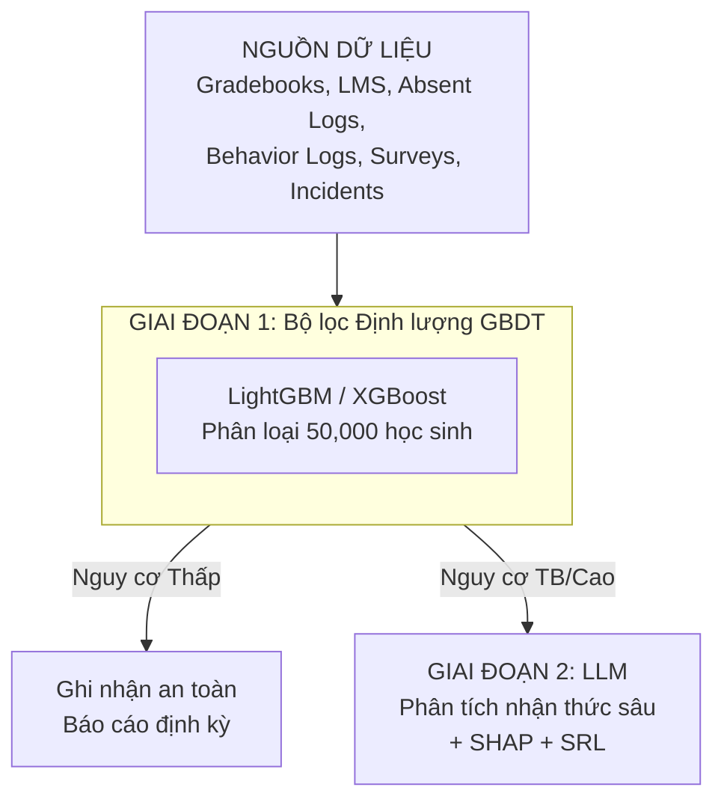
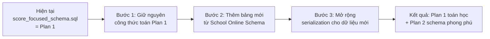

# So Sánh Plan 1 vs Plan 2 - Hệ Thống Cảnh Báo Sớm Học Lực (EWS)

## 1. Tổng Quan Kiến Trúc (Giống nhau)

Cả 2 plan đều chia sẻ cùng kiến trúc tổng thể:

---

## 2. SO SÁNH CHI TIẾT CÔNG THỨC TOÁN HỌC

### 2.1. Xu hướng Điểm số (Grade Slope / Grade Trend)

| Khía cạnh | Plan 1 (score_focused) | Plan 2 (School Online) |
|---|---|---|
| **Công thức** | ✅ **Có**: `REGR_SLOPE(score, week_number)` - Hồi quy tuyến tính OLS | ❌ **Không có** - Chỉ có comment "sẽ được tính toán qua OLS" trong code Python |
| **SQL cụ thể** | `SELECT regr_slope(score, week_number) as grade_slope FROM fact_subject_academic_records GROUP BY student_id` | Không có SQL tương ứng |
| **Giải thích** | S > 0: tiến bộ; S < 0: suy giảm (cần can thiệp khẩn) | Chỉ là hằng số giả lập `grade_slope = -0.38` |
| **Nguồn bảng** | `s360.fact_subject_academic_records` | Cùng bảng nhưng không có truy vấn cụ thể |

### 2.2. Tỷ lệ Vắng học có Trọng số (Weighted Absenteeism Rate - WAR)

| Khía cạnh | Plan 1 (score_focused) | Plan 2 (School Online) |
|---|---|---|
| **Công thức** | ✅ **Có**: `WAR = Σ(Unexcused×1.0 + Excused×0.2 + Tardy×0.1) / Total_Expected_School_Days × 100` | ❌ **Không có** |
| **Trọng số** | Không phép ×1.0, Có phép ×0.2, Đi muộn ×0.1 | Không định nghĩa |
| **Nguồn bảng** | `fact_absent_logs`, `fact_so_daily_attendance` | Chỉ có bảng nhưng không có logic tính toán |

### 2.3. Điểm trừ Hành vi (Behavior Demerits)

| Khía cạnh | Plan 1 (score_focused) | Plan 2 (School Online) |
|---|---|---|
| **Công thức** | ✅ **Có**: `Behavior_Demerits = Σ I(points_change_j < 0)` (đếm số sự kiện bị trừ điểm) | ❌ **Không có** |
| **Nguồn bảng** | `s360.fact_behavior_logs` | Chỉ có bảng nhưng không có logic |

### 2.4. Xử lý Đa cộng tuyến (Multicollinearity)

| Khía cạnh | Plan 1 (score_focused) | Plan 2 (School Online) |
|---|---|---|
| **Phương pháp** | ✅ **Có**: Kiểm tra VIF (Variance Inflation Factor), ngưỡng VIF > 5 sẽ loại bỏ/kết hợp | ❌ **Không có** |
| **Lý do** | Các biến học đường thường tương quan mạnh (vắng → nộp muộn → điểm thấp) | Không đề cập |

### 2.5. Dịch chuyển Trọng số theo Thời gian (Time-dependent Weight Shifting)

| Khía cạnh | Plan 1 (score_focused) | Plan 2 (School Online) |
|---|---|---|
| **Tuần 5-6 (Khởi động)** | ✅ Điểm 35%, LMS 30%, Chuyên cần 20% | ❌ **Không có** |
| **Trước Cuối kỳ** | ✅ Điểm 55-60%, LMS 15-20%, Chuyên cần 10-15% | ❌ **Không có** |
| **Mục đích** | Tránh overfitting vào điểm số nghèo nàn đầu kỳ, tận dụng tín hiệu LMS sớm | Không đề cập |

---

## 3. SO SÁNH CẤU TRÚC DATABASE

### 3.1. Số lượng Bảng

| Loại | score_focused_schema.sql | School Online Schema.csv |
|---|---|---|
| Tổng số bảng | **24 tables** | **36 tables** |
| Schema public | 10 tables | - |
| Schema s360 | 14 tables | ~30 tables |
| Schema t360 | - | 1 table (dim_t360_homeroom_class_teacher) |
| Schema default (staging) | - | 3 tables |

### 3.2. Bảng có trong School Online nhưng KHÔNG có trong score_focused

| Bảng | Mục đích | Ảnh hưởng đến EWS |
|---|---|---|
| `default.stg_so_exam_moet_path` | Cây phân cấp đầu điểm MOET | Trung bình - hỗ trợ truy vấn phân cấp |
| `default.stg_so_strand_path` | Cây phân cấp chủ đề môn học | Thấp - không ảnh hưởng trực tiếp |
| `default.stg_so_students` | Staging học sinh | Thấp |
| `s360.dim_extracurricular_activity` | Hoạt động ngoại khóa | **Cao** - dữ liệu mới có thể là chỉ báo rủi ro |
| `s360.dim_so_evaluate_progress` | Đánh giá tiến độ định kỳ | **Cao** - feedback định tính quan trọng |
| `s360.dim_so_school_mapping_subject` | Ánh xạ môn học giữa các trường | Trung bình |
| `s360.fact_extracurricular_activity_payments` | Thanh toán ngoại khóa | Thấp |
| `s360.fact_extracurricular_activity_registers` | Đăng ký ngoại khóa | Trung bình - hành vi xã hội |
| `s360.fact_so_absent_extract_late` | Trích xuất vắng/đi muộn | Trung bình |
| `s360.fact_so_evaluate_process_subject_criterion` | Tiêu chí đánh giá quá trình | **Cao** - chi tiết định tính theo tiêu chí |
| `s360.fact_so_subject_mastery` | Mức độ thành thạo môn học | **Cao** - phân loại năng lực chi tiết |
| `s360.link_register_payment` | Liên kết đăng ký-thanh toán | Thấp |
| `t360.dim_t360_homeroom_class_teacher` | Giáo viên chủ nhiệm (tenant) | Thấp |

### 3.3. Trường bổ sung trong các bảng có sẵn (School Online chi tiết hơn)

| Bảng | School Online có thêm |
|---|---|
| `dim_homeroom_class` | `class_leader_id`, `parent_leader_id`, `is_bilingual`, `is_bilingual_prep` |
| `dim_homeroom_class_student` | `tenant_id`, `school_code`, `campus_name` |
| `dim_subject` | `education_stages`, `is_credit`, `is_level_esl`, `is_cambridge_k11`, `is_sync_lms` |
| `fact_overall_academic_records` | `final_grade_after_summer`, `s1/s2_final_behavior_point`, `change_final_conduct_*` (nhiều trường audit), `vocational_certificate`, `reward`, `special_reward`, `title` |
| `fact_gradebooks` | `final_grade_convert`, `is_grade_letter`, `is_move_in_grade`, `course_id`, `homeroom_teacher_id` |
| `fact_so_assignment_grade` | `tenant_id`, `school_id`, `is_sync_from_exam`, `is_push_notification` |
| `fact_behavior_logs` | `behavior_before_id`, `object_type`, `sanction_code`, `sanction_name` |

---

## 4. KHÁC BIỆT VỀ NGUỒN DỮ LIỆU ĐỊNH TÍNH CHO GIAI ĐOẠN 2 (LLM)

| Khía cạnh | Plan 1 (score_focused) | Plan 2 (School Online) |
|---|---|---|
| **Bảng notes** | `dim_homeroom_class_student` (trường `special_note`) | `fact_behavior_logs` (trường `description_text`, `behavior_category`) |
| **Giới hạn** | Không giới hạn số bản ghi | `ORDER BY log_date DESC LIMIT 3` |
| **Hardcode category** | `'Biến cố' as behavior_category` (cứng) | `behavior_category` (động, từ bảng) |
| **Trigger scan cho GĐ2** | Bản ghi mới trong `dim_homeroom_class_student.special_note` | Bản ghi mới trong `fact_behavior_logs` và `fact_family_incident_logs` |
| **Phân loại mẫu** | "Ghi chú đặc biệt" | "Chăm sóc đặc biệt" |

---

## 5. ĐÁNH GIÁ VÀ KHUYẾN NGHỊ

### 5.1. Plan nào tốt hơn?

**Về mặt công thức toán học và feature engineering: Plan 1 TỐT HƠN.**

| Tiêu chí | Plan 1 | Plan 2 |
|---|---|---|
| **Chi tiết công thức** | ✅ Đầy đủ (Grade Slope, WAR, Demerits, VIF) | ❌ Thiếu hoàn toàn |
| **Xử lý đa cộng tuyến** | ✅ Có (VIF > 5) | ❌ Không |
| **Dịch chuyển trọng số thời gian** | ✅ Có (Tuần 5-6 → Cuối kỳ) | ❌ Không |
| **Phạm vi schema** | ❌ 24 tables | ✅ 36 tables (phong phú hơn) |
| **Dữ liệu định tính chi tiết** | ❌ Chỉ `special_note` từ `dim_homeroom_class_student` | ✅ `fact_behavior_logs` + `fact_family_incident_logs` |
| **Bảng ngoại khóa / Đánh giá quá trình** | ❌ Không có | ✅ Có (`dim_extracurricular_activity`, `dim_so_evaluate_progress`,...) |
| **Subject Mastery** | ❌ Không có | ✅ Có (`fact_so_subject_mastery`) |

### 5.2. Lộ trình Merge Đề xuất

Vì hệ thống hiện tại đang chạy với `score_focused_schema.sql` (Plan 1), và bạn muốn **merged dần School Online Schema.csv vào**:

**Các bước cụ thể:**

1. **Giữ nguyên toàn bộ công thức toán học từ Plan 1** (Grade Slope, WAR, Behavior Demerits, VIF, Time-weight shifting) - đây là phần xương sống của EWS

2. **Bổ sung các bảng mới từ School Online Schema.csv** ưu tiên theo thứ tự:
   - `fact_so_subject_mastery` → Có thể thay thế / bổ sung cho Grade Slope
   - `dim_so_evaluate_progress` + `fact_so_evaluate_process_subject_criterion` → Dữ liệu định tính cho GĐ2 (LLM)
   - `dim_extracurricular_activity` + `fact_extracurricular_activity_registers` → Feature mới cho GĐ1
   - Các bảng còn lại (staging, payment, v.v.) → Khi cần

3. **Cập nhật Data Serialization (GĐ2)** để bao gồm dữ liệu từ các bảng mới

4. **Bổ sung behavior_category động** từ `fact_behavior_logs` (Plan 2) thay vì hardcode (Plan 1)

### 5.3. Kết luận

**Plan 1 vượt trội về mặt toán học và feature engineering** - đây là phần cốt lõi không thể thiếu cho một EWS. **Plan 2 vượt trội về phạm vi schema** và nguồn dữ liệu định tính phong phú hơn.

**Khuyến nghị:** Lấy Plan 1 làm nền tảng (giữ nguyên công thức), sau đó mở rộng schema và data serialization theo Plan 2. Việc merge này sẽ cho ra plan tổng thể mạnh nhất.
