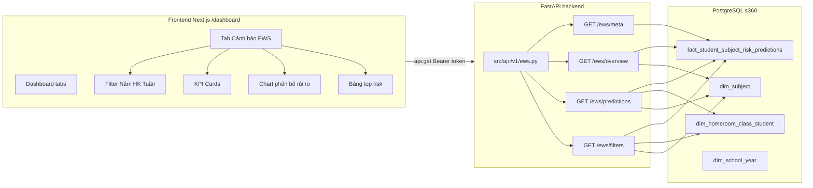

# Plan: Hiển Thị Kết Quả Cảnh Báo EWS (CatBoost) trên Dashboard

> Scope: `http://localhost:3000/dashboard` — hiển thị kết quả dự báo rủi ro EWS đã persist trong
> `s360.fact_student_subject_risk_predictions` (14,432 rows — năm 2025, HK1, tuần 8 & 14, chỉ môn SCORED).

---

## 1. BỐI CẢNH & DỮ LIỆU SẴN CÓ

### 1.1 Bảng dữ liệu nguồn
- Bảng: `s360.fact_student_subject_risk_predictions`
- Khóa duy nhất: `(student_code, subject_id, school_year_id, semester_index, evaluated_at_week)`
- Cột kết quả: `risk_score` [26.41, 99.80], `risk_level` (enum `LOW | MODERATE | HIGH | CRITICAL`), `risk_probability`, `evaluated_at_date`
- Cột feature (24): 3 categorical/context (`subject_id`, `subject_category`, `grade_level`) + 21 numeric (9 Temporal: `weighted_early_avg`, `weighted_late_avg`, `score_slope`, `score_volatility`, `max_drop`, `last_score`, `max_coefficient_so_far`, `high_weight_score_count`, `last_high_weight_score`; 5 LMS; 4 Attendance; 3 Behavior).
- **KHÔNG lưu** tên HS / lớp / môn → mọi truy vấn hiển thị phải JOIN các bảng dim bên dưới.
- **KHÔNG lưu** `shap_drivers` (bị lọc khi UPSERT) → UI không hiển thị SHAP, chỉ dùng feature value.

### 1.2 Bảng JOIN (schema s360 — đã xác nhận)
| Bảng | Cột dùng để hiển thị |
|---|---|
| `s360.dim_homeroom_class_student` | `student_code`, `student_name`, `class_name`, `grade_id`, `grade_name`, `school_year_id`, `so_school_id` |
| `s360.dim_subject` | `id`, `name`, `code`, `subject_category` |
| `s360.dim_school_year` | `id`, `fullname`, `start_date` |

### 1.3 Dữ liệu thực tế (đã verify trong DB)
- Năm 2025, học kỳ 1: có dự báo ở **tuần 8** và **tuần 14** — mỗi tuần **7,216** dự báo (SCORED only).
- Phân bố risk_level tuần 8: CRITICAL 148 / HIGH 3,007 / MODERATE 3,328 / LOW 733.
- Sau khi fix mock (`created_at` theo mốc thi) + loại môn PASS_FAIL, `weighted_late_avg` + `score_slope` **đã có dữ liệu đầy đủ** (không còn 100% NaN). UI vẫn xử lý null → hiện "—" để an toàn.
- **Lưu ý feature vector**: mã nguồn đang định nghĩa **24 features** (3 categorical + 9 temporal + 5 LMS + 4 attendance + 3 behavior). Số "22" trong comment cũ (`feature_extractor.py:25`, `train_catboost_ews.py:58`) và `plan_catboost_ews_model.md` §2 là **STALE** — mô hình `.cbm` đã retrain với 24 features, bảng persisted lưu đủ 24 cột feature. `evaluated_at_week`/`semester_index` là **khóa metadata**, KHÔNG nằm trong vector (đúng ý team), còn `subject_category`/`grade_level` ĐÃ nằm trong vector (3 categorical). Ý tưởng của team đúng nhưng con số chuẩn là **24**.

---

## 2. KIẾN TRÚC TỔNG THỂ



---

## 3. BACKEND — FastAPI

### 3.1 Schema mới `src/schemas/ews.py`
```python
class EwsLevelCount(BaseModel):
    level: str  # LOW | MODERATE | HIGH | CRITICAL
    count: int

class EwsPredictionRow(BaseModel):
    student_code: str
    student_name: str | None
    class_name: str | None
    grade_name: str | None
    subject_id: int
    subject_name: str | None
    subject_code: str | None
    subject_category: str | None
    evaluated_at_week: int
    risk_score: float
    risk_level: str
    risk_probability: float | None
    risk_factors: list[str] = []  # badges: SLOPE_DOWN | LAST_SCORE_LOW | ABSENTEEISM
    last_score: float | None
    weighted_early_avg: float | None
    weighted_late_avg: float | None
    score_slope: float | None
    score_volatility: float | None
    max_drop: float | None
    evaluated_at_date: date | None

class EwsOverview(BaseModel):
    school_year_id: int
    semester_index: int
    evaluated_at_week: int
    total_predictions: int
    total_students: int
    at_risk_count: int  # HIGH + CRITICAL
    avg_risk_score: float | None
    levels: list[EwsLevelCount]
    top_risk_subjects: list[dict]  # [{subject_name, cnt, avg_risk}]

class EwsWeekOption(BaseModel):
    school_year_id: int
    semester_index: int
    evaluated_at_week: int
    school_year_name: str | None

class EwsMeta(BaseModel):
    weeks: list[EwsWeekOption]
    subjects: list[dict]  # [{id, name, code}] theo bộ lọc hiện tại
    grades: list[dict]    # [{grade_id, grade_name}]
    classes: list[str]    # tên lớp

class EwsPagedResult(BaseModel):
    items: list[EwsPredictionRow]
    total: int
    limit: int
    offset: int
```

### 3.2 Router mới `src/api/v1/ews.py`
- `router = APIRouter(prefix="/ews", tags=["Early Warning System"])`
- Mọi endpoint dùng `CurrentUser` (xác thực), thao tác bằng `text()` SQL như `analytics_v2.py`.
- **RBAC (đã chốt mục 6)**: tất cả role đã đăng nhập đều xem được toàn trường (đồng nhất với tab Cảnh báo quy tắc hiện tại). Không khóa chi tiết CRITICAL theo role.
- **Không lọc theo `user.school_id`**: s360 hiện là single-school (mock 1 trường, `so_school_id` không map trực tiếp với `school_id` UUID của app). Ghi chú rõ trong code để mở rộng sau.

#### Endpoint 1 — `GET /ews/meta`
Danh sách tổ hợp `(school_year_id, semester_index, evaluated_at_week)` có dữ liệu:
```sql
SELECT rp.school_year_id, sy.fullname AS school_year_name, rp.semester_index,
       rp.evaluated_at_week
FROM s360.fact_student_subject_risk_predictions rp
LEFT JOIN s360.dim_school_year sy ON rp.school_year_id = sy.id
GROUP BY rp.school_year_id, sy.fullname, rp.semester_index, rp.evaluated_at_week
ORDER BY rp.school_year_id, rp.semester_index, rp.evaluated_at_week;
```

#### Endpoint 2 — `GET /ews/overview?school_year_id=&semester_index=&evaluated_at_week=`
```sql
SELECT COUNT(*) AS total_predictions,
       COUNT(DISTINCT rp.student_code) AS total_students,
       COUNT(*) FILTER (WHERE rp.risk_level IN ('HIGH','CRITICAL')) AS at_risk_count,
       ROUND(AVG(rp.risk_score)::numeric, 2) AS avg_risk_score,
       COUNT(*) FILTER (WHERE rp.risk_level='LOW') AS low,
       COUNT(*) FILTER (WHERE rp.risk_level='MODERATE') AS moderate,
       COUNT(*) FILTER (WHERE rp.risk_level='HIGH') AS high,
       COUNT(*) FILTER (WHERE rp.risk_level='CRITICAL') AS critical
FROM s360.fact_student_subject_risk_predictions rp
WHERE rp.school_year_id = :school_year_id
  AND rp.semester_index = :semester_index
  AND rp.evaluated_at_week = :evaluated_at_week;
```
Kèm `top_risk_subjects` (môn nguy cơ cao nhất theo avg risk):
```sql
SELECT sub.name AS subject_name, COUNT(*) AS cnt, ROUND(AVG(rp.risk_score)::numeric,2) AS avg_risk
FROM s360.fact_student_subject_risk_predictions rp
JOIN s360.dim_subject sub ON rp.subject_id = sub.id
WHERE rp.school_year_id = :school_year_id
  AND rp.semester_index = :semester_index
  AND rp.evaluated_at_week = :evaluated_at_week
GROUP BY sub.name
ORDER BY avg_risk DESC LIMIT 10;
```

#### Endpoint 3 — `GET /ews/predictions` (có phân trang + lọc)
Tham số: `school_year_id`, `semester_index`, `evaluated_at_week` (bắt buộc); `risk_level` (tùy chọn), `subject_id` (tùy chọn), `grade_id` (tùy chọn), `class_name` (tùy chọn), `min_risk_score` (tùy chọn — mặc định FE dùng để lọc HIGH+CRITICAL), `limit` (mặc định 50), `offset` (mặc định 0).
```sql
WITH hcs AS (
    -- DISTINCT ON: mỗi học sinh chỉ lấy 1 lớp (tránh trùng khi HS chuyển lớp trong năm)
    SELECT DISTINCT ON (student_code)
        student_code, student_name, class_name, grade_id, grade_name
    FROM s360.dim_homeroom_class_student
    WHERE school_year_id = :school_year_id
    ORDER BY student_code, is_active DESC, homeroom_class_id
)
SELECT rp.student_code, hcs.student_name, hcs.class_name, hcs.grade_name,
       rp.subject_id, sub.name AS subject_name, sub.code AS subject_code,
       sub.subject_category,
       rp.evaluated_at_week, rp.risk_score, rp.risk_level, rp.risk_probability,
       rp.last_score, rp.weighted_early_avg, rp.weighted_late_avg,
       rp.score_slope, rp.score_volatility, rp.max_drop, rp.evaluated_at_date,
       ARRAY_REMOVE(ARRAY[
           CASE WHEN rp.score_slope < -0.5 THEN 'SLOPE_DOWN' END,
           CASE WHEN rp.last_score < 5.0 THEN 'LAST_SCORE_LOW' END,
           CASE WHEN rp.daily_absence_rate > 0.1 THEN 'ABSENTEEISM' END
       ], NULL) AS risk_factors
FROM s360.fact_student_subject_risk_predictions rp
LEFT JOIN hcs ON rp.student_code = hcs.student_code
LEFT JOIN s360.dim_subject sub ON rp.subject_id = sub.id
WHERE rp.school_year_id = :school_year_id
  AND rp.semester_index = :semester_index
  AND rp.evaluated_at_week = :evaluated_at_week
  AND (:risk_level IS NULL OR rp.risk_level = :risk_level)
  AND (:subject_id IS NULL OR rp.subject_id = :subject_id)
  AND (:grade_id IS NULL OR hcs.grade_id = :grade_id)
  AND (:class_name IS NULL OR hcs.class_name = :class_name)
  AND (:min_risk_score IS NULL OR rp.risk_score >= :min_risk_score)
ORDER BY rp.risk_score DESC
LIMIT :limit OFFSET :offset;
```
> `total` dùng COUNT(*) với cùng CTE `hcs` + cùng WHERE (kèm điều kiện lọc) để khớp phân trang.
```
Endpoint trả `{items, total, limit, offset}`; `total` tính bằng `COUNT(*)` với cùng WHERE.

#### Endpoint 4 — `GET /ews/filters?school_year_id=&semester_index=&evaluated_at_week=`
Trả danh sách distinct `subjects`, `grades`, `classes` để đổ dropdown:
```sql
SELECT DISTINCT sub.id, sub.name, sub.code
FROM s360.fact_student_subject_risk_predictions rp
JOIN s360.dim_subject sub ON rp.subject_id = sub.id
WHERE rp.school_year_id = :school_year_id AND rp.semester_index = :semester_index
  AND rp.evaluated_at_week = :evaluated_at_week
ORDER BY sub.name;
-- tương tự: grades từ dim_homeroom_class_student, classes (class_name) distinct
```

### 3.3 Đăng ký router
`src/api/v1/__init__.py`: thêm `ews` vào import và `api_router.include_router(ews.router)`.

---

## 4. FRONTEND — Next.js

### 4.1 Types `frontend/src/lib/types.ts` (thêm cuối file)
```ts
export type EwsRiskLevel = "LOW" | "MODERATE" | "HIGH" | "CRITICAL";
export const EWS_RISK_ORDER: EwsRiskLevel[] = ["LOW", "MODERATE", "HIGH", "CRITICAL"];
export const EWS_RISK_LABELS: Record<EwsRiskLevel, string> = {
  LOW: "Thấp", MODERATE: "Trung bình", HIGH: "Cao", CRITICAL: "Nghiêm trọng",
};
export const EWS_RISK_COLORS: Record<EwsRiskLevel, string> = {
  LOW: "#10b981", MODERATE: "#f59e0b", HIGH: "#f97316", CRITICAL: "#ef4444",
};

export interface EwsPredictionRow { /* khớp src/schemas/ews.py */ }
export interface EwsOverview { /* ... */ }
export interface EwsMeta { /* ... */ }
export interface EwsPagedResult { items: EwsPredictionRow[]; total: number; limit: number; offset: number; }
```
> Lưu ý: `risk_level` EWS dùng `MODERATE` — khác `Medium` của tab Cảnh báo quy tắc hiện tại. Không tái dùng `RISK_COLORS`/`RISK_VI` cũ.

### 4.2 Component mới `frontend/src/components/dashboard/EwsWarningTab.tsx`
- Tự quản state: `meta`, `schoolYearId` (mặc định 2025), `semesterIndex` (mặc định 1), `week` (mặc định tuần mới nhất từ meta), `riskLevel`, `subjectId`, `gradeId`, `className`, `page`.
- Gọi API (lazy, theo bộ lọc):
  - `api.get<EwsMeta>("/ews/meta")` lúc mount → đổ bộ lọc.
  - `api.get<EwsOverview>("/ews/overview?school_year_id=...")` khi đổi filter.
  - `api.get<EwsPagedResult>("/ews/predictions?school_year_id=...")` khi đổi filter/trang.
- UI (tái sử dụng style Card/Kpi/LoadingState/InfoTooltip như page hiện tại — copy nhẹ các helper local):
  - **Filter bar**: Năm học, Học kỳ (1/2), Tuần (dropdown từ meta), Mức rủi ro (ALL + 4 mức), Môn, Khối, Lớp.
  - **KPI cards**: Tổng dự báo, HS bị cảnh báo (HIGH+CRITICAL), Tỷ lệ CRITICAL, Điểm rủi ro TB.
  - **Chart phân bố rủi ro**: BarChart (recharts) theo 4 mức, màu từ `EWS_RISK_COLORS`.
  - **Bảng top risk**: Mã HS, Họ tên, Lớp, Môn, Risk score, Risk level (badge màu), Xác suất, **Nguyên nhân rủi ro (badges)**, Điểm gần nhất (`last_score`), ĐTB sớm (`weighted_early_avg`), Độ dốc (`score_slope`) — null hiện "—".
  - **Badge nguyên nhân** (từ `risk_factors`): 📉 `SLOPE_DOWN` → "Tụt dốc điểm" (score_slope < -0.5); ⚠️ `LAST_SCORE_LOW` → "Bài thi mới nhất rớt" (last_score < 5.0); 🚫 `ABSENTEEISM` → "Vắng học nhiều" (daily_absence_rate > 0.1). Hiển thị dạng chip màu ngay cạnh cột Môn.
  - **Phân trang** (Prev/Next + tổng) theo `total/limit/offset`.

### 4.3 Tích hợp vào `frontend/src/app/(app)/dashboard/page.tsx`
- Thêm tab mới vào `TABS` (đề xuất: `{ key: "ews", label: "Cảnh báo EWS", icon: ShieldAlert }`) — đặt cạnh tab "Cảnh báo sớm" hiện có.
- Thêm `type TabKey = ... | "ews"` và render branch: `{tab === "ews" && <EwsWarningTab />}`.
- Import component.

> **Đề xuất vị trí — chờ user chọn (mục 6)**: Tab mới riêng "Cảnh báo EWS" (khuyến nghị, tách biệt khỏi Cảnh báo quy tắc) HOẶC sub-toggle trong tab "Cảnh báo sớm" hiện tại.

---

## 5. CÁC FILE THAY ĐỔI / TẠO MỚI

| Loại | File | Hành động |
|---|---|---|
| Backend | `src/schemas/ews.py` | Tạo mới — Pydantic DTO |
| Backend | `src/api/v1/ews.py` | Tạo mới — router 4 endpoints |
| Backend | `src/api/v1/__init__.py` | Sửa — import + include_router |
| Frontend | `frontend/src/lib/types.ts` | Sửa — thêm EWS types/labels/colors |
| Frontend | `frontend/src/components/dashboard/EwsWarningTab.tsx` | Tạo mới — UI tab |
| Frontend | `frontend/src/app/(app)/dashboard/page.tsx` | Sửa — thêm tab + render |

---

## 6. QUYẾT ĐỊNH ĐÃ CHỐT (đã xác nhận với user)

1. **Vị trí hiển thị**: ✅ (A) Tab mới riêng "Cảnh báo EWS" trong dashboard, đặt cạnh tab "Cảnh báo sớm" hiện tại.
2. **Quyền xem (RBAC)**: ✅ (A) Mọi role đăng nhập đều xem được toàn trường (đồng nhất tab Cảnh báo hiện tại).
   - Ghi chú tương lai: RBAC chi tiết theo phân công GV—lớp—môn (`teacher_assignments` + bridge app↔s360 qua `users.teacher_code`/`subject_id` + `dim_homeroom_class.teacher_code`) để giai đoạn sau; mock data hiện chưa có phân công nên chưa triển khai.
3. **Nội dung bảng**: ✅ hiển thị cả feature value (`last_score`, `weighted_early_avg`, `score_slope`) — SHAP drivers không persist nên không hiển thị.
4. **Mặc định tuần hiển thị**: ✅ tuần mới nhất có dữ liệu (hiện là tuần 14).
5. **Hiển thị nguyên nhân rủi ro (badges)**: ✅ tính trực tiếp trong SQL từ feature đã persist (KHÔNG cần SHAP) — `SLOPE_DOWN`, `LAST_SCORE_LOW`, `ABSENTEEISM` theo ngưỡng team product. Thêm `risk_factors: list[str]` vào `EwsPredictionRow`.
6. **JOIN lớp chống trùng**: ✅ dùng `DISTINCT ON (student_code)` cho `dim_homeroom_class_student` (HS chuyển lớp) — tái dùng pattern có sẵn trong `feature_extractor.py`.
7. **Số lượng feature**: ✅ mã nguồn = **24** features (3 categorical + 21 numeric); "22" chỉ còn ở comment cũ → dọn comment lệch khi code. Không ảnh hưởng phần hiển thị.

---

## 7. VERIFICATION

1. `python -m py_compile src/schemas/ews.py src/api/v1/ews.py`
2. Khởi động backend + lấy token, chạy curl 4 endpoints (meta → overview → filters → predictions) xác nhận JSON đúng schema, JOIN trả đủ tên HS/lớp/môn.
3. `cd frontend && npm run dev` → mở `/dashboard` → tab EWS: bộ lọc đổ đúng (năm 2025, HK1, tuần 8/14), KPI/chart/bảng khớp số liệu DB (week 8: CRITICAL 148 / HIGH 3007 / MODERATE 3328 / LOW 733), null hiển thị "—".
4. Kiểm tra phân trang + lọc theo risk_level/môn/khối/lớp.
