# Plan: Generator Dữ Liệu Train EWS — Mock Data Synthesis (`generate_train_dataset.py`)

> **Tech Refinements (đã approve):**
> 1. **Numpy Vectorization** — Toàn bộ phép tính được vector hóa bằng Numpy array thay vì vòng lặp Python thuần, đảm bảo sinh ~113.080 rows trong < 1 giây.
> 2. **Feature Noise (5%)** — `add_noise_to_features(noise_level=0.05)` giúp dataset mịn, chống overfitting cho GBDT.

> **Mục tiêu:** Xây dựng script `data_mock/mock_train_data/generate_train_dataset.py` để **SINH DỮ LIỆU TRAIN CHO GBDT** bằng mô hình nhân quả tiềm ẩn (Latent Causal Model). Script này **KHÔNG query database thật** — nó tự sinh ra cả 22 features ($X$) và ground truth ($y$) từ các latent variables của học sinh.
>
> **Nguyên lý:** Temporal Asymmetry — features là quan sát TỪNG PHẦN tại checkpoint, ground truth là kết quả CHỐT SỔ cuối kỳ từ full trajectory. GBDT học mối quan hệ giữa quan sát sớm và kết quả cuối, không thể "học công thức" vì thiếu dữ liệu tương lai.

---

## I. KIẾN TRÚC TỔNG THỂ — LATENT CAUSAL MODEL

```mermaid
flowchart LR
    subgraph LAT["Latent Variables (TAD-PG + mở rộng)"]
        A1["persona + profile G1-G9"]
        A2["c_math, c_lang (năng lực)"]
        A3["eff (effort)"]
        A4["conduct_tendency"]
        A5["attendance_tendency"]
    end

    subgraph TRAJ["Full Trajectory Generator"]
        B1["Exam scores<br/>4-5 exams/semester<br/>có hệ số 1-2-3-3"]
        B2["LMS assignments<br/>theo tuần"]
        B3["Attendance<br/>~185 ngày/semester"]
        B4["Behavior logs<br/>vi phạm + kỷ luật"]
    end

    subgraph GT["Ground Truth y"]
        C1["final_grade = 0.65×score + 0.15×lms + 0.10×attendance + 0.10×behavior"]
        C2["actual_risk_level = map final_grade → LOW/MODERATE/HIGH/CRITICAL"]
        C3["is_at_risk = 1 nếu final_grade < 5.0"]
    end

    subgraph FEAT["Features X tại mỗi checkpoint"]
        D1["22 features từ data TRƯỚC cutoff_date"]
        D2["Có NOISE ngẫu nhiên"]
        D3["Thiếu data tương lai → temporal asymmetry"]
    end

    LAT --> TRAJ
    TRAJ --> GT
    TRAJ --> FEAT
    
    GT --> STORE["s360.train_student_subject_risk_dataset<br/>+ CSV"]
    FEAT --> STORE
```



### Temporal Asymmetry — Lý do KHÔNG có Circular Logic

| Checkpoint | GBDT thấy | Ground Truth (y) | Có học được công thức? |
|:-----------|:----------|:-----------------|:-----------------------|
| Tuần 5 | 1 bài KT + LMS sớm + điểm danh đầu kỳ | final_grade = weighted avg CẢ 4-5 bài | ❌ Còn 3-4 bài chưa thi |
| Tuần 8 | 2 bài KT (hệ số 1+2) + LMS 8 tuần | final_grade = weighted avg CẢ 4-5 bài | ❌ Còn 2-3 bài + cuối kỳ |
| Tuần 11 | 3 bài KT (hệ số 1+2+3) | final_grade = weighted avg CẢ 4-5 bài | ❌ Còn 1-2 bài cuối kỳ |
| Tuần 14 | 3 bài + gần hết LMS | final_grade = weighted avg CẢ 4-5 bài | ⚠️ Gần nhưng thiếu cuối kỳ |
| Tuần 16 | 3-4 bài | final_grade = weighted avg CẢ 4-5 bài | ⚠️ Vẫn thiếu bài cuối kỳ |

GBDT phải học **xác suất**, không phải công thức: "nếu đến tuần 8 điểm trung bình 7.5 nhưng slope đang giảm -0.7/tuần, thì **khả năng cao** final_grade sẽ xuống dưới 5.0" — chứ không phải "final_grade = 0.65 × ..." một cách deterministic.

---

## II. CHI TIẾT GROUND TRUTH GENERATION (65/15/10/10)

### 1. Score Component (Trọng số 65% — Yếu tố Quyết định)

Điểm số là yếu tố NÒNG CỐT quyết định final_grade. Các yếu tố khác chỉ là điều chỉnh nhẹ.

```python
def compute_score_component(student, subject, semester):
    """
    Sinh 4-5 bài kiểm tra cho 1 môn trong 1 học kỳ.
    Mỗi bài có hệ số khác nhau theo Quy chế MoET.
    """
    # 1. Base ability từ TAD-PG
    if subject.is_math_or_science:
        base = 6.5 + 1.5 * student.c_math + 0.5 * student.eff
    else:
        base = 6.5 + 1.5 * student.c_lang + 0.5 * student.eff
    base = clip(base, 0.0, 10.0)
    
    # 2. Score profile quyết định trend
    profile = student.profile  # G1-G9
    
    # 3. Định nghĩa các bài kiểm tra trong học kỳ
    exams = [
        {"name": "Thường xuyên 1", "coeff": 1, "week": 4},
        {"name": "Thường xuyên 2", "coeff": 2, "week": 8},
        {"name": "Giữa kỳ",        "coeff": 3, "week": 12},
        {"name": "Cuối kỳ",        "coeff": 3, "week": 18},
    ]
    
    scores = []
    for exam in exams:
        # Score phụ thuộc: base + profile_trend + noise
        trend_offset = get_profile_trend(profile, exam["week"])
        noise = np.random.normal(0, 0.3)  # noise nhẹ
        score = clip(base + trend_offset + noise, 0.0, 10.0)
        scores.append({"score": score, "coeff": exam["coeff"], "week": exam["week"]})
    
    return scores

def get_profile_trend(profile, week):
    """
    Profile G1-G9 định hình xu hướng điểm:
    G1: cao ổn định         G4: TB-thấp biến động    G7: giảm mạnh
    G2: TB ổn định          G5: cao giảm dần         G8: rất thấp
    G3: cải thiện dần       G6: thấp nhưng LMS tốt   G9: zero
    """
    trends = {
        "G1": lambda w: 0.0,                              # ổn định cao
        "G2": lambda w: 0.0,                              # ổn định TB
        "G3": lambda w: 0.3 * (w / 18),                   # tăng dần
        "G4": lambda w: np.random.uniform(-0.5, 0.5),     # dao động
        "G5": lambda w: -0.05 * w,                        # giảm dần
        "G6": lambda w: np.random.uniform(-1.0, -0.5),    # thấp
        "G7": lambda w: -0.08 * w,                        # giảm mạnh
        "G8": lambda w: -1.0,                             # rất thấp
        "G9": lambda w: -base,                            # zero
    }
    return trends.get(profile, lambda w: 0.0)(week)
```

### 2. LMS Component (Trọng số 15% — Ảnh hưởng Tham khảo)

```python
def compute_lms_component(student, semester):
    """
    LMS engagement: submission rate + average score.
    Học sinh chăm chỉ LMS → điểm cộng nhẹ.
    Học sinh bỏ bê LMS → điểm trừ nhẹ.
    """
    # Persona khác nhau → LMS behavior khác nhau
    if student.persona in ("High_Achiever", "STEM_Focus"):
        sub_rate = np.random.uniform(0.85, 0.98)
        avg_score = np.random.uniform(7.5, 9.5)
    elif student.persona == "Diligent_Average":
        sub_rate = np.random.uniform(0.70, 0.90)
        avg_score = np.random.uniform(6.0, 8.0)
    elif student.persona == "Academic_At_Risk":
        sub_rate = np.random.uniform(0.20, 0.50)
        avg_score = np.random.uniform(2.0, 5.0)
    else:
        sub_rate = np.random.uniform(0.50, 0.80)
        avg_score = np.random.uniform(5.0, 7.0)
    
    # LMS component scale 0-10
    lms_raw = 10.0 * sub_rate * (avg_score / 10.0)
    
    return {
        "lms_component": clip(lms_raw, 0.0, 10.0),
        "submission_rate": sub_rate,
        "avg_score": avg_score,
        "daily_logs": generate_lms_daily_logs(sub_rate, avg_score, semester),
    }
```

### 3. Attendance Component (Trọng số 10% — Ảnh hưởng Nhẹ)

```python
def compute_attendance_component(student, semester):
    """
    Tỷ lệ chuyên cần. Học sinh đi học đều → điểm cộng rất nhẹ.
    Học sinh nghỉ nhiều → điểm trừ nhẹ.
    """
    # attendance_tendency từ latent variable
    base_absence = clip(0.5 - 0.3 * student.attendance_tendency, 0.01, 0.50)
    
    # Persona modifier
    if student.persona == "Academic_At_Risk":
        absence_rate = clip(base_absence + 0.15, 0.05, 0.60)
    elif student.persona == "Diligent_Average":
        absence_rate = clip(base_absence - 0.05, 0.01, 0.30)
    else:
        absence_rate = base_absence
    
    # Attendance scale 0-10: càng vắng càng thấp
    attend_raw = 10.0 * (1.0 - absence_rate)
    
    return {
        "attendance_component": clip(attend_raw, 0.0, 10.0),
        "absence_rate": absence_rate,
        "daily_logs": generate_daily_attendance(absence_rate, semester),
    }
```

### 4. Behavior Component (Trọng số 10% — Ảnh hưởng Rất Nhẹ)

```python
def compute_behavior_component(student, semester):
    """
    Hạnh kiểm, kỷ luật. Vi phạm đơn lẻ hầu như không ảnh hưởng đến final_grade.
    Chỉ khi vi phạm NẶNG + TÁI PHẠM nhiều lần mới ảnh hưởng đáng kể.
    """
    # conduct_tendency từ latent variable
    base_demerit = max(0, 1.0 - 0.5 * student.conduct_tendency)
    
    if student.persona == "Academic_At_Risk":
        demerit = base_demerit * np.random.uniform(2.0, 5.0)
        repeat_offenses = int(np.random.poisson(2))
        severe_sanctions = int(np.random.poisson(0.5))
    elif student.persona == "High_Achiever":
        demerit = base_demerit * np.random.uniform(0.0, 0.5)
        repeat_offenses = 0
        severe_sanctions = 0
    else:
        demerit = base_demerit * np.random.uniform(0.0, 2.0)
        repeat_offenses = int(np.random.poisson(0.3))
        severe_sanctions = int(np.random.poisson(0.1))
    
    # Behavior scale 0-10
    behavior_raw = clip(10.0 - demerit * 0.5, 0.0, 10.0)
    
    return {
        "behavior_component": behavior_raw,
        "total_demerit_points": round(demerit, 2),
        "repeat_offense_count": repeat_offenses,
        "severe_sanction_count": severe_sanctions,
        "logs": generate_behavior_logs(demerit, semester),
    }
```

### 5. Công thức Tổng hợp Ground Truth

```python
def compute_ground_truth(student, subject, semester):
    """
    Tổng hợp 4 components để ra GROUND TRUTH (y).
    """
    exams = compute_score_component(student, subject, semester)
    lms = compute_lms_component(student, semester)
    attendance = compute_attendance_component(student, semester)
    behavior = compute_behavior_component(student, semester)
    
    # Score component: weighted avg của tất cả bài kiểm tra
    total_weight = sum(e["coeff"] for e in exams)
    score_component = sum(e["score"] * e["coeff"] for e in exams) / total_weight
    
    # Công thức 65/15/10/10
    latent_final_grade = (
        0.65 * score_component +
        0.15 * lms["lms_component"] +
        0.10 * attendance["attendance_component"] +
        0.10 * behavior["behavior_component"]
    )
    actual_final_grade = clip(round(latent_final_grade, 1), 0.0, 10.0)
    
    # Mapping
    if actual_final_grade >= 6.5:
        actual_risk_level, is_at_risk = "LOW", 0
    elif actual_final_grade >= 5.0:
        actual_risk_level, is_at_risk = "MODERATE", 0
    elif actual_final_grade >= 3.5:
        actual_risk_level, is_at_risk = "HIGH", 1
    else:
        actual_risk_level, is_at_risk = "CRITICAL", 1
    
    return {
        "actual_final_grade": actual_final_grade,
        "actual_risk_level": actual_risk_level,
        "is_at_risk": is_at_risk,
        # Trả về full trajectory để tính features
        "exams": exams,
        "lms": lms,
        "attendance": attendance,
        "behavior": behavior,
    }
```

### Ví dụ Nghiệp vụ Cụ thể (65/15/10/10)

| Kịch bản | Score (65%) | LMS (15%) | Attend (10%) | Beh (10%) | final_grade | Risk Level | Giải thích |
|:----------|:-----------|:----------|:-------------|:----------|:------------|:-----------|:-----------|
| Giỏi, vi phạm 1 lần | 8.5 | 8.0 | 9.5 | 9.5 | **8.5** | **LOW** | ✅ Điểm cao → không cảnh báo |
| TB, không vi phạm | 5.8 | 6.5 | 9.0 | 10.0 | **6.3** | **MODERATE** | ✅ Theo dõi nhẹ |
| Yếu, chăm chỉ, đi học đều | 3.5 | 8.5 | 9.8 | 10.0 | **4.9** | **HIGH** | ✅ Điểm thấp → vẫn cảnh báo |
| TB khá, vi phạm + lơ LMS | 6.0 | 3.0 | 7.0 | 5.0 | **5.5** | **MODERATE** | ✅ Nhiều yếu tố nhưng điểm còn TB |
| Yếu, vi phạm nặng, nghỉ học | 2.0 | 2.0 | 4.0 | 3.0 | **2.2** | **CRITICAL** | ✅ Khẩn cấp |

---

## III. FEATURES EXTRACTION (X) TẠI CHECKPOINT

### 1. Temporal Features (9 features) — từ exam scores đến cutoff_date

```python
def compute_temporal_features(exams, checkpoint_week):
    """
    Tính 9 temporal features CHỈ từ các bài kiểm tra
    đã diễn ra TRƯỚC hoặc TẠI checkpoint_week.
    """
    # Lọc bài kiểm tra đến checkpoint
    seen_exams = [e for e in exams if e["week"] <= checkpoint_week]
    
    if len(seen_exams) == 0:
        return default_temporal_features()  # fallback cho tuần đầu
    
    scores = [e["score"] for e in seen_exams]
    coeffs = [e["coeff"] for e in seen_exams]
    weeks = [e["week"] for e in seen_exams]
    
    # weighted_early_avg: trung bình có hệ số nửa đầu (50% số bài)
    mid = max(1, len(seen_exams) // 2)
    early_scores = scores[:mid]
    early_coeffs = coeffs[:mid]
    weighted_early_avg = sum(s * c for s, c in zip(early_scores, early_coeffs)) / sum(early_coeffs)
    
    # weighted_late_avg: trung bình có hệ số nửa sau
    late_scores = scores[mid:]
    late_coeffs = coeffs[mid:]
    weighted_late_avg = sum(s * c for s, c in zip(late_scores, late_coeffs)) / sum(late_coeffs) if late_coeffs else weighted_early_avg
    
    # score_slope: OLS slope (không weight)
    if len(weeks) >= 2:
        x = np.array(weeks)
        y = np.array(scores)
        A = np.vstack([x, np.ones(len(x))]).T
        slope, _ = np.linalg.lstsq(A, y, rcond=None)[0]
        score_slope = round(float(slope), 4)
    else:
        score_slope = 0.0
    
    # score_volatility: raw std dev
    score_volatility = round(float(np.std(scores)), 4) if len(scores) >= 2 else 0.0
    
    # max_drop: max negative difference between consecutive exams
    drops = [scores[i] - scores[i-1] for i in range(1, len(scores))]
    max_drop = round(abs(min(drops)), 2) if drops else 0.0
    
    # last_score: điểm mới nhất
    last_score = scores[-1]
    
    # max_coefficient_so_far: hệ số lớn nhất đã gặp
    max_coefficient_so_far = max(coeffs)
    
    # high_weight_score_count: số bài có hệ số >= 2.0
    high_weight_score_count = sum(1 for c in coeffs if c >= 2.0)
    
    # last_high_weight_score: điểm bài hệ số cao gần nhất
    high_weight_scores = [(s, w) for s, c, w in zip(scores, coeffs, weeks) if c >= 2.0]
    last_high_weight_score = high_weight_scores[-1][0] if high_weight_scores else last_score
    
    return {
        "weighted_early_avg": round(weighted_early_avg, 2),
        "weighted_late_avg": round(weighted_late_avg, 2),
        "score_slope": score_slope,
        "score_volatility": score_volatility,
        "max_drop": max_drop,
        "last_score": last_score,
        "max_coefficient_so_far": max_coefficient_so_far,
        "high_weight_score_count": high_weight_score_count,
        "last_high_weight_score": last_high_weight_score,
    }
```

### 2. LMS Features (5 features) — từ data LMS đến cutoff_date

Tương tự, tính các chỉ số LMS từ dữ liệu LMS đã phát sinh đến checkpoint.

### 3. Attendance Features (4 features) — từ điểm danh đến cutoff_date

Từ daily attendance logs, tính absence rate, unexcused rate, v.v.

### 4. Behavior Features (3 features) — từ behavior logs đến cutoff_date

Tổng hợp demerit points, repeat offenses, severe sanctions đến checkpoint.

### 5. Thêm NOISE vào Features

```python
def add_noise_to_features(features, noise_level=0.05):
    """
    Thêm noise ngẫu nhiên vào features để GBDT không học được
    quan hệ deterministic giữa features và ground truth.
    noise_level = 5%: giá trị feature ±5% ngẫu nhiên.
    """
    noisy = {}
    for key, value in features.items():
        if isinstance(value, (int, float)):
            noise = 1.0 + np.random.uniform(-noise_level, noise_level)
            noisy[key] = round(value * noise, 4)
        else:
            noisy[key] = value
    return noisy
```

---

## IV. CHECKPOINTS & OUTPUT SCHEMA

### Checkpoints theo học kỳ

| Học kỳ | Checkpoints | Target Scopes |
|:-------|:------------|:--------------|
| HK1 (tuần 1-18) | [5, 8, 11, 14, 16] | SEMESTER_1 |
| HK2 (tuần 19-36) | [23, 26, 29, 32, 34] | SEMESTER_2, FULL_YEAR |

### Output: `train_student_subject_risk_dataset`

```sql
-- Mỗi row = 1 (student, subject, checkpoint)
-- ~1.028 students × 11 subjects × 2 semesters × 5 checkpoints ≈ 113.080 rows

student_code      VARCHAR(50)     -- Mã học sinh
subject_id        INTEGER         -- Môn học
school_year_id    INTEGER         -- Năm học 2025
semester_index    INTEGER         -- 1 hoặc 2
evaluated_at_week INTEGER         -- 5, 8, 11, 14, 16 hoặc 23, 26, 29, 32, 34

-- 22 Features (X)
weighted_early_avg         DECIMAL(10,2)
weighted_late_avg          DECIMAL(10,2)
score_slope                DECIMAL(10,4)
...
lms_avg_score              DECIMAL(10,2)
...
daily_absence_rate         DECIMAL(5,4)
...
total_demerit_points       DECIMAL(10,2)
...

-- Ground Truth (y)
actual_final_grade         DECIMAL(10,2)   -- Kết quả chốt sổ cuối kỳ
actual_risk_level          VARCHAR(15)     -- LOW/MODERATE/HIGH/CRITICAL
is_at_risk                 INTEGER         -- 0 hoặc 1
```

---

## V. PSEUDOCODE TỔNG THỂ

```python
def generate_train_dataset(school_year_id=2025):
    """
    Sinh toàn bộ training dataset cho GBDT EWS.
    KHÔNG query database — tự sinh từ latent causal model.
    """
    # 1. ĐỊNH NGHĨA LATENT VARIABLES
    students = define_students_from_tadpg(num_students=1028)
    
    all_rows = []
    sem_configs = {
        1: {"weeks": [5, 8, 11, 14, 16], "scope": "SEMESTER_1"},
        2: {"weeks": [23, 26, 29, 32, 34], "scope": "SEMESTER_2"},
    }
    
    for student in students:
        for subject in student.get_subjects():
            for sem_idx, config in sem_configs.items():
                
                # 2. SINH GROUND TRUTH (y) từ LATENT CAUSAL MODEL (65/15/10/10)
                gt = compute_ground_truth(student, subject, sem_idx)
                
                # 3. VỚI MỖI CHECKPOINT, TÍNH FEATURES (X)
                for cw in config["weeks"]:
                    features = compute_all_22_features(
                        exams=gt["exams"],
                        lms=gt["lms"],
                        attendance=gt["attendance"],
                        behavior=gt["behavior"],
                        checkpoint_week=cw,
                        semester=sem_idx,
                    )
                    
                    # Thêm noise nhẹ
                    features = add_noise_to_features(features, noise_level=0.05)
                    
                    # Gộp X + y
                    row = {
                        "student_code": student.code,
                        "subject_id": subject.id,
                        "school_year_id": school_year_id,
                        "semester_index": sem_idx,
                        "evaluated_at_week": cw,
                        **features,
                        **gt,  # actual_final_grade, actual_risk_level, is_at_risk
                    }
                    all_rows.append(row)
    
    # 4. XUẤT CSV
    df = pd.DataFrame(all_rows)
    df.to_csv("data_mock/mock_train_data/train_risk_dataset.csv", index=False)
    
    # 5. BATCH INSERT VÀO DB (nếu cần)
    batch_insert_to_db(df)
    
    print(f"✅ Generated {len(all_rows)} training rows")
    return df
```

---

## VI. SO SÁNH: ETL vs LATENT CAUSAL MODEL

| Khía cạnh | Bản cũ (ETL — Sai) | Bản mới (Latent Causal — Đúng) |
|:-----------|:-------------------|:-------------------------------|
| Bản chất | Query database thật (`fact_subject_academic_records`) | **Sinh dữ liệu từ latent variables** |
| Ground truth y | Lấy từ bảng có sẵn | **Tính từ full trajectory bằng 65/15/10/10** |
| Features X | Query từ DB | **Cắt từ partial trajectory tại checkpoint** |
| Circular Logic | ❌ Nếu query Rule Engine | ✅ **Temporal Asymmetry — không thể học công thức** |
| Data Leakage | ❌ Nếu dùng actual_final_grade trong X | ✅ **Không có — y độc lập với X tại checkpoint** |
| Tính chủ động | Phụ thuộc vào DB đã có data | ✅ **Tự sinh được mọi kịch bản** |
