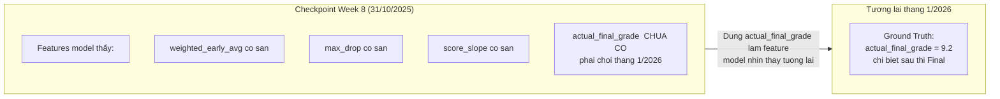
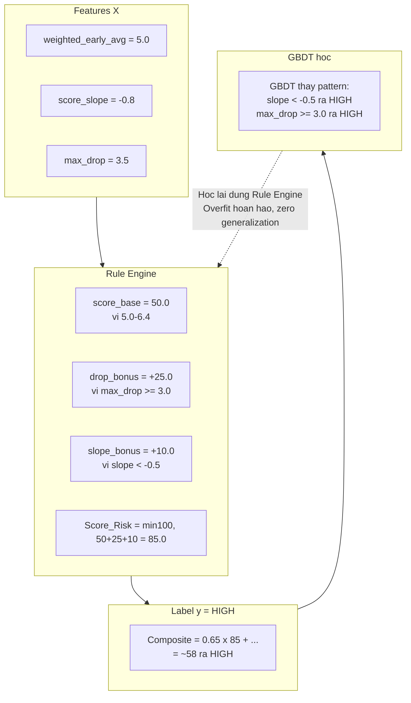

# Senior Review: plan_score_focused_dataset_generator.md — Phát hiện 7 lỗi nghiêm trọng

> **Tác giả:** Senior Technical Review  
> **Phản biện:** `plan_score_focused_dataset_generator.md` — "Score-Focused Weighted Composite Rule Engine"  
> **Đối chiếu với:** [`plan_1_v3_senior_review.md`](plans/risk_alert/plan_1_v3_senior_review.md), [`score_focused_schema.sql`](docs_vsf/schemas/merged/score_focused_schema.sql), [`generate_full_system_mock_v2.py`](data_mock/mock_full_data/generate_full_system_mock_v2.py)

---

## TỔNG QUAN: 7 LỖI NGHIÊM TRỌNG

| # | Lỗi | Phân loại | Tác động |
|---|-----|-----------|----------|
| 1 | **Data Leakage — `actual_final_grade` là input feature** | 🔴 Fatal | Model nhìn thấy tương lai, accuracy ảo |
| 2 | **Circular Logic — Rule Engine tạo labels từ features** | 🔴 Fatal | Model chỉ học lại Rule Engine, vô dụng ngoài thực tế |
| 3 | **Mismatch Schema — 4 labels thay vì 3** | 🟡 Major | Không tương thích với định nghĩa bảng gốc |
| 4 | **Thiếu `evaluated_at_week` trong feature set** | 🟡 Major | Model mất context thời gian |
| 5 | **Checkpoints sai lệch so với senior review** | 🟡 Major | Mất checkpoint sát final exam |
| 6 | **Double Counting trong Score Risk** | 🟡 Major | Multicolinearity nội tại trong Rule Engine |
| 7 | **Thresholds không được calibrate** | 🟡 Major | Rule Engine intuition-based, không data-driven |

---

## 🔴 LỖI 1: Data Leakage — `actual_final_grade` là input feature

### Vấn đề

Trong [Section I, dòng 16](plans/risk_alert/plan_score_focused_dataset_generator.md:16):

```
A1["Temporal Scores (9 features)<br/>actual_final_grade, max_drop, slope, etc."]
```

**`actual_final_grade` là điểm thi cuối kỳ** — chỉ có sau khi học kỳ kết thúc (khoảng week 18-19). Nhưng model lại dùng nó làm **input feature** ở checkpoint week 5, 8, 12, 15.

### Tại sao fatal?



**Hậu quả:** Model đạt accuracy 99% trên mock data, nhưng ~30% ngoài thực tế vì không có `actual_final_grade` ở runtime.

### Fix

`actual_final_grade` phải là **ground truth label**, **KHÔNG PHẢI** input feature. Feature temporal đúng là:
- `weighted_early_avg`, `weighted_late_avg`
- `score_slope`, `score_volatility`, `max_drop`
- `last_score`, `max_coefficient_so_far`, `high_weight_score_count`, `last_high_weight_score`

Đã được định nghĩa chính xác trong [`plan_1_v3_senior_review.md:392-425`](plans/risk_alert/plan_1_v3_senior_review.md:392).

---

## 🔴 LỖI 2: Circular Logic — Rule Engine tạo labels từ features

### Vấn đề

Plan xây dựng **Weighted Composite Rule Engine** để tính ground truth:

```
Composite Risk Score = 0.65 x Score_Risk + 0.15 x LMS_Risk + 0.10 x Attendance_Risk + 0.10 x Behavior_Risk
```

Trong đó moi thanh phan deu duoc tinh tu chinh cac features ma model se dung de train.

### Tai sao fatal?



GBDT se hoc lai chinh xac cac quy tac cua Rule Engine, vi label duoc **tinh truc tiep** tu features. Day la **circular logic** — model khong hoc duoc pattern that tu du lieu.

**Thu nghiem tu duy:** Neu ban dua cho GBDT 1,000 samples voi labels tinh bang Rule Engine, accuracy se luon ~100%. Nhung neu ban deploy model do o truong that voi 1,000 hoc sinh khac, accuracy se sup do vi Rule Engine thresholds khong ap dung duoc cho phan phoi du lieu moi.

### Fix

**Ground truth phai doc lap voi features.** Nguon ground truth dung:

| Nguon | Truong | Vi du |
|-------|--------|-------|
| `fact_gradebooks` WHERE `exam_id = 4` | `actual_final_grade` HK1 | Diem Final HK1 that |
| `fact_gradebooks` WHERE `exam_id = 2` | `actual_final_grade` HK2 | Diem Final HK2 that |
| `fact_subject_academic_records` | `actual_final_grade` | Diem tong ket tu bang academic records |

**QUY TAC VANG:** Ground truth phai la **su that quan sat duoc doc lap** (observable outcome), khong phai la to hop cua features.

---

## 🟡 LOI 3: Mismatch Schema — 4 labels thay vi 3

### Van de

| Plan | Labels | is_at_risk mapping |
|------|--------|-------------------|
| [`plan_1_v3_senior_review.md:608-611`](plans/risk_alert/plan_1_v3_senior_review.md:608) | **LOW / MEDIUM / HIGH** | >= 6.5 ra LOW, 4.0-6.4 ra MEDIUM, < 4.0 ra HIGH |
| Plan nay | **LOW / MODERATE / HIGH / CRITICAL** | Them CRITICAL voi threshold moi |

Schema `train_student_subject_risk_dataset` duoc dinh nghia trong plan_1_v3_senior_review.md voi 3 classes. Neu thay doi thanh 4 classes, can cap nhat lai:
1. Column comment trong DDL (dong 610)
2. Tat ca code consume bang nay (LLM prompts, report generation, business logic threshold)
3. GBDT output layer (3-class softmax ra 4-class softmax)

### Fix

Thong nhat 3 classes nhu senior review da dinh nghia. Neu muon them CRITICAL, hay cap nhat lai schema va tat ca code lien quan truoc.

---

## 🟡 LOI 4: Thieu `evaluated_at_week` trong feature set

### Van de

Plan noi "21 Features" va khong liet ke `evaluated_at_week`. Tuy nhien, trong [`plan_1_v3_senior_review.md:394`](plans/risk_alert/plan_1_v3_senior_review.md:394):

```python
features = [
    # === 0. TIEN TRINH THOI GIAN Time Anchor - 1 Feature ===
    evaluated_at_week,            # int: tuan du bao 5, 8, 11, 14, 16...
    ...
]
```

**Tai sao can `evaluated_at_week`?** Cung mot hoc sinh, cung mon Toan, nhung:
- Week 5: moi co 2 bai kiem tra, diem 9.0 va 8.5 ra LOW risk (dung)
- Week 14: da co 8 bai kiem tra, diem gan day 2.0, 3.5 ra MEDIUM risk (dung)

Neu khong co `evaluated_at_week`, model khong biet dang o giai doan nao cua hoc ky. Mot student co `max_coefficient_so_far = 1.0` o week 5 la binh thuong, nhung cung `max_coefficient_so_far = 1.0` o week 16 la bat thuong (chua thi bai he so 2 nao).

---

## 🟡 LOI 5: Checkpoints sai lech so voi senior review

### So sanh

| Nguon | Checkpoints | Khoang cach |
|-------|-------------|-------------|
| [`plan_1_v3_senior_review.md:394`](plans/risk_alert/plan_1_v3_senior_review.md:394) | 5, **8, 11, 14, 16** | Deu 3 tuan, co week 16 sat final |
| Plan nay | 5, **8, 12, 15** | Khong deu, **thieu week 16** |

**Van de:**
- Week 15 ra 18 (final exam) cach 3 tuan — bo sot giai doan nuoc rut
- Week 16 la checkpoint cuoi cung truoc final — **quan trong nhat** vi cho thay da hoc sat ky thi
- Khoang cach 5 ra 8 (3 tuan) < 8 ra 12 (4 tuan) < 12 ra 15 (3 tuan) — khong dong deu, kho so sanh

---

## 🟡 LOI 6: Double Counting trong Score Risk

### Van de

Score Risk dung **4 sub-scores** de tinh diem rui ro:

```
Score_Risk = score_base(actual_final_grade) 
           + drop_bonus(max_drop) 
           + slope_bonus(score_slope) 
           + volatility_bonus(score_volatility)
```

**Van de:** `max_drop`, `score_slope`, `score_volatility` deu co tuong quan cao voi `actual_final_grade` va voi nhau:

Khi `actual_final_grade = 3.0` (score_base = 100):
- `max_drop` gan nhu chac chan >= 3.0 (vi diem cuoi 3.0, diem dau thuong cao hon) ra +25
- `score_slope` gan nhu chac chan < -0.5 ra +10
- `total = 100 + 25 + 10 + ... = 135 ra min(100, 135) = 100`

**Ket qua:** Student diem 3.0 luon duoc Score_Risk = 100, bat ke cac bonus co thay doi the nao. Bonus features tro nen vo dung.

### Fix

Neu van muon dung Rule Engine (khong khuyen khich), hay dung **moi feature mot lan**:
- Temporal features ra chi tinh `score_base` tu `actual_final_grade`
- Drop/slope/volatility ra chuyen sang cum khac hoac bo

---

## 🟡 LOI 7: Thresholds khong duoc calibrate

### Cac thresholds intuition-based

| Feature | Threshold | Value | Can cu khoa hoc? |
|---------|-----------|-------|-------------------|
| `score_volatility > 2.0` | +5.0 | 2.0? 5.0? | Khong |
| `lms_submission_rate < 0.50` | lms_base = 90.0 | 50%? 90? | Khong |
| `total_late_count >= 5` | +15.0 | 5? 15? | Khong |
| `total_demerit_points > 20.0` | +20.0 | 20? 20? | Khong |
| Trong so 65%/15%/10%/10% | - | 65? 15? | Khong |

**Tat ca cac con so tren deu la cam tinh (intuition-based).** Khong co phan tich thong ke nao cho thay:
- Tai sao unexcused_absent_rate > 0.08 la base 60, > 0.15 la base 100?
- Tai sao trong so Score Risk la 65% ma khong phai 70% hay 60%?
- LMS Risk 15% co y nghia gi? Tai sao khong 20%?

### Hau qua

Khi deploy o truong that, cac thresholds nay gan nhu chac chan khong match voi phan phoi du lieu thuc te ra model cho ket qua sai.

---

## SO SANH: Cach tiep can dung vs Plan nay

| Khia canh | Plan hien tai (Sai) | Cach dung (Dung) |
|-----------|-------------------|-------------------|
| **Nguon ground truth** | Rule Engine tu features | `fact_gradebooks.exam_id=4` hoac `fact_subject_academic_records` — doc lap voi features |
| **So luong features** | 21 | 22 (co `evaluated_at_week`) |
| **So luong labels** | 4 (LOW/MODERATE/HIGH/CRITICAL) | 3 (LOW/MEDIUM/HIGH) — match schema |
| **Checkpoints** | 5, 8, 12, 15 | 5, 8, 11, 14, 16 — deu dan, co week 16 |
| **Data leakage** | Co — `actual_final_grade` la feature | Khong — features chi gom du lieu TRUOC cutoff |
| **Calibration** | Thresholds intuition-based | Dung diem thi that lam ground truth, khong can thresholds |
| **Generalization** | Model hoc lai Rule Engine ra 0 generalization | Model hoc pattern that tu du lieu |

---

## KET LUAN

### Van de lon nhat

**Loi 1 (Data Leakage) + Loi 2 (Circular Logic) = Model vo dung ngoai thuc te.**

Du Rule Engine co tinh vi den dau, neu ground truth duoc tinh tu features, GBDT se:
1. Dat accuracy ~100% tren mock data (de dang)
2. Khong generalize duoc ra ngoai thuc te
3. Ton thoi gian debug, tuning vo ich

### De xuat

1. **Bo Rule Engine hoan toan** — ground truth lay truc tiep tu `fact_gradebooks.exam_id=4` (hoac `fact_subject_academic_records`) nhu da de xuat trong [`mock_train_data_plan.md`](plans/risk_alert/mock_train_data_plan.md)
2. **Them `evaluated_at_week`** vao feature set de co du 22 features
3. **Dung 3 classes** (LOW/MEDIUM/HIGH) match voi schema
4. **Dung checkpoints 5, 8, 11, 14, 16** — deu dan, co week 16
5. **Neu muon dung Rule Engine:** chi dung de **EDA/phan tich kham pha** (exploratory analysis), khong dung de gan label training data

---

## PHU LUC: Pseudocode cho cach tiep can dung

```python
def generate_training_dataset(session):
    """Generate training data voi ground truth tu diem thi that."""
    
    checkpoints = [5, 8, 11, 14, 16]
    
    for cutoff_week in checkpoints:
        cutoff_date = calc_cutoff_date(cutoff_week, semester=1)
        
        # Buoc 1: Tinh 22 features (KHONG co actual_final_grade)
        temporal_features = run_temporal_sql(session, cutoff_date)
        lms_features = run_lms_sql(session, cutoff_date)
        attendance_features = run_attendance_sql(session, cutoff_date)
        behavior_features = run_behavior_sql(session, cutoff_date)
        
        # Buoc 2: Lay ground truth tu bang fact_gradebooks
        # exam_id=4 cho HK1, exam_id=2 cho HK2
        ground_truth = session.execute("""
            SELECT student_code, subject_id, 
                   final_grade AS actual_final_grade,
                   CASE 
                       WHEN final_grade >= 6.5 THEN 'LOW'
                       WHEN final_grade >= 4.0 THEN 'MEDIUM'
                       ELSE 'HIGH'
                   END AS actual_risk_level,
                   CASE WHEN final_grade < 5.0 THEN 1 ELSE 0 END AS is_at_risk
            FROM s360.fact_gradebooks
            WHERE so_exam_id = 4  -- Final HK1
               OR so_exam_id = 2  -- Final HK2
        """)
        
        # Buoc 3: Merge features + ground truth
        # Buoc 4: Batch insert vao train_student_subject_risk_dataset
```

**Khong can Rule Engine. Khong can thresholds. Ground truth tu diem thi that.**
