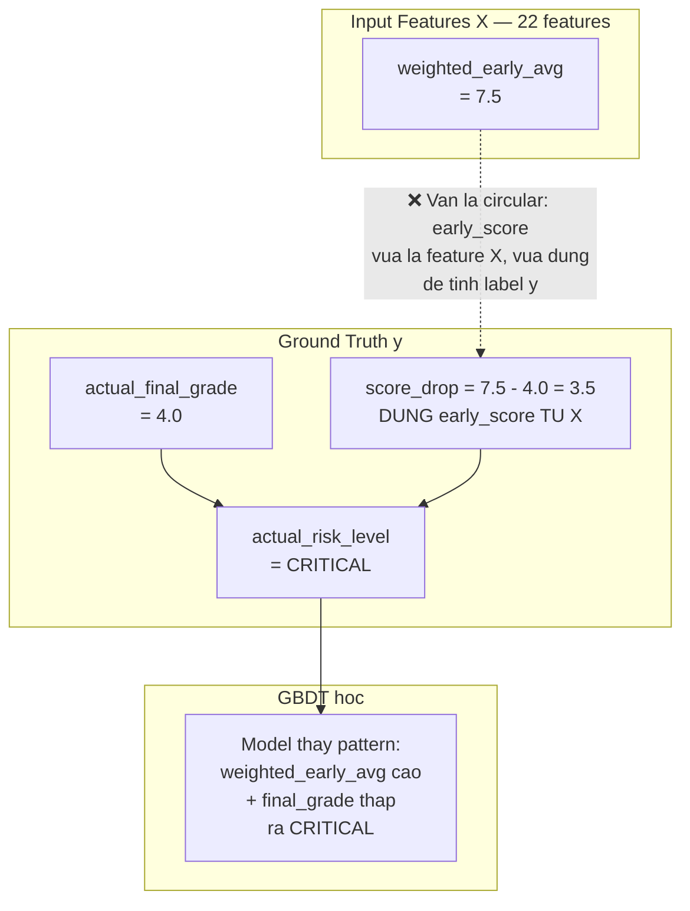
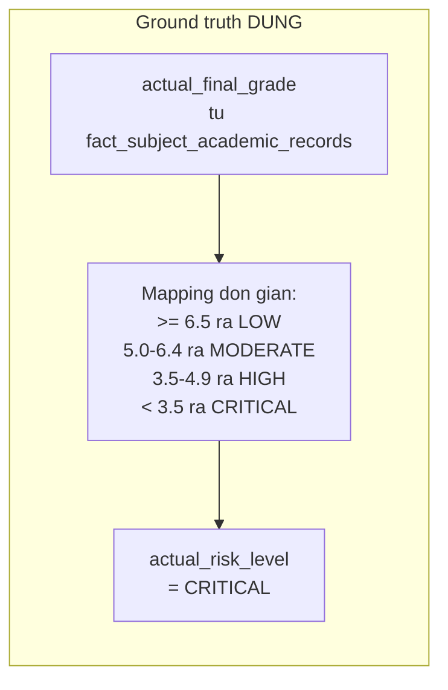

# Phản hồi Senior Review: Đối chiếu với phản biện từ nhóm Product

> **Mục đích:** Phân tích từng điểm Đồng ý / Phản bác giữa Senior Review và nhóm Product, đi đến thống nhất cuối cùng.

---

## I. MA TRẬN ĐỐI CHIẾU

| # | Nội dung | Senior Review | Product Team | Kết luận cuối |
|---|----------|--------------|--------------|---------------|
| 1 | Data Leakage — `actual_final_grade` là feature | 🔴 Fatal — phải bỏ | ✅ Đồng ý bỏ | ✅ **Thống nhất: bỏ khỏi feature set** |
| 2 | Circular Logic — Rule Engine | 🔴 Fatal — phải bỏ | ✅ Đồng ý bỏ | ✅ **Thống nhất: bỏ Rule Engine** |
| 3 | Số lượng labels (3 vs 4) | 🟡 Dùng 3 labels | 🔴 Giữ 4 labels (Stakeholder req) | ⚠️ **Cần thảo luận** (xem II) |
| 4 | Thiếu `evaluated_at_week` | 🟡 Phải thêm | ✅ Đồng ý thêm | ✅ **Thống nhất: 22 features** |
| 5 | Checkpoints 5,8,12,15 vs 5,8,11,14,16 | 🟡 Dùng 5,8,11,14,16 | ✅ Đồng ý đổi | ✅ **Thống nhất: 5,8,11,14,16** |
| 6 | Double Counting trong Score Risk | 🟡 Phải bỏ | ✅ Đồng ý bỏ | ✅ **Thống nhất: bỏ** |
| 7 | Thresholds intuition-based | 🟡 Phải bỏ | ✅ Đồng ý bỏ | ✅ **Thống nhất: bỏ** |

---

## II. PHẢN BIỆN VỀ 4 LABELS — CÓ ĐIỀU KIỆN

### 2.1 Tôi ĐỒNG Ý giữ 4 labels

Sau khi kiểm tra schema thực tế:

- [`train_student_subject_risk_dataset.actual_risk_level`](docs_vsf/schemas/merged/score_focused_schema.sql:1067): `VARCHAR(15)` ✅
- [`fact_student_subject_risk_predictions.risk_level`](docs_vsf/schemas/merged/score_focused_schema.sql:1013): `VARCHAR(15)` ✅

Schema **đã được cập nhật** hỗ trợ 4 mức. Đây là yêu cầu UI/UX từ Stakeholder hợp lý.

**Đồng ý giữ:** `LOW`, `MODERATE`, `HIGH`, `CRITICAL` + `risk_score` (0-100).

### 2.2 Tôi PHẢN BÁC cách tính ground truth có `score_drop`

Product team đề xuất:

```
ground_truth = f(actual_final_grade, score_drop, discipline_flags)
                mà score_drop = early_score - actual_final_grade
```

**Đây vẫn là circular logic**, dù gián tiếp hơn:



**Luồng đúng phải là:**



### 2.3 Về `risk_score` (0-100)

`risk_score` là **runtime output** của GBDT (dự đoán), không phải ground truth.

Trong bảng `train_student_subject_risk_dataset`, ground truth chỉ gồm:
- `actual_final_grade` (điểm thật)
- `actual_risk_level` (LOW/MODERATE/HIGH/CRITICAL)
- `is_at_risk` (0/1)

Còn `risk_score` (0-100) chỉ xuất hiện ở bảng `fact_student_subject_risk_predictions` — là **kết quả dự báo runtime**, không phải training data.

**Đề xuất mapping 4 levels từ actual_final_grade:**

| actual_final_grade | actual_risk_level | is_at_risk | Ý nghĩa |
|-------------------|-------------------|------------|---------|
| >= 6.5 | LOW | 0 | An toàn |
| 5.0 - 6.4 | MODERATE | 0 | Cần theo dõi |
| 3.5 - 4.9 | HIGH | 1 | Nguy cơ trượt |
| < 3.5 | CRITICAL | 1 | Khẩn cấp |

> **Lưu ý:** Thresholds này có thể điều chỉnh sau khi có dữ liệu thật. Quan trọng là ground truth PHẢI độc lập với features.

---

## III. TÓM TẮT THỐNG NHẤT CUỐI CÙNG

### ✅ Đồng ý (6/7 điểm)

| # | Điểm | Chi tiết |
|---|------|----------|
| 1 | Data Leakage | `actual_final_grade` chỉ là ground truth, không phải feature |
| 2 | Circular Logic | Bỏ Rule Engine, ground truth từ `fact_subject_academic_records` |
| 3 | 4 Labels | Giữ LOW/MODERATE/HIGH/CRITICAL (schema đã hỗ trợ) |
| 4 | 22 features | Thêm `evaluated_at_week` |
| 5 | Checkpoints | Dùng 5, 8, 11, 14, 16 |
| 6 | Bỏ thresholds intuition | Ground truth = mapping đơn giản từ `actual_final_grade` |

### ❌ Phản bác (1 điểm có điều kiện)

| # | Điểm | Lý do |
|---|------|-------|
| 7 | `score_drop` trong ground truth | `score_drop = early_score - actual_final_grade` vẫn là circular vì `weighted_early_avg` (early_score) là input feature X |

---

## IV. PSEUDOCODE CUỐI CÙNG CHO `generate_train_dataset.py`

```python
def generate_training_dataset(session):
    """Generate training data voi ground truth doc lap hoan toan."""
    
    checkpoints = [5, 8, 11, 14, 16]
    
    for cutoff_week in checkpoints:
        cutoff_date = calc_cutoff_date(cutoff_week, semester)
        
        # === BUOC 1: TINH 22 FEATURES X ===
        # Chi dung du lieu TRUOC cutoff_date
        # KHONG co actual_final_grade trong features
        temporal = run_temporal_sql(session, cutoff_date)
        lms = run_lms_sql(session, cutoff_date)
        attendance = run_attendance_sql(session, cutoff_date)
        behavior = run_behavior_sql(session, cutoff_date)
        
        features_x = merge(temporal, lms, attendance, behavior)
        features_x['evaluated_at_week'] = cutoff_week  # Time anchor
        
        # === BUOC 2: LAY GROUND TRUTH y ===
        # Doc lap hoan toan voi features
        ground_truth_y = session.execute("""
            SELECT 
                sar.student_code,
                sar.subject_id,
                sar.final_grade AS actual_final_grade,
                CASE
                    WHEN sar.final_grade >= 6.5 THEN 'LOW'
                    WHEN sar.final_grade >= 5.0 THEN 'MODERATE'
                    WHEN sar.final_grade >= 3.5 THEN 'HIGH'
                    ELSE 'CRITICAL'
                END AS actual_risk_level,
                CASE WHEN sar.final_grade < 5.0 THEN 1 ELSE 0 END AS is_at_risk
            FROM s360.fact_subject_academic_records sar
            WHERE sar.semester_index = :sem
        """, {"sem": semester})
        
        # === BUOC 3: MERGE X + y ===
        dataset = features_x.merge(ground_truth_y, on=['student_code', 'subject_id'])
        
        # === BUOC 4: BATCH INSERT ===
        batch_insert_to_train_table(session, dataset)
```

**Ground truth sach, doc lap, khong circular.**
